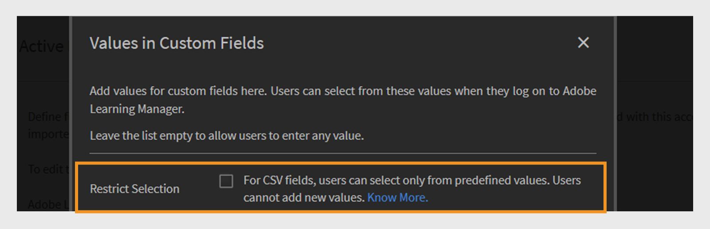

# アクティブフィールド

Adobe Learning Managerのアクティブフィールドは、管理者がユーザーを効果的に整理および管理するのに役立つカスタムユーザー属性です。 ユーザーに関する追加情報（部門、場所、役職など）を収集できます。 管理者はこのデータを使用して、ユーザーグループの作成、学習のパーソナライズ、およびレポートのフィルタリングをより効果的に行うことができます。

ユーザー属性とは、ユーザーの姓、名、メールアドレスなどの情報のことです。 これらの属性は、管理者が次のことを実行する際に役立ちます。

* ユーザーの識別
* グループユーザー
* ユーザー権限とアクセス制限の管理

ユーザープロファイルにカスタム属性を追加することで、アクティブフィールドに組織に関連する追加情報が取り込まれます。

>[!INFO]
>
>アクティブフィールドを追加、カスタマイズ、設定する方法については、このALMアカデミーのトレーニングをご覧ください。  

## アクティブフィールドを追加

アクティブフィールドは社内外の学習者の両方に適用され、組織はすべてのユーザーのカスタムユーザー属性を定義および管理できます。

内部ユーザーのアクティブフィールドを追加または管理するには、次の手順を実行します。

1. 管理者ホームページで&#x200B;**ユーザー**&#x200B;を選択します。

2. **アクティブフィールド**&#x200B;を選択します。

3. アクティブなフィールド名を入力して、**追加**&#x200B;を選択します。 社外学習者のアクティブフィールドを追加するプロセスは、社内学習者の場合と同じです。

   
   _ユーザーの新しいカスタム属性の名前を入力するフィールド_

4. 「**保存**」を選択します。

## アクティブなフィールドにカスタム値を追加する

アクティブフィールドには、組織の構造に一致する定義済みまたはカスタムの値を含めることができます。 カスタム値を追加すると、部門名、役職レベル、地方事務所など、内部ユーザーに固有の詳細を取得できます。

社内ユーザーのカスタム値を追加するには、次の手順に従います。

1. 「**アクティブフィールド**」セクションで「**値を表示**」を選択します。
2. **ユーザー設定フィールドの値**&#x200B;ダイアログで、次の操作を行います。

   * **[フィールドの選択]**&#x200B;ドロップダウンからアクティブなフィールドを選択します。
   * アクティブなフィールドの値を&#x200B;**新しい値**&#x200B;フィールドに入力します。

   
   _特定のアクティブなフィールドのカスタム値を入力するためのダイアログ_

3. 「**完了**」を選択し、「**保存**」を選択して変更を適用します。

## アクティブフィールド設定の構成

ユーザー管理とレポート作成のタスクに役立つアクティブフィールドをカスタマイズし、アクティブフィールドのプロパティを設定します。

* **グループ化可能**：このオプションを使用すると、アクティブなフィールド値に基づいて学習者をグループ化できます。
* **レポート可能**：このオプションを使用すると、アクティブなフィールド値に基づいてレポートユーザーグループを作成し、ダッシュボードレポートのフィールドに対してレポートフィルターを有効にすることができます。
* **学習者が設定可能** ：このオプションを使用すると、学習者が自分でフィールドを設定できます。
* **エクスポート可能**：このオプションは、エクスポートされたユーザーグループレポートにアクティブフィールドを含めます。
* **複数値**：このオプションは、アクティブなフィールドに対して複数の値をサポートします。

アクティブフィールドの設定を行うには、次の手順に従います。

1. 「**設定**」タブを選択し、「**ユーザーディスプレイ**」セクションに移動します。

   
   _[設定]タブを選択して、アクティブなフィールドをカスタマイズします_

2. 必要に応じて、一方または両方のオプションを選択します。 

   * **学習者のログイン画面で未入力のフィールドのみを表示：**&#x200B;このオプションを選択すると、まだ入力されていないアクティブフィールドのみが学習者に表示されます。 これにより、プロファイルを完了するよう求められ、ユーザーデータが正確で最新のものであることを確認できます。 これらのフィールドを表示すると、学習者プロファイル全体がサポートされ、パーソナライズされた学習体験が可能になります。
   * **オフの場合、ユーザーに「プロファイルを完成させる」ページが表示されません。**&#x200B;このオプションを無効にすると、ログイン時に学習者に&#x200B;**プロファイルを完成させる**&#x200B;ページが表示されなくなります。 プロファイル情報の更新や入力は求められず、プラットフォームに直接アクセスできます。

   
   _アクティブなフィールドを表示する方法とタイミングを制御するための設定インターフェイス_

3. 「**保存**」を選択して変更を適用します。

>[!NOTE]
>
>新しい役割を割り当てても、カスタムユーザーグループには影響しません。 ただし、すべての管理者、すべての作成者、および同様の役割ベースのグループなどの自動生成ユーザーグループに影響します。

## 複数値のアクティブフィールド

複数値を持つアクティブフィールドを使用すると、場所、役職、プロジェクトチームなど、複数の値を1つのユーザー属性に割り当てることができます。 これにより、より詳細で柔軟なユーザー情報を取得できます。

1つのアカウントにつき最大3つの複数値アクティブフィールドを設定できます。 これらは、社内ユーザーと社外ユーザーの両方で使用できます。 フィールドを複数値として設定した後は、この設定を元に戻すことはできません。

アクティブなフィールドに複数の値を割り当てるには：

1. **ユーザー**&#x200B;を選択し、**アクティブなフィールド**&#x200B;を選択します。
2. **[設定]**&#x200B;タブで、**複数値**&#x200B;を選択します。

_アクティブフィールドの表示方法と表示方法を制御するための設定インターフェイス_

CSVまたはユーザーインターフェイスで複数の値を追加できます。 複数値を持つフィールドをユーザーグループで一度使用すると、単一値に変更することはできません。

## CSVをアップロードしてアクティブフィールドを追加

CSVを使用してユーザーをアップロードする際に、定義された各フィールドに一致するヘッダーを含めて、アクティブフィールドを追加します。 管理者は、CSVファイルを使用してユーザーを一括でアップロードできます。 CSVには、読み込むユーザーを定義する新しいアクティブフィールドが含まれている必要があります。 データが正しくマッピングされるように、ファイルのヘッダー名がシステムで設定したアクティブフィールドと正確に一致することを確認します。 **ユーザー**&#x200B;セクションからCSVファイルをアップロードします。

ユーザーの一括追加の詳細については、この[記事](/help/migrated/administrators/feature-summary/add-users-user-groups.md)を参照してください。

## CSVフィールドの値の制限

**ユーザー設定フィールドの値**&#x200B;の&#x200B;**選択の制限**&#x200B;オプションは、CSVファイルを使用してデータをインポートするユーザーが、ユーザー設定フィールドの定義済みの値からのみ選択できるようにするかどうかを制御します。 有効にした場合、ユーザーは値のセット・リストから選択する必要があります。これにより、データの一貫性が確保され、新しいエントリや予期しないエントリが発生するのを防ぐことができます。 無効にすると、ユーザーは任意の値を入力できるようになり、柔軟性は向上しますが、データの正確性に対する制御が少なくなります。

_CSVアップロード時に値の制限を有効にするチェックボックス_

## ユーザーのCSV読み込みで不足しているアクティブフィールドを管理

場合によっては、管理者がAdobe Learning Managerにログインしたときに、学習者が特定のアクティブフィールドに手動で入力することを希望することがあります。 これは、CSVファイルを介して読み込まれたユーザーに対してサポートされます。 ユーザーを一括で追加する方法については、この[記事](/help/migrated/administrators/feature-summary/add-users-user-groups.md)を参照してください。 ユーザーは、Box FTPフィールドの値に基づいて、アクティブなフィールドまたはロールベースのグループに自動的に追加されます。 カスタムグループには追加できません。

CSVファイルにすべてのアクティブフィールドが含まれていない場合、管理者はインポート後に欠落している値を手動で入力する必要があります。

デフォルトでは、すべてのアクティブフィールドをソースCSVの対応するフィールドにマッピングする必要があります。 ただし、特定のアクティブフィールドをCSVの列にマッピングしない場合は、BoxとFTPの両方の読み込みプロセスで、ドロップダウンリストから値&#x200B;**DontImportFromSource**&#x200B;を選択できます。 このオプションは、FTPコネクタまたはBoxコネクタを介してユーザーを読み込む場合に使用できます。 コネクタの詳細については、この[記事](https://experienceleague.adobe.com/en/docs/learning-manager/using/integration/connectors)を参照してください。

