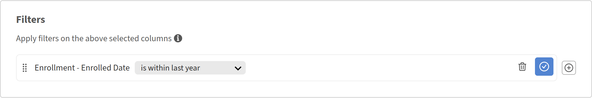
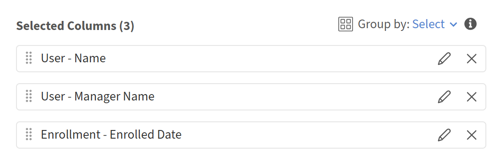
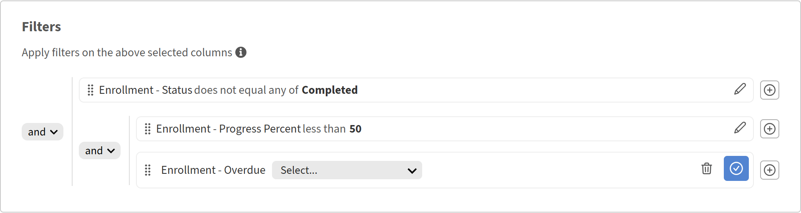

# レポートへのフィルターの追加と結合

## 概要

フィルターを使用すると、必要なレコードに合わせてレポートの範囲を調整できます。 1つのフィルターを適用し、複数のフィルターをANDまたはORロジックと組み合わせ、複雑な条件用のネストされたグループを作成することができます。

## フィルターの追加

フィルタを使用して、レポートのデータを表示する代わりに、データの特定のサブセットだけを表示します。

例えば、過去365日間にコースに登録された学習者の数を把握することができます。 この場合、登録日に日付フィルターを適用して、最近のアクティビティのみを含めます。

1. Report Builderを起動して、**レポートの作成**&#x200B;を選択します。
2. レポートの名前と説明を入力します。
3. 次の列を選択します。 <dataset>:<column name>

   * 登録 – 登録日
   * ユーザー – 名前

   

4. レポートセクションで、**フィルターの追加**&#x200B;を選択します。
5. フィルターを適用するフィールドを検索するか、参照します。 この例では、**登録 – 登録日**&#x200B;を選択します。

   

6. 「**追加**」を選択します。
7. 演算子を選択します。 使用可能な演算子は、フィールドのデータ型によって異なります。

   * 文字列フィールド – を含み、等しい、で始まる
   * 数値フィールド – より大きい、より小さい、等しい、間
   * 日付フィールド – 等しい、前、後、間、最後N日
   * リスト（列挙）フィールド – 内、外

8. この場合、**は昨年の範囲内**&#x200B;を選択します。

   

9. **レポートを保存**&#x200B;を選択し、**アクション** > **ダウンロード**&#x200B;を選択してレポートをダウンロードします。

ダウンロードされたレポートには、過去365日以内に学習目標に登録したすべてのユーザーが一覧表示されます。

## AND / ORロジックによる複数のフィルターの追加

2番目のフィルタを追加する場合、フィルタ間のデフォルトの関係はANDです。行を表示するには、両方の条件がtrueである必要があります。

例えば、過去365日間にコースに登録した学習者を特定し、特定のマネージャーにレポートすることができます。 この場合、両方の条件が真である必要があります。そのため、フィルタはAND論理を使用して組み合わされます。

1. Report Builderを起動して、**レポートの作成**&#x200B;を選択します。
2. レポートの名前と説明を入力します。
3. 次の列を選択します。 <dataset>:<column name>

   * ユーザー – 名前
   * ユーザー – マネージャー名
   * 登録 – 登録日

4. 列&#x200B;**User-Manager Name**&#x200B;でグループ化します。
5. 「フィルター」セクションで、次のフィルターを選択します。

   * 登録 – 登録日： i **は過去1年以内**&#x200B;です
   * ユーザー – マネージャー名&#x200B;**の先頭は**&#x200B;ですN
   * ユーザー – マネージャー名&#x200B;**が空ではありません**

     

6. **レポートを保存**&#x200B;を選択し、**アクション** > **ダウンロード**&#x200B;を選択してレポートをダウンロードします。

ダウンロードされたレポートには、名前がNで始まるマネージャーの&#x200B;**および**&#x200B;過去365日間に学習目標に登録したすべてのユーザーが一覧表示されます。

## ネストされたフィルタグループの作成

ネストされたグループでは、式の中の括弧に相当する複数の論理レベルを持つ条件を作成できます。 例えば、（カタログ=安全性またはカタログ=衛生管理）の場合、完了日は過去90日間です。

入れ子になったフィルタグループは、論理にAND条件とOR条件が混在しており、これらを同時に評価する必要がある場合に使用します。

例えば、入れ子のフィルターロジックを使用して、学習者のトレーニングの進行状況が50%未満の未完了または期限切れになった未完了の登録を特定し、ANDとORの条件が連携する方法を示します。

1. Report Builderを起動して、**レポートの作成**&#x200B;を選択します。
2. レポートの名前と説明を入力します。
3. 次の列を選択します。 <dataset>:<column name>

   * 登録 – ステータス
   * 登録 – 進捗率
   * 加入契約 – 期限切れ

     

4. 「**フィルター**」セクションで、次のフィルターを選択します。

   * 登録 – ステータス&#x200B;**が完了**&#x200B;のいずれとも一致しません。
   * 「+」を選択します。
   * 登録の進行状況の割合を検索します。
   * フィルターを選択します。
   * **[グループとして追加]**&#x200B;を選択します。

     

5. 登録の追加 – 進行状況&#x200B;**未満** 50。

   

6. 「+」を選択します。
7. **Enrollment-Overdue**&#x200B;を検索します。
8. フィルターを選択します。
9. **[グループとして追加]**&#x200B;を選択します。

   

10. Add Enrollment-Overdue equals TRUE.
11. ネストされたANDをORに変更します。

    

12. **レポートを保存**&#x200B;を選択し、**アクション** > **ダウンロード**&#x200B;を選択してレポートをダウンロードします。

ダウンロードされたレポートには、進行中または未開始の登録、進捗率が50%未満の登録、または期限切れのすべての登録が一覧表示されます。
