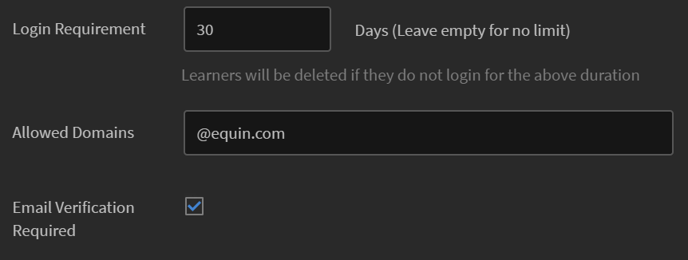
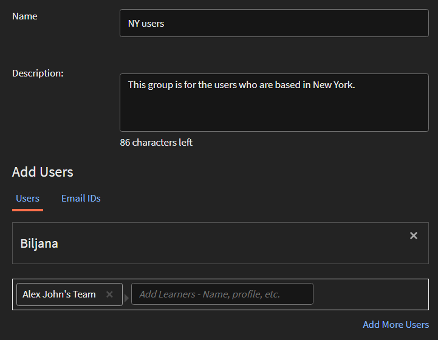

# ユーザーの追加とユーザーグループの作成

Learning Managerアプリケーションでユーザーまたはユーザーグループを追加する方法について説明します。

<!---->

## 概要 {#overview}

AdobeのLearning Managerでは、以下の役割を割り当てることができます。

* **管理者：** 管理者は、組織のトレーニング戦略を定義します。 管理者は、組織全体に対して、学習者の追加、学習者に必要なスキルの検索、コースの管理と割り当て、学習プラン、資格認定、学習プログラムの作成、レポートの管理を行うことができます。
* **作成者：** 作成者は、教育デザイナーとコンテンツ作成者です。 作成者は、モジュールとコースをLearning Managerに追加できます。
* **マネージャー：** マネージャーは、チームの学習活動を管理します。 マネージャーは、チームメンバーにコースを受講するように指名したり、チームメンバーからのリクエストを承認したり、トレーニングの完了後にチームメンバーのパフォーマンスに関するフィードバックを提供したりできます。 マネージャーは、チームのレポートを表示して、パフォーマンスを追跡することもできます。
* **学習者：** 学習者は、割り当てられたコース、学習プログラムおよび資格認定にアクセスできます。 学習者はカタログを使用して利用可能なすべてのコースを参照し、コース、学習プログラム、資格認定のいずれかに自分自身を登録することもできます。

管理者は、次の3つの方法でユーザーを追加できます。

* 内部
* 外部
* ユーザーグループ

## 1人のユーザーを追加 {#addasingleuser}

ユーザーを追加するには

1. Learning ManagerAdobeに管理者としてログインします。
1. ホームページで、をクリックします。 **[!UICONTROL ユーザーを追加]**. このページでは、CSVを使用して、一度に1人のユーザーを追加することも、複数のユーザーを追加することもできます。 また、社内従業員用のセルフ登録リンクを作成したり、社外学習者プロファイルを作成したりすることもできます。
1. ユーザーを1人追加するには、 **[!UICONTROL 追加]** をクリックし、 **[!UICONTROL シングルユーザー]**.

   
   *1人の内部ユーザーを追加*

1. を **[!UICONTROL ユーザーを追加]** ダイアログで、学習者の詳細を入力します。 フィールド用 **[!UICONTROL マネージャーの名前]**、システム内の既存ユーザーの名前を選択します。

   
   *ユーザーの追加ダイアログボックス*

1. Learning Managerに新しいユーザーを追加するには、 **[!UICONTROL 追加]**. ユーザが追加されると、ユーザは確認メールを受信する。 次に、学習者はアカウントを有効化し、Learning Managerの使用を開始します。 このワークフローは、限られた数の学習者をLearning Managerアカウントに追加する必要がある場合に便利です。 ただし、大規模組織の従業員全員を登録する場合は、1回の試行で追加できます。 詳しくは、次の節を参照してください。

## ユーザーを一括で追加 {#addusersinbulk}

通常、ほとんどの組織はHR管理システム(HRMS)と連携して作業し、HRMSは名称、事業所、加入日、従業員階層などのすべての従業員レコードを保持します。 このデータはCSV形式で書き出すことができます。 CSVを読み込むには、次の手順に従います。

1. クリック **[!UICONTROL 追加]** をクリックし、 **[!UICONTROL CSVのアップロード]**.

   
   *CSVをアップロードしてユーザーを一括で追加*

1. アップロードするCSVは、次のようなフィールドで構成されています。

   
   *CSVの構造*

   マスターCSVを保持し、マスターCSVに対してすべての追加および削除を実行する必要があります。 マスターCSVには、次のフィールドが含まれます。

   * 名前 &#42;
   * 電子メール &#42;
   * プロフィール
   * 支配人

   (&#42;)必須フィールド。

1. オプションをクリックした後 **[!UICONTROL CSVのアップロード]**)をクリックすると、次のダイアログが表示されます。

   
   *CSVをアップロードダイアログ*

1. CSVを選択するか、ファイルをドラッグ&amp;ドロップします。 ファイルを選択したら、データフィールドをCSVファイルのデータフィールドにマッピングします。 必要なドロップダウンをクリックし、右側のフィールドを選択します。

   
   *CSVでフィールドをマッピング*

1. ユーザーのインポートを開始するには、 **[!UICONTROL 保存]**. 確認メッセージが表示されます。

   
   *CSVのアップロードが成功したことを示す確認メッセージ*

1. これで、新しいユーザーがAdobeのLearning Managerアカウントに追加されました。 新しいユーザーを選択するには、名前の横にあるチェックボックスをオンにして、全員を選択します。

   
   *新しいユーザーが追加されました*

>[!NOTE]
>
>詳しくは、FAQ、 [ユーザーを一括で追加](../add-users-in-bulk.md).

ユーザーを選択した後、次の操作を実行できます。

## ユーザーの登録 {#registerauser}

ユーザーを選択して、 **[!UICONTROL アクション]** をクリックします。 **[!UICONTROL 登録]**.

選択したユーザーにウェルカムメールが送信されます。 学習者が既にAdobe IDを持っている場合は、このリンクをクリックできます。 既存のAdobe IDをお持ちでない場合は、ようこそリンクをクリックしてAdobe IDを作成し、それをLearning Managerアカウントにリンクすることができます。

## 役割の割り当て {#assignarole}

AdobeのLearning Managerアカウントに学習者を追加した後で役割を変更する場合は、ページの右上隅にある「アクション」をクリックします。 オプションを選択 **[!UICONTROL 役割の割り当て]**. ここでは、学習者に対する作成者のアクセス権を付与するか、管理者のアクセス権を付与するかを決定できます。 役割を割り当てると、この学習者はアカウントに対する作成者のアクセス権を持ち、モジュールの追加とコースの作成を行うことができます。

*ユーザーへの役割の割り当て*

## ロールの削除 {#removearole}

また、ユーザーの作成者または管理者のアクセス権を削除することもできます。 1人以上の学習者を選択して「 **[!UICONTROL アクション]**、を選択します **[!UICONTROL ロールの削除]**. オプションを選択します。例： **[!UICONTROL 作成者を削除]**&#x200B;を選択すると、この学習者の作成者アクセス権が取り消されます。

>[!NOTE]
>
>システム内のユーザーにマネージャーの役割を手動で割り当てることはできません。 1人以上の従業員が配下に追加されると、自動的にマネージャーダッシュボードにアクセスできます。

## ユーザーの削除 {#deleteauser}

ユーザーを削除するには、 **[!UICONTROL アクション]**&#x200B;を選択し、 **[!UICONTROL ユーザーを削除]**. 確認ダイアログで、をクリックします。 **[!UICONTROL はい]**&#x200B;を選択した場合は、学習者が削除されます。

*ユーザーを削除するための確認メッセージ*

## ユーザーの編集 {#editauser}

ユーザーのリストでユーザーを選択し、そのユーザーをクリックします。 ユーザーの詳細で、 **[!UICONTROL 編集]** ( )ボタンをクリックします。 を **[!UICONTROL ユーザーを編集]** ダイアログで、必要な編集を行い、変更を保存するには、 **[!UICONTROL 保存]**.

*ユーザーを編集ダイアログ*

## 大文字と小文字の区別を維持する、アクティブなフィールドおよびアクティブなフィールド値のワークフロー

このリリースのLearning Managerでは、ユーザー属性およびその値の大文字と小文字の区別が維持されます。 **例**&#x200B;大文字と小文字の区別が保持されたユーザー属性が「location」で、値が「PARIS」の場合、同様に保持されて表示されます。 問題が発生した場合、管理者は属性名と値を編集して、大文字と小文字の区別に関するエラーを修正できるようになりました。

管理者は、次のサイトにアクセスして、この操作を実行できます **[!UICONTROL 管理者アプリ]** > **[!UICONTROL ユーザー]** > **[!UICONTROL ユーザーグループ]** グループ名をクリック

管理者は、UIを使用して学習者に許可された属性値を追加および更新できます。

アクティブフィールドのタイプ：

* グループ化可能：学習者は、値に基づいてグループ化されます
* 報告可能：アクティブなフィールドに基づいて、ユーザーグループのレポートが作成されます
* 書き出し可能：フィールドは、ユーザーグループのレポートに書き出されるときに表示されます。

## セルフ登録リンクの作成 {#createaselfregistrationlink}

また、組織内の従業員がAdobeのLearning Managerアカウントの学習者として自身を登録できるようにすることも可能です。管理者の支援を受ける必要はありません。 管理者はセルフ登録リンクを作成してAdobeと共有し、従業員の資格情報を使用してLearning Managerに登録できます。

ページの右上隅にあるをクリックします。 **[!UICONTROL 追加]**&#x200B;を選択し、 **[!UICONTROL セルフ登録]**.

*学習者としてセルフ登録するためのリンクを作成*

この **[!UICONTROL セルフ登録プロファイルの追加]** ダイアログが表示されます。 このプロファイルに名前を付けます。 次に、マネージャーの名前を追加します。 マネージャーはLearning Managerに登録された学習者である必要があります。

*セルフ登録用のプロファイルを追加*

クリック後 **[!UICONTROL 保存]**&#x200B;を選択すると、URLが生成されます。このURLを学習者と共有して、学習者がURLをクリックし、自分で登録できるようになります。

## 社外学習者の登録 {#enrollexternallearners}

AdobeのLearning Managerでは、アカウントへのアクセスが制限されている社外パートナーやエージェンシーの登録リンクを作成し、学習教材を提供することもできます。

内部登録と外部登録にはいくつかの違いがあります。

<table>
 <tbody>
  <tr>
   <td>
    
<b>社内ユーザー</b>
</td>
   <td>
    
<b>社外ユーザー</b>
</td>
  </tr>
  <tr>
   <td>
    
Adobe IDまたはSSO資格情報を使用してログインします。
</td>
   <td>
    
任意の電子メールIDを使用してログインします。
</td>
  </tr>
  <tr>
   <td>
    
ゲーミフィケーションを利用できます。
</td>
   <td>
    
ゲーミフィケーションは利用できません。
</td>
  </tr>
  <tr>
   <td>
    
学習者階層を使用できます。
</td>
   <td>
    
学習者階層は使用できません。
</td>
  </tr>
 </tbody>
</table>

社外ユーザーを登録するには、次の手順に従います。

1. 左側のナビゲーション・ペインで、 **[!UICONTROL 外部]**.

   

   *社外ユーザーの登録*

1. ページの右上隅にあるをクリックします。 **[!UICONTROL 追加]**.
1. を **[!UICONTROL 社外登録プロファイルを追加]** ダイアログで、次の詳細を追加します。

   * パートナー組織のプロファイル名。
   * パートナー組織のマネージャーの電子メールアドレス。
   * このパートナーの社外登録の人数制限です。
   * 有効期限：このグループへの新しい登録の許可を停止する期限を設定します。 有効期限後は、既存の登録ユーザーのみがこのトレーニングにアクセスできます。

   

   *外部登録プロファイルを追加ダイアログ*

   * を **[!UICONTROL 詳細設定]** セクションで、次のように入力します。

      * **[!UICONTROL ログイン要件]:** 日数で値を指定します。 上記の期間ログインしなかった学習者は削除されます。
      * **[!UICONTROL 許可されたドメイン]:** ホワイトリストに登録された電子メールドメイン名のコンマ区切りリスト。
      * **[!UICONTROL メール確認が必要です]:** 学習者の電子メール確認を必須にする場合は、このオプションを選択します。

   

   *「詳細設定」セクションに詳細を入力します*

1. クリック後 **[!UICONTROL 保存]**&#x200B;に到達すると、次の確認メッセージが表示されます。 外部パートナーとURLを共有する必要があります。

   

## 社外プロファイルを有効にする {#enableanexternalprofile}

外部プロファイルを作成した後、そのステータスを有効にする必要があります。 社外プロファイルのリストから、必要なプロファイルを選択し、「ステータス」ボタンを切り替えます。

*社外プロファイルを有効にする*

これにより、「社外登録」リンクが有効になります。 パートナーにウェルカムメールが自動的に送信されます。 URLをコピーアイコン()をクリックして、リンクをコピーして共有したり、メールアイコン()をクリックして、パートナー組織にようこそメールを再送信することもできます。

パートナーマネージャーは、PrLearning Managerでトレーニングを受ける必要がある従業員とリンクを共有できます。 リンクをクリックすると、詳細を入力した後に自分でセルフ登録し、Learning Managerでプロファイルを作成できます。 これらのユーザーは、社内従業員と一緒に「学習者」タブに表示されません。 名前は、 **[!UICONTROL 社外学習者]** タブをクリックします。

## 社外プロファイルの一時停止 {#pause}

社外ユーザーグループをLearning Managerに追加した後で、社外ユーザーの登録プロセスを一時停止することもできます。 一時停止すると、社外ユーザーの登録プロセスはブロックされます。 ただし、このプロセスは、ユーザーが招待を受け入れてまだ登録していない場合にのみ機能します。

外部ユーザーグループを一時停止するには、グループを選択して **[!UICONTROL アクション]** ページの右上隅のをクリックし、 **[!UICONTROL 一時停止]**.

## 社外プロファイルの再開 {#resumeanexternalprofile}

いつでも、いつでも外部パートナーの一時停止した状態を取り消し、通常のサービスを再開できます。 クリック **[!UICONTROL アクション]** を選択します。 **[!UICONTROL 履歴書]**.

社外ユーザーには、次の状態が適用されます。

* **非アクティブ状態**  – この状態では、社外ユーザーの登録が期限切れになります。 管理者は、外部ユーザーの有効期限を設定し、ユーザーの追加ワークフローを使用して外部ユーザーを追加します。
* **アクティブ状態**  – この状態の場合、社外ユーザーはLearning Managerアプリケーションに登録し、アプリケーションにログインできます。
* **一時停止**  – この状態では、社外ユーザーの登録プロセスはブロックされます。 ただし、既存のユーザーは引き続きログインできます。

## 使用席の確認 {#checkusedseats}

社外プロファイルのリストで、をクリックします。 **[!UICONTROL 使用席]**. パートナー組織内で追加された学習者の数を表示できます。

*使用席の確認*

## ユーザーの削除 {#Deleteauser-1}

ユーザーを選択し、右上隅のをクリックします。 **[!UICONTROL アクション]** > **[!UICONTROL ユーザーを削除]**.

## プロファイルの変更 {#changeprofile}

ユーザーを別の社外プロファイルに移動するには、ユーザーを選択して、右上隅のをクリックします。 **[!UICONTROL アクション]** > **[!UICONTROL プロファイルの変更]**. プロファイルのリストからプロファイルを選択し、 **[!UICONTROL 変更]**.

## 役割の割り当て {#Assignarole-1}

ユーザーを選択し、右上隅のをクリックします。 **[!UICONTROL アクション]** > **[!UICONTROL 役割の割り当て]** > **作成`<role>`**. ユーザーに新しいロールが割り当てられます。

## ロールの削除 {#Removearole-1}

ユーザーを選択し、右上隅のをクリックします。 **[!UICONTROL アクション]** > **[!UICONTROL ロールの削除]** > **削除`<role>`**. 選択したロールが、ユーザーに割り当てられたロールのリストから削除されます。

## ユーザーグループの作成 {#createusergroups}

ユーザーグループは、カテゴリに関連するユーザーのセットです。 ユーザーグループを使用すると、管理者は属性に基づいて組織内の学習者を選択し、学習コンテンツを割り当てることができます。 また、これらのユーザーグループを使用すると、管理者はカスタマイズされたロゴやカタログを学習者に割り当てたり、進捗状況に関するカスタマイズされたレポートを表示したりできます。

ユーザーグループにアクセスするには、左側のナビゲーションペインで **[!UICONTROL ユーザーグループ]**.

*ユーザーグループの作成*

AdobeのLearning Managerには、カスタムおよび自動生成の2種類のグループがあります。 アカウントに学習者を追加すると、一部のグループが共通のプロパティに基づいて自動的に作成されます。

自動作成されたグループを表示するには、タブをクリックします **[!UICONTROL 自動生成]**.

*自動生成されたグループの表示*

すべての内部ユーザー、すべてのマネージャ、コスト・センターに基づくグループ、部門に基づくグループ、マネージャのチームに基づくグループなど、様々なグループが表示されます。

自動生成されたグループの他に、カスタムグループも作成できます。 新しいカスタムグループを追加するには、右上隅のをクリックします。 **[!UICONTROL 追加]**.

1. グループの名前と説明を入力します。
1. 「入力中に検索」フィールドにユーザー名またはプロファイルを入力し、ドロップダウンリストから選択してユーザーを追加します。
1. さらに学習者を追加するには、 **[!UICONTROL さらにユーザーを追加].**
1. ユーザーグループを作成するには、 **[!UICONTROL 保存]**.

これで、このカスタムグループが作成され、プロファイルに追加されました。 作成するユーザーグループは、本質的に動的です。 新しいユーザーが同様の属性で追加されると、ユーザーグループに自動的に追加されます。

## ユーザーグループの除外

大規模なユーザーグループから一部のユーザーを除外する場合があります。 これは、特定のユーザーグループを学習プランを介してトレーニングに登録したり、カタログを正しく表示したりするために必要です。 このリリースのLearning Managerでは、カスタムユーザーグループの作成時に学習者またはユーザーグループを除外できます。 ユーザーグループを追加ダイアログの「学習者を除外」セクションから行えます。

*ユーザーグループを除外*

例えば、「場所=カリフォルニアに属するユーザーのうち、ストア5（カリフォルニア州に所在）を除く」すべてのユーザーが登録されるように、学習プランを設定するとします。

## 詳細設定 {#advancedsettings}

## データソース {#datasources}

ユーザーや学習データを組織のデータベースからLearning Managerアプリケーションに読み込む/同期する場合に、この機能を使用できます。 この同期の頻度を設定することもできます。

クリック **[!UICONTROL データソース]** の下の左側のペインで **[!UICONTROL 詳細]** セクションに追加します。

*ユーザーをインポートまたは同期するデータソース*

データソースタイプを **[!UICONTROL Source]** ドロップダウンで、更新の頻度を選択し、 **[!UICONTROL 今すぐ同期]** すぐに同期する必要がある場合、または **[!UICONTROL 保存].** データソースタイプには、内部ユーザー用のSFDC、FTPなどがあります。

複数のデータソースを追加できます。

## アクティブフィールド {#activefields}

この機能を使用すると、管理者は、ユーザー登録時に入力されたフィールドに加えて、よりアクティブなフィールドを追加できます。

クリック **アクティブフィールド** ユーザーページ内で利用可能です。 学習者は、カスタム値で指定された値からのみ選択できます。

*アクティブなフィールド*

### フィールドを設定 {#configurefields}

**社内ユーザー**

社内ユーザーのユーザーフィールドにカスタム値を追加できます。

カスタム値を追加するには、次の手順に従います。

1. クリック  **[!UICONTROL 値を変更]** （社内ユーザーの場合）。

   
   *社内ユーザーの値の変更*

1. この **カスタムフィールドの値** ダイアログボックスが表示されます。

   
   *[ユーザー設定フィールドの値]ダイアログボックス*

1. 追加する値を選択します **[!UICONTROL フィールドを選択]** ドロップダウンメニュー。
1. 新しい値を **[!UICONTROL 新しい値]** フィールドに入力します。
1. クリック **[!UICONTROL 完了]**.
1. 右上隅の「保存」をクリックして、 **[!UICONTROL 保存]** 変更。

**社外ユーザー**

社内ユーザーの場合と同様のカスタム値を追加します。

*社外ユーザーの値の変更*

### 設定 {#settings}

**ユーザー表示**

オプション **学習者のログイン画面で未入力のフィールドのみを表示** を有効にすると、ログイン時に空白のフィールドのみが表示されます。

*未入力フィールドを表示*

このオプションを使用すると、管理者はフィールドの入力後に、フィールドを表示するか非表示にするかを決定できます。

## レポートのアクティブフィールドを制限 {#restrictactivefields}

Learning Manager 27.7には、次の2つの新しいオプションが導入されています。 **[!UICONTROL 報告可能]** および **[!UICONTROL エクスポート可能]**&#x200B;アクティブフィールドの場合：

*アクティブフィールドのオプション*

CSVフィールドおよび手動で追加したフィールドで、アクティブフィールドが次のようにマークされている場合 **[!UICONTROL 報告可能]**&#x200B;を指定すると、ダッシュボードレポート内のフィルターでアクティブフィールドを検索できるようになります。

*ダッシュボードレポートのフィルター*

アクティブフィールドが **[!UICONTROL エクスポート可能]**&#x200B;をクリックした場合、Excelレポートをダウンロードすると、Excelファイルにアクティブフィールドが表示されます。

これらのオプションは、内部と外部の両方のアクティブフィールドに表示されます。

削除できるのは、ユーザー設定のアクティブフィールドのみです。

## ユーザー表示

学習者に対して、「プロファイルを完成させる」ページ全体を非表示にすることが可能です。 学習者がログインしても、ページは表示されません。

既存のデフォルトの動作は変更されません。 これは、管理者が使用できるオプション機能です。

以下のオプションを有効にします。

*「ユーザー表示」セクション*

## FTPコネクタおよびBoxコネクタによる手動CSVフィールドのサポート {#import-connector}

多くの場合、学習者がLearning Managerにログインしたときに、アクティブなフィールドを手動で入力します。 これは、現在のLearning Managerでは、ユーザーがCSVを手動で読み込む場合に可能です。

CSVには、一部のアクティブフィールドを含めることはできません。 アップロードされたCSVで更新されていないすべてのアクティブフィールドについては、ユーザーがアクティブフィールドのデータを入力する必要があります。

現在、すべてのアクティブなフィールドは、ソースCSVからいくつかのフィールドにマッピングする必要があります。

ユーザーが、CSVで指定されているフィールドにアクティブフィールドをマッピングしたくない場合があります。 このような場合、ユーザーはアクティブフィールドを値にマッピングできます **[!UICONTROL DontImportFromSource]**. FTPコネクタおよびBoxコネクタからユーザーを読み込む場合は、ドロップダウンリストからこの値を選択します。

## カスタム役割 {#customroles}

ユーザー情報の一部として任意のフィールドを追加し、 **[!UICONTROL 保存]**. フィールドを追加後、 **[!UICONTROL ユーザーの編集]** ダイアログが表示されます。

フィールドを追加すると、チェックマークが付いているフィールドは、以下のスナップショットで説明されているように、データソースまたはCSVから取得されていることがわかります。 管理者は、これらのフィールドを有効または無効にすることで、これらのソースのフィールドを編集できます。

**Learning Managerのアクティブフィールドの値**

アクティブフィールドの値は、次の方法で取得されます。

1. Learning Managerアプリケーションでは、アカウントに関連付けられているデータソースからメタデータが読み込まれます。
1. 手動で読み込んだCSVファイルから取得したメタデータ。
1. 学習者はログイン時にメタデータを入力
1. 管理者がユーザーのデータを入力します。

>[!NOTE]
>
>Learning Managerアプリケーションでは、これらのメタデータからユーザーグループが自動的に作成されます。

**カスタム値の追加**

「内部」および「外部」ユーザーフィールドで、ユーザーフィールドのカスタム値を追加できます。

カスタム値を追加するには、次の手順に従います。

カスタムフィールドは追加および削除でき、すべてのユーザーに適用されます。 CSVフィールドは有効または無効にすることができます。有効になるのは、アクティブフィールドで変更を行った後にCSVをアップロードした場合のみです。 すべての内部アクティブフィールドは、すべてのタイプの内部ユーザーに適用されます。 外部フィールドは、外部ユーザーにのみ適用されます。 CSVにカスタムフィールドが存在する場合、次回のアップロード時にCSVフィールドに自動的に変換され、有効になります。

## CSVフィールドの値 {#valuesforcsvfields}

ユーザーがCSVフィールドの定義済みフィールドから選択できるのは、 **[!UICONTROL 選択を制限]** チェックボックスは有効になっています。

*「選択の制限」チェック・ボックス*

## ログのインポート {#importlogs}

このスペースでは、一括読み込み機能を使用して管理者が追加したユーザーのCSV読み込みの履歴を表示できます。 をクリックすることもできます。 **追加** ページの右上隅で、CSVアップロード機能を使用してユーザーを追加します。

## 複数値のアクティブフィールド

この機能を使用すると、アクティブなフィールドに複数のフィールドを設定できます。 アカウントには、最大3つの複数値アクティブフィールドを設定できます。 複数値を持つアクティブフィールドは、社外ユーザーと社内ユーザーの両方が使用できます。

アクティブフィールドを複数値としてマークすると、単一値に戻すことはできません。 これは元に戻せません。

既存の単一値フィールドを複数値フィールドとしてマークすることはできません。

複数値を持つアクティブフィールドを作成するには、次の手順に従います。

1. アクティブフィールドを追加します。

   
   *アクティブフィールドを追加*

1. 「追加」をクリックします。
1. 「設定」タブで、新しいフィールドを複数値としてマークします。

   
   *複数値としてマーク*

   別のチェックボックスがあります。 **[!UICONTROL 設定可能な学習者]**&#x200B;無効にすると、学習者は「プロファイル」ページでフィールドを表示できなくなります。

1. CSVを使用するか、「値の変更」をクリックして、値を追加します。

   
   *値の追加*

1. クリック [!UICONTROL **完了**].

>[!NOTE]
>
>ユーザーグループが作成され、フィールドに値が入力されると、複数の値を単一の値に変換、またその逆に変換することもできません。

### CSVを使用した複数値のアクティブフィールドの追加

次の手順に従います。

1. 新しいアクティブフィールドを列（コンマ区切りまたは単一値）として含むCSVを作成します。
1. CSVを読み込みます。
1. 「カスタムフィールドの値」ダイアログで、フィールドを複数値としてマークします。
1. CSVを再度インポートします。

CSVには、複数値としてマークされたアクティブフィールドと同じ名前の列が必要です。

CSVには次のフィールドが含まれます。

* **[!UICONTROL ユーザー]**：ロールとして作成されたユーザーグループ。
* **[!UICONTROL ロール]**：値を持つ複数値のアクティブフィールド。

CSVが新しい値または削除された値で再アップロードされると、アクティブなフィールドおよびグループもそれに応じて更新されます。

### レポート

すべてのレポートには、複数値のアクティブフィールドとその値が含まれます。

管理者は、自動生成されたアクティブフィールドを追加して、ユーザーアクティビティおよびトレーニングレポートを設定できます。

学習者のトランスクリプトレポートには、すべてのアクティブフィールドとコンマ区切りの値が含まれています。 管理者はそれに応じてデータをフィルタリングできます。

## よくある質問 {#faq}

+++Learning Managerでユーザーを登録する方法

ユーザーを追加し、役割をユーザーに割り当てた後、次の手順を実行してユーザーを登録できます。

1. ユーザーを選択した状態で、 **[!UICONTROL アクション]** 右上隅のをクリックし、 **[!UICONTROL 登録]**.

1. ポップアップウィンドウで、 **[!UICONTROL はい]**.

選択したユーザーにウェルカムメールが送信されます。 学習者が既にAdobe IDを持っている場合は、このリンクをクリックできます。 既存のAdobe IDをお持ちでない場合は、ようこそリンクをクリックしてAdobe IDを作成し、それをLearning Managerアカウントにリンクすることができます。

Learning Managerは学習者のアカウントを確認できるため、学習者は電子メールに記載されたこれらのリンクのいずれかをクリックする必要があります。

+++

+++ユーザーデータを編集する方法

ユーザーを編集するには、次の手順に従います。

1. ユーザーのリストで、データを編集するユーザーをクリックします。
1. 次に示すように、鉛筆アイコンをクリックします。

を **[!UICONTROL ユーザーを編集]** ダイアログが表示されたら、必要に応じてフィールドを更新します。 変更を保存するには、 **[!UICONTROL 保存]**.

+++

+++Learning Managerで社外ユーザーを一時停止および再開する方法

社外ユーザーのリストで、削除するユーザーを選択します。 右上隅のをクリックします。 **[!UICONTROL アクション]** > **[!UICONTROL 一時停止]**.

詳しくは、「 [社外プロファイルの一時停止](add-users-user-groups.md#pause).

プロファイルを一時停止すると、外部プロファイルには次のようなステータスが表示されます ***停止中***.

+++

+++新しく作成した社外プロファイルにようこそメールを送信する方法

外部ユーザーを追加する場合は、 **[!UICONTROL 社外登録プロファイルを追加]** ダイアログで、外部マネージャーの電子メールを入力します。 「保存」をクリックすると、指定した電子メールアドレスにようこそ電子メールも送信されます。 再度ようこそ電子メールを送信する場合は、次のようにエンベロープアイコンをクリックします。

+++

+++カスタムユーザーグループを作成する方法

クリック **[!UICONTROL ユーザー]** > **[!UICONTROL ユーザーグループ]** [ユーザーグループ]ページで、次をクリックします **[!UICONTROL 追加]**. ユーザーグループを追加ダイアログで、ユーザーを個人およびチームとして追加します。

+++

+++入力済みのアクティブフィールドを無効にする方法を教えてください。

学習者が入力していないアクティブフィールドのみを学習者に表示する場合は、次の手順に従います。

1. クリック **[!UICONTROL ユーザー]** > **[!UICONTROL アクティブフィールド]**.

1. クリック **[!UICONTROL 設定]** オプションを有効にする **[!UICONTROL 学習者のログイン画面で未入力のフィールドのみを表示]**.

1. クリック **[!UICONTROL 保存]**.

+++

+++アクティブなフィールドに学習者がランダムな値を入力できないようにする方法を教えてください。

学習者が事前に定義された値のみを選択し、ランダムな値を入力できないように、選択を制限できます。 次の手順に従います。

1. クリック **[!UICONTROL ユーザー]** > **[!UICONTROL アクティブフィールド]**.
1. セクション内 **[!UICONTROL フィールドの設定]**、をクリック **[!UICONTROL 値を変更]**.

1. オプションを有効にする **[!UICONTROL 選択を制限]**.
1. クリック **[!UICONTROL 完了]**.

+++

+++CSVのアクティブなフィールドとカスタムのアクティブなフィールドを見分けるにはどうすればよいですか？

CSVのアクティブなフィールドの有効化と無効化は可能ですが、フィールドを削除することはできません。 一方、カスタムのアクティブフィールドを有効または無効にすることはできません。

+++
