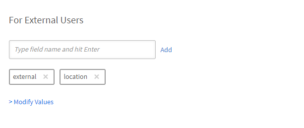

# Adobe Learning Managerでのユーザーの追加

Adobe Learning Managerでは、ユーザーは学習やトレーニングにプラットフォームを使用するユーザーです。 ユーザーには、内部ユーザーと外部ユーザーの2種類があります。

内部ユーザーとは、組織の従業員またはチームメンバーを指します。

社外ユーザーとは、顧客、パートナー、ベンダー、クライアントなど、社外で学習コンテンツにアクセスできるユーザーを指します。

Adobe Learning Manager(ALM)を使用すると、管理者は手動入力、CSVアップロード、セルフ登録、システム統合など、様々な方法で社内ユーザーと社外ユーザーの両方をオンボーディングおよび管理できます。

## 社内ユーザー

Adobe Learning Managerの社内ユーザーとは、組織内の従業員またはチームメンバーを指します。 手動で追加したり、一括でアップロードしたり、システム統合を介して読み込んだりすることができます。 追加したユーザーをグループに編成したり、コースを割り当てたり、学習の進行状況を監視したりできます。

Adobe Learning Managerのユーザーは、割り当てられた役割に基づいて、様々な責任を負い、様々なタスクを管理できます。 管理者、作成者、インストラクター、統合管理者を含む各ロールは、プラットフォーム内でのユーザーの責任をサポートするためにカスタマイズされた、一連の特定の機能を提供します。

Adobe Learning Managerでは、次のユーザーロールをサポートしています。

* **管理者**:ユーザーとユーザーグループの管理、役割の割り当て、およびデータソース、許可されたドメイン、表示オプションなどのシステム全体の基本設定の構成を行います。 管理者は、学習コンテンツの作成と整理、学習者の進行状況の追跡、レポートの生成、外部システムとの統合の設定についても責任を負います。
* **作成者**:モジュールやコースなど、コンテンツを作成および管理します。
* **マネージャー**:チームの学習活動を監督し、チームメンバーにコースを推薦し、リクエストを承認して、フィードバックを提供します。
* **統合管理者**: ALMと外部プラットフォーム間のシステム統合とデータ接続を管理します。
* **カスタムの役割**：管理者は、ユーザーの責任に応じてユーザーに合わせたアクセス権を付与するカスタムの役割を作成できます。 カスタムの役割の詳細については、この記事を参照してください。

### 社内ユーザーを追加する方法

管理者は、次の方法を使用して内部ユーザーを追加できます。

* **単一のユーザーを追加する**：一度に1人のユーザーを手動で追加します。
* **セルフ登録プロファイル** ：管理者が作成した登録リンクを使用して、学習者がAdobe Learning Managerに学習者としてセルフ登録できるようにします。
* **CSVで一括アップロード**: CSVファイルをアップロードして、複数のユーザーを一度に追加します。

### 内部ユーザーを手動で追加する

管理者は、名前、電子メールID、一意の識別子、マネージャーの名前を入力して、個々のユーザーを手動で追加できます。 Adobe Learning Managerの固有IDは、管理者がユーザーを作成するときに割り当てる必須のIDです。 これは、各ユーザーに対して一意であり、システム全体で一貫した参照として機能する必要があります。

>[!INFO]
>
>Adobe Learning Managerでのシングルユーザーの追加について詳しくは、こちらのALMアカデミーのトレーニングをご覧ください。  

1人のユーザーをAdobe Learning Managerに追加するには、次の手順を実行します。

1. 管理者としてログインします。
2. **ユーザー**&#x200B;を選択し、**内部**&#x200B;を選択します。
3. **追加**&#x200B;を選択し、**シングルユーザー**&#x200B;を選択します。

   
   _単一の内部ユーザーを手動で追加するオプションを示す管理者インターフェイス_
4. **ユーザーの追加**&#x200B;プロンプトで、ユーザーの&#x200B;**名前**、**電子メール**&#x200B;および&#x200B;**プロファイル** （役職）を入力します。

   
   _新しいユーザーの名前、電子メール、一意の識別子、およびプロファイルを入力するためのフィールド_
5. ユーザーのマネージャーを検索し、マネージャーリストから名前を選択します。
6. 「**追加**」を選択します。
ユーザーは、アクセス用のログインURLを含む案内メールを受け取ります。

### 社内ユーザーのセルフ登録を許可

セルフ登録は、ユーザーが登録URLにアクセスして詳細情報を入力し、プラットフォームに自動的に登録できるセルフサービスのオンボーディングプロセスです。 この方法では、提供されたURLを使用してユーザーが自分で登録できるようにすることで、管理作業を最小限に抑えます。

ユーザーのセルフ登録URLを作成する手順は、次のとおりです。

1. 管理者としてログインします。
2. **ユーザー**&#x200B;を選択し、**内部**&#x200B;を選択します。
3. 右上隅の&#x200B;**追加**&#x200B;を選択し、**セルフ登録**&#x200B;を選択します。

   
   _セルフ登録オプションを選択するためのドロップダウンメニュー_
4. **セルフ登録プロファイルの追加**&#x200B;プロンプトで、**プロファイル名** （ユーザーの役職名）フィールドにプロファイルを入力します。
5. [**マネージャーの名前**]フィールドでマネージャーを検索して、ユーザーのマネージャーを選択します。 セルフ登録プロファイルに割り当てられたマネージャーは、Adobe Learning Managerに登録されたユーザーである必要があります。

   
   _役職を設定し、自己登録プロファイルにマネージャーを割り当てるための入力フィールド_
6. 「**画像を追加**」オプションを使用して画像を選択します。 この画像は、「プロファイル」セクションの学習者に表示されます。
7. 「**保存**」を選択します。

   Adobe Learning Managerはユーザープロファイルを作成してセルフ登録URLを生成します。ユーザーはこのURLを共有して登録を完了できます。

   
   _セルフ登録URLの作成に成功したことを示す確認メッセージ_
8. セルフ登録を行うユーザーにURLを公開します。

   URLは、登録のために複数のユーザーと共有することができます。 たとえば、**営業担当者**&#x200B;プロファイルのURLを生成し、営業担当者チームと共有して、営業担当者が自分で登録できるようにすることができます。

_セルフ登録リンクでサインアップページを開く_

### セルフ登録URLのリストの表示

セルフ登録URLのリストを表示する手順は、次のとおりです。

1. **ユーザー**&#x200B;を選択し、**内部**&#x200B;を選択します。
2. **セルフ登録**&#x200B;を選択します。

   管理者は、セルフ登録URLのリストを表示できます。

_社内ユーザーが利用できる既存のセルフ登録URLを示すリストビュー_

### 内部ユーザーのバルクアップロード

Adobe Learning Managerでは、名前、電子メールID、マネージャーの名前などのユーザー情報を含むCSVをアップロードすることで、管理者は一度に複数のユーザーを追加できます。 このバルクアップロード機能により、ユーザーを個別に追加する場合に比べて時間と労力を節約できます。

>[!INFO]
>
>CSVを使用してユーザーを一括で追加する方法については、このALMアカデミーのトレーニングをご覧ください。   

複数のユーザーを追加するには：

1. 管理者としてログインします。
2. **ユーザー**&#x200B;を選択し、**内部**&#x200B;を選択します。
3. 右上隅の&#x200B;**追加**&#x200B;を選択し、**CSVをアップロード**&#x200B;を選択します。

   
   _ユーザーの一括読み込み用にCSVファイルをアップロードするオプション_

4. 次のフィールドを含むCSVファイルを準備します。

   * 従業員の氏名*
   * 従業員のメールアドレス*
   * 従業員のプロファイル/指名
   * マネージャーのID/電子メール\
     (*)必須フィールド。

5. 従業員のマネージャーの電子メールIDを追加する前に、マネージャーが従業員としてCSVファイルに既に含まれていることを確認します。 例えば、以下のスナップショットのHoward Waltersという名前の従業員を参照してください。

   
   _すべてのフィールドを含むサンプルCSVの画像_

6. CSVファイルをアップロードし、それに応じてデータフィールドをマッピングします。

   
   _スプレッドシートの列をシステムフィールドに揃えるためのCSVマッピングインターフェイス_
7. 「**保存**」を選択して、ユーザーを読み込みます。

   アップロードが成功すると、確認メッセージが表示されます。

   
   _画像は、CSVアップロードのステータスを正常に表示しています_

>[!NOTE]
>
>すべての追加と削除に関するマスターCSVを保持します。 既存のCSVファイルの更新と再アップロードはサポートされていません。

CSVファイルをアップロードしてユーザーを追加する場合、すべての関連情報を正しい順序で含めることが重要です。 マネージャーの電子メールIDを従業員に割り当てる場合、マネージャーの詳細がCSVファイルの前に表示されている必要があります。 これにより、システムはマネージャーをチームメンバーにリンクする前に既存のユーザーとして認識します。 例えば、Howard Waltersがマネージャーの場合は、自分に報告した従業員をリストする前に、ユーザーの詳細情報をCSVに含めます。

### ユーザー登録の管理

ユーザーを個別にまたは一括で追加した後、ユーザーを登録してアカウントをアクティベートする必要があります。 これにより、Adobe Learning Managerにアクセスしてプラットフォームの使用を開始できます。

ユーザーを登録するには、次の手順に従います。

1. 管理者ホームページで&#x200B;**ユーザー**&#x200B;を選択します。
2. 登録するユーザーの名前の横にあるチェックボックスをオンにします。
3. **アクション**&#x200B;を選択し、**登録**&#x200B;を選択します。

   
   _Adobe Learning Managerで選択したユーザーをアクティベートするための「登録」ボタン_

4. 「**はい**」を選択して、ユーザーをアクティベートします。

ユーザーに確認用メールが送信されます。 アカウントを有効にしてAdobe Learning Managerの使用を開始するには、電子メール内のリンクを選択する必要があります。

## 社外ユーザー

Adobe Learning Managerを使用すると、社外のユーザー（顧客、パートナー、ベンダー、クライアントなど）を追加して、学習コンテンツにアクセスできます。 追加された学生は、グループ化したり、コースを割り当てたり、学習の進捗状況を追跡したりできます。

Adobe Learning Managerで外部ユーザーを追加するには、次の手順を実行します。

* 社外登録プロファイルの作成
* 登録プロファイルを有効にする
* 登録リンクを外部ユーザーと共有する
* 必要に応じてプロファイルを一時停止または再開する

Adobe Learning Managerでは、社外登録プロファイルを使用したこれらのユーザーの登録をサポートしています。

外部ユーザーを作成するには、次の手順に従います。

1. 管理者としてログインします。
2. **ユーザー**&#x200B;を選択し、**外部**&#x200B;を選択します。
3. 右上隅の「**追加**」を選択して、社外ユーザーの登録を作成します。
4. **社外登録プロファイルを追加**&#x200B;ダイアログで、以下を指定します。

   * **プロファイル名：** Adobe Learning Managerにアクセスするパートナー組織の名前を入力します
   * **マネージャーの電子メール：**&#x200B;ユーザーのマネージャーの電子メールアドレスを入力します。
   * **人数制限：**&#x200B;許可される登録数の上限を設定します。
   * **有効期限：**&#x200B;新しい登録の最後の日付を定義します。 有効期限が切れると、新規ユーザーの登録にリンクが使用できなくなります。

   
   _プロファイル名、マネージャーの電子メール、人数制限、および有効期限を入力するためのダイアログボックス_

5. **[画像の追加]**&#x200B;オプションを使用して画像を選択します。 この画像は、「プロファイル」セクションの学習者に表示されます。
6. 「**詳細設定**」セクションを選択して展開し、必要な詳細を入力します。
   * **ログイン要件：**&#x200B;日数を入力します。 学習者がその期間中非アクティブのままの場合は、自動的に削除されます。
   * **許可されたドメイン：**&#x200B;許可された電子メールドメインのコンマ区切りの一覧を入力します。 承認されたドメインのメールアドレスを持つユーザーのみが新規登録できます。
   * **電子メールの確認が必要：**&#x200B;登録時に電子メールの確認を強制するには、これを選択します。

   
   _ログイン要件、許可されているドメイン、および電子メール確認を設定するための詳細設定パネル_

7. 「**保存**」を選択します。

登録URLが生成されます。

### 社外プロファイルを有効にする

社外プロファイルを有効にするには：

1. 新しく作成したプロファイルを社外プロファイルのリストで探します。

2. 「**ステータス**」トグルボタンを選択して有効にします。

管理者はこのURLを外部パートナーと共有し、新規登録してAdobe Learning Managerにログインできます。

_切り替えを選択して外部プロファイルを有効にします_

### 社外プロファイルの登録URLをコピーして共有する

外部プロファイルの登録URLは、**外部ユーザー**&#x200B;セクションからコピーできます。

_社外プロファイルの登録URLをコピーする_

### 内部ユーザー登録と外部ユーザー登録の主な違い

社内登録と社外登録にはいくつかの違いがあります。

| 社内ユーザー | 社外ユーザー |
|---|---|
| Adobe IDまたはSSO資格情報を使用してログインできます。 | 任意の電子メールIDを使用してログインできます。 |
| ゲーミフィケーションが使用できます。 | ゲーミフィケーションを利用できます。 管理者は、[ゲーミフィケーション設定](https://experienceleague.adobe.com/en/docs/learning-manager/using/admin/gamification)で社外学習者のゲーミフィケーションを有効にする必要があります。 |

### 外部登録プロファイルを一時停止

Adobe Learning Managerでは、管理者はプロファイルを一時停止することで社外ユーザーの登録を管理できます。 これは、特定の社外ユーザープロファイルを使用した新規ユーザーの参加を一時的に停止する場合に便利です。 プロファイルを一時停止すると、招待を受け取ったが、登録がまだ完了していないユーザーは、サインアッププロセスを完了できなくなります。 このアクションは、既に登録を完了しているユーザーには影響しません。

外部プロファイルを一時停止するには、次の手順を実行します。

1. **外部ユーザー**&#x200B;ページの右上隅にある&#x200B;**アクション**&#x200B;を選択します。
2. 外部ユーザープロファイルを一時停止するには、**一時停止**&#x200B;を選択します。

これにより、招待をまだ受け入れていないユーザーの登録プロセスがブロックされます。 このアクションは、まだ登録を完了していないユーザーにのみ影響します。

_アクションメニューから既存の社外ユーザープロファイルを一時停止するオプション_

### 社外登録プロファイルを再開

外部プロファイルが以前に一時停止されていた場合、管理者はそれを再開して、新しいユーザーが登録を完了できるようにすることができます。 招待されたがサインアップを完了していないユーザーの登録プロセスが再開されます。

外部ユーザーを再開するには、次の手順に従います。

1. ページの右上隅にある&#x200B;**アクション**&#x200B;を選択します。
2. 一時停止したパートナーのアクセスを再開するには、**再開**&#x200B;を選択します。

_一時停止していた外部ユーザープロファイルを再開するオプション_

### 外部シートの使用状況の監視

管理者は、Adobe学習で各社外プロファイルに追加されたユーザー数をトラックできます。

使用席を確認する手順は、次のとおりです。

1. 外部プロファイルのリストで&#x200B;**使用されている席**&#x200B;を選択します。

パートナー組織に追加された学習者の数と、学習者がアクティブかどうかを表示できます。

## ユーザーの管理

管理者は、ユーザーの詳細の編集、ユーザーの削除、役割の割り当て、役割の削除を行うことができます。 これにより、各ユーザーが適切なアクセス権とタスクを持つことができるようになります。

>[!INFO]
>
>役割の割り当てと削除、案内メールの送信、ユーザーの削除と消去の方法については、このALM Academyトレーニングをご覧ください。 [![ボタン]](https://content.adobelearningmanageracademy.com/app/learner?accountId=98632#/course/7555586) 

### ユーザーの編集

名前、メールアドレス、一意のID、プロファイル、マネージャーの名前など、ユーザーのプロファイル情報を更新するには、Adobe Learning Managerの&#x200B;**ユーザーを編集**&#x200B;オプションを使用します。 管理者はこれらの変更を行って、ユーザーデータを正確かつ最新の状態に保つことができます。

ユーザーを編集するには：

1. 管理者ホームページで&#x200B;**ユーザー**&#x200B;を選択します。
2. 編集するユーザーを&#x200B;**ユーザー**&#x200B;リストから選択します。
3. **プロファイルの編集**&#x200B;を選択します。

   
   _プラットフォームからユーザーを削除するには、[アクション]メニューの[ユーザーの削除]オプションを使用します_

4. **はい**&#x200B;を選択してユーザーを削除します。

ユーザーが正常に削除されると、確認メッセージが表示されます。

## ユーザーに役割を割り当てる

Adobe Learning Managerのユーザーロールは、各ユーザーがシステム内で実行できるアクションを定義します。 各ロールには、ユーザーの責任に基づいた特定の権限が割り当てられます。

役割をユーザーに割り当てるには：

1. 管理者ホームページで&#x200B;**ユーザー**&#x200B;を選択します。
2. ロールを割り当てるユーザーを選択します。
3. 右上隅の&#x200B;**アクション**&#x200B;を選択します。
4. **役割の割り当て**&#x200B;を選択します。
5. 必要な役割を選択します。

   
   _[役割の割り当て]メニューのオプションには、選択したユーザーが使用できる役割が表示されます_

6. 確認ダイアログで「**はい**」を選択します。

## 役割の削除

ユーザーロールを削除すると、そのロールによって付与された権限が取り消されます。

ユーザーからロールを削除するには、次の手順に従います。

1. 管理者ホームページで&#x200B;**ユーザー**&#x200B;を選択します。
2. ロールを削除するユーザーを選択します。
3. **アクション**&#x200B;を選択し、**ロールの削除**&#x200B;を選択します。

   
   _[アクション]メニューのユーザーから割り当てられたロールを削除するオプション_

4. 確認ダイアログで「**はい**」を選択します。
<!--# Add users and create user groups

Learn how to add users or user groups in Learning Manager application.

<!---->

<!--## Overview {#overview}

In Adobe Learning Manager, you can assume the following roles:

* **Administrator:** An Administrator defines the training strategy for the organization. An Administrator can add learners, search required skills for learners, manage and assign courses, create learning plans, certifications, and learning programs, and manage reports for the entire organization.
* **Author:** Authors are Instructional Designers and content creators. An Author can add modules and courses to Learning Manager.
* **Manager:** A Manager manages the learning activities of a team. A Manager can nominate team members to take a course, approve requests from team members, and provide feedback on performance of their team members post-completion of training. Managers can also view reports for their team to track their performance.
* **Learner:** Learners can access courses, learning programs, and certifications assigned to them. Learners can also browse through all the available courses by using a catalog and enroll themselves for either courses, learning programs, or certifications.

As an Administrator, you can add users in three ways:

* Internal
* External
* User groups

## Add a single user {#addasingleuser}

Add internal learners to the Adobe Learning Manager using a single user option.

>[!INFO]
>
>In this training, you will learn how to add internal learners to the Adobe Learning Manager.    

If you're unable to launch the training, write to <almacademy@adobe.com>.

To add users,

1. Log into Adobe Learning Manager as an Administrator. 
1. On the home page, click **[!UICONTROL Add Users]**. On this page, you can add a single user or multiple users at a time using a CSV. You can also create a self-registration link for internal employees or create an external learner profile.
1. To add a single user, click **[!UICONTROL Add]** on the upper-right corner and choose the option **[!UICONTROL Single User]**.

1. To add a single user, click **[!UICONTROL Add]** on the upper-right corner and choose the option **Single User**.

   
   *Add a single internal user*

1. On the **[!UICONTROL Add User]** dialog, enter the details of the learner. For the field **[!UICONTROL Manager's Name]**, pick the name of an existing user in the system.

   
   *Add user dialog box*

1. To add the new user in Learning Manager, click **[!UICONTROL Add]**. After the user is added, the user receives a verification mail. The Learner then activates the account and starts using Learning Manager. This workflow is helpful if you need to add limited number of learners to your Learning Manager Account. But if you're planning to enroll all the employees of a large organization, you can add them in a singe attempt. For more information, see the next section.

## Add users in bulk {#addusersinbulk}

Typically, most organizations work with an HR Management System (HRMS), which maintains all employee records, such as, designation, location, date of joining, or employee hierarchy. You can export this data in a CSV format. To import a CSV, follow the steps below:

1. Click **[!UICONTROL Add]** on the upper-right corner, and choose the option **[!UICONTROL Upload a CSV]**.

   
   *Upload a CSV to add users in bulk*

1. The CSV that you upload consists of the fields, as shown below:

   
   *Structure of the CSV*

   You must maintain a master CSV and perform perform all additions and deletions on the master CSV. The master CSV contains the following fields:

   * name &#42;
   * email &#42;
   * profile
   * manager

   (&#42;) Required field.

1. After you click the option **[!UICONTROL Upload a CSV]**, the following dialog displays.

   
   *Upload a CSV dialog*

1. Choose the CSV or drag-and-drop the file. After you've chosen the file, map the data fields with the ones in the CSV file. Click the required drop-down and choose the right field.

   
   *Map fields in CSV*

1. To start importing the users, click **[!UICONTROL Save]**. You can see a confirmation message.

   
   *Confirmation message for successful upload of the CSV*

1. The new users are now added to your Adobe Learning Manager account. To select the new users, select the check-box next to the names so that everybody is selected. 

   
   *New users added*

>[!NOTE]
>
>For more information, see the FAQ, [Add users in bulk](../add-users-in-bulk.md).

>[!INFO]
>
>In this training, you will learn how to add users in bulk through a CSV.    

If you're unable to launch the training, write to <almacademy@adobe.com>.

## Register a user {#registerauser}

With the user selected, click **[!UICONTROL Actions]** on the upper-right corner and click **[!UICONTROL Register]**.

The selected users receive a Welcome email. If the learners have an existing Adobe ID, they can click this link. If they don't have an existing Adobe ID, they can go ahead and click the Welcome link to create an Adobe ID and link it to their Learning Manager account.

### Manage users

In this training, you will learn how to assign and remove roles, send a welcome email, and delete and purge users. 

If you're unable to launch the training, write to <almacademy@adobe.com>.

## Assign a role {#assignarole}

After adding learners to the Adobe Learning Manager account, if you want to change their roles, click Actions on the upper-right corner of the page. Choose the option **[!UICONTROL Assign Role]**. Here you can decide whether you want to give Author access or Admin access to the learner. After you have assigned a role, this learner has Author access to the account and can add modules and create courses. 

*Assign a role to a user*

## Remove a role {#removearole}

You can also remove Author or Admin access for the users. Select one or more learners, click **[!UICONTROL Actions]**, and select **[!UICONTROL Remove Role]**. Choose an option, for example, **[!UICONTROL Remove Author]**, and the author access gets revoked for this learner. 

>[!NOTE]
>
>You cannot manually assign a Manager role to someone in the system. They automatically get access to the Manager dashboard when one or more employees are added under them.

## Delete a user {#deleteauser}

To delete a user, click **[!UICONTROL Actions]**, and choose **[!UICONTROL Delete User]**. On the confirmation dialog, click **[!UICONTROL Yes]**, and the learner gets deleted.

*Confirmation message to delete a user*

## Edit a user {#editauser}

On the list of users, choose a user, and click the user. On the user details, click the **[!UICONTROL Edit]** ( ) button. On the **[!UICONTROL Edit User]** dialog, make the necessary edits and to save the changes, click **[!UICONTROL Save]**.

*Edit User dialog*

## Active fields

Active Fields in Adobe Learning Manager are customizable metadata fields used to store and manage user-specific information. These fields help define key attributes or characteristics associated with each user in the system.

### Manage user attributes

>[!INFO]
>
>In this training, you will learn how to add, customize, and configure Active Fields.    

If you're unable to launch the training, write to <almacademy@adobe.com>.

Adobe Learning Manager preserves the case sensitivity of the user attribute and its value. **For example**, the case sensitivity of a user attribute is 'location' and its value as 'PARIS' will be preserved and displayed in the same manner. In case of any issues, the Administrator can now edit the attribute name and values to correct any case sensitivity errors. 

The Administrator can do this by visiting **[!UICONTROL Admin app]** > **[!UICONTROL Users]** > **[!UICONTROL User groups]** and clicking on the group name.  

An Admin can add and update allowed attribute values for a learner through UI.

Types of active fields:

* Groupable: Learners would get grouped on the basis of the Values
* Reportable: Reporting user groups would be created based on the active fields
* Exportable: The fields will be seen in exported in user group report.

## Create a self-registration link {#createaselfregistrationlink}

You can also enable employees in your organization to register themselves as Learners to Adobe Learning Manager Account, without taking help from you as an administrator. The administrator can create a Self-Registration link and share with the employees, who can further register to Learning Manager using their Adobe credentials.

On the upper-right corner of the page, click **[!UICONTROL Add]**, and select **[!UICONTROL Self-Registration]**.

*Create link to self-register as learner*

The **[!UICONTROL Add Self-Registration Profile]** dialog appears. Give this profile a name. Then add the manager's name. It's important to know that the manager must already be registered learner in Learning Manager.

*Add profile for self-registration*

After you click **[!UICONTROL Save]**, a URL gets generated, which you can share with the learners, so that they can click the URL and self-register themselves.

## Enroll external learners {#enrollexternallearners}

In Adobe Learning Manager, you can also create Registration links for external partners or agencies with limited access to your account and provide them learning material.

There are a few differences between internal and external registrations.

<table>
 <tbody>
  <tr>
   <td>
    
<b>Internal users</b>
</td>
   <td>
    
<b>External users</b>
</td>
  </tr>
  <tr>
   <td>
    
Log in using Adobe ID or SSO credentials.
</td>
   <td>
    
Log in using any email ID.
</td>
  </tr>
  <tr>
   <td>
    
Gamification is available.
</td>
   <td>
    
Gamification is available. The admin must enable gamification for external learners in the Gamification settings.
</td>
  </tr>
  <tr>
   <td>
    
Learner hierarchies are available.
</td>
   <td>
    
Learner hierarchies are not available.
</td>
  </tr>
 </tbody>
</table>

To enroll external users, follow the steps below:

1. In the left navigation pane, click **[!UICONTROL External]**.

   
   
   *Enroll external users*

1. On the upper-right corner of the page, click **[!UICONTROL Add]**.

1. On the **Add External Registration Profile** dialog, add the following details:

   * The profile name of the partner organization.
   * The email address of the manager of the partner organization.
   * Seat limit for external enrollment for this partner.
   * Expiry date to set a deadline to stop allowing new registrations to this group. After the Expiry date, only the existing registered users can access this training.

   

   *Add External Registration Profile dialog*

   * In the **[!UICONTROL Advanced Settings]** section, enter the following:

     * **[!UICONTROL Login Requirement]:** Specify a value in days. Learners get deleted if they do not login for the above duration.
     * **[!UICONTROL Allowed Domains]:** A comma-separated list of whitelisted email domain names.
     * **[!UICONTROL Email Verification Required]:** Select this option to make email verification mandatory for a learner.

   

   *Enter the details in the Advanced Settings section* 

1. After you click **[!UICONTROL Save]**, you can see the following confirmation message. You must share the URL with your external partner.

   

## Enable an external profile {#enableanexternalprofile}

After an external profile has been created, you must enable its status. From the list of external profiles, choose the required profile, and toggle the status button.

*Enable an external profile*

This enables the External Enrollment link. A welcome email is automatically be sent to the partner. You can also copy the link and share with them by clicking the Copy URL icon (), or you can resend the welcome email to the partner organization by clicking the Mail icon ().

The partner manager can share the link with the employees who must take the training in PrLearning Managerime. When they click the link, they can self-enroll themselves after filling out some details to create their profile on Learning Manager. These users will not appear on the Learners tab along with the internal employees. You can see their names under the **[!UICONTROL External Learners]** tab.

## Pause an external profile {#pause}

After adding an external user group to Learning Manager, you can also pause the external users' registration process. When you pause, the external users' registration process is blocked. However, this process works only when the users haven't registered yet by accepting the invitation.

To pause the external user groups, choose a group or groups, click **[!UICONTROL Actions]** from the upper-right corner of the page, and click **[!UICONTROL Pause]**.

## Resume an external profile {#resumeanexternalprofile}

At any time, you can always revoke the paused state of an external partner and resume normal services. Click **[!UICONTROL Actions]** at the upper-right corner of the page and select **[!UICONTROL Resume]**.

The following states are applicable for external users:

* **Inactive state** - In this state, the external users' registration is expired. Administrators set the expiry date for the external users while adding them through the add user workflow.
* **Active state** - In this state, the external users can register to the Learning Manager application, and log in to the application.
* **Pause** - In this state, the registration process for external users is blocked. However, the existing users can continue to log in.

## Check used seats {#checkusedseats}

On the list of external profiles, click **[!UICONTROL Seats Used]**. You can view the number of learners in the partner organization who have been added.

*Check used seats*

## Delete a user {#Deleteauser-1}

Choose a user, and from the upper-right corner, click **[!UICONTROL Actions]** > **[!UICONTROL Delete User]**.

## Change profile {#changeprofile}

To move a user to another external profile, choose a user, from the upper-right corner, click **[!UICONTROL Actions]** > **[!UICONTROL Change Profile]**. From the list of profiles, choose a profile, and click **[!UICONTROL Change]**.

## Assign a role {#Assignarole-1}

Choose a user, and from the upper-right corner, click **[!UICONTROL Actions]** > **[!UICONTROL Assign Role]** > **Make `<role>`**. The user gets a new role.

## Remove a role {#Removearole-1}

Choose a user, and from the upper-right corner, click **[!UICONTROL Actions]** > **[!UICONTROL Remove Role]** > **Remove `<role>`**. The selected role gets removed from the list of roles that were assigned to the user.

>[!NOTE]
>
>Assigning a new role will not affect custom user groups. However, it will impact auto-generated user groups such as All Admins, All Authors, and similar role-based groups.

## Create user groups {#createusergroups}

A User Group is a set of users who are related to a category. User Groups help administrators to select learners in their organization based on their attributes, and then assign learning content to them. Also, these User Groups enable administrators to assign customized logos and catalogs to learners and show customized reports on their progress.

To access User Groups, on the left navigation pane, click **[!UICONTROL User Groups]**.

*Create user groups*

### Manage user groups

>[!INFO]
>
>In this training, you will learn how to create a user group by names, email IDs, and combining multiple auto-generated user groups.    

If you're unable to launch the training, write to <almacademy@adobe.com>.

There are two types of groups in Adobe Learning Manager, Custom and Auto-generated. When you add learners to your account, some groups are automatically created based on their common properties.

To see the automatically created groups, click the tab **[!UICONTROL Auto-generated]**.

*View Auto-generated groups*

You can see that there are different groups, like All Internal Users, All Managers, groups based on the Cost Center, based on the department, and based on the teams of the managers.

In addition to Auto-generated groups, you can create Custom groups. To add a new Custom Group, on the upper-right corner, click **[!UICONTROL Add]**. 

1. Enter the name, and description for the group.
1. Enter user name or profile in search-as-you-type field and select from the drop-down list, to add users.

1. To add more learners, click **[!UICONTROL Add More Users]**.

1. To create the user group, click **[!UICONTROL Save]**.

This Custom Group is now created and added to the profile. The User Groups that you create are dynamic in nature. If new users are added with similar attributes, they're automatically added to the User Group.

To view the list of groups a user belongs to, navigate to **[!UICONTROL User]** > **[!UICONTROL User Groups]**, search for the user's name, and select it. This will display all the groups the user is part of.

### Download the list of users in a user group

To download the list of users in a specific user group, navigate to **[!UICONTROL User]** > **[!UICONTROL User Groups]**, select the **[!UICONTROL Download icon]** next to the group. This will generate a CSV file containing the list of users in that group.

 

## Exclusion of user groups

At times you would want to exclude a small set of users from a large user group. This is required to enroll this specific set of users into training via Learning Plans or to setup the correct visibility of catalogs. In this release of Learning Manager, you can exclude learners or User Groups when you create a custom user group. In the Add User Group dialog, the Exclude Learners section enables you to achieve so.

*Exclude user groups*

For example, if you want to set up a Learning Plan so that all users belonging to location = California except Store-5 (located in California) get enrolled. 

## Advanced settings {#advancedsettings}

### Data Sources {#datasources}

You can use this feature when you want to import/sync the users or learning data from your organization's database in to the Learning Manager application. You can also set up the frequency of this sync. 

Click **[!UICONTROL Data Sources]** on the left pane under **[!UICONTROL Advanced]** section. 

*Data sources to iport or sync users*

Choose the data source type from the **[!UICONTROL Source]** drop-down, select the update frequency, and click **[!UICONTROL Sync now]** if you need to sync immediately or click **[!UICONTROL Save].** Data source types are SFDC, FTP, and so on for internal users. 

You can add multiple data sources. 

### Active Fields {#activefields}

This feature enables administrators to add more active fields in addition to what has been provided during user registration. 

Click **[!UICONTROL Active Fields]** available inside users page. Learners can only choose from the values given in custom values.

*Active fields*

### Configure Fields {#configurefields}

**Internal users**

You can add custom value for user fields for internal users.

To add  custom values, follow these steps:

1. Click  **[!UICONTROL Modify Values]** for an Internal user. 

   
   *Modify values for internal users*

1. The **Values in Custom field** dialog box appears.

   
   *Values in Custom Fields dialog box*

1. Select the value to add from the **[!UICONTROL Select Field]** drop-down menu.
1. Enter new values in the **[!UICONTROL New Value]** field.
1. Click **[!UICONTROL Done]**. 
1. Click Save on the top right corner to **[!UICONTROL Save]** changes.

**External users**

Add custom values similar to that for internal users.

*Modify values for external users*

### Settings {#settings}

**User Display**

If the option **Show only unfilled fields on Learner login** is enabled, a user only sees the blank fields upon login.

*Show unfilled fields*

Using this option, an Administrator can decide whether he/she wants to show the fields or hide them once these have been populated.

## Restrict Active Fields in reports {#restrictactivefields}

Learning Manager 27.7 introduces two new options- **[!UICONTROL Reportable]** and **[!UICONTROL Exportable]**, for Active Fields.

*Options in Active Fields*

For CSV fields and manually added fields, if an Active Field is marked as **[!UICONTROL Reportable]**, the Active Field becomes searchable in a filter inside a dashboard report.

*Filters in a dashboard report*

If an Active Field is marked as **[!UICONTROL Exportable]**, then the Active Field appears in the Excel file upon downloading any Excel report.

These options appear for both internal and external Active Fields.

You can only delete a custom Active Field.

## User Display

You can hide the entire 'Complete your profile' page from the learners. The page will not pop up once the learner logs in.

Note that the existing default behavior does not change. This is an optional capability now available to Administrators. 

Enable the options below:

*User Display section*

## Support for manual CSV fields by FTP and Box connectors {#import-connector}

Often, users want Active fields to be manually provided when a learner logs in to Learning Manager. This is possible in Learning Manager at present, when the user imports a CSV manually.

The CSV may not contain all the Active fields. For all the Active fields that are not updated in the uploaded CSV, the user needs to enter the data for such Active fields.

Presently, all Active fields must be mapped to some field from the source CSV.

It so happens that sometimes a user does not want to map an Active field to a field specified in the CSV. In such cases, the user can map the Active field to the value **[!UICONTROL DontImportFromSource]**. Select this value from the drop-down list, when importing users from FTP and Box connectors.

## Custom Roles {#customroles}

Add any field of your choice as part of your user information and click **[!UICONTROL Save]**. After adding the fields, you can also cross check the availabilities of the fields in the **[!UICONTROL Edit users]** dialog. 

After adding the fields, you can notice that the fields marked with tick mark are sourced from data source or CSV as mentioned in the below snapshot. Administrator can edit these sourced fields by enabling or disabling the fields. 

**Values for active fields in Learning Manager**

The values for active fields are fetched in the following ways: 

1. Learning Manager application imports metadata from data sources associated with your account. 
1. Metadata captured from the manually imported CSV file. 
1. Learners fill up metadata when they log in
1. Administrator enters data for the users. 

>[!NOTE]
>
>Learning Manager application creates user groups automatically, from these metadata. 

**Add custom value**

You can add custom value for user fields in the Internal and External user fields.

To add  custom values, follow these steps:

Custom fields can be added and deleted, they are applicable to all users. CSV fields can be enabled or disabled, they come into effect only when you upload CSV after making the modifications in Active fields. All internal active fields are applicable to all types of Internal users. External fields are applicable only to external users. If a custom field is present in CSV, on next upload it gets converted to a CSV field automatically and it is enabled. 

## Values for CSV fields {#valuesforcsvfields}

Users can only choose from predefined fields for CSV fields if the **[!UICONTROL Restrict Selection]** check-box is enabled.

*Restrict selection check-box*

## Import Logs {#importlogs}

In this space, you can view the CSV import history for the users the administrator has added using bulk import feature. You can also click **[!UICONTROL Add]** at the upper-right corner of the page to add users using CSV upload feature. 

## Multi-valued Active Fields

With this feature, you can have more than one field for an active field. In an account, there can be at most three multi-valued active fields. The multi-valued active fields are available for both external and internal users.

Once you mark an active field as multi-valued, you cannot convert it back to single valued. This is irreversible.

An existing single valued field cannot be marked as multi-valued field.

To create a multi-valued active field, follow the steps below:

1. Add an active field.

   
   *Add an active field*

1. Click Add.
1. In the Settings tab, mark the new field as multi-valued.

   
   *Mark as multi-valued*

   There is another checkbox, **[!UICONTROL Learner Configurable]**, which when disabled, the learner will not be able to see the field on the Profile page.

1. Add the values using a CSV or by clicking Modify Values.

   
   *Add values*

1. Click [!UICONTROL **Done**].

>[!NOTE]
>
>Once is the user group is created and the field is populated, multi values cannot be converted to single values, and vice versa.

### Add multi-valued active field via CSV

Follow the steps below:

1. Create a CSV with the new active fields as columns (comma-separated or single values).
1. Import the CSV.
1. Mark the fields as multi-valued in the Values in Custom Fields dialog.
1. Import the CSV again.

The CSV must have a column with the same name as that of an active field that was marked as multi-valued.

The CSV contains the fields:

* **[!UICONTROL User]**: User groups created as roles.
* **[!UICONTROL Roles]**: Multi-valued active field with values.

If the CSV is re-uploaded with new values or deleted values, the active fields and groups also get updated accordingly.

### Reports

All reports include the multi-valued active fields and their values.

The Administrator can add auto-generated active fields, and configure user activity and training reports.

The Learner Transcript report contains all the active fields and comma-separated values. The Administrator can then filter the data accordingly.

## User group report

Adobe Learning Manager's new User Group Report helps manage user groups by providing visibility into groups left unmanaged when admins left. Admins can access the reports under the **[!UICONTROL Users]** > **[!UICONTROL User Group]** section. It provides detailed information about each group, including:

* User group type
* Group name
* Description
* Created by (Name)
* Created by (Email)
* Created on (UTC Timezone)
* Number of Users

To download the report, follow these steps:

1. Log in as an **[!UICONTROL Admin]**.
2. Select **[!UICONTROL Users]** > **[!UICONTROL User Group]**.
3. Select **[!UICONTROL Actions]** > **[!UICONTROL Download User Group Report]**.

 
_Download the User Group report_

## Frequently Asked Questions {#faq}

+++How to register users in Learning Manager?

After adding a user and assigning a role to the user, you can register the user by performing the steps below:

1. With the user or users selected, click **[!UICONTROL Actions]** on the upper-right corner, and click **[!UICONTROL Register]**.

1. On the pop-up window, click **[!UICONTROL Yes]**.

The selected user(s) receive a Welcome email. If the learners have an existing Adobe ID, they can click this link. If they don't have an existing Adobe ID, they can go ahead and click the Welcome link to create an Adobe ID and link it to their Learning Manager account.

Clicking one of these links in the email is mandatory for the learners as it helps Learning Manager to verify the learner's account.

+++

+++How to edit user data?

To edit a user, follow the steps below:

1. In the list of users, click the user for who you want to edit the data.
1. Click the pencil icon, as shown below.

In the **Edit User** dialog, update the fields accordingly. To save the changes, click **[!UICONTROL Save]**.

+++

+++How to pause and resume an external user in Learning Manager?

In the list of External Users, choose the user that you want to delete. On the upper-right corner, click **[!UICONTROL Actions]** > **[!UICONTROL Pause]**.

For more information, see [Pause an external profile](add-users-user-groups.md#pause).

After you pause a profile, the external profile displays the status as ***Paused***.

+++

+++How to send welcome email to newly created external profile?

When adding an external user, in the **[!UICONTROL Add External Registration Profile]** dialog, enter the email of the external manager. When you click Save, a welcome email also gets sent to the email address that you had specified. If you want to send the welcome mail again, click the envelope icon, as shown below:

+++

+++How to create Custom User Groups?

Click **[!UICONTROL Users]** > **[!UICONTROL User Groups]** and on the User Groups page, click **[!UICONTROL Add]**. In the Add User Group dialog, add the users both individually and as a team.

+++

+++How to disable already filled active fields?

If you want learners to only see the active fields that are not filled by them, then follow the steps below:

1. Click **[!UICONTROL Users]** > **[!UICONTROL Active Fields]**.  

1. Click **[!UICONTROL Settings]** and enable the option **[!UICONTROL Show only unfilled fields on Learner login]**.

1. Click **[!UICONTROL Save]**.

+++

+++How to prevent learners from entering random values in the active fields.?

You can restrict the selection for learners so that they can only select the values that are pre-defined and not enter any random values. Follow the steps below:

1. Click **[!UICONTROL Users]** > **[!UICONTROL Active Fields]**.
1. Enable the option **[!UICONTROL Restrict Selection]**.
1. Click **[!UICONTROL Done]**.

+++

+++How do I differentiate CSV active fields and Custom Active fields?

You can only enable or disable CSV active fields, but cannot delete them. On the other hand, you cannot enable or disable custom active fields.

+++-->