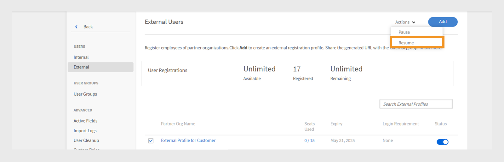

# Adobe Learning Managerでのユーザーの追加

Adobe Learning Managerでは、ユーザーは学習またはトレーニング用のプラットフォームを使用する学習者です。 ユーザーには、内部ユーザーと外部ユーザーの2種類があります。

内部ユーザーとは、組織の従業員またはチームメンバーを指します。

社外ユーザーとは、顧客、パートナー、ベンダー、クライアントなど、社外で学習コンテンツにアクセスできる学習者を指します。

Adobe Learning Manager(ALM)を使用すると、管理者は手動入力、CSVアップロード、セルフ登録、システム統合など、様々な方法で社内ユーザーと社外ユーザーの両方をオンボーディングおよび管理できます。

## 社内ユーザー

Adobe Learning Managerの社内ユーザーとは、組織内の従業員またはチームメンバーを指します。 手動で追加したり、一括でアップロードしたり、システム統合を介して読み込んだりすることができます。 追加したユーザーをグループに編成したり、コースを割り当てたり、学習の進行状況を監視したりできます。

Adobe Learning Managerのユーザーは、割り当てられた役割に基づいて、様々な責任を負い、様々なタスクを管理できます。 管理者、作成者、インストラクター、統合管理者を含む各ロールは、プラットフォーム内でのユーザーの責任をサポートするためにカスタマイズされた、一連の特定の機能を提供します。

### 社内ユーザーを追加する方法

管理者は、次の方法を使用して内部ユーザーを追加できます。

* **単一のユーザーを追加する**：一度に1人のユーザーを手動で追加します。
* **セルフ登録プロファイル** ：管理者が作成した登録リンクを使用して、学習者がAdobe Learning Managerに学習者としてセルフ登録できるようにします。
* **CSVで一括アップロード**: CSVファイルをアップロードして、複数のユーザーを一度に追加します。

### 内部ユーザーを手動で追加する

管理者は、名前、電子メール、一意の識別子、マネージャーの名前を入力して、ユーザーを手動で追加できます。 Adobe Learning Managerの固有IDは、管理者がユーザーを作成するときに割り当てる必須のIDです。 これは、各ユーザーに対して一意であり、システム全体で一貫した参照として機能する必要があります。

>[!INFO]
>
>Adobe Learning Managerでのシングルユーザーの追加について詳しくは、こちらのALMアカデミーのトレーニングをご覧ください。  

1人のユーザーをAdobe Learning Managerに追加するには、次の手順を実行します。

1. 管理者としてログインします。
2. **ユーザー**&#x200B;を選択して、**内部**&#x200B;を選択します。
3. **追加**&#x200B;を選択し、**単一ユーザー**&#x200B;を選択します。

   
   _単一の内部ユーザーを手動で追加するオプションを示す管理者インターフェイス_
4. **ユーザーの追加**&#x200B;プロンプトで、ユーザーの&#x200B;**名前**、**電子メール**&#x200B;および&#x200B;**プロファイル** （役職）を入力します。

   
   _新しいユーザーの名前、電子メール、一意の識別子、およびプロファイルを入力するためのフィールド_
5. ユーザーのマネージャーを検索し、マネージャーリストから名前を選択します。
6. 「**追加**」を選択します。
ユーザーは、アクセス用のログインURLを含む案内メールを受け取ります。

### 社内ユーザーのセルフ登録を許可

セルフ登録は、ユーザーが登録URLにアクセスして詳細情報を入力し、プラットフォームに自動的に登録できるセルフサービスのオンボーディングプロセスです。 この方法では、提供されたURLを使用してユーザーが自分で登録できるようにすることで、管理作業を最小限に抑えます。

ユーザーのセルフ登録URLを作成する手順は、次のとおりです。

1. 管理者としてログインします。
2. **ユーザー**&#x200B;を選択して、**内部**&#x200B;を選択します。
3. **追加**&#x200B;を選択して、**セルフ登録**&#x200B;を選択します。

   
   _セルフ登録オプションを選択するためのドロップダウンメニュー_
4. **セルフ登録プロファイルの追加**&#x200B;プロンプトで、**プロファイル名** （ユーザーの役職名）フィールドにプロファイルを入力します。
5. [**マネージャーの名前**]フィールドでマネージャーを検索して、ユーザーのマネージャーを選択します。 セルフ登録プロファイルに割り当てられたマネージャーは、Adobe Learning Managerに登録されたユーザーである必要があります。

   
   _プロファイル名を設定し、管理者をセルフ登録プロファイルに割り当てるための入力フィールド_
6. 「**画像を追加**」オプションを使用して画像を選択します。 この画像は、「プロファイル」セクションの学習者に表示されます。
7. 「**保存**」を選択します。

   Adobe Learning Managerはユーザープロファイルを作成してセルフ登録URLを生成します。ユーザーはこのURLを共有して登録を完了できます。

   
   _セルフ登録URLの作成に成功したことを示す確認メッセージ_
8. セルフ登録を行うユーザーにURLを公開します。

   URLは、登録のために複数のユーザーと共有することができます。 たとえば、**営業担当者**&#x200B;プロファイルのURLを生成し、営業担当者チームと共有して、営業担当者が自分で登録できるようにすることができます。

_セルフ登録リンクでサインアップページを開く_

### セルフ登録URLのリストの表示

セルフ登録URLのリストを表示する手順は、次のとおりです。

1. **ユーザー**&#x200B;を選択して、**内部**&#x200B;を選択します。
2. **セルフ登録**&#x200B;を選択します。

   管理者は、セルフ登録URLのリストを表示できます。

_社内ユーザーが利用できる既存のセルフ登録URLを示すリストビュー_

### 内部ユーザーのバルクアップロード

管理者は、名前、電子メールアドレス、マネージャーの名前などのユーザー情報を含むCSVファイルをアップロードすることで、複数のユーザーを一度に追加できます。 このバルクアップロード機能により、ユーザーを個別に追加する場合に比べて時間と労力を節約できます。

>[!INFO]
>
>CSVを使用してユーザーを一括で追加する方法については、このALMアカデミーのトレーニングをご覧ください。   

複数のユーザーを追加するには：

1. 管理者としてログインします。
2. **ユーザー**&#x200B;を選択して、**内部**&#x200B;を選択します。
3. **追加**&#x200B;を選択して、**CSVをアップロード**&#x200B;を選択します。

   
   _ユーザーの一括読み込み用にCSVファイルをアップロードするオプション_

4. 次のフィールドを含むCSVファイルを準備します。

   * 従業員の氏名*
   * 従業員のメールアドレス*
   * 従業員のプロファイル/指名
   * マネージャーのID/電子メール\
     (*)必須フィールド。

5. 従業員のマネージャーの電子メールIDを追加する前に、マネージャーが従業員としてCSVファイルに既に含まれていることを確認します。 例えば、以下のスナップショットのHoward Waltersという名前の従業員を参照してください。

   
   _すべてのフィールドを含むサンプルCSVの画像_

6. CSVファイルをアップロードし、それに応じてデータフィールドをマッピングします。

   
   _スプレッドシートの列をシステムフィールドに揃えるためのCSVマッピングインターフェイス_
7. 「**保存**」を選択して、ユーザーを読み込みます。

   アップロードが成功すると、確認メッセージが表示されます。

   
   _画像は、CSVアップロードのステータスを正常に表示しています_

>[!NOTE]
>
>すべての追加と削除に関するマスターCSVを保持します。 既存のCSVファイルの更新と再アップロードはサポートされていません。

CSVファイルをアップロードしてユーザーを追加する場合、すべての関連情報を正しい順序で含めることが重要です。 マネージャーの電子メールIDを従業員に割り当てる場合、マネージャーの詳細がCSVファイルの前に表示されている必要があります。 これにより、システムはマネージャーをチームメンバーにリンクする前に既存のユーザーとして認識します。 例えば、Howard Waltersがマネージャーの場合は、自分に報告した従業員をリストする前に、ユーザーの詳細情報をCSVに含めます。

### ユーザー登録の管理

ユーザーを個別にまたは一括で追加した後、ユーザーを登録してアカウントをアクティベートする必要があります。 これにより、Adobe Learning Managerにアクセスしてプラットフォームの使用を開始できます。

ユーザーを登録するには、次の手順に従います。

1. 管理者ホームページで&#x200B;**ユーザー**&#x200B;を選択します。
2. 登録するユーザーの名前の横にあるチェックボックスをオンにします。
3. **アクション**&#x200B;を選択して、**登録**&#x200B;を選択します。

   
   _Adobe Learning Managerで選択したユーザーをアクティベートするための「登録」ボタン_

4. 「**はい**」を選択して、ユーザーをアクティベートします。

ユーザーに確認用メールが送信されます。 アカウントを有効にしてAdobe Learning Managerの使用を開始するには、電子メール内のリンクを選択する必要があります。

## 社外ユーザー

Adobe Learning Managerを使用すると、社外のユーザー（顧客、パートナー、ベンダー、クライアントなど）を追加して、学習コンテンツにアクセスできます。 追加された学生は、グループ化したり、コースを割り当てたり、学習の進捗状況を追跡したりできます。

Adobe Learning Managerで外部ユーザーを追加するには、次の手順を実行します。

* 社外登録プロファイルの作成
* 登録プロファイルを有効にする
* 登録リンクを外部ユーザーと共有する
* 必要に応じてプロファイルを一時停止または再開する

Adobe Learning Managerでは、社外登録プロファイルを使用したこれらのユーザーの登録をサポートしています。

外部ユーザーを作成するには、次の手順に従います。

1. 管理者としてログインします。
2. **ユーザー**&#x200B;を選択してから、**外部**&#x200B;を選択します。
3. **[追加]**&#x200B;を選択して、外部ユーザーの登録を作成します。
4. **社外登録プロファイルを追加**&#x200B;ダイアログで、以下を指定します。

   * **プロファイル名：**&#x200B;名前を入力します。
   * **マネージャーの電子メール：**&#x200B;マネージャーの電子メールアドレスを入力してください。
   * **人数制限：**&#x200B;許可される登録数の上限を設定します。
   * **有効期限：**&#x200B;新しい登録の最後の日付を定義します。 有効期限が切れると、新規ユーザーの登録にリンクが使用できなくなります。

   
   _プロファイル名、マネージャーの電子メール、人数制限、および有効期限を入力するためのダイアログボックス_

5. **[画像の追加]**&#x200B;オプションを使用して画像を選択します。 この画像は、「プロファイル」セクションの学習者に表示されます。
6. 「**詳細設定**」セクションを選択して展開し、必要な詳細を入力します。
   * **ログイン要件：**&#x200B;日数を入力します。 学習者がその期間中非アクティブのままの場合は、自動的に削除されます。
   * **許可されたドメイン：**&#x200B;許可された電子メールドメインのコンマ区切りの一覧を入力します。 承認されたドメインのメールアドレスを持つユーザーのみが新規登録できます。
   * **電子メールの確認が必要：**&#x200B;登録時に電子メールの確認を強制するには、これを選択します。

   
   _ログイン要件、許可されているドメイン、および電子メール確認を設定するための詳細設定パネル_

7. 「**保存**」を選択します。

登録URLが生成されます。

### 社外プロファイルを有効にする

社外プロファイルを有効にするには：

1. 新しく作成したプロファイルを社外プロファイルのリストで探します。
2. 「**ステータス**」トグルボタンを選択して有効にします。

管理者はこのURLを外部パートナーと共有し、新規登録してAdobe Learning Managerにログインできます。

_切り替えを選択して外部プロファイルを有効にします_

### 社外プロファイルの登録URLをコピーして共有する

外部プロファイルの登録URLは、**外部ユーザー**&#x200B;セクションからコピーできます。

_社外プロファイルの登録URLをコピーする_

### 内部ユーザー登録と外部ユーザー登録の主な違い

社内登録と社外登録にはいくつかの違いがあります。

| 社内ユーザー | 社外ユーザー |
|---|---|
| Adobe IDまたはSSO資格情報を使用してログインできます。 | 任意の電子メールIDを使用してログインできます。 |
| ゲーミフィケーションが使用できます。 | ゲーミフィケーションを利用できます。 管理者は、[ゲーミフィケーション設定](https://experienceleague.adobe.com/ja/docs/learning-manager/using/admin/gamification)で社外学習者のゲーミフィケーションを有効にする必要があります。 |

### 外部登録プロファイルを一時停止

Adobe Learning Managerでは、管理者はプロファイルを一時停止することで社外ユーザーの登録を管理できます。 これは、特定の外部登録プロファイルを使用した新規ユーザーの参加を一時的に停止する場合に便利です。 プロファイルを一時停止すると、招待を受け取ったが、登録がまだ完了していないユーザーは、サインアッププロセスを完了できなくなります。 このアクションは、既に登録を完了しているユーザーには影響しません。

外部プロファイルを一時停止するには、次の手順を実行します。

1. **外部ユーザー**&#x200B;ページの右上隅にある&#x200B;**アクション**&#x200B;を選択します。
2. 外部登録プロファイルを一時停止するには、**一時停止**&#x200B;を選択します。

これにより、招待を承諾していないユーザーの新しい登録がブロックされます。 このアクションは、まだ登録を完了していないユーザーにのみ影響します。

_アクションメニューから既存の外部登録プロファイルを一時停止するオプション_

### 社外登録プロファイルを再開

外部プロファイルが以前に一時停止されていた場合、管理者はそれを再開して、新しいユーザーが登録を完了できるようにすることができます。 招待されたがサインアップを完了していないユーザーの登録プロセスが再開されます。

外部ユーザーを再開するには、次の手順に従います。

1. ページの右上隅にある&#x200B;**アクション**&#x200B;を選択します。
2. 一時停止したパートナーのアクセスを再開するには、**再開**&#x200B;を選択します。

_以前に一時停止した外部登録プロファイルを再開するオプション_

### 外部シートの使用状況の監視

管理者は、Adobe学習で各社外プロファイルに追加されたユーザー数をトラックできます。

使用席を確認する手順は、次のとおりです。

1. 外部プロファイルのリストで&#x200B;**使用されている席**&#x200B;を選択します。

パートナー組織に追加された学習者の数と、学習者がアクティブかどうかを表示できます。

## ユーザーの管理

管理者は、ユーザーの詳細の編集、ユーザーの削除、ロールの割り当て、ロールの削除を行うことができます。 これにより、各ユーザーが適切なアクセス権とタスクを持つことができるようになります。

>[!INFO]
>
>役割の割り当てと削除、案内メールの送信、ユーザーの削除と消去の方法については、このALM Academyトレーニングをご覧ください。 [![ボタン]](https://content.adobelearningmanageracademy.com/app/learner?accountId=98632#/course/7555586) 

### ユーザーの編集

名前、メールアドレス、一意のID、プロファイル、マネージャーの名前など、ユーザーのプロファイル情報を更新するには、Adobe Learning Managerの&#x200B;**ユーザーを編集**&#x200B;オプションを使用します。 管理者はこれらの変更を行って、ユーザーデータを正確かつ最新の状態に保つことができます。

ユーザーを編集するには：

1. 管理者ホームページで&#x200B;**ユーザー**&#x200B;を選択します。
2. 編集するユーザーを&#x200B;**ユーザー**&#x200B;リストから選択します。
3. **プロファイルの編集**&#x200B;を選択します。

   
   _プラットフォームからユーザーを削除するには、[アクション]メニューの[ユーザーの削除]オプションを使用します_

4. **はい**&#x200B;を選択してユーザーを削除します。

ユーザーが正常に削除されると、確認メッセージが表示されます。

## ユーザーに役割を割り当てる

Adobe Learning Managerのユーザーロールは、各ユーザーがシステム内で実行できるアクションを定義します。 各ロールには、ユーザーの責任に基づいた特定の権限が割り当てられます。

Adobe Learning Managerでは、次のユーザーロールをサポートしています。

* **管理者**:ユーザーとユーザーグループの管理、役割の割り当て、およびデータソース、許可されたドメイン、表示オプションなどのシステム全体の基本設定の構成を行います。 管理者は、学習コンテンツの作成と整理、学習者の進行状況の追跡、レポートの生成、外部システムとの統合の設定についても責任を負います。
* **作成者**:モジュールやコースなど、コンテンツを作成および管理します。
* **マネージャー**:チームの学習活動を監督し、チームメンバーにコースを推薦し、リクエストを承認して、フィードバックを提供します。
* **統合管理者**: ALMと外部プラットフォーム間のシステム統合およびデータ接続を管理します。
* **カスタムの役割**：管理者は、ユーザーの責任に応じてユーザーに合わせたアクセスを提供するために、カスタムの役割を作成することができます。 カスタムの役割の詳細については、この[記事](/help/migrated/administrators/feature-summary/custom-role.md)を参照してください。

役割をユーザーに割り当てるには：

1. 管理者ホームページで&#x200B;**ユーザー**&#x200B;を選択します。
2. ロールを割り当てるユーザーを選択します。
3. 右上隅の&#x200B;**アクション**&#x200B;を選択します。
4. **役割の割り当て**&#x200B;を選択します。
5. 必要な役割を選択します。

   
   _[役割の割り当て]メニューのオプションには、選択したユーザーが使用できる役割が表示されます_

6. 確認ダイアログで「**はい**」を選択します。

## 役割の削除

ユーザーロールを削除すると、そのロールによって付与された権限が取り消されます。

ユーザーからロールを削除するには、次の手順に従います。

1. 管理者ホームページで&#x200B;**ユーザー**&#x200B;を選択します。
2. ロールを削除するユーザーを選択します。
3. **アクション**&#x200B;を選択し、**ロールの削除**&#x200B;を選択します。

   
   _[アクション]メニューのユーザーから割り当てられたロールを削除するオプション_

4. 確認ダイアログで「**はい**」を選択します。

