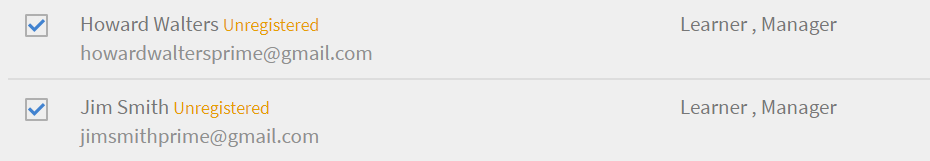
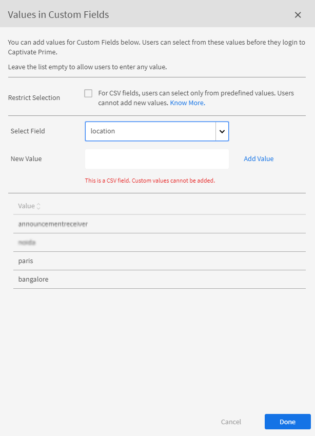

# ユーザーを追加してユーザーグループの作成

Learning manager でユーザーまたはユーザーグループを追加する方法について解説します。

<!---->

## 概要 {#overview}

Adobe Learning Manager では、以下の役割を割り当てることができます。

* **管理者：**&#x200B;管理者は、組織のトレーニング戦略を定義します。管理者は、学習者の追加、学習者に必要なスキルの検索、コースの管理と割り当て、学習計画、認定、学習プログラムの作成、および組織全体のレポートの管理を行うことができます。
* **作成者：**&#x200B;作成者は、インストラクションデザイナーでありコンテンツクリエイターです。また作成者は、Learning manager にモジュールおよびコースを追加することができます。
* **マネージャー：**&#x200B;マネージャーは、チームの学習活動を管理します。マネージャーは、コースを受講するチームメンバーを指名し、チームメンバーからのリクエストを承認し、トレーニングの完了後にチームメンバーのパフォーマンスに関するフィードバックを提供できます。マネージャーは、チームのレポートを表示してパフォーマンスを追跡することもできます。
* **学習者：**&#x200B;学習者は、自分に割り当てられたコース、学習プログラム、および認定資格にアクセスできます。学習者は、カタログを使用して利用可能なすべてのコースを参照し、コース、学習プログラム、または検定に登録することもできます。

管理者として、次の 3 つの方法でユーザーを追加できます。

* 社内
* 社外
* ユーザーグループ

## 単一ユーザーの追加 {#addasingleuser}

シングルユーザーオプションを使用して、社内学習者をAdobe Learning Managerに追加します。

>[!INFO]
>
>このトレーニングでは、Adobe Learning Managerに社内学習者を追加する方法について説明します。    

トレーニングを起動できない場合は、<almacademy@adobe.com>に書き込んでください。

ユーザーを追加するには、

1. Adobe Learning Manager に管理者としてログインします。
1. ホームページで、「**[!UICONTROL ユーザーを追加]**」をクリックします。このページでは、CSV を使用して一度に 1 人のユーザーまたは複数のユーザーを追加できます。社内従業員用のセルフ登録リンクを作成したり、社外学習者プロファイルを作成したりすることもできます。
1. 1 人のユーザーを追加するには、右上隅の「**[!UICONTROL 追加]**」をクリックし、「**[!UICONTROL シングルユーザー]**」オプションを選択します。

1. 1 人のユーザーを追加するには、右上隅の「**[!UICONTROL 追加]**」をクリックし、「**シングルユーザー**」オプションを選択します。

   
   *単一の内部ユーザーを追加する*

1. **[!UICONTROL ユーザーを追加]**&#x200B;ダイアログで、学習者の詳細を入力します。「**[!UICONTROL マネージャーの名前]**」フィールドで、システム内の既存のユーザーの名前を選択します。

   
   *[ユーザーの追加]ダイアログボックス*

1. 新しいユーザーを Learning Manager で追加するには、**[!UICONTROL 「追加」]**&#x200B;をクリックします。ユーザーが追加されると、ユーザーは確認メールを受け取ります。続いて学習者はアカウントを有効化し、Learning Manager の使用を開始します。このワークフローは、限られた数の学習者をLearning Managerアカウントに追加する必要がある場合に便利です。 ただし、大規模な組織のすべての従業員を登録することを計画している場合は、1 回の試行で追加できます。詳細については、次のセクションを参照してください。

## ユーザーの一括追加 {#addusersinbulk}

通常、ほとんどの組織は人材管理システム（HRMS）を使用します。これにより、職位、勤務地、入社日、従業員の階層など、すべての従業員レコードが保持されます。このデータを CSV 形式で書き出しすることができます。CSV を読み込むには、以下の手順を実行します。

1. 右上隅にある「**[!UICONTROL 追加]**」をクリックして「**[!UICONTROL CSV をアップロード]**」オプションを選択します。

   
   *CSVをアップロードしてユーザーを一括で追加*

1. アップロードする CSV は、以下に示すようなフィールドで構成されます。

   
   *CSVの構造*

   マスターCSVを保持し、マスターCSVに対してすべての追加および削除を実行する必要があります。 マスター CSV には、次のフィールドが含まれます。

   * 名前&#42;
   * 電子メール&#42;
   * profile（プロファイル）
   * マネージャー

   (&#42;)必須フィールド。

1. 「**[!UICONTROL CSV をアップロード]**」オプションをクリックすると、以下のダイアログが表示されます。

   
   *CSVダイアログをアップロード*

1. CSV を選択するか、ファイルをドラッグ＆ドロップします。ファイルを選択したら、データフィールドをCSVファイルのデータフィールドにマッピングします。 必要なドロップダウンをクリックして、適切なフィールドを選択します。

   
   *フィールドをCSVにマップする*

1. ユーザーの読み込みを開始するには、「**[!UICONTROL 保存]**」をクリックします。確認メッセージが表示されます。

   
   *CSVを正常にアップロードするための確認メッセージ*

1. Adobe Learning Manager のアカウントに新たなユーザーが追加されました。新しいユーザーを選択するには、名前の横にあるチェックボックスを選択して、全員が選択されるようにします。

   
   *新しいユーザーが追加されました*

>[!NOTE]
>
>詳細については、FAQ 「[ユーザーの一括追加](../add-users-in-bulk.md)」を参照してください。

>[!INFO]
>
>このトレーニングでは、CSVを使用してユーザーを一括で追加する方法を説明します。    

トレーニングを起動できない場合は、<almacademy@adobe.com>に書き込んでください。

## ユーザーの登録 {#registerauser}

ユーザーを選択した状態で、右上隅にある「**[!UICONTROL アクション]**」をクリックし、「**[!UICONTROL 登録]**」をクリックします。

選択したユーザーにようこそ電子メールが届きます。学習者が既存の Adobe ID を持っている場合、このリンクをクリックできます。既存のAdobe IDをお持ちでない場合は、ようこそリンクをクリックしてAdobe IDを作成し、それをLearning Managerアカウントにリンクすることができます。

### ユーザーの管理

このトレーニングでは、役割の割り当てと削除、ようこそ電子メールの送信、ユーザーの削除と消去を行う方法について説明します。

トレーニングを起動できない場合は、<almacademy@adobe.com>に書き込んでください。

## 役割の割り当て {#assignarole}

Adobe Learning Manager アカウントに学習者を追加した後で役割を変更する場合は、画面右上の「アクション」をクリックします。「**[!UICONTROL 役割を割り当て]**」オプションを選択します。ここでは、学習者に作成者アクセス権または管理者アクセス権を付与するかどうかを決定できます。役割を割り当てると、この学習者はアカウントに対する作成者のアクセス権を持ち、モジュールの追加とコースの作成を行うことができます。

*ユーザーにロールを割り当てる*

## 役割の削除 {#removearole}

ユーザーから、作成者アクセス権または管理者アクセス権を削除することもできます。1 人以上の学習者を選択し、「**[!UICONTROL アクション]**」をクリックして「**[!UICONTROL 役割を削除]**」を選択します。オプション（例： **[!UICONTROL 作成者を削除]**）を選択すると、この学習者の作成者アクセス権が取り消されます。

>[!NOTE]
>
>システム内の誰かにマネージャーの役割を手動で割り当てることはできません。1 人以上の従業員がマネージャーの下に追加されると、自動的にマネージャーダッシュボードにアクセスできるようになります。

## ユーザーの削除 {#deleteauser}

ユーザーを削除するには、「**[!UICONTROL アクション]**」をクリックし、「**[!UICONTROL ユーザーを削除]**」を選択します。確認ダイアログで、「**[!UICONTROL はい]**」をクリックすると学習者が削除されます。

*ユーザーを削除するための確認メッセージ*

## ユーザーの編集 {#editauser}

ユーザーのリストで、「ユーザー」を選択して「ユーザー」をクリックします。ユーザーの詳細で、**[!UICONTROL 編集]** ()ボタンをクリックします。 **[!UICONTROL ユーザーを編集]**&#x200B;ダイアログで必要な編集を行い、「**[!UICONTROL 保存]**」をクリックして変更内容を保存します。

*ユーザーの編集ダイアログ*

## アクティブフィールド

Adobe Learning Managerのアクティブフィールドはカスタマイズ可能なメタデータフィールドであり、ユーザー固有の情報を保存および管理するために使用されます。 これらのフィールドは、システム内の各ユーザーに関連付けられたキー属性または特性を定義するのに役立ちます。

### ユーザー属性の管理

>[!INFO]
>
>このトレーニングでは、アクティブフィールドを追加、カスタマイズ、設定する方法について説明します。    

トレーニングを起動できない場合は、<almacademy@adobe.com>に書き込んでください。

Adobe Learning Managerでは、ユーザー属性およびその値の大文字と小文字の区別が保持されます。 **例**&#x200B;では、大文字と小文字の区別が&#39;location&#39;に設定され、値が&#39;PARIS&#39;の場合、同様に保持されて表示されます。 問題が発生した場合、管理者は属性名と値を編集して、大文字と小文字の区別に関するエラーを修正できるようになりました。

管理者は、**[!UICONTROL 管理者アプリ]** > **[!UICONTROL ユーザー]** > **[!UICONTROL ユーザーグループ]**&#x200B;にアクセスし、グループ名をクリックするとこの操作を実行できます。

管理者は、UIを使用して学習者に許可された属性値を追加および更新できます。

アクティブなフィールドの種類は、次のとおりです。

* グループ化可能：学習者は、値に基づいてグループ化できます。
* 報告可能：アクティブなフィールドに基づいて、ユーザーグループのレポートが作成されます。
* 書き出し可能：フィールドはユーザーグループのレポートにエクスポートされ、表示可能となります。

## セルフ登録リンクの作成 {#createaselfregistrationlink}

組織内の従業員が管理者のサポートを受けずに、Adobe Learning manager アカウントの学習者として自身を登録できるようにすることも可能です。管理者はセルフ登録リンクを作成してAdobeと共有し、従業員の資格情報を使用してLearning Managerに登録できます。

ページの右上隅の[**[!UICONTROL 追加]**]をクリックし、[**[!UICONTROL セルフ登録]**]を選択します。

*学習者としてセルフ登録するためのリンクを作成する*

**[!UICONTROL セルフ登録プロファイルを追加]**&#x200B;ダイアログが表示されます。このプロファイルに名前を付けます。次に、マネージャーの名前を追加します。マネージャーはLearning Managerに登録された学習者である必要があります。

*セルフ登録用のプロファイルを追加する*

「**[!UICONTROL 保存]**」をクリックすると、学習者と共有できる URL が生成されます。学習者は URL をクリックしてセルフ登録を行うことができます。

## 社外学習者の登録 {#enrollexternallearners}

Adobe Learning manager では、アカウントへのアクセスが制限されている社外パートナーまたは代理店向けの登録リンクを作成し、学習教材を提供することもできます。

社内学習者の登録と社外学習者の登録にはいくつかの違いがあります。

<table>
 <tbody>
  <tr>
   <td>
    
<b>社内ユーザー</b>
</td>
   <td>
    
<b>社外ユーザー</b>
</td>
  </tr>
  <tr>
   <td>
    
Adobe ID または SSO 資格情報を使用してログインします。
</td>
   <td>
    
任意の電子メール ID を使用してログインします。
</td>
  </tr>
  <tr>
   <td>
    
ゲーミフィケーションが使用できます。
</td>
   <td>
    
ゲーミフィケーションを利用できます。 管理者は、ゲーミフィケーション設定で社外学習者のゲーミフィケーションを有効にする必要があります。
</td>
  </tr>
  <tr>
   <td>
    
学習者の階層が使用できます。
</td>
   <td>
    
学習者の階層は使用できません。
</td>
  </tr>
 </tbody>
</table>

社外ユーザーを登録するには、以下の手順を実行します。

1. 左側のナビゲーションペインで、「**[!UICONTROL 社外]**」をクリックします。

   

   *社外ユーザーの登録*

1. ページの右上隅にある「**[!UICONTROL 追加]**」をクリックします。

1. **社外登録プロファイルの追加**&#x200B;ダイアログで、以下の詳細を追加します。

   * パートナー組織のプロファイル名。
   * パートナー組織のマネージャーの電子メールアドレス。
   * このパートナーの社外登録の人数制限です。
   * 有効期限：このグループへの新しい登録の許可を停止する期限を設定します。 有効期限後は、既存の登録ユーザーのみがこのトレーニングにアクセスできます。

   

   *社外登録プロファイルの追加ダイアログ*

   * **[!UICONTROL 詳細設定]**&#x200B;セクションで、次のように入力します。

      * **[!UICONTROL ログイン要件]:**&#x200B;日数で値を指定してください。 上記の期間ログインしなかった学習者は削除されます。
      * **[!UICONTROL 許可されたドメイン]:**&#x200B;許可されたドメイン名をコンマで区切ったリストです。
      * **[!UICONTROL 電子メールの確認が必要]:**&#x200B;学習者が電子メールの確認を必須にする場合は、このオプションを選択します。

   

   *[詳細設定]セクションに詳細を入力します*

1. 「**[!UICONTROL 保存]**」をクリックすると、次の確認メッセージが表示されます。社外パートナーと URL を共有する必要があります。

   

## 社外プロファイルの有効化 {#enableanexternalprofile}

社外プロファイルを作成したら、そのステータスを有効にする必要があります。社外プロファイルのリストから、必要なプロファイルを選択し、ステータスボタンを切り替えます。

*社外プロファイルを有効にする*

これにより、「社外登録」リンクが有効になります。ようこそ電子メールがパートナーに自動的に送信されます。「URL をコピー」アイコン（）をクリックし、リンクをコピーして共有したり、「メール」アイコン（）をクリックしてパートナー組織にようこそ電子メールを再送したりすることができます。

パートナーマネージャーは、PrLearning Managerでトレーニングを受ける必要がある従業員とリンクを共有できます。 従業員がリンクをクリックして、Learning Manager でプロファイルを作成するための詳細を入力すると、セルフ登録を行うことができます。これらのユーザーは、社内従業員と一緒の「学習者」タブには表示されません。「**[!UICONTROL 社外学習者]**」タブの下に名前が表示されます。

## 社外プロファイルの一時停止 {#pause}

社外ユーザーグループをLearning Managerに追加した後で、社外ユーザーの登録プロセスを一時停止することもできます。 一時停止すると、社外ユーザーの登録プロセスはブロックされます。 ただし、このプロセスは、ユーザーがまだ招待を受け入れて登録していない場合にのみ機能します。

社外ユーザーグループを一時停止するには、一つ以上のグループを選択し、ページの右上隅にある「**[!UICONTROL アクション]**」をクリックして、「**[!UICONTROL 一時停止]**」クリックします。

## 社外プロファイルの再開 {#resumeanexternalprofile}

社外パートナーの一時停止状態をいつでも取り消して、通常のサービスを再開できます。ページの右上隅にある&#x200B;**[!UICONTROL アクション]**&#x200B;をクリックし、**[!UICONTROL 再開]**&#x200B;を選択します。

社外ユーザーには次の状態が適用されます。

* **非アクティブ状態** – この状態では、外部ユーザーの登録が期限切れです。 管理者は、ユーザー追加のワークフローで社外ユーザーを追加するときに、社外ユーザーの有効期限を設定します。
* **アクティブ状態** - この状態の場合は、社外ユーザーが Learning manager アプリケーションに登録し、アプリケーションにログインできます。
* **一時停止状態** - この状態では、社外ユーザーの登録プロセスはブロックされます。ただし、既存のユーザーは引き続きログインできます。

## 使用されている座席数の確認 {#checkusedseats}

社外プロファイルのリストで、「**[!UICONTROL 使用されている席]**」をクリックします。追加されたパートナー組織の学習者の数を表示できます。

*使用席の確認*

## ユーザーの削除 {#Deleteauser-1}

ユーザーを選択し、右上隅から、**[!UICONTROL アクション]**/**[!UICONTROL ユーザーの削除]**&#x200B;をクリックします。

## プロファイルを変更 {#changeprofile}

ユーザーを別の社外プロファイルに移動するには、ユーザーを選択し、右上隅から、**[!UICONTROL アクション]**/**[!UICONTROL プロファイルの変更]**&#x200B;をクリックします。 プロファイルのリストからプロファイルを選択し、「**[!UICONTROL 変更]**」をクリックします。

## 役割の割り当て {#Assignarole-1}

ユーザーを選択し、右上隅から、**[!UICONTROL アクション]**/**[!UICONTROL 役割の割り当て]**/**作成`<role>`**&#x200B;をクリックします。 ユーザーは新しい役割を取得します。

## 役割の削除 {#Removearole-1}

ユーザーを選択し、右上隅から、**[!UICONTROL アクション]**/**[!UICONTROL ロールの削除]**/**`<role>`**&#x200B;をクリックします。 選択した役割が、ユーザーに割り当てられた役割のリストから削除されます。

>[!NOTE]
>
>新しい役割を割り当てても、カスタムユーザーグループには影響しません。 ただし、すべての管理者、すべての作成者、および同様の役割ベースのグループなどの自動生成ユーザーグループに影響します。

## ユーザーグループの作成 {#createusergroups}

ユーザーグループとは、カテゴリに関連付けられたユーザーのセットです。ユーザーグループは、管理者が属性に基づいて組織内の学習者を選択し、学習コンテンツを割り当てるのに役立ちます。また、これらのユーザーグループを使用すると、管理者はカスタマイズされたロゴとカタログを学習者に割り当て、進捗状況に関するカスタマイズされたレポートを表示できます。

ユーザーグループにアクセスするには、左側のナビゲーションペインで「**[!UICONTROL ユーザーグループ]**」をクリックします。

*ユーザーグループの作成*

### ユーザーグループの管理

>[!INFO]
>
>このトレーニングでは、名前、電子メールID、自動生成された複数のユーザーグループの結合方法を使用して、ユーザーグループを作成します。    

トレーニングを起動できない場合は、<almacademy@adobe.com>に書き込んでください。

Adobe Learning Manager には、カスタムおよび自動生成の 2 種類のグループがあります。アカウントに学習者を追加すると、いくつかのグループが共通のプロパティに基づいて自動的に作成されます。

自動的に作成されたグループを表示するには、「**[!UICONTROL 自動生成]**」タブをクリックします。

*自動生成されたグループを表示する*

すべての社内ユーザー、すべてのマネージャー、コストセンター、部門、およびマネージャーのチームに基づくグループなど、様々なグループがあることがわかります。

自動生成グループに加えて、カスタムグループを作成できます。新しいカスタムグループを追加するには、右上隅の[**[!UICONTROL 追加]**]をクリックします。

1. グループの名前と説明を入力します。
1. 検索フィールドにユーザー名またはプロファイルを入力し、ドロップダウンリストから選択してユーザーを追加します。

1. 他の学習者を追加するには、**[!UICONTROL 「他のユーザーを追加」]**&#x200B;をクリックします。

1. ユーザーグループを作成するには、「**[!UICONTROL 保存]**」をクリックします。

これで、このカスタムグループが作成され、プロファイルに追加されました。作成するユーザーグループは、本質的に動的です。同じ属性を持つ新しいユーザーが追加された場合、自動的にユーザーグループに追加されます。

ユーザーが属するグループのリストを表示するには、**[!UICONTROL ユーザー]**/**[!UICONTROL ユーザーグループ]**&#x200B;に移動し、ユーザー名を検索して選択します。 これにより、ユーザーが所属するすべてのグループが表示されます。

### ユーザーグループ内のユーザーのリストのダウンロード

特定のユーザーグループのユーザーのリストをダウンロードするには、**[!UICONTROL ユーザー]**/**[!UICONTROL ユーザーグループ]**&#x200B;に移動し、グループの横にある&#x200B;**[!UICONTROL ダウンロードアイコン]**&#x200B;を選択します。 これにより、そのグループ内のユーザーのリストを含むCSVファイルが生成されます。

## ユーザーグループの除外

大規模なユーザーグループから一部のユーザーを除外する場合があります。 これは、特定のユーザーグループを学習プランを介してトレーニングに登録したり、カタログを正しく表示したりするために必要です。 このリリースのLearning Managerでは、カスタムユーザーグループの作成時に学習者またはユーザーグループを除外できます。 ユーザーグループを追加ダイアログの「学習者を除外」セクションから行えます。

*ユーザーグループを除外する*

例えば、「場所＝カリフォルニアに属するユーザーのうち、ストア 5（カリフォルニア州に所在）を除く」すべてのユーザーが登録されるように、学習プランを設定する場合などです。

## 詳細設定 {#advancedsettings}

### データソース {#datasources}

ユーザーや学習データを組織のデータベースからLearning Managerアプリケーションに読み込む/同期する場合に、この機能を使用できます。 この同期の頻度を設定することもできます。

[**[!UICONTROL 詳細]**]セクションの下の左側のウィンドウで[**[!UICONTROL データソース]**]をクリックします。

*ユーザーをインポートまたは同期するデータソース*

[**[!UICONTROL ソース]**]ドロップダウンからデータソースの種類を選択し、更新の頻度を選択します。直ちに同期する必要がある場合は[**[!UICONTROL 今すぐ同期]**]をクリックするか、[**[!UICONTROL 保存]]をクリックします。**&#x200B;データソースの種類は、内部ユーザーのSFDC、FTPなどです。

複数のデータソースを追加できます。

### アクティブフィールド {#activefields}

この機能により、管理者は、ユーザー登録時に提供されたフィールドに加えて、さらにアクティブフィールドを追加できます。

ユーザーページ内で利用可能な&#x200B;**[!UICONTROL アクティブフィールド]**&#x200B;をクリックします。 学習者は、カスタム値で指定された値からのみ選択できます。

*アクティブなフィールド*

### フィールドの設定 {#configurefields}

**社内ユーザー**

社内ユーザーのユーザーフィールドにカスタム値を追加できます。

カスタム値を追加するには、次の手順に従います。

1. 内部ユーザーの&#x200B;**[!UICONTROL 値の変更]**&#x200B;をクリックします。

   
   *内部ユーザーの値を変更する*

1. [**ユーザー設定フィールドの値**]ダイアログボックスが表示されます。

   
   *[ユーザー設定フィールドの値]ダイアログボックス*

1. 「**[!UICONTROL フィールドを選択]**」ドロップダウンメニューから追加する値を選択します。
1. 「**[!UICONTROL 新しい値]**」フィールドに新しい値を入力します。
1. **[!UICONTROL 「完了」]**&#x200B;をクリックします。
1. 右上隅にある「**[!UICONTROL 保存]**&#x200B;をクリックして変更内容を保存します。

**社外ユーザー**

社内ユーザーの場合と同様のカスタム値を追加します。

*社外ユーザーの値を変更する*

### 設定 {#settings}

**ユーザーディスプレイ**

オプション&#x200B;**「学習者のログイン画面で未入力のフィールドのみを表示」**&#x200B;が有効になっている場合、ユーザーはログイン時に空白のフィールドのみが表示されます。

*未入力のフィールドを表示する*

このオプションを使用すると、管理者は、入力後のフィールドの表示または非表示を決定できます。

## レポートのアクティブフィールドの制限 {#restrictactivefields}

Learning Manager 27.7では、アクティブフィールドに対して、**[!UICONTROL 報告可能]**&#x200B;と&#x200B;**[!UICONTROL 書き出し可能]**&#x200B;という2つの新しいオプションが導入されました。

*アクティブなフィールドのオプション*

CSV フィールドと手動で追加されたフィールドの場合、「**[!UICONTROL 報告可能]**」としてマーキングされているアクティブフィールドを、ダッシュボードレポート内のフィルターで検索することができます。

*ダッシュボードレポートのフィルター*

「**[!UICONTROL 書き出し可能]**」としてマーキングされているアクティブフィールドの場合、Excel ファイルのダウンロード時にそのアクティブフィールドが Excel ファイル内に表示されます。

これらのオプションは、内部のアクティブフィールドと外部のアクティブフィールドの両方で表示されます。

削除できるのは、カスタムのアクティブフィールドのみです。

## ユーザーディスプレイ

学習者に対して、「プロファイルを完成させる」ページ全体を非表示にすることが可能です。 学習者がログインしても、ページは表示されません。

既存のデフォルトの動作は変更されません。 このオプション機能を管理者が使用できるようになりました。

以下のオプションを有効にします。

*ユーザーディスプレイセクション*

## FTPコネクタおよびBoxコネクタによる手動CSVフィールドのサポート {#import-connector}

多くの場合、学習者がLearning Managerにログインしたときに、アクティブなフィールドを手動で入力します。 これは、現在のLearning Managerでは、ユーザーがCSVを手動で読み込む場合に可能です。

CSVには、一部のアクティブフィールドを含めることはできません。 アップロードされたCSVで更新されていないすべてのアクティブフィールドについては、ユーザーがアクティブフィールドのデータを入力する必要があります。

現在、すべてのアクティブなフィールドは、ソースCSVからいくつかのフィールドにマッピングする必要があります。

ユーザーが、CSVで指定されているフィールドにアクティブフィールドをマッピングしたくない場合があります。 このような場合、ユーザーはActiveフィールドを値&#x200B;**[!UICONTROL DontImportFromSource]**&#x200B;にマップできます。 FTPコネクタおよびBoxコネクタからユーザーを読み込む場合は、ドロップダウンリストからこの値を選択します。

## カスタム役割 {#customroles}

ユーザー情報の一部として任意のフィールドを追加し、[**[!UICONTROL 保存]**]をクリックします。 フィールドを追加した後、**[!UICONTROL ユーザーの編集]**&#x200B;ダイアログでフィールドの可用性をクロスチェックすることもできます。

フィールドを追加すると、以下のスナップショットで説明されているように、チェックマークが付いたフィールドがデータソースまたは CSV から取得されていることがわかります。管理者は、フィールドを有効または無効にすることで、これらのソースフィールドを編集できます。

**Learning Managerのアクティブフィールドの値**

アクティブフィールドの値は、次の方法で取得されます。

1. Learning manager アプリケーションでは、アカウントに関連付けられたデータソースからメタデータがインポートされます。
1. メタデータは手動で読み込みされた CSV ファイルからキャプチャされます。
1. 学習者はログイン時にメタデータを書き込みます。
1. 管理者がユーザーのデータを入力します。

>[!NOTE]
>
>Learning manager アプリケーションでは、これらのメタデータからユーザーグループが自動で作成されます。

**カスタム値の追加**

社内および社外ユーザーフィールドのユーザーフィールドにカスタム値を追加できます。

カスタム値を追加するには、次の手順に従います。

カスタムフィールドは追加および削除でき、すべてのユーザーに適用できます。CSV フィールドは有効または無効にすることができます。アクティブフィールドで変更を行った後に CSV をアップロードした場合にのみ有効になります。すべての社内アクティブフィールドは、すべてのタイプの社内ユーザーに適用することができます。社外フィールドは社外ユーザーにのみ適用することができます。カスタムフィールドが CSV に存在する場合、次のアップロードで自動的に CSV フィールドに変換され、有効になります。

## CSV フィールドの値 {#valuesforcsvfields}

「**[!UICONTROL 選択を制限]**」チェックボックスが有効になっている場合、ユーザーは CSV フィールドの定義済みフィールドからのみ選択できます。

*選択を制限するチェックボックス*

## ログの読み込み {#importlogs}

このスペースでは、一括読み込み機能を使用して管理者が追加したユーザーの CSV 読み込み履歴を表示できます。ページの右上隅にある&#x200B;**[!UICONTROL 追加]**&#x200B;をクリックして、CSVアップロード機能を使用してユーザーを追加することもできます。

## 複数値のアクティブフィールド

この機能を使用すると、アクティブなフィールドに複数のフィールドを設定できます。 アカウントには、最大 3 つの複数値アクティブフィールドを設定できます。 複数値を持つアクティブフィールドは、社外ユーザーと社内ユーザーの両方で使用できます。

アクティブなフィールドを複数値としてマークすると、単一値に戻すことはできません。 これを逆にすることもできません。

既存の単一値フィールドを複数値フィールドとしてマークすることはできません。

複数値を持つアクティブフィールドを作成するには、次の手順に従います。

1. アクティブフィールドを追加します。

   
   *アクティブなフィールドを追加する*

1. 「追加」をクリックします。
1. 「設定」タブで、新しいフィールドを複数値としてマークします。

   
   *複数値としてマーク*

   別のチェックボックスが表示されています。**[!UICONTROL 設定可能な学習者]**&#x200B;これを無効にすると、学習者は「プロファイル」ページでフィールドを表示できなくなります。

1. CSVを使用するか、「値の変更」をクリックして、値を追加します。

   
   *値の追加*

1. [!UICONTROL **「完了」**]&#x200B;をクリックします。

>[!NOTE]
>
>ユーザーグループが作成され、フィールドに値が入力されると、複数の値を単一の値に変換、またその逆に変換することもできません。

### CSV を通じて複数値のアクティブフィールドを追加

以下の手順を実行します。

1. 新しいアクティブフィールドを列（コンマ区切りまたは単一値）として含む CSV を作成します。
1. CSV をインポートします。
1. 「カスタムフィールドの値」ダイアログで、フィールドを複数値としてマークします。
1. CSV を再度インポートします。

CSV には、複数値としてマークされたアクティブフィールドと同じ名前の列を含めなければなりません。

CSV には次のフィールドが含まれます。

* **[!UICONTROL ユーザー]**:ロールとして作成されたユーザーグループ。
* **[!UICONTROL ロール]**：値を持つ複数値のアクティブフィールドです。

CSV が新たな値または削除された値で再アップロードされると、アクティブフィールドおよびグループもそれに応じて更新されます。

### レポート

すべてのレポートには、複数値のアクティブフィールドとその値が含まれます。

管理者は、自動生成されたアクティブフィールドを追加し、ユーザーアクティビティおよびトレーニングレポートを設定することができます。

学習者のトランスクリプトレポートには、すべてのアクティブフィールドとコンマ区切りの値が含まれます。 管理者はそれに応じてデータを適切にフィルタリングすることができます。

## ユーザーグループレポート

Adobe Learning Managerの新しいユーザーグループレポートを使用すると、管理者が離脱したときに管理されていないグループを確認できるため、ユーザーグループを管理しやすくなります。 管理者は、**[!UICONTROL ユーザー]** > **[!UICONTROL ユーザーグループ]**&#x200B;セクションのレポートにアクセスできます。 各グループについて、次のような詳細情報が提供されます。

* ユーザーグループタイプ
* グループ名
* 説明
* 作成者（名前）
* 作成者（電子メール）
* 作成日（UTCタイムゾーン）
* ユーザー数

レポートをダウンロードするには、次の手順に従います。

1. **[!UICONTROL 管理者]**&#x200B;としてログインします。
2. **[!UICONTROL ユーザー]** > **[!UICONTROL ユーザーグループ]**&#x200B;を選択します。
3. **[!UICONTROL アクション]**/**[!UICONTROL ユーザーグループレポートのダウンロード]**&#x200B;を選択します。

_ユーザーグループレポートのダウンロード_

## よくある質問 {#faq}

+++Learning Managerでユーザーを登録する方法

ユーザーを追加し、そのユーザーに役割を割り当てた後、以下の手順を実行してユーザーを登録できます。

1. ユーザーを選択した状態で、右上隅の&#x200B;**[!UICONTROL アクション]**&#x200B;をクリックし、**[!UICONTROL 登録]**&#x200B;をクリックします。

1. ポップアップウィンドウで、「**[!UICONTROL はい]**」をクリックします。

選択したユーザーに、ようこそ電子メールが届きます。 学習者が既存の Adobe ID を持っている場合、このリンクをクリックできます。既存のAdobe IDをお持ちでない場合は、ようこそリンクをクリックしてAdobe IDを作成し、それをLearning Managerアカウントにリンクすることができます。

Learning Managerは学習者のアカウントを確認できるため、学習者は電子メールに記載されたこれらのリンクのいずれかをクリックする必要があります。

+++

+++ユーザーデータを編集する方法

ユーザーを編集するには、以下の手順を実行します。

1. ユーザーのリストで、編集対象のユーザーをクリックします。
1. 下の図のように、鉛筆アイコンをクリックします。

**ユーザーを編集**&#x200B;ダイアログで、対応するフィールドを更新します。 変更を保存するには、「**[!UICONTROL 保存]**」をクリックします。

+++

+++Learning Managerで社外ユーザーを一時停止および再開する方法

社外ユーザーのリストで、削除するユーザーを選択します。 右上隅で、**[!UICONTROL アクション]**/**[!UICONTROL 一時停止]**&#x200B;をクリックします。

詳しくは、[「社外プロファイルの一時停止」](add-users-user-groups.md#pause)を参照してください。

プロファイルを一時停止すると、社外プロファイルに&#x200B;***「一時停止」***&#x200B;と表示されます。

+++

+++新しく作成した社外プロファイルにようこそメールを送信する方法

社外ユーザーを追加する際、**[!UICONTROL 社外登録プロファイルを追加]**&#x200B;ダイアログで、社外マネージャーの電子メールを入力します。 「保存」をクリックすると、指定した電子メールアドレスにようこそ電子メールも送信されます。 再度ようこそ電子メールを送信する場合は、次に示すようにエンベロープアイコンをクリックします：

+++

+++カスタムユーザーグループを作成する方法

**[!UICONTROL ユーザー]**/**[!UICONTROL ユーザーグループ]**&#x200B;をクリックし、ユーザーグループページで「**[!UICONTROL 追加]**」をクリックします。 ユーザーグループを追加ダイアログで、ユーザーを個別に、またはグループとして追加します。

+++

+++入力済みのアクティブフィールドを無効にする方法を教えてください。

学習者が入力していないアクティブなフィールドのみを学習者に表示する場合は、次の手順を実行します。

1. **[!UICONTROL ユーザー]** > **[!UICONTROL アクティブフィールド]**&#x200B;をクリックします。

1. **[!UICONTROL 「設定」]**&#x200B;をクリックして、オプション&#x200B;**[!UICONTROL 「学習者のログイン画面で未入力のフィールドのみを表示」]**&#x200B;を有効にします。

1. **[!UICONTROL 「保存」]**&#x200B;をクリックします。

+++

+++アクティブなフィールドに学習者がランダムな値を入力できないようにする方法を教えてください。

選択肢を制限することにより、事前に設定した値のみを学習者が選択できるようにして、値をランダムに入力できないようにすることが可能です。 以下の手順を実行します。

1. **[!UICONTROL ユーザー]** > **[!UICONTROL アクティブフィールド]**&#x200B;をクリックします。
1. **[!UICONTROL 「選択を制限」]**&#x200B;オプションを有効にします。
1. 「**[!UICONTROL 完了]**」をクリックします。

+++

+++CSVのアクティブなフィールドとカスタムのアクティブなフィールドを見分けるにはどうすればよいですか？

CSV のアクティブなフィールドの有効化および無効化は可能ですが、フィールドを削除することはできません。 ただし、カスタムのアクティブなフィールドを有効化または無効化することはできません。

+++
