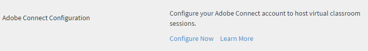

# Adobe Connect の統合

組織の管理者は、Adobe Connect と統合できるように Learning Manager アカウントを設定できます。

## Adobe Connect {#configureadobeconnect}

1. 管理者ログインで、「 **[!UICONTROL 設定]** をクリックして、会社に関する基本的な情報を表示します。 クリック **[!UICONTROL Adobe Connect]** をクリックします。

   

   *左側のパネルで「 Adobe Connect 」を選択します*

1. クリック **[!UICONTROL 設定する]** リンクする **[!UICONTROL Adobe Connectの設定]** セクションに追加します。

   <!---->

1. 会社の Adobe Connect ドメイン名とログイン資格情報を入力します。

   

   *ドメイン名と資格情報の追加*

   Adobe Connect URLの例：mycompany.adobeconnect.com\
   Adobe接続アカウントの管理者の電子メールIDを入力する必要があります。

   Learning Manager では、アドビがホストする Connect アカウントのみがサポートされます。例：&quot;.adobeconnect.com&quot;

1. クリック **[!UICONTROL 統合].**

   電子メールIDの認証後、Connectが正常に統合されたというメッセージがLearning Managerに表示されます。 自動的に Adobe Connect を使用してバーチャルクラスルームコースを表示できるようになります。

   Adobe Connect アカウント管理者は、Adobe Connect の利用条件に同意する必要があります。これに同意していない場合、ログイン認証が失敗する可能性があります。Adobe Connect アカウントの作成後、アカウントに 1 回ログインします。初回ログイン時に、利用条件ページが表示されます。

   <!---->

## バーチャルクラスルームセッション情報の追加 {#addvirtualclassroomsessioninformation}

バーチャルクラスルームコースの作成者がセッション情報を提供していない場合、管理者はセッションの詳細を追加することができます。

管理者ログインで、VC コース名をクリックします。クリック **[!UICONTROL インスタンス]** をクリックします。 **[!UICONTROL セッションの詳細]**.  「セッションの詳細」ページの右隅にある「編集」アイコンをクリックして、セッション情報を追加します。

*バーチャルクラスルームセッション情報を追加*

バーチャルクラスルームモジュールまたはセッションを作成するために Adobe Learning Manager と Adobe Connect を統合することで、Connect アカウントは、ユースケースに十分な数の会議室と同時ユーザーを持つ会議室をサポートします。これらの会議室は、Learning Manager のバーチャルクラスルームモジュールをホストするために使用されます。Learning Manager 内のバーチャルクラスルームモジュールまたはセッションごとに、新しい Connect の会議室が Learning Manager によって動的に作成されます。

Adobe Learning Manager とは別に、Adobe Connect を購入する必要があります。

## 学習者の出席 {#learnersattendance}

バーチャルクラスルームコースのホストがセッションに出席しない場合、セッションに出席した学習者の出席は自動的に登録されません。 このような場合、管理者は出席を手動で記録できます。

バーチャルクラスルームコースをクリックし、次のページの左ペインで「出席」をクリックして出席を記録します。
