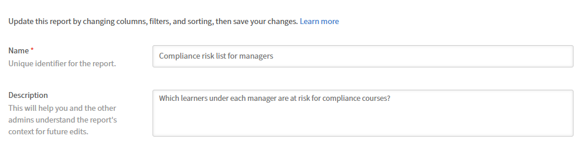
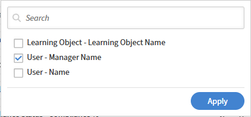
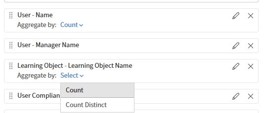

# Report Builderでのカスタムレポートの作成

## 概要

ゼロからの作成は、必要な列と出力の画像が明確で、ユースケースに一致する既存のテンプレートがない場合に最も効果的です。 初めてテンプレートを使用する場合は、Report Builderから始めることをお勧めします。

## カスタムレポートの作成

この例では、コンプライアンスコースのリスクがある学習者を、各マネージャーの下で特定します。

1. Adobe Learning Managerに管理者としてログインします。
2. **レポート**&#x200B;を選択し、**Report Builder**&#x200B;を選択します。
3. 「**レポート**」タブを選択してから、「**レポートを作成**」を選択します。
4. レポート名を入力します。 名前が必要です。 必要に応じて、説明を入力します。

   

5. 列パネルで、次のデータセットを選択して展開します。

   * ユーザー
   * 学習目標
   * ユーザーコンプライアンスステータス

6. 含める次の列の横にある&#x200B;**+**&#x200B;を選択します。 選択した列がレポート・キャンバスに表示されます。

   * ユーザー – 名前
   * ユーザー – マネージャー名
   * 学習目標 – 学習目標名
   * ユーザーコンプライアンスステータス – 完了%
   * ユーザーコンプライアンスステータス – コンプライアンス%

   

7. カンバス内で列をドラッグして、列を並べ替えます。
8. 列の名前を変更するには、列の別名フィールドに名前を入力します。 エイリアスは、ダウンロードしたファイルの列ヘッダーとして表示されます。
9. **[レポートの保存]**&#x200B;を選択します。

## レポートのダウンロード

1. 右上隅の&#x200B;**アクション**&#x200B;を選択します。

   

2. 「**ダウンロード**」を選択します。 準備ができたら、通知アイコンからレポートをダウンロードできます。

ダウンロードされたレポート(csv)には、次の列が含まれています。

* 名前
* managerName
* 名前
* completePct
* compliancePct

## グループ化、フィルター、並べ替えの適用

### フィルター

レポートのダウンロードが完了したので、completionPctまたはcompliancePctが100であるフィルターを適用します。

1. レポートを開いて、右上隅の&#x200B;**編集**&#x200B;を選択します。
2. **[フィルターの追加]**&#x200B;を選択し、フィルターを適用する列を検索します。

   

3. 「**追加**」を選択します。
4. フィルタをAND/OR論理と組み合せて、演算子を選択してフィルタ行を切り替えます。

   

5. **[レポートの保存]**&#x200B;を選択し、レポートをダウンロードします。

ダウンロードされたレポートには、completionPctまたはcompliancePctが100に等しいレコードが含まれています。

### 次の基準でグループ化

マネージャー別にレコードをグループ化して、次の操作を実行します。

* マネージャー別に学習者データを集計
* コンピューティングマネージャーレベルの平均
* 各マネージャーの下にある学習者の数

1. レポートを開いて、右上隅の&#x200B;**編集**&#x200B;を選択します。
2. **グループ化:Select**&#x200B;を選択し、**ユーザーマネージャー名**&#x200B;列を選択します。

   

3. 次の列を集約します：

   * ユーザー名
   * 学習目標 – 学習目標名

4. 列の集計関数として&#x200B;**Count**&#x200B;を選択します。

   

5. 学習目標 – 学習目標名についてこの手順を繰り返します。

   

6. **[レポートの保存]**&#x200B;を選択し、レポートをダウンロードします。

ダウンロードされたレポートには、学習者のトレーニングパフォーマンスに関するマネージャーごとの概要が含まれています。 これにより、各マネージャーの平均完了率、平均準拠スコア、および学習者カウントの合計が表示されます。 このデータは、すべてのグループでユニバーサルトレーニングが完了したことを示していますが、コンプライアンスのパフォーマンスはマネージャによって大きく異なります。

### 並べ替え

各マネージャーの学習者数の降順でレポートを並べ替えます。

1. レポートを開いて、右上隅の&#x200B;**編集**&#x200B;を選択します。
2. 「**並べ替えを追加**」を選択します。
3. ユーザー名を検索し、**User-Name**&#x200B;を選択します。
4. **降順**&#x200B;を選択します。

   

5. 「**追加**」を選択します。
6. **[レポートの保存]**&#x200B;を選択し、レポートをダウンロードします。

ダウンロードされたレポートには、マネージャーごとの学習者数が降順で含まれています。
