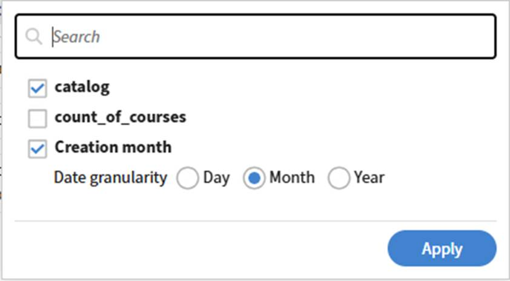

# Report Builderでのカスタムレポートの作成

ゼロからの作成は、必要な列と出力の画像が明確で、ユースケースに一致する既存のテンプレートがない場合に最も効果的です。 初めてテンプレートを使用する場合は、Report Builderから始めることをお勧めします。

この例では、コンプライアンスコースのリスクがある学習者を、各マネージャーの下で特定します。

1. Adobe Learning Managerに管理者としてログインします。
2. **レポート**&#x200B;を選択し、**Report Builder**&#x200B;を選択します。
3. 「**レポート**」タブを選択してから、「**レポートを作成**」を選択します。
4. レポート名を入力します。名前が必要です。必要に応じて、説明を入力します。
   
5. 列パネルで、次のデータセットを選択して展開します。
a. ユーザー
b. 学習目標
c. ユーザーコンプライアンスステータス
6. 含める次の列の横にある&#x200B;**+**を選択します。選択した列がレポート・キャンバスに表示されます。
a.ユーザー\名前
b.ユーザー\マネージャー名
c.学習目標\学習目標名
d.ユーザーコンプライアンスのステータス\完了%
e.ユーザーコンプライアンスのステータス\コンプライアンス%
!  
7. カンバス内で列をドラッグして、列を並べ替えます。
8. 列の名前を変更するには、列の別名フィールドに名前を入力します。 エイリアスは、ダウンロードしたファイルの列ヘッダーとして表示されます。
9. **[レポートの保存]**&#x200B;を選択します。

## レポートのダウンロード

1. 右上隅の&#x200B;**アクション**を選択します。
   
2. 「ダウンロード」を選択します。 準備ができたら、通知アイコンからレポートをダウンロードできます。

ダウンロードした.csvファイル拡張子のレポートには、次の列が含まれています。

1. 名前
2. managerName
3. 名前
4. completePct
5. compliancePct

## グループ化、フィルター、並べ替えの適用

### フィルター

レポートのダウンロードが完了したので、completionPctまたはcompliancePctが100であるフィルターを適用します。

1. レポートを開いて、右上隅の&#x200B;**編集**&#x200B;を選択します。
2. **[フィルターの追加]**を選択し、フィルターを適用する列を検索します。
   
3. 「**追加**」を選択します。
4. フィルタをAND/OR論理と組み合せて、演算子を選択してフィルタ行を切り替えます。
   
5. **[レポートの保存]**&#x200B;を選択し、レポートをダウンロードします。

ダウンロードされたレポートには、completionPctまたはcompliancePctが100に等しいレコードが含まれています。

### 次の基準でグループ化

マネージャー別にレコードをグループ化して、次の操作を実行します。

* マネージャー別に学習者データを集計
* コンピューティングマネージャーレベルの平均
* 各マネージャーの下にある学習者の数

1. レポートを開いて、右上隅の&#x200B;**編集**&#x200B;を選択します。
2. **グループ化:Select**&#x200B;を選択し、**ユーザーマネージャー名**列を選択します。
   
3. 次の列を集約します：
a. ユーザー\名前
b. 学習目標\学習目標名
4. 列の集計関数として&#x200B;**Count**を選択します。
   
5. 学習目標\学習目標名についてこの手順を繰り返します。
   
6. **[レポートの保存]**&#x200B;を選択し、レポートをダウンロードします。

ダウンロードされたレポートには、学習者のトレーニングパフォーマンスに関するマネージャーごとの概要が含まれています。 これにより、各マネージャーの平均完了率、平均準拠スコア、および学習者カウントの合計が表示されます。 このデータは、すべてのグループでユニバーサルトレーニングが完了したことを示していますが、コンプライアンスのパフォーマンスはマネージャによって大きく異なります。

### 並べ替え

各マネージャーの学習者数の降順でレポートを並べ替えます。

1. レポートを開いて、右上隅の&#x200B;**編集**&#x200B;を選択します。
2. 「**並べ替えを追加**」を選択します。
3. ユーザー名を検索し、**User\Name**&#x200B;を選択します。
4. **降順**を選択します。
   
5. 「**追加**」を選択します。
6. **[レポートの保存]**&#x200B;を選択し、レポートをダウンロードします。

ダウンロードされたレポートには、マネージャーごとの学習者数が降順で含まれています。
