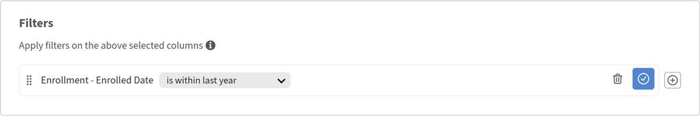

# レポートのダウンロード、共有、および購読

レポートをReport Builderーに保存しておくと、必要に応じてダウンロードしたり、アカウントの他の管理者と共有したり、定期的に受信したりすることができます。

## レポートのダウンロード

1. [**レポート**]タブで、ダウンロードするレポートを見つけます。
2. 「**ダウンロード**」を選択します。
3. 「**OK**」を選択します。
   
レポートの生成は非同期で実行されます。 ファイルの準備が整うと、アプリ内通知が届きます。
4. 通知を開き、ファイルをダウンロードします。

>[!NOTE]
>
>たとえば、フィルタが結果を返さないためにレポートに一致するデータがない場合でも、空のファイルが生成されます。 エラーは表示されません。ダウンロードしたファイルにはヘッダーが含まれていますが、行は含まれていません。

## Report Builderでのレポートの共有とサブスクライブ

他の管理者が保存されたレポートにアクセスできるようにし、Adobe Learning Manager Report Builderでスケジュールされた電子メール配信を設定します。

**共有と購入**&#x200B;ダイアログには2つの独立したセクションがあります。1つは他の管理者とレポートを共有するためのセクション、もう1つは電子メールサブスクリプションを設定するためのセクションです。 どちらか、または両方を使用できます。

## 他の管理者とのレポートの共有

共有管理者は、レポートを表示、複製、および編集できます。

1. 共有するレポートを開きます。
2. **アクション**/**共有と購入**を選択します。
   
3. **共有アクセス権を持つ管理者**&#x200B;で、**編集**&#x200B;を選択します。 次に、「**ユーザー/ユーザーグループの選択**」フィールドを選択します。
4. 共有する管理者またはユーザーグループを検索して選択します。
   
5. 「**保存**」を選択します。

これで、選択した管理者がReport Builderビューでレポートにアクセスできるようになりました。

>[!NOTE]
>
>共有アクセス権を持つ管理者は、レポートを表示、複製、編集できます。 アクセス権を削除するには、**共有と購入**&#x200B;に戻り、ユーザーまたはユーザーグループの選択を解除します。

## レポートの管理者の登録

登録済みの管理者は、選択した頻度でレポートをメールで受け取ります。

1. 管理者を登録するレポートを開きます。
2. **アクション**/**共有と購入**&#x200B;を選択します。
3. **サブスクリプションを持つ管理者**&#x200B;で、**編集**&#x200B;を選択します。
4. 「**メールの頻度**」ドロップダウンを選択します。
5. 頻度を選択してください：
   * **毎日送信**
   * **毎週送信**
   * **毎月送信**
6. 「**ユーザー/ユーザーグループの選択**」フィールドで、登録する管理者またはユーザーグループを検索して選択します。
7. 「**保存**」を選択します。

登録済みの管理者は、選択した頻度でレポートをメールで受け取ります。

>[!TIP]
>
>サブスクリプションを設定する前に、少なくとも1つの並べ替えをレポートに適用してください。 これにより、スケジュールされた配信ごとに行の順序が一貫するようになります。

