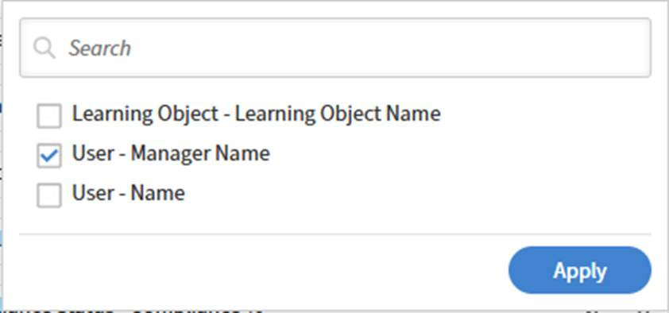

# レポートの列をReport Builderで並べ替え

ダウンロードしたレポートファイルの行の順序は、ソートによって決まります\。 一貫した出力が重要な場合は、常に並べ替えを適用します。

## 並べ替えを追加

この例では、最も高い完了率を持つコースを確認します。

1. Report Builderを起動して、**レポートの作成**&#x200B;を選択します。
2. レポートの名前と説明を入力します。
3. 次の列を選択します。 `<dataset>:<column name>`
a. 学習目標 – 学習目標名
b. 学習目標 – 学習目標のステータス
c. 学習目標 – 完了数
4. 「並べ替え」セクションで、「**並べ替えを追加**」を選択します。
5. **学習目標 – 完了数**&#x200B;を選択します。
6. 並べ替え順序として、**昇順**&#x200B;または&#x200B;**降順**&#x200B;を選択します。
   
7. 「**追加**」を選択します。
8. **レポートを保存**&#x200B;を選択し、**アクション** > **ダウンロード**&#x200B;を選択してレポートをダウンロードします。

ダウンロードされたレポートには、コースの完了数順に並べ替えられたすべてのレコードが一覧表示されます。

## 複数列の並べ替えの追加

この例では、マネージャー間のパフォーマンスを測定するレポートを生成します。

複数の列でソートするには、次の手順に従います。

1. **Report Builder**&#x200B;を起動し、**レポートの作成**&#x200B;を選択します。
2. レポートの名前と説明を入力します。
3. 次の列を選択します。 `<dataset>:<column name>`
a. ユーザー – 名前
b. ユーザー – マネージャー名
c. モジュールのトランスクリプト – ステータス
d. モジュールのトランスクリプト – 進行状況%
4. 次の集計を追加します。
a.ユーザーによるグループ化 – マネージャー名
b. Count Distinct User – 名前
c. Count If=COMPLETEDモジュールのトランスクリプト – ステータス
d.モジュールのトランスクリプトの平均 – 進行状況%
   
5. **並べ替え**&#x200B;セクションで、次の複数列の並べ替えを追加します。
a.モジュールのトランスクリプト – ステータス：降順
b.ユーザー – マネージャー名：昇順
   
6. レポートを保存を選択し、アクション/ダウンロードを選択してレポートをダウンロードします。

ダウンロードされたレポートには、マネージャーごとのパフォーマンスの概要が表示され、明確な学習者カウント、ステータスベースの登録カウント、および平均進行状況の割合が示されます。 異なるマネージャーグループ間の参加レベルとトレーニングの進捗状況が強調表示されます。
