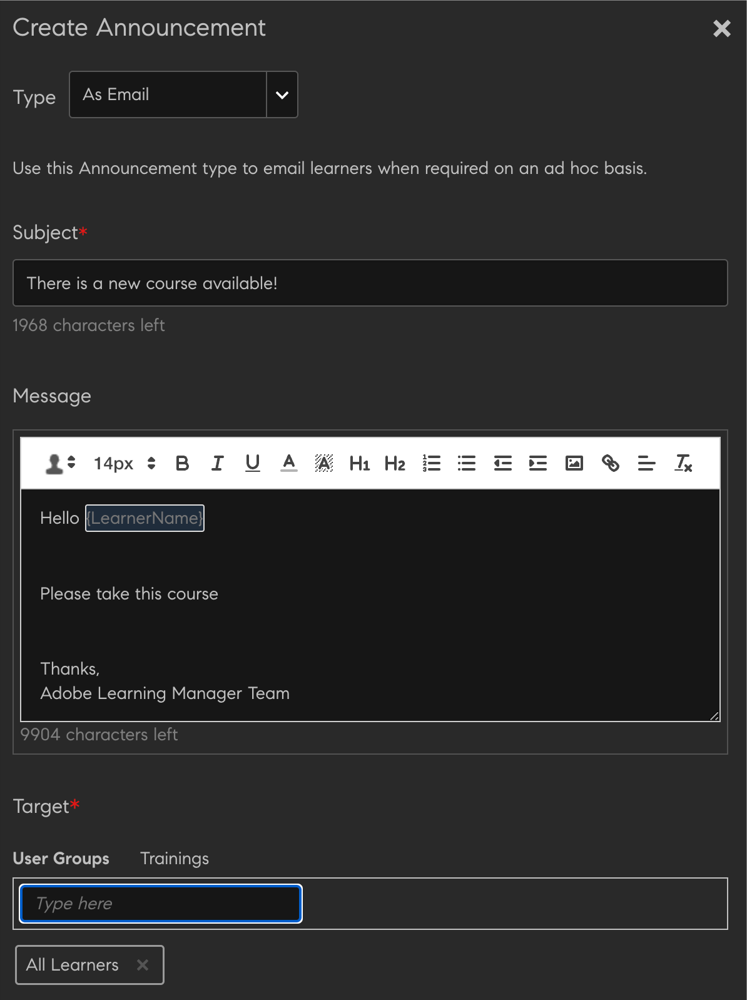

# アナウンス

アナウンスとは、管理者が特定のユーザーにブロードキャストできるマルチメディアメッセージ（テキスト、画像、ビデオ）です。

管理者は、イベントやアクティビティの発生に関するアナウンスを学習者にブロードキャストできます。 通知には、テキスト、画像、ビデオを組み合わせて使用できます。 コース、学習プログラム、認定などの学習オブジェクトをアナウンスにリンクすることができます。

アナウンスには次の4種類があります。

* 通知
* マストヘッド
* 推奨
* 電子メール

## 通知 {#notification}

1. 管理者ユーザーとして、左ペインで「お知らせ」をクリックします。
1. ページの右上隅にある「追加」をクリックします。
1. 「タイプ」ドロップダウンリストで、**「通知として」**&#x200B;オプションを選択します。
1. 「メッセージ」フィールドで、アナウンス用のメッセージを追加します。 ここで、アナウンスの URL を追加することもできます。 ただし、URL は HTML フォームで追加する必要があります。

   例えば、  `code <a href="http://www.w3schools.com" target="_blank">Visit W3Schools</a>.`

   target を blank に指定した場合、ユーザーがアナウンスの URL をクリックすると、リンクが新しいタブで開きます。 target を指定しない場合、リンクは同じブラウザーで開きます。

1. 必要に応じて、アナウンス用の画像やビデオファイルなどの添付ファイルを追加します。
1. 対象のユーザーグループまたは対象の学習オブジェクトを選択します。 アナウンスに使用できるのは、いずれか 1 つだけです。

   テキストボックスにユーザーグループ名の入力を開始し、ドロップダウンリストからグループ名を選択します。 同様に、テキストボックスにオブジェクト名を入力してトレーニングを選択します。

1. ダイアログボックスで「詳細設定」をクリックします。 次の操作を実行できます。

   * 「注釈アナウンスを有効にする」チェックボックスをオンにして、このアナウンスを注釈アナウンスに設定します。
   * アナウンスの配信時間を選択します。

1. 選択 **[!UICONTROL 日付]** 後でアナウンスをスケジュールする場合は、その横にあるテキスト領域をクリックします。 開始日を選択できるカレンダーがポップアップで表示されます。 開始日の設定と同じ手順で終了日を選択します。
1. **[!UICONTROL 「保存」]**&#x200B;をクリックします。
1. 「下書き」タブで、通知の横にある設定アイコンをクリックし、「送信」をクリックします。

マルチメディアの添付ファイルが大きい場合は、アップロードに時間がかかる場合があります。 「保存」をクリックすると、アップロードが処理されるときに、メッセージを含むポップアップが表示されます。 添付ファイルが正常にアップロードされると、通知が届きます。

## マストヘッド {#masthead}

このオプションを選択すると、選択したメディアファイルが、学習者ホームページにマストヘッドとして表示されます。 マストヘッドは、対象学習者の行動のきっかけになります。

*マストヘッドのカスタマイズ*

1. マストヘッドとして表示される画像を参照して選択します。 推奨サイズは 1280 x 360 ピクセルです。
1. マストヘッドを追加するロケールを選択します。 マストヘッドのアセットは、言語ごとに選択する必要があります。
1. **[!UICONTROL 「アクションボタン」]**&#x200B;フィールドに URL を追加します。学習者がマストヘッドのボタンをクリックすると、そのボタンの URL にリダイレクトされるようになります。これはオプションのフィールドです。
1. 対象のユーザーグループまたは対象の学習オブジェクトを選択します。 アナウンスに使用できるのは、いずれか 1 つだけです。

   テキストボックスにユーザーグループ名の入力を開始し、ドロップダウンリストからグループ名を選択します。 同様に、テキストボックスにオブジェクト名を入力してトレーニングを選択します。

1. を **[!UICONTROL 詳細設定]** セクションには次のオプションがあります。

   * クリック **[!UICONTROL 今すぐ]** アナウンスをすぐに投稿したい場合。
   * クリック **[!UICONTROL しない]** アナウンスの有効期限を切らないようにする場合。
   * を選択します **[!UICONTROL 開始]** および **[!UICONTROL 終了]** 発表日。

   

   *マストヘッドの表示時間の設定*

**ライブのマストヘッドアナウンスの数に制限はありますか？**

最新のマストヘッドアナウンスが、10 件のみ表示されます。

## 推奨 {#recommendation}

このオプションを選択すると、選択したトレーニングが、指定したユーザーグループに推奨されます。 推奨事項は、機械学習アルゴリズムによって決定されます。

*学習者に表示する推奨トレーニングを選択*

1. 学習者に推奨するトレーニングを選択します。トレーニングは 10 個まで追加できます。

   学習者には、組織による推奨で登録されていないトレーニングのみが表示されます。 学習者は、カタログ表示に基づいて、トレーニングを表示するためのアクセス権を持ちます。

1. 対象のユーザーグループまたは対象の学習オブジェクトを選択します。 アナウンスに使用できるのは、いずれか 1 つだけです。

   テキストボックスにユーザーグループ名の入力を開始し、ドロップダウンリストからグループ名を選択します。 同様に、テキストボックスにオブジェクト名を入力してトレーニングを選択します。

1. 「詳細設定」セクションには、次のオプションがあります。

   * クリック **[!UICONTROL 今すぐ]** アナウンスをすぐに投稿したい場合。
   * クリック **[!UICONTROL しない]** アナウンスの有効期限を切らないようにする場合。
   * を選択します **[!UICONTROL 開始]** および **[!UICONTROL 終了]** 発表日。

   <!---->

**[!UICONTROL 「保存」]**&#x200B;をクリックすると、アナウンスをすぐにパブリッシュするか、後からパブリッシュすることができます。 パブリッシュするまで、アナウンスは下書き状態になります。

* マストヘッド／推奨によって通知がトリガーされることはありません。
* マストヘッド／推奨はアナウンスレポートに表示されません。

## 下書き、スケジュール済み、送信済みのリスト {#draftscheduledandsentlist}

管理者ログインでは、「下書き」、「スケジュール済み」、「送信済み」などの3つのタブですべてのアナウンスを表示できます。

<!---->

### 下書き {#draft}

「下書き」タブでは、管理者が作成し、まだブロードキャストされていない、またはブロードキャスト用にスケジュールされていないすべてのアナウンスを表示できます。

デフォルトでは、すべてのアナウンスが即時にブロードキャストされるように設定されています。 予定されていないアナウンスで設定／送信オプションを選択すると、そのアナウンスは直ちにブロードキャストされます。 アナウンスのブロードキャストをスケジュール設定するには、「詳細設定」で開始日と終了日を選択する必要があります。

### スケジュール済み {#scheduled}

「スケジュール済み」タブでは、後日ブロードキャストされる予定のアナウンスがすべて表示されます。

### 送信済み {#sent}

「送信済み」タブでは、既にブロードキャストされているすべてのアナウンスが表示されます。

## 電子メールとして

このオプションを使用すると、選択したユーザーグループの学習者または特定のトレーニングに登録している学習者に、対象となるアドホックメールを送信できます。

*学習者へのターゲット指定アドホックメールの送信*

*管理者がお知らせの電子メールを作成*

1. 選択 **[!UICONTROL 電子メールとして入力]**.
1. 電子メールの件名とメッセージの本文を入力します。
1. 「ターゲット」セクションで、次のいずれかを実行できます。

   * ユーザーグループの選択
   * コースの選択 コースに含まれるインスタンスが複数の場合は、必要なインスタンスを選択できます。

1. **[!UICONTROL 「保存」]**&#x200B;をクリックします。
