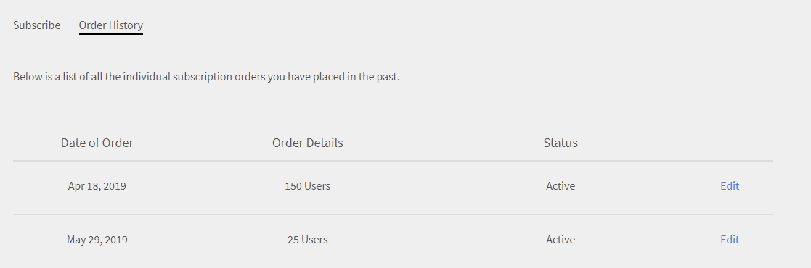

# Learning Manager の注文および請求管理

クレジットカードによる購入は、[米国地域](http://learningmanager.adobe.com/)でのみご利用いただけます。

Learning Manager の請求の管理、クレジットカードを使用した注文、発注または月間アクティブユーザープランを使用したサブスクリプションの購入など。

Adobe Learning Manager では、組織のニーズに応じて柔軟かつ手頃な最適価格モデルが提供されます。 詳細については、[Learning Manager &#x200B;](https://www.adobe.com/products/learningmanager.html) ページを参照してください。

請求を管理できるのは組織の管理者のみになります。

Learning Manager のサブスクリプションおよび請求についての詳細は、[learningmanagersales@adobe.com](mailto:learningmanagersales@adobe.com) までお問い合わせください。

## 請求ページ

請求ページにアクセスするには、管理者としてAdobe Learning Managerにログインして、左側のナビゲーションパネルで「**[!UICONTROL 請求]**」を選択します。

請求ページには、次のタブがあります。

| Tab | 目的 |
|---|---|
| **サブスクリプション** | アカウントの詳細、ライセンスの使用権限、シートの使用状況を表示します。 プランの有効化を管理します。 |
| **注文履歴** | アカウントに対して行われた過去の注文を確認します。 |

### 「購読」タブ

**アカウントの詳細**

「**サブスクリプション**」タブの上部にある&#x200B;**アカウントの詳細**&#x200B;カードには、アカウントの4つの読み取り専用IDが表示されます。

| フィールド | 説明 |
|---|---|
| **ECCID** | お客様のアカウントのAdobe参照番号。 Adobeサポートに問い合わせる場合は、ここに記載する内容を引用してください。 |
| **アカウントID** | 固有のAdobe Learning ManagerアカウントID。 |
| **アカウント名** | Adobe Learning Managerアカウントの表示名です。 |
| **IMS組織ID** | Adobe Admin Console組織が、このアカウントにリンクされています。 まだリンクされていない場合は空白。 |

**ライセンス**

**ライセンス**&#x200B;セクションには、アカウントで有効なすべてのライセンスまたは使用権限が一覧表示されます。 各ブロックには、ライセンス名、該当する場合はプランの説明、現在の契約期間の消費量を示す統計行が表示されます。

統計行の列は、ライセンスの種類によって異なります。

| ライセンスタイプ | 表示されている列 |
|---|---|
| 有料ライセンス（Adobe Learning Manager Ultimateなど） | 購入済み/使用済み/ピアアカウントで使用済み/残り |
| 体験版ライセンス（例：バーチャルコーチ） | 使用可能/使用済み/残り |

統計行の下の&#x200B;**[!UICONTROL 利用状況の詳細を表示]**&#x200B;を選択して、インラインの内訳を展開します。 展開されたセクションには、次の情報が表示されます。

- **期間の選択**&#x200B;ドロップダウンでは、過去の期間を含め、契約期間でフィルター処理できます
- **全体的な利用状況**&#x200B;テーブルに列があります：購入済み/このアカウントで使用済み/ピアアカウントで使用済み/残り
- 個々のピアアカウントに分散された使用状況を確認するための&#x200B;**アカウントの内訳の表示**&#x200B;リンク
- 使用状況データをファイルとしてエクスポートするための&#x200B;**詳細レポートのダウンロード**&#x200B;リンク

**Agent Orchestratorライセンスブロック**

Agent Orchestratorライセンスがリンクされている場合、統計行には次の情報が表示されます。

| 列 | 説明 |
|---|---|
| **購入済み** | 契約期間中に購入されたGen AIクレジットの合計。 |
| **使用済み** | このライセンスを使用するすべてのサービスで消費されるクレジット。 |
| **ALMが使用** | Adobe Learning Managerが別途消費するクレジット |
| 残り&#x200B;**&#x200B;** | クレジットは引き続き利用できます。 |

組織で親アカウントと子アカウントを使用している場合、親アカウントの&#x200B;**ライセンス**&#x200B;セクションには、**ピアアカウントによる使用済み**&#x200B;列が表示され、リンクされたすべての子アカウントのクレジットの使用状況が反映されます。 子アカウントの割り当ては、購入済みではなく&#x200B;**制裁済みのシート**&#x200B;として表示されます。

## Adobe Learning ManagerアカウントをAdobe Admin Consoleにリンク

Gen AI機能を有効にするには、Adobe Learning ManagerアカウントがAdobe Admin Console組織に接続されている必要があります。 リンクすると、Adobe Learning ManagerによってAgent Orchestratorのライセンスが検出され、「**クレジット**」タブが使用できるようになります。

リンクは、Adobeの通常の注文プロセスでアカウントを購入したとき、またはアクティベーションキーを使用してアカウントをアクティベートしたときに自動的に確立されます。 リンクは「**サブスクリプション**」タブで確認できます。「**アカウントの詳細**」の「**IMS組織ID**」フィールドに情報が入力されている場合、アカウントは既にリンクされています。

### アカウントを手動でリンク

アカウントが個別に設定され、**IMS組織ID**&#x200B;フィールドが空白の場合は、手動でリンクしてください。

**前提条件：**
- Adobe Learning Managerアカウントの管理者である必要があります。
- リンクするAdobe Admin Consoleの組織で、システム管理者ロールを保持する必要があります。
- Adobe Admin Console組織には、アクティブなAgent Orchestratorライセンスが必要です。

1. **[!UICONTROL 請求]**&#x200B;を選択し、[**[!UICONTROL サブスクリプション]**]タブを選択します。
2. **アカウントの詳細**&#x200B;カードで、**[!UICONTROL IMS組織のリンク]**&#x200B;を選択します。
3. ログインウィンドウが開きます。 Adobeアカウントの資格情報を入力し、リストから組織を選択します。 Adobe Learning Managerは、ログインしているアカウントがAdobe Admin ConsoleのSystem Administratorロールを持ち、同じアカウントがAdobe Learning ManagerのAdministratorロールを持っていることを確認します。
4. 両方のチェックに合格すると、リンクが確立されます。 **IMS組織ID**&#x200B;フィールドが組織のIDで更新され、クレジット残高が&#x200B;**ライセンス**&#x200B;セクションに表示されます。
5. いずれかのチェックが失敗すると、エラーメッセージが表示されます。 上記の前提条件を確認して、もう一度やり直してください。

### アカウントのリンク解除

リンクを解除すると、すべての学習者に対してGen AI機能が無効になり、アカウントが再度リンクされるまで「**クレジット**」タブは使用できません。

1. **[!UICONTROL 請求]**&#x200B;を選択し、[**[!UICONTROL サブスクリプション]**]タブを選択します。
2. **アカウントの詳細**&#x200B;カードで、**[!UICONTROL IMS組織のリンクを解除]**&#x200B;を選択します。
3. 組織での管理者の役割を確認するには、もう一度ログインしてください。
4. リンクが削除されます。 「**IMS組織ID**」フィールドが空白に戻り、「**クレジット**」タブが非表示になります。

アクセスを復元するには、上記の手動リンクの手順を繰り返します。

## クレジットカードを使用した注文 {#placeordersusingcreditcards}

1 回のクレジットカード支払いによる注文で、最大 3500 人の学習者のサブスクリプションを購入できます。 アカウントで初めて注文する場合は、学習者が 10 人以上必要になります。

1. 管理者アプリで、左側のナビゲーションペインの「**[!UICONTROL 請求]**」をクリックします。

   

   *Adobe Learning Manager請求の開始*

1. **[!UICONTROL 請求情報]**&#x200B;ページで、**[!UICONTROL ユーザーの追加]**&#x200B;フィールドにユーザー数を追加します。 プリペイドのサブスクリプションにクレジットカードを使用する場合、サブスクリプションに追加できるユーザーの数を確認できます。 「残り」セクションに表示されている人数を超えるユーザーを追加することはできません。

   

   *ユーザー数の追加*

1. 追加するユーザーの数を指定したら、ページの右上隅にある「注文する」をクリックします。

   

1. 画面に表示される見積を確認します。

   

   *注文する*

   年間サブスクリプションの料金は、サブスクリプションに追加されたユーザーの数に基づいて計算されます。 例えば、4 人のユーザーが追加された場合、年間料金は「4 人 × $4 × $12」と計算されて $192 となります。

   「**[!UICONTROL 続行]**」をクリックします。

   *見積もりの確認*

1. 支払詳細ページで、注文の見積価格を確認できます。 通貨は現在のロケールに基づいて表示されます。

   

   *支払いの詳細を表示*

   ドロップダウンリストから国を選択してロケールを変更することもできます。

   

   *請求国を選択してください*

1. 連絡先情報を入力し、クレジットカードのタイプを選択して、クレジットカードの詳細を入力します。 必要な情報を入力したら、[**[!UICONTROL 注文を完了]**]をクリックします。
1. 注文が完了したら、最近注文したパッケージを表示するには、**[!UICONTROL 請求]**&#x200B;ページの&#x200B;**[!UICONTROL 注文履歴]**&#x200B;タブをクリックします。

   

   *注文履歴の表示*

## 注文ステータスの確認 {#checkorderstatus}

すべての注文のステータスは次のいずれかになります。

**アクティブ**：注文がアクティブであり、ユーザーが正常に登録されています。

**中断：**&#x200B;次のシナリオでは、注文が中断状態に移行します。

- クレジットカードの支払いが遅延している
- クレジットカードの有効期限が切れている
- 定期的な支払いサイクルで支払いが拒否される

**キャンセルの開始**： Learning Manager 管理者がアカウントを無効にすると、注文はこの状態に移行します。 注文のキャンセルが確認されると、注文はキャンセルされた状態に移行します。

## サブスクリプションの詳細の更新 {#updatesubscriptiondetails}

1. 注文リストで「**[!UICONTROL 編集]**」をクリックします。

   

   *サブスクリプションの詳細の更新*

1. サブスクリプションの詳細ページで、「**[!UICONTROL サブスクリプションを編集]**」をクリックします。
1. 編集するアイテムを選択します。

   - 支払い方法：クレジットカードなどの支払いの詳細を更新するには、このオプションを使用します。
   - 住所：住所の詳細を更新するには、このオプションを使用します。

## サブスクリプションをキャンセル {#cancelasubscription}

注文をキャンセルするには、以下の手順を実行します。

1. 管理者ページの左側のペインで、「請求」をクリックします。
1. 請求ページの右上隅で、**[!UICONTROL アクション]**/**[!UICONTROL アカウントの無効化]**&#x200B;を選択します。
1. 管理者がアカウントを無効にすると、アカウント内の既存のすべての注文は、次の請求サイクルでキャンセルされます。

お客様がアカウントを無効にすると、その後 30 日間は体験版の状態になります。 アカウント所有者は、アカウントの回復に関するリマインダー電子メールを 3 通受け取ります。 所有者がアカウントを再度アクティブにしない場合、所有者以外のユーザーは Learning Manager にアクセスできなくなります。

## 発注を使用した注文 {#placeordersusingpurchaseorder}

代替の支払い方法として、発注プロセスを選択することができます。 前提条件として、組織のアカウントがAdobeに登録されている必要があります。 組織のアカウントは発注プロセスによって請求されます。 アカウントは、学習者のアクティビティに基づいて請求されます。 学習オブジェクトレベルのアクティビティのみが請求対象になります。 発注を使用して注文するには、以下の手順を実行します。

1. [learningmanagersales@adobe.com](mailto:learningmanagersales@adobe.com) に電子メールを送信し、必要な学習者の人数をお伝えください。
1. Learning Manager チームがアクティベーションキーを送信します。
1. 管理者アプリの請求ページで、アクティベーションキーを入力します。
1. ページの右上隅にある「アクティブにする」をクリックします。

## アカウントステータスの確認 {#checkaccountstatus}

アカウントはアクティブになると次のいずれかの状態になります。

- **体験版** - Adobe Learning Managerアカウントを作成し、30日間無料で使用することができます。 体験期間中に登録する学習者の数に制限はありません。
- **アクティブ** – この状態のアカウントには、サブスクリプションの注文に従って毎月の定期的な支払いを行うアクティブな学習者サブスクリプションがあります。
- **非アクティブ** – アカウントは次のシナリオで非アクティブ状態に移行します：

  - 体験版期間の後、アカウントに有効なサブスクリプション注文がない場合。
  - 管理者がアカウントを無効にすると、サブスクリプションの次の請求サイクルからアカウントの既存の注文がすべてキャンセルされます。
  - リマインダー後も、アカウントのアクティブな注文の支払いは拒否されます。

非アクティブ状態では、ただちにアカウントがキャンセルされることはありません。 Learning Managerチームからリマインダーが送信され、有効期限が切れているクレジットカードの最新情報を提供するよう求められます。 非アクティブ状態では、管理者のみがAdobe Learning Managerアカウントにログインできます。 その他のユーザーは、アカウントにアクセスできません。

- **アクティベーションが必要** - Learning Manager管理者が無効化を選択すると、アカウントはこの状態に移行します。 このアカウントの注文はすべてキャンセルされます。 これらの注文の支払いは、次の請求サイクルからは発生しません。 アカウントのステータスは、請求サイクルの最終日までこの状態のままになります。 この状態では、すべてのユーザーが定期的な支払いの最終日まで影響を受けることなくアプリケーションを引き続き使用できます。

## サブスクリプションをキャンセル {#Cancelasubscription-1}

アクティブなサブスクリプションをキャンセルするには、Learning Manager サポートチームまでお問い合わせください。

## アカウント解約手数料 {#accountterminationfee}

年間契約期間が完了する前にサブスクリプションを解約する場合は、途中解約手数料が請求されます。 解約手数料は、残りの契約期間のサブスクリプション価格の 50% となります。

## 月間アクティブユーザー（MAU）プラン {#monthlyactiveusersmauplan}

請求方法として、MAU プランを選択できます。 このオプションでは、1 ヶ月間における一意のアクティブユーザーの数に基づいて請求が行われます。 1 ヶ月間における一意のアクティブユーザーの数は、プランがアクティブ化された月から 12 ヶ月間にわたって累積的に加算されます。 請求は 12 ヶ月後の月に行われます。

次の例で、MAU の計算方法を説明します。

1 ヶ月ごとのユーザー数が以下のように推移するとします。

- 1 ヶ月目：50 人
- 2 ヶ月目：500 人
- 3 ヶ月目：5000 人
- 4 ～ 12 ヶ月目：10 人

請求対象の月間アクティブユーザーの合計は、上記の合計 50 + 500 + 5000 + 90 = 5640 人です。

したがって、この期間の請求は、5640 人のユーザーに対して行われます。

12 ヶ月後にカウントが 0 に戻り、新しい MAU プラン期間が開始されます。 複数のアクティベーションキーを追加して、購入するシートの数を増やすことができます。

次のアクションを実行したユーザー、または他のユーザーが実行したアクションによって要件を満たしたユーザーは、その月の一意の月間アクティブユーザーと見なされます。

- コース、学習プログラム、または資格認定を使用する。
- 作業計画書またはコースの添付ファイルを使用、ダウンロードする。
- 個人的なメモを使用、ダウンロード、または作成する。
- 掲示板、投稿、またはコメントを作成してソーシャル学習に参加する。
- 社外の資格認定提出の承認または教室／バーチャルクラスルームセッションへの出席を通じて要件を満たす。

## 詳細な使用状況を表示 {#viewusagedetails}

1. 1 ヶ月あたりのアクティブユーザーの数を表示するには、「**[!UICONTROL 詳細な使用状況を表示]**」をクリックします。

   

   *アクティブなユーザーを月別に表示*

1. 表示されるページでは、以下を確認できます。

   - **全体的な使用量：**&#x200B;アクティブユーザーの総数、Learning Managerを使用している1ヶ月あたりのユーザー数、コースに未登録のユーザー数を確認することができます。
   - **毎月の使用量：**&#x200B;毎月の一意のアクティブユーザーのテーブルを表示できます。

## 使用状況レポートのダウンロード {#downloadusagereport}

1 ヶ月および 1 年あたりのアクティブユーザー数のデータをダウンロードすることもできます。 ダウンロードするには、「**[!UICONTROL 詳細レポートをダウンロード]**」をクリックします。

**レポートリクエストを生成**&#x200B;ダイアログで、必要な月と年の範囲を入力し、「**[!UICONTROL 生成]**」をクリックします。

*アクティブな使用状況レポートをダウンロードする*

ブラウザーウィンドウを閉じると、次回 Learning Manager にアクセスした際にダウンロードが開始されます。

レポートはブラウザーのダウンロードフォルダーに保存されます。

## サブスクリプションをキャンセル

アクティブなサブスクリプションをキャンセルするには、Learning Manager サポートチームまでお問い合わせください。

<!--
## Gen AI credits {#genaicredits}

### How Gen AI credits work

Gen AI credits are consumed each time a learner interacts with an AI-powered feature — for example, when asking a question through the AI Assistant or generating a personalized learning recommendation. Before each interaction begins, Adobe Learning Manager checks that credits are available. If credits are available, the interaction proceeds. If the balance has been exhausted, the learner sees a message that the feature is temporarily unavailable.

Credits are purchased as part of an Adobe Experience Platform Agent Orchestrator license. That license is managed in your Adobe Admin Console, and Adobe Learning Manager connects to it automatically to detect available credits.

**Credit priority rule:** If your Adobe Learning Manager plan includes bundled Gen AI credits and you also have an Agent Orchestrator license, the bundled credits are consumed first. Agent Orchestrator credits are used only after the bundled credits are exhausted.

**Shared credit pools:** If your organization has multiple Adobe Learning Manager accounts all linked to the same Adobe Admin Console organization, all accounts draw from a single shared credit pool.

>[!IMPORTANT]
>
>All Gen AI features are turned off by default. You must enable each feature and set a credit usage limit before learners can access it.

### Access the Gen AI Credits tab

1. Select **[!UICONTROL Admin]** > **[!UICONTROL Billing]**.
2. Select the **[!UICONTROL Credits]** tab.

The **Credits** tab is visible only when Gen AI credits have been purchased or were historically active on the account. If the tab is not visible, verify that your account is linked to an Adobe Admin Console organization that has an active Agent Orchestrator license.

### Gen AI Features table

The **Gen AI Features** table lists every AI feature available on the account.

| Column | Description |
|---|---|
| **Feature Name** | Name of the AI feature. Select the name to go to that feature's settings page. |
| **Status** | Whether the feature is on or off. Toggle the feature from its settings page. |
| **Max Credits Usage Limit** | Maximum credits this feature can consume during the contract period. Must be set before the feature can be enabled. Applies to learner-facing features only. |
| **Credits Used** | Total credits consumed by this feature since the contract start date, updated in real time. |

### Enable a Gen AI feature

1. On the **[!UICONTROL Credits]** tab, locate the feature in the **Gen AI Features** table.
2. In the **Max Credits Usage Limit** column, enter the maximum number of credits this feature can consume during the contract period.
3. Select the feature name to go to its **Feature Settings** page.
4. On the **Feature Settings** page, toggle the feature on.
5. Complete any additional configuration, such as assigning learners and catalogs to the AI Assistant.

### What happens when credits run out

- If a feature reaches its **Max Credits Usage Limit**, learners see a message that the feature is temporarily unavailable. Raise the limit at any time from the **Credits** tab.
- If overall account credits are exhausted, all Gen AI features stop working for learners until additional credits are purchased. Usage reports and credit metrics remain accessible to admins.
- If a learner is mid-interaction when credits are exhausted, that interaction completes. All subsequent interactions are blocked.
- Admins can set a credit limit higher than the number of purchased credits. Over-allocation is permitted, and a true-up can happen at renewal.

### Monthly Credits Usage chart

Below the Gen AI Features table, a **Monthly Credits Usage** chart shows credits consumed per feature per month. By default, the chart shows the current contract year period based on the Agent Orchestrator contract start date. Select **[!UICONTROL Download]** to export the monthly report for the selected period. Report generation is asynchronous — you receive an in-app notification and email when the file is ready.

### Gen AI usage reports

Adobe Learning Manager provides two Gen AI usage reports under **[!UICONTROL Reports]** > **[!UICONTROL AI Reports]**.

**Monthly credits usage report**

Shows credits consumed per feature per month. Useful for budget planning and contract renewal.

- **Columns:** Month | Feature | Credits Used
- **Filter:** Select a date range spanning one or more contract periods
- **Download:** Asynchronous — you receive an in-app notification and email when the file is ready

**Learner Gen AI credits usage report**

An audit trail showing which learners used which features and how many credits each interaction consumed.

- **Columns:** Date | Learner Name | Learner Email | Feature | Credits Used
- **Filter:** Select the date range you want to audit
- **Download:** Asynchronous — you receive an in-app notification and email when the file is ready

### Credit usage alerts

Adobe Learning Manager automatically notifies you when credit consumption crosses key thresholds. Notifications are delivered both in-app and by email.

| Trigger | Notification |
|---|---|
| Account credits reach 90% of total purchased | Warning — credits are nearly exhausted at the account level |
| Account credits reach 100% of total purchased | Alert — all credits are consumed and Gen AI features stop for learners |
| A feature reaches its individual Max Credits Usage Limit | Alert — names the specific feature; that feature stops for learners |

When you receive a 90% warning, contact your Adobe account team to purchase additional credits before the 100% threshold is reached.
-->

## よくある質問 {#frequentlyaskedquestions}

**サブスクリプションを追加またはアカウントから削除する方法**

サブスクリプションをアカウントに追加するには、サブスクリプションを購入するユーザーの人数を追加します。 ページの右上隅にある&#x200B;**[!UICONTROL 「注文する」]**&#x200B;をクリックします。 見積もりを確認して&#x200B;**[!UICONTROL 「続行」]**&#x200B;をクリックします。 アカウント情報とクレジットカード情報を入力します。 サブスクリプションを購入できたら、**[!UICONTROL 「注文を完了」]**&#x200B;をクリックします。

アクティブなサブスクリプションを削除するには、Learning Manager サポートチームまでお問い合わせください。

**サブスクリプションのクレジットカード情報を変更する方法を教えてください。**

有効なアカウントの&#x200B;**[!UICONTROL 注文履歴]**&#x200B;タブで、**[!UICONTROL 編集]**&#x200B;をクリックします。 サブスクリプションの詳細ページで、**[!UICONTROL 「サブスクリプションを編集」]**&#x200B;をクリックします。 新しいクレジットカードの情報を入力して、**[!UICONTROL 「支払い方法を更新」]**&#x200B;をクリックします。

*クレジットカードの詳細を表示する*

**Learning Managerの請求情報を更新する方法を教えてください。**

請求情報を更新するには、次の手順に従います。

1. **管理者**&#x200B;としてログインし、**[!UICONTROL 請求]**&#x200B;をクリックします。
1. 注文リストで&#x200B;**[!UICONTROL 編集]**&#x200B;をクリックします。
1. サブスクリプションの詳細ページで、「**[!UICONTROL サブスクリプションを編集]**」をクリックします。

編集するアイテムを選択します。

1. **[!UICONTROL 支払い方法]:**&#x200B;このオプションを使用して、クレジットカードなどの支払いの詳細を更新します。
1. **[!UICONTROL アドレス]:**&#x200B;このオプションを使用して、アドレスの詳細を更新します。

**サブスクリプションを部分的に解約できますか？**

いいえ。サブスクリプションを部分的にキャンセルすることはできません。 購入したシートの数を減らす必要がある場合は、請求サイクルの終了時にサブスクリプションを解約した後、改めて必要なシートの数を購入できます。

**クレジットカードでの支払いの請求書を取得する方法を教えてください。**

支払いの請求書を入手するには、次のいずれかの方法で [FastSpring](https://fastspring.com/) にお問い合わせください。

- リンク`https://questionacharge.com`を使用して、FastSpringでサービス要求を作成します。
- `orders@fastspring.com`にFastSpringに請求書を要求する電子メールを送信します。

## Gen AIクレジットに関する問題のトラブルシューティング

| 問題 | 解決策 |
|---|---|
| **[クレジット]タブが表示されていません** | Gen AIクレジットは購入されていないか、このアカウントに適用されていません。 Adobe Admin ConsoleでAgent Orchestratorのライセンスを確認し、組織が&#x200B;**[!UICONTROL 請求]** > **[!UICONTROL サブスクリプション]** > **アカウントの詳細**&#x200B;にリンクされていることを確認してください。 |
| **IMS組織IDフィールドが空白です** | アカウントはまだリンクされていません。 **アカウントの詳細**&#x200B;カードで&#x200B;**[!UICONTROL IMS組織のリンク]**&#x200B;を選択し、上記のリンク手順に従います。 |
| **リンクがエラーで失敗しました** | リンクしようとしているAdobe Learning ManagerとAdobe Admin Consoleの両方にAdministratorロールがあることを確認します。 リンクを確立するには、両方のチェックに合格する必要があります。 |
| **アクティベーションキーを適用した後、[IMS組織ID]フィールドが空白です** | 自動リンクは、Adobeの標準注文フローを通じてアクティブ化されたアカウントに対してのみ行われます。 独立して設定されたアカウントの場合は、キーをアクティブにした後、上記の手動リンク手順を完了します。 |
| **リンク解除後、Gen AI機能を使用できません** | リンクを解除すると、すべてのGen AI機能へのアクセスが削除され、「クレジット」タブが非表示になります。 アクティブなAgent Orchestratorライセンスを持つAdobe Admin Console組織にアカウントを再リンクして、アクセスを復元します。 |

<!-- 
# Manage Learning Manager orders and billing

Credit card-based purchase is only available in the [US region](http://learningmanager.adobe.com/).

Manage Learning Manager billing, place orders by using a credit card, subscribe using a Purchase Order, or via a Monthly Active Users plan.

Adobe Learning Manager has a flexible, customer-friendly, and one of the best pricing models to cater to your organization needs. For more information, see the [Learning Manager](https://www.adobe.com/products/learningmanager.html) page.

Only the Administrators of your organization can manage billing.

If you want to contact Adobe for more information about Learning Manager subscription and billing, write to us at [learningmanagersales@adobe.com](mailto:learningmanagersales@adobe.com).

## Place orders using credit cards {#placeordersusingcreditcards}

You can buy a subscription for a maximum of 3500 learners through any single credit card payment order. The first order in the account must be for a minimum of 10 learners.

1. On the Administrator app, click **[!UICONTROL Billing]** on the left navigation pane.

   

   *Launch Adobe Learning Manager billing*

1. On the **[!UICONTROL Billing Information]** page, add the number of users in the **[!UICONTROL Add Users]** field. When using a credit card for pre-paid subscriptions, you can see the number of users that you can add for the subscription. The number of users you can add must not exceed the number mentioned in the section Remaining.1. 

   

   *Add number of users*

1. After specifying the number of users to add, click Place Order in the upper-right corner of the page.

   

1. Review the estimate that appears on the screen.

   

   *Place an order*

   The annual subscription fee is calculated based on the number of users who are added for the subscription. For example, if four users are being added, the annual fee is calculated using the expression 4 usersX$4X$12, which returns $192.

   Click **[!UICONTROL Proceed]**.

   *Review the estimate*

1. On the Payment Details page, you can view the estimated price of the order. The currency appears based on the current locale.

   

   *View payment details*

   You can also change the locale by choosing the country from the drop-down list.

   

   *Select the country of billing*

1. Enter your contact information, choose the credit card type, and provide the details of the credit card. After you've entered the required details, click **[!UICONTROL Complete Order]**.
1. After you've placed the order, to see the recently ordered packages, click the **[!UICONTROL Order History]** tab on the **[!UICONTROL Billing]** page.

   

   *View order history*

## Check order status {#checkorderstatus}

All orders can have one of the four statuses:

**Active:** An order is active, and users are registered successfully.

**Suspended:** An order moves into suspended state in the following scenarios:

* Delay in receipt of payment from the credit card
* Expiry of the credit card.
* Payment is declined for any recurring payment cycle.

**Canceled initiated:** An order moves into this state when the Learning Manager Administrator deactivates the account. The order then moves into a canceled state after receiving the cancellation confirmation of the order.

## Update subscription details {#updatesubscriptiondetails}

1. In the list of orders, click **[!UICONTROL Edit]**.

   

   *Update subscription details*

1. In the Subscription details page, click **[!UICONTROL Edit Subscription]**.
1. Choose the item that you want to edit:

   * Payment method: Use this option to update payment details, such as, credit card.
   * Address: Use this option to update address details.

## Cancel a subscription {#cancelasubscription}

To cancel an order:

1. In the left pane of the Administrator page, click Billing.
1. In the Billing page, on the upper-right corner, choose **[!UICONTROL Actions]** > **[!UICONTROL Deactivate Account]**.
1. Once the Administrator deactivates the account, all existing orders in the account are canceled from the next billing cycle.

When an account is deactivated by the customer, it enters a trial state for the next 30 days. The account owner receives three reminder emails to revive the account. If the owner does not reactivate the account, none of the users are able to access Learning Manager apart from the owner.

## Place orders using Purchase Order {#placeordersusingpurchaseorder}

You can choose purchase order process as an alternative mode of payment. As a pre-requisite, your organization's account must be registered with Adobe. Your organization account is charged for this process. The account is charged based on a learner's activities. Only Learning Object-level activities are charged. To place an order using PO:

1. Send an email to [learningmanagersales@adobe.com](mailto:learningmanagersales@adobe.com) and mention the number of required learners.
1. The Learning Manager team sends you an activation key.
1. In the Billing page of the Administrator app, enter the activation key.
1. Click Activate in the upper-right corner of the page.

## Check account status {#checkaccountstatus}

After an account gets activated, the account can be in any of the following states:

* **Trial** - You can create an Adobe Learning Manager account and use it without any payment for a period of 30 days. There is no limit on the number of learners registered during the trial period.
* **Active** - In this state, the account has active learner subscriptions with recurring monthly payment as per the subscription order.
* **Inactive** - An account moves into inactive state in the following scenarios:

  * After the trial period if there are no active subscription orders in the account.
  * Administrator deactivates the account, which results in canceling all the existing orders in an account from the next billing cycle of subscription.
  * Payment is declined for active orders in an account even after reminders.

An inactive state does not cancel your account with immediate effect. You receive at least a couple of reminders from the Learning Manager team asking you to provide the latest information about

your credit card if it has expired. In an inactive state, only an administrator can log in to the Captivate

Learning Manager account. All other users cannot access the account.

* **Activation required** - Your account moves into this state when the Learning Manager administrator chooses to deactivate the account. All the orders of this account get canceled. The collection of payment for these orders does not happen from the next billing cycle. The status of the account remains in this state until the day of the last billing cycle. In this state, all users can continue to use the application without any impact until the end of the last recurring payment date.

## Cancel a subscription {#Cancelasubscription-1}

To cancel an active subscription, contact the Learning Manager support team.

## Account termination fee {#accountterminationfee}

If you want to cancel the subscription before the completion of the annual term, an early termination fee is charged. The termination fee is equivalent to 50% of the subscription price of the remaining commitment period.

## Monthly Active Users (MAU) plan {#monthlyactiveusersmauplan}

You can choose a MAU plan as your preferred way of billing. This option generates billing based on the number of monthly unique active users. The monthly unique active users are added cumulatively for a period of 12 months starting from the month of plan activation. This number is used for billing for the period.

Use the following example to understand how MAU is calculated.

Let there be a case where the number of users per month are as follows:

* Month 1 = 50
* Month 2 = 500
* Month 3 = 5000
* Month 4 to 12 = 10

Total Monthly Active Users that are billed = Month 1 + Month 2 + Month 3 + Month 4 to 12 = 50 + 500 + 5000 + 90 = 5640.

The billing for the period would be for 5640 users.

At the end of the 12-month period, the usage count is reset back to zero and a new period for MAU plan starts. You can add multiple activation keys to increase the purchased number of seats.

Any user who performs the following actions or achieves completions due to actions taken by others is considered as a monthly unique active user for that calendar month.

* Consuming a course, learning program or certification.
* Consuming, downloading a Job Aid or course attachments.
* Consuming, downloading or creating personal notes.
* Participating in Social Learning by creating Boards, posts or comments.
* Achieving completions due to External Certificate submission approvals or attendance for a classroom/virtual classroom sessions.

## View usage details {#viewusagedetails}

1. To view the number of active users by month, click **[!UICONTROL View Usage Details]**.

   

   *View active users by month*

1. On the page that displays, you can view the following:

   * **Overall usage:** You can check the total number of active users, users who are consuming Learning Manager in a month, and the number of users who have not yet signed up for any course.

   * **Monthly usage:** You can see a table of unique active users per month.

## Download usage report {#downloadusagereport}

You can also download the data of the number of active users by month and year. To download, click **[!UICONTROL Download Detailed Report]**.

On the **Generate Report Request** dialog, enter the required months and year, and click **[!UICONTROL Generate]**.

*Download active usage report*

If you close the browser window, the download starts the next time you visit Learning Manager.

The reports are saved in the Downloads folder of your browser.

## Cancel a subscription

To cancel an active subscription, contact the Learning Manager support team.

## Frequently Asked Questions {#frequentlyaskedquestions}

+++How to add/remove subscriptions from an account?

To add subscriptions in an account, add the number of users for who you'd like to purchase subscriptions. Then on the upper-right corner, click **[!UICONTROL Place Order]**. Review the estimate and click **[!UICONTROL Proceed]**. Enter your account details and also your credit card details. Then to purchase the subscriptions, click **[!UICONTROL Complete Order]**.

To remove an active subscription, contact the Learning Manager support team.
+++

+++How to change a credit card for subscriptions?

In the **[!UICONTROL Order History]** tab, for an active account, click **[!UICONTROL Edit]**. Then on the Subscription Details page, click **[!UICONTROL Edit Subscription]**. Enter your new credit card details and click **[!UICONTROL Update Payment Method]**.

*View credit card details*
+++

+++How to update the Billing information on Learning Manager?

To update the billing information, follow the steps below:

1. Log in as **Admin** and click **[!UICONTROL Billing]**.
1. In the list of orders, click **[!UICONTROL Edit]**.
1. In the Subscription details page, click **[!UICONTROL Edit Subscription]**.

Choose the item that you want to edit:

1. **[!UICONTROL Payment method]:** Use this option to update payment details, such as, credit card.
1. **[!UICONTROL Address]:** Use this option to update address details.
+++

+++Can I partially cancel a subscription?

No, you cannot cancel a subscription partially. If you need to reduce the number of seats that you have purchased, you can cancel the subscription at the end of the billing cycle and then purchase the number of seats required.
+++

+++How do I get an Invoice for my Credit card payments?

Contact [FastSpring](https://fastspring.com/) to get an invoice for your payments, using one of the following ways:

* Create a service request with FastSpring using the link `https://questionacharge.com`.
* Send an email to FastSpring on `orders@fastspring.com` requesting for the invoice.
-->
