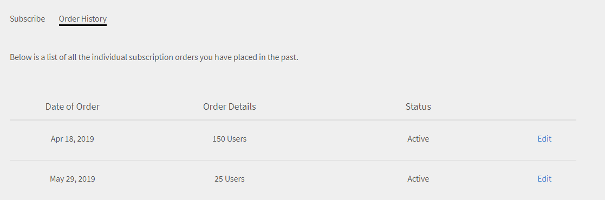

# Learning Manager の注文および請求管理

クレジットカードによる購入は、[米国地域](http://learningmanager.adobe.com/)でのみご利用いただけます。

Learning Manager の請求の管理、クレジットカードを使用した注文、発注または月間アクティブユーザープランを使用したサブスクリプションの購入など。

Adobe Learning Manager では、組織のニーズに応じて柔軟かつ手頃な最適価格モデルが提供されます。詳細については、[Learning Manager &#x200B;](https://www.adobe.com/products/learningmanager.html) ページを参照してください。

請求を管理できるのは組織の管理者のみになります。

Learning Manager のサブスクリプションおよび請求についての詳細は、[learningmanagersales@adobe.com](mailto:learningmanagersales@adobe.com) までお問い合わせください。

## クレジットカードを使用した注文 {#placeordersusingcreditcards}

1 回のクレジットカード支払いによる注文で、最大 3500 人の学習者のサブスクリプションを購入できます。アカウントで初めて注文する場合は、学習者が 10 人以上必要になります。

1. 管理者アプリで、左側のナビゲーションペインの「**[!UICONTROL 請求]**」をクリックします。

   

   *Adobe Learning Manager請求の開始*

1. **[!UICONTROL 請求情報]**&#x200B;ページで、**[!UICONTROL ユーザーの追加]**&#x200B;フィールドにユーザー数を追加します。 プリペイドのサブスクリプションにクレジットカードを使用する場合、サブスクリプションに追加できるユーザーの数を確認できます。追加できるユーザーの数は、セクションの残りの数を超えることはできません。 1.

   

   *ユーザー数の追加*

1. 追加するユーザーの数を指定したら、ページの右上隅にある「注文する」をクリックします。

   

1. 画面に表示される見積を確認します。

   

   *注文する*

   年間サブスクリプションの料金は、サブスクリプションに追加されたユーザーの数に基づいて計算されます。例えば、4 人のユーザーが追加された場合、年間料金は「4 人 × $4 × $12」と計算されて $192 となります。

   「**[!UICONTROL 続行]**」をクリックします。

   *見積もりの確認*

1. 支払詳細ページで、注文の見積価格を確認できます。通貨は現在のロケールに基づいて表示されます。

   

   *支払いの詳細を表示*

   ドロップダウンリストから国を選択してロケールを変更することもできます。

   

   *請求国を選択してください*

1. 連絡先情報を入力し、クレジットカードのタイプを選択して、クレジットカードの詳細を入力します。必要な情報を入力したら、[**[!UICONTROL 注文を完了]**]をクリックします。
1. 注文が完了したら、最近注文したパッケージを表示するには、**[!UICONTROL 請求]**&#x200B;ページの&#x200B;**[!UICONTROL 注文履歴]**&#x200B;タブをクリックします。

   

   *注文履歴の表示*

## 注文ステータスの確認 {#checkorderstatus}

すべての注文のステータスは次のいずれかになります。

**アクティブ**：注文がアクティブであり、ユーザーが正常に登録されています。

**中断：**&#x200B;次のシナリオでは、注文が中断状態に移行します。

* クレジットカードの支払いが遅延している
* クレジットカードの有効期限が切れている
* 定期的な支払いサイクルで支払いが拒否される

**キャンセルの開始**： Learning Manager 管理者がアカウントを無効にすると、注文はこの状態に移行します。注文のキャンセルが確認されると、注文はキャンセルされた状態に移行します。

## サブスクリプションの詳細の更新 {#updatesubscriptiondetails}

1. 注文リストで「**[!UICONTROL 編集]**」をクリックします。

   

   *サブスクリプションの詳細の更新*

1. サブスクリプションの詳細ページで、「**[!UICONTROL サブスクリプションを編集]**」をクリックします。
1. 編集するアイテムを選択します。

   * 支払い方法：クレジットカードなどの支払いの詳細を更新するには、このオプションを使用します。
   * 住所：住所の詳細を更新するには、このオプションを使用します。

## サブスクリプションをキャンセル {#cancelasubscription}

注文をキャンセルするには、以下の手順を実行します。

1. 管理者ページの左側のペインで、「請求」をクリックします。
1. 請求ページの右上隅で、**[!UICONTROL アクション]**/**[!UICONTROL アカウントの無効化]**&#x200B;を選択します。
1. 管理者がアカウントを無効にすると、アカウント内の既存のすべての注文は、次の請求サイクルでキャンセルされます。

お客様がアカウントを無効にすると、その後 30 日間は体験版の状態になります。アカウント所有者は、アカウントの回復に関するリマインダー電子メールを 3 通受け取ります。所有者がアカウントを再度アクティブにしない場合、所有者以外のユーザーは Learning Manager にアクセスできなくなります。

## 発注を使用した注文 {#placeordersusingpurchaseorder}

代替の支払い方法として、発注プロセスを選択することができます。前提条件として、組織のアカウントがAdobeに登録されている必要があります。 組織のアカウントは発注プロセスによって請求されます。アカウントは、学習者のアクティビティに基づいて請求されます。 学習オブジェクトレベルのアクティビティのみが請求対象になります。発注を使用して注文するには、以下の手順を実行します。

1. [learningmanagersales@adobe.com](mailto:learningmanagersales@adobe.com) に電子メールを送信し、必要な学習者の人数をお伝えください。
1. Learning Manager チームがアクティベーションキーを送信します。
1. 管理者アプリの請求ページで、アクティベーションキーを入力します。
1. ページの右上隅にある「アクティブにする」をクリックします。

## アカウントステータスの確認 {#checkaccountstatus}

アカウントはアクティブになると次のいずれかの状態になります。

* **体験版** - Adobe Learning Managerアカウントを作成し、30日間無料で使用することができます。 体験期間中に登録する学習者の数に制限はありません。
* **アクティブ** – この状態のアカウントには、サブスクリプションの注文に従って毎月の定期的な支払いを行うアクティブな学習者サブスクリプションがあります。
* **非アクティブ** – アカウントは次のシナリオで非アクティブ状態に移行します：

   * 体験版期間の後、アカウントに有効なサブスクリプション注文がない場合。
   * 管理者がアカウントを無効にすると、サブスクリプションの次の請求サイクルからアカウントの既存の注文がすべてキャンセルされます。
   * リマインダー後も、アカウントのアクティブな注文の支払いは拒否されます。

非アクティブ状態では、ただちにアカウントがキャンセルされることはありません。Learning Managerチームから、以下に関する最新情報を提供するよう求めるリマインダーが少なくとも2つ届きます

クレジットカードの有効期限が切れている場合。 非アクティブ状態では、管理者のみがCaptivateにログインできます

Learning Managerアカウント。 その他のユーザーは、アカウントにアクセスできません。

* **アクティベーションが必要** - Learning Manager管理者が無効化を選択すると、アカウントはこの状態に移行します。 このアカウントの注文はすべてキャンセルされます。これらの注文の支払いは、次の請求サイクルからは発生しません。アカウントのステータスは、請求サイクルの最終日までこの状態のままになります。この状態では、すべてのユーザーが定期的な支払いの最終日まで影響を受けることなくアプリケーションを引き続き使用できます。

## サブスクリプションをキャンセル {#Cancelasubscription-1}

アクティブなサブスクリプションをキャンセルするには、Learning Manager サポートチームまでお問い合わせください。

## アカウント解約手数料 {#accountterminationfee}

年間契約期間が完了する前にサブスクリプションを解約する場合は、途中解約手数料が請求されます。解約手数料は、残りの契約期間のサブスクリプション価格の 50% となります。

## 月間アクティブユーザー（MAU）プラン {#monthlyactiveusersmauplan}

請求方法として、MAU プランを選択できます。このオプションでは、1 ヶ月間における一意のアクティブユーザーの数に基づいて請求が行われます。1 ヶ月間における一意のアクティブユーザーの数は、プランがアクティブ化された月から 12 ヶ月間にわたって累積的に加算されます。請求は 12 ヶ月後の月に行われます。

次の例で、MAU の計算方法を説明します。

1 ヶ月ごとのユーザー数が以下のように推移するとします。

* 1 ヶ月目：50 人
* 2 ヶ月目：500 人
* 3 ヶ月目：5000 人
* 4 ～ 12 ヶ月目：10 人

請求対象の月間アクティブユーザーの合計は、上記の合計 50 + 500 + 5000 + 90 = 5640 人です。

したがって、この期間の請求は、5640 人のユーザーに対して行われます。

12 ヶ月後にカウントが 0 に戻り、新しい MAU プラン期間が開始されます。複数のアクティベーションキーを追加して、購入するシートの数を増やすことができます。

次のアクションを実行したユーザー、または他のユーザーが実行したアクションによって要件を満たしたユーザーは、その月の一意の月間アクティブユーザーと見なされます。

* コース、学習プログラム、または資格認定を使用する。
* 作業計画書またはコースの添付ファイルを使用、ダウンロードする。
* 個人的なメモを使用、ダウンロード、または作成する。
* 掲示板、投稿、またはコメントを作成してソーシャル学習に参加する。
* 社外の資格認定提出の承認または教室／バーチャルクラスルームセッションへの出席を通じて要件を満たす。

## 詳細な使用状況を表示 {#viewusagedetails}

1. 1 ヶ月あたりのアクティブユーザーの数を表示するには、「**[!UICONTROL 詳細な使用状況を表示]**」をクリックします。

   

   *アクティブなユーザーを月別に表示*

1. 表示されるページでは、以下を確認できます。

   * **全体的な使用量：**&#x200B;アクティブユーザーの総数、Learning Managerを使用している1ヶ月あたりのユーザー数、コースに未登録のユーザー数を確認することができます。

   * **毎月の使用量：**&#x200B;毎月の一意のアクティブユーザーのテーブルを表示できます。

## 使用状況レポートのダウンロード {#downloadusagereport}

1 ヶ月および 1 年あたりのアクティブユーザー数のデータをダウンロードすることもできます。ダウンロードするには、「**[!UICONTROL 詳細レポートをダウンロード]**」をクリックします。

**レポートリクエストを生成**&#x200B;ダイアログで、必要な月と年の範囲を入力し、「**[!UICONTROL 生成]**」をクリックします。

*アクティブな使用状況レポートをダウンロードする*

ブラウザーウィンドウを閉じると、次回 Learning Manager にアクセスした際にダウンロードが開始されます。

レポートはブラウザーのダウンロードフォルダーに保存されます。

## サブスクリプションをキャンセル

アクティブなサブスクリプションをキャンセルするには、Learning Manager サポートチームまでお問い合わせください。

## よくある質問 {#frequentlyaskedquestions}

+++サブスクリプションを追加またはアカウントから削除するにはどうすればよいですか？

サブスクリプションをアカウントに追加するには、サブスクリプションを購入するユーザーの人数を追加します。 ページの右上隅にある&#x200B;**[!UICONTROL 「注文する」]**&#x200B;をクリックします。 見積もりを確認して&#x200B;**[!UICONTROL 「続行」]**&#x200B;をクリックします。 アカウント情報とクレジットカード情報を入力します。 サブスクリプションを購入できたら、**[!UICONTROL 「注文を完了」]**&#x200B;をクリックします。

アクティブなサブスクリプションを削除するには、Learning Managerサポートチームまでお問い合わせください。
+++

+++サブスクリプションのクレジットカード情報を変更するには、どうすればよいですか？

有効なアカウントの&#x200B;**[!UICONTROL 注文履歴]**&#x200B;タブで、**[!UICONTROL 編集]**&#x200B;をクリックします。 サブスクリプションの詳細ページで、**[!UICONTROL 「サブスクリプションを編集」]**&#x200B;をクリックします。新しいクレジットカードの情報を入力して、**[!UICONTROL 「支払い方法を更新」]**&#x200B;をクリックします。

*クレジットカードの詳細を表示する*
+++

+++Learning Managerの請求情報を更新するにはどうすればよいですか？

請求情報を更新するには、次の手順に従います。

1. **管理者**&#x200B;としてログインし、**[!UICONTROL 請求]**&#x200B;をクリックします。
1. 注文リストで&#x200B;**[!UICONTROL 編集]**&#x200B;をクリックします。
1. サブスクリプションの詳細ページで、「**[!UICONTROL サブスクリプションを編集]**」をクリックします。

編集するアイテムを選択します。

1. **[!UICONTROL 支払い方法]:**&#x200B;このオプションを使用して、クレジットカードなどの支払いの詳細を更新します。
1. **[!UICONTROL アドレス]:**&#x200B;このオプションを使用して、アドレスの詳細を更新します。
+++

+++サブスクリプションを部分的に解約できますか？

いいえ。サブスクリプションを部分的に解約することはできません。 購入したシートの数を減らす必要がある場合は、請求サイクルの終了時にサブスクリプションを解約した後、必要なシートの数を購入できます。
+++

+++クレジットカードでの支払いの請求書を取得する方法を教えてください。

支払いの請求書を入手するには、次のいずれかの方法で [FastSpring](https://fastspring.com/) にお問い合わせください。

* リンク`https://questionacharge.com`を使用して、FastSpringでサービス要求を作成します。
* `orders@fastspring.com`にFastSpringに請求書を要求する電子メールを送信します。
+++
