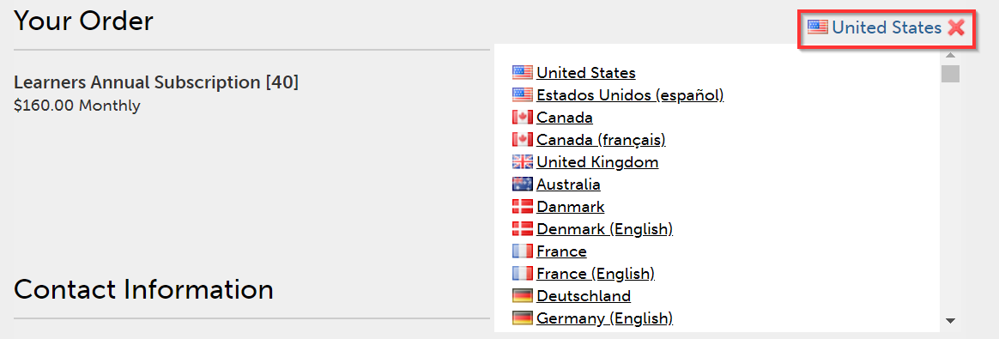

# Learning Managerの注文および請求の管理

クレジットカードによる購入は、 [米国地域](http://learningmanager.adobe.com/).

Learning Managerの請求の管理、クレジットカードを使用した注文、発注または月間アクティブユーザープランを使用したサブスクリプションの購入など。

Adobe版Learning Managerは、お客様のニーズに合わせて柔軟かつ手頃な最適価格モデルを提供します。 詳しくは、 [Learning Manager](https://www.adobe.com/products/learningmanager.html) ページです。

請求を管理できるのは、組織の管理者のみです。

Learning Managerのサブスクリプションおよび請求についての詳細は、Adobeまでお問い合わせください。こちらまでお問い合わせください。 [learningmanagersales@adobe.com](mailto:learningmanagersales@adobe.com).

## クレジットカードを使用した注文 {#placeordersusingcreditcards}

1つのクレジットカード決済注文で最大3,500人の学習者のサブスクリプションを購入できます。 アカウント内での最初の注文は、10人以上の学習者を対象としている必要があります。

1. 管理者アプリで、 **[!UICONTROL 請求]** をクリックします。

   

   *Adobe版Learning Managerの請求を開始*

1. を **[!UICONTROL 請求情報]** ページにユーザー数を追加 **[!UICONTROL ユーザーを追加]** フィールドに入力します。 プリペイド版サブスクリプションでクレジットカードを使用する場合、サブスクリプションに追加できるユーザー数が表示されます。 追加できるユーザーの数は、セクションの残りの数を超えることはできません。 1.

   

   *ユーザー数を追加*

1. 追加するユーザー数を指定したら、ページの右上隅にある「注文する」をクリックします。

   

1. 画面に表示される見積を確認します。

   

   *注文する*

   年間サブスクリプション料金は、サブスクリプションに追加されたユーザーの数に基づいて計算されます。 例えば、4人のユーザーが追加されている場合、年間料金は4 usersX$4X$12という式を使用して計算され、$192が返されます。

   クリック **[!UICONTROL 続行]**.

   *見積もりの確認*

1. 「Payment Details（支払の詳細）」ページで、注文の見積り価格を表示できます。 通貨は現在のロケールに基づいて表示されます。

   

   *支払詳細の表示*

   ドロップダウンリストから国を選択して、ロケールを変更することもできます。

   

   *請求国を選択*

1. 連絡先情報を入力し、クレジットカードのタイプを選択し、クレジットカードの詳細を入力します。 必要な情報を入力したら、 **[!UICONTROL 注文を完了]**.
1. 注文が完了したら、最近注文したパッケージを表示するには、 **[!UICONTROL 注文履歴]** タブを **[!UICONTROL 請求]** ページです。

   

   *注文履歴の表示*

## 注文状況の確認 {#checkorderstatus}

すべての注文は、次の4つのステータスのいずれかになります。

**アクティブ：** 注文が有効で、ユーザーが正常に登録されている。

**一時停止：** 次のシナリオでは、注文が中断状態に移行します。

* クレジットカードからの支払いの遅延
* クレジットカードの有効期限。
* 繰り返される支払いサイクルに対して支払いが拒否されます。

**キャンセルの開始：** Learning Manager管理者がアカウントを無効にすると、注文はこの状態に移行します。 その後、注文のキャンセル確認を受けた後、注文はキャンセル状態に移行します。

## サブスクリプションの詳細を更新 {#updatesubscriptiondetails}

1. 注文リストで、をクリックします。 **[!UICONTROL 編集]**.

   

   *サブスクリプションの詳細を更新*

1. サブスクリプションの詳細ページで、をクリックします。 **[!UICONTROL サブスクリプションを編集]**.
1. 編集する項目を選択してください：

   * 支払い方法：クレジットカードなどの支払いの詳細を更新するには、このオプションを使用します。
   * 住所：住所の詳細を更新するには、このオプションを使用します。

## サブスクリプションの解約 {#cancelasubscription}

受注を取り消す手順は、次のとおりです。

1. 管理者ページの左ペインで、「請求」をクリックします。
1. 請求ページの右上隅で、次を選択します。 **[!UICONTROL アクション]** > **[!UICONTROL アカウントを無効にする]**.
1. 管理者がアカウントを無効にすると、アカウント内の既存のすべての注文が次の請求サイクルからキャンセルされます。

お客様がアカウントを無効にすると、30日間の体験版ステータスになります。 アカウントの所有者には、アカウントを復活させるための3通のリマインダーメールが送信されます。 所有者がアカウントを再アクティベートしない場合、所有者以外のユーザーはLearning Managerにアクセスできなくなります。

## 注文書を使用した注文 {#placeordersusingpurchaseorder}

別の支払い方法として、発注処理を選択できます。 前提条件として、組織のアカウントがAdobeに登録されている必要があります。 このプロセスでは、お客様の組織アカウントに請求が行われます。 アカウントは、学習者のアクティビティに基づいて請求されます。 学習目標レベルのアクティビティにのみ料金が発生します。 発注を使用して発注する手順は、次のとおりです。

1. メールの送信先 [learningmanagersales@adobe.com](mailto:learningmanagersales@adobe.com) 必要な学習者の数を入力します。
1. Learning Managerチームからアクティベーションキーが送信されます。
1. 管理者アプリの請求ページで、アクティベーションキーを入力します。
1. ページの右上隅にある「有効化」をクリックします。

## アカウントステータスを確認 {#checkaccountstatus}

アカウントがアクティベートされると、アカウントは次のいずれかの状態になります。

* **体験版** - AdobeのLearning Managerアカウントを作成し、30日間無料で使用することができます。 体験版期間中の登録学習者の数に制限はありません。
* **アクティブ**  – この状態では、アカウントにはサブスクリプションの注文に従って毎月の定期的な支払いを行うアクティブな学習者サブスクリプションがあります。
* **非アクティブ**  – 次のシナリオで、アカウントが非アクティブ状態になります。

   * 体験版期間の後、アカウントに有効なサブスクリプション注文がない場合。
   * 管理者がアカウントを無効にすると、サブスクリプションの次の請求サイクルからアカウントの既存の注文がすべてキャンセルされます。
   * リマインダー後も、アカウントのアクティブな注文の支払いは拒否されます。

非アクティブ状態にしても、アカウントは直ちに解約されません。 Learning Managerチームから、以下に関する最新情報を提供するよう求めるリマインダーが少なくとも2つ届きます

クレジットカードの有効期限が切れている場合。 非アクティブ状態では、管理者のみがCaptivateにログインできます

Learning Managerアカウント。 その他のユーザーは、アカウントにアクセスできません。

* **ライセンス認証が必要** - Learning Manager管理者が無効化を選択すると、アカウントはこの状態に移行します。 このアカウントのすべての注文が取り消されます。 これらの注文の支払いの回収は、次の請求サイクルからは行われません。 アカウントのステータスは、最後の請求サイクルの日までこの状態のままです。 この状態では、すべてのユーザーは、最後の定期的な支払い日の終わりまで影響を受けずにアプリケーションを使用し続けることができます。

## サブスクリプションの解約 {#Cancelasubscription-1}

アクティブなサブスクリプションをキャンセルするには、Learning Managerサポートチームまでお問い合わせください。

## アカウントの解約手数料 {#accountterminationfee}

年間契約期間の終了前にサブスクリプションを解約する場合は、早期解約手数料が請求されます。 解約手数料は、残りの契約期間のサブスクリプション価格の50%に相当します。

## 月間アクティブユーザー(MAU)プラン {#monthlyactiveusersmauplan}

ご希望の請求方法として、MAUプランをご選択いただけます。 このオプションでは、月間アクティブユーザー数に基づいて請求が生成されます。 月間アクティブユーザーは、プランのアクティベーション月から12か月間、累積的に追加されます。 この番号は、期間の請求に使用されます。

次の例を使用して、MAUの計算方法を理解します。

1か月あたりのユーザー数が次のような場合があるとします。

* 月1 = 50
* 月2 = 500
* 月3 = 5,000
* 4か月から12か月= 10

請求対象の月間アクティブユーザーの合計は、1か月+2か月+3か月+4か月から12 = 50 + 500 + 5000 + 90 = 5640です。

この期間の請求は、5640ユーザーです。

12か月の期間が終了すると、使用数は0にリセットされ、MAUプランの新しい期間が開始されます。 複数のアクティベーションキーを追加して、購入するシート数を増やすことができます。

次のアクションを実行するユーザー、または他のユーザーのアクションが原因で完了したユーザーは、その暦月の月間アクティブユーザーとみなされます。

* コース、学習プログラム、資格認定の利用
* 作業計画書やコースの添付ファイルの使用とダウンロード
* 個人メモの使用、ダウンロード、作成
* 掲示板、投稿、コメントを作成して、ソーシャル学習に参加する。
* 教室/バーチャルクラスルームセッションの外部証明書提出の承認または出席による完了の達成。

## 使用状況の詳細を表示 {#viewusagedetails}

1. アクティブなユーザーの数を月別に表示するには、 **[!UICONTROL 使用状況の詳細を表示]**.

   

   *アクティブなユーザーを月別に表示*

1. 表示されるページでは、次の項目を確認できます。

   * **全体的な使用量：** アクティブユーザーの総数、Learning Managerを使用している1ヶ月あたりのユーザー数、コースに未登録のユーザー数を確認することができます。

   * **毎月の使用量：** 1か月あたりの一意のアクティブユーザーのテーブルを表示できます。

## 使用状況レポートをダウンロード {#downloadusagereport}

月別、年別のアクティブユーザー数のデータをダウンロードすることもできます。 ダウンロードするには、 **[!UICONTROL 詳細レポートをダウンロード]**.

を **レポート要求の生成** ダイアログで、必要な月と年を入力し、 **[!UICONTROL 描画]**.

*美しい使用状況レポートをダウンロード*

ブラウザーウィンドウを閉じると、次回Learning Managerにアクセスした際にダウンロードが開始されます。

レポートはブラウザーのダウンロードフォルダーに保存されます。

## サブスクリプションの解約

アクティブなサブスクリプションをキャンセルするには、Learning Managerサポートチームまでお問い合わせください。

## よくある質問 {#frequentlyaskedquestions}

+++サブスクリプションを追加またはアカウントから削除するにはどうすればよいですか？

アカウントにサブスクリプションを追加するには、サブスクリプションを購入するユーザーの人数を追加します。 右上隅のをクリックします。 **[!UICONTROL 注文]**. 見積もりを確認してクリック **[!UICONTROL 続行]**. アカウント情報とクレジットカード情報を入力します。 サブスクリプションを購入するには、をクリックします。 **[!UICONTROL 注文を完了]**.

アクティブなサブスクリプションを削除するには、Learning Managerサポートチームまでお問い合わせください。
+++

+++サブスクリプションのクレジットカード情報を変更するには、どうすればよいですか？

を **[!UICONTROL 注文履歴]** タブで、アクティブなアカウントの場合は、 **[!UICONTROL 編集]**. サブスクリプションの詳細ページで、をクリックします。 **[!UICONTROL サブスクリプションを編集]**. 新しいクレジットカード情報を入力して、 **[!UICONTROL 支払い方法を更新]**.

*クレジットカードの詳細を表示*
+++

+++Learning Managerの請求情報を更新するにはどうすればよいですか？

請求情報を更新するには、次の手順に従います。

1. ログイン **管理者** クリック **[!UICONTROL 請求]**.
1. 注文リストで、をクリックします。 **[!UICONTROL 編集]**.
1. サブスクリプションの詳細ページで、をクリックします。 **[!UICONTROL サブスクリプションを編集]**.

編集する項目を選択してください：

1. **[!UICONTROL 支払い方法]:** クレジットカードなどの支払詳細を更新するには、このオプションを使用します。
1. **[!UICONTROL 住所]:** 住所の詳細を更新するには、このオプションを使用します。
+++

+++サブスクリプションを部分的に解約できますか？

いいえ。サブスクリプションを部分的に解約することはできません。 購入したシートの数を減らす必要がある場合は、請求サイクルの終了時にサブスクリプションを解約した後、必要なシートの数を購入できます。
+++

+++クレジットカードでの支払いの請求書を取得する方法を教えてください。

連絡先 [FastSpring](https://fastspring.com/) 支払いの請求書を取得するには、次のいずれかの方法を使用します。

* リンクを使用して、FastSpringでサービス・リクエストを作成します。 `https://questionacharge.com`.
* FastSpringに電子メールを送信する `orders@fastspring.com` 請求書の請求
+++
