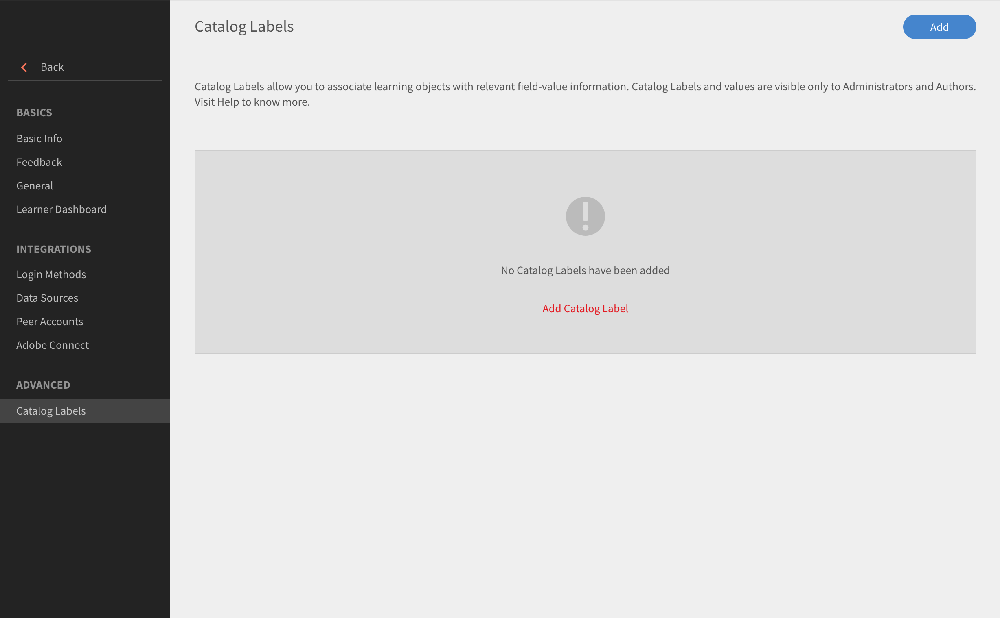
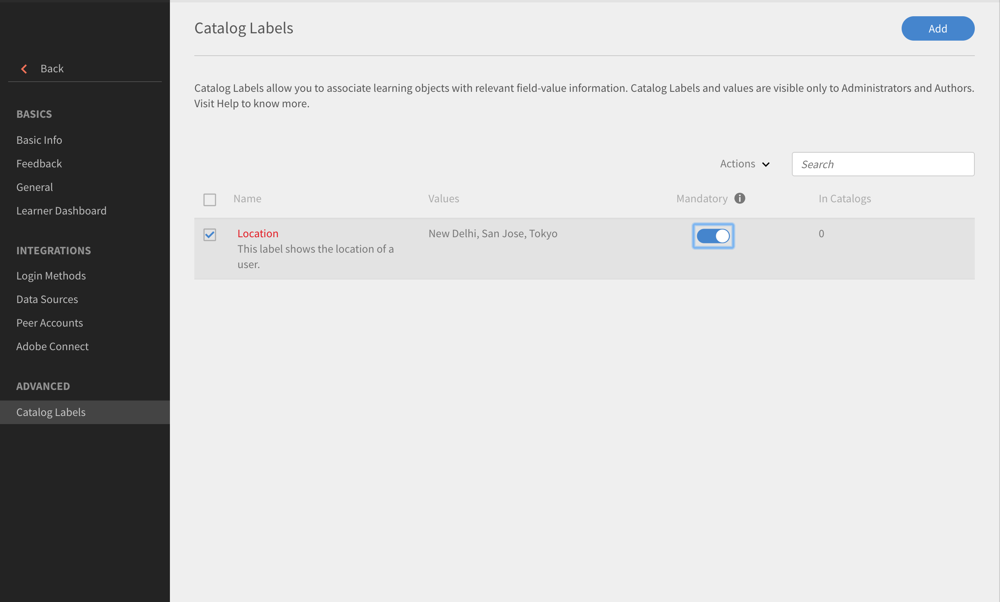

# カタログラベル

カタログラベルを使用すると、学習目標に特定のフィールドをタグ付けし、1 つまたは複数の値を適用できます。 これを有効にすると、管理者と作成者がカタログラベルとその値を設定して学習目標にリンクできるようになります。

この機能を使用すれば、データを簡単に分類できます。 例えば、場所、部署、スキルに基づいて学習目標を分類するとします。 これらのフィールドを適用してデータをフィルターできます。

カタログラベルを有効にするには、次の手順に従います。

* 管理者として、**[!UICONTROL 設定]** > **[!UICONTROL 全般]** > **[!UICONTROL カタログラベルの表示]**&#x200B;を開きます。
* チェックボックスを使用してラベルを有効にします。

## カタログラベルを追加する {#addcataloglabels}

カタログラベルを追加するには、次の手順に従います。

1. **[!UICONTROL 詳細]**&#x200B;オプションで、**[!UICONTROL 設定]** > **[!UICONTROL カタログラベル]**&#x200B;を開きます。 [!UICONTROL カタログラベル]ページが開きます。

   

1. 右上隅の&#x200B;**[!UICONTROL 「カタログラベルを追加」]**&#x200B;または&#x200B;**[!UICONTROL 「追加」]**&#x200B;をクリックします。 **[!UICONTROL カタログラベルを追加]**&#x200B;ダイアログボックスが表示されます。
1. フィールドにカタログラベルとその値を追加します。 1 つのカスタムフィールドに複数の値を設定できます。 作成者は、コース作成プロセスで、これらの値を選択することができます。

   

1. 「**[!UICONTROL 保存]**」をクリックします。
1. 保存したラベルは、カタログラベルページに表示されます。 これを必須の値にするかどうかを選択できます。

   

## カタログにラベルを適用する {#applylabelstocatalogs}

以下の手順により、作成したカタログラベルを特定のカタログに適用することができます。

1. 左側のペインで&#x200B;**[!UICONTROL 「カタログ」]**&#x200B;を開きます。 カタログページが開き、カタログのリストが表示されます。
1. ラベルの適用先となるカタログを選択します。
1. 左側のペインで「カタログラベル」を選択します。
1. ページ右上隅の「**[!UICONTROL 編集]**」をクリックします。 使用可能なカタログラベルが一覧表示されます。
1. **[!UICONTROL 「カタログに追加」]**&#x200B;をクリックして、ラベルをカタログに適用します。
1. カタログに適用されているラベルを削除する場合は、「**[!UICONTROL 削除]**」をクリックします。

カスタムフィールドがカタログに追加されると、カタログの一部であるすべての学習目標に適用されます。
