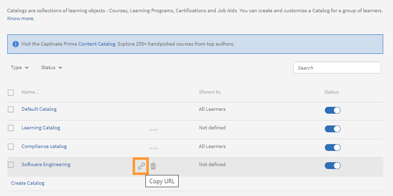
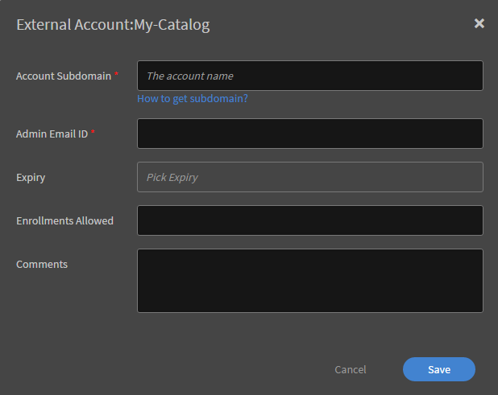

# カタログ

カタログには、コース、学習プログラム、資格認定など、学習のコレクションが含まれます。 学習者はカタログを使用して、カスタマイズされた学習オブジェクトのセットにアクセスすることができます。 新しいカタログを作成する際に、特定の学習オブジェクトをそのカタログに関連付けることができます。

管理者は、自分のアカウントまたは複数のアカウントで異なる学習者用にコースを選択して、カスタムのカタログを作成することができます。

## カタログ入門

このトレーニングでは、カタログを作成および管理する方法について学習します。

トレーニングを起動できない場合は、にメッセージを送信してください。 <almacademy@adobe.com>.

## カタログの作成 {#createacatalog}

カタログを作成するには、以下の手順を実行します。

1. 管理者として、左ペインで「カタログ」をクリックします。 このページにはデフォルトのカタログが表示されます。このカタログは、Learning Managerアカウントを作成すると自動的に作成されます。 デフォルトカタログ内のすべての学習オブジェクトが、すべての学習者間でデフォルトで共有されます。
1. ページの右上隅に表示されている「**[!UICONTROL 作成]**」をクリックします。または、カタログリストの下に表示されている「**[!UICONTROL カタログの作成]**」をクリックしてもかまいません。
1. 「**[!UICONTROL カタログの作成]**」ページで、作成するカタログの名前と説明を入力します。

   

   「次へ」をクリックします。****

   サムネールは没入型 UI でのみ表示でき、クラシックな UI では表示できません。

1. カタログページでは、以下に示す学習オブジェクトを新しいカタログに追加することができます。

   * [コース](catalogs.md#course)
   * [学習プログラム](catalogs.md#lp)
   * [資格認定](catalogs.md#cert)
   * [作業計画書](catalogs.md#job)

## コースをカタログに追加する {#course}

1. コースリストで、カタログに追加するコースを選択します。

   

   *カタログの作成*

   複数のコースをカタログに追加することができます。

1. 変更内容を保存します。 カタログリストに戻り、リスト内の新しいカタログをクリックします。
1. 新しいカタログのページが表示されたら、左側のペインで「**[!UICONTROL コンテンツ]**」をクリックします。

   

   *カタログに追加するコースを選択*

   追加したコースが「**[!UICONTROL コース]**」タブに表示されます。

## 学習プログラムをカタログに追加する {#lp}

1. 学習プログラムのリストで、カタログに追加する学習プログラムを選択します。
1. 変更内容を保存します。 カタログリストに戻り、リスト内の新しいカタログをクリックします。
1. 新しいカタログのページが表示されたら、左側のペインで「**[!UICONTROL コンテンツ]**」をクリックします。

   追加した学習プログラムが、に表示されます。 **[!UICONTROL 学習プログラム]** タブをクリックします。

## 資格認定をカタログに追加する {#cert}

1. 資格認定リストで、カタログに資格認定を選択します。
1. 変更内容を保存します。 カタログリストに戻り、リスト内の新しいカタログをクリックします。
1. 新しいカタログのページが表示されたら、左側のペインで「**[!UICONTROL コンテンツ]**」をクリックします。

   追加した資格認定が「 **[!UICONTROL 資格認定]** タブをクリックします。

## 作業計画書をカタログに追加する {#job}

1. 作業計画書リストで、カタログに追加する作業計画書を選択します。
1. 変更内容を保存します。 カタログリストに戻り、リスト内の新しいカタログをクリックします。
1. 新しいカタログのページが表示されたら、左側のペインで「**[!UICONTROL コンテンツ]**」をクリックします。

   追加した作業計画書が、 **[!UICONTROL 作業計画書]** タブをクリックします。

アカウント内でコンテンツが使用可能な状態になっている場合は、上記で説明した各タブにそのコンテンツが表示されます。 使用可能なコンテンツがない場合は、最初にコンテンツを作成する必要があります。 例えば、コースや学習プログラムがまだ Learning Manager アプリケーションに追加されていない場合は、最初にそれらを作成する必要があります。

## 学習者向けカタログへのディープリンク {#deep-link}

管理者は、学習者を特定のカタログページに誘導するためのディープリンクを生成できます。

を **[!UICONTROL カタログ]** ページを作成し、ディープリンクの対象となるカタログにマウスオーバーして、ハイライトされたアイコンをクリックします。

*学習者向けのディープリンクの生成*

## カタログを有効にする {#enablethecatalog}

カタログを作成して学習オブジェクトを追加したら、そのカタログを有効にする必要があります。これにより、学習者に対してカタログが表示されるようになります。

カタログを有効にするには、

1. カタログリストで、有効にするカタログの近くに表示されているオプションを切り替えます。 または、目的のカタログの近くに表示されているチェックボックスを選択し、右上隅の「**[!UICONTROL アクション]**」をクリックして「**[!UICONTROL 有効]**」を選択してもかまいません。

1. リスト内で複数のカタログを有効にすることもできます。 その場合は、目的のカタログを選択し、**[!UICONTROL アクション]**&#x200B;メニューの「**[!UICONTROL 有効]**」オプションを選択します。

## カタログを無効にする {#disablethecatalog}

カタログを無効にするには、目的のカタログの近くに表示されているオプションを切り替えます。

または、カタログの近くにあるチェックボックスを選択し、右上隅の「アクション」をクリックしてをクリックすることもできます。 **[!UICONTROL 無効]**.

リスト内で複数のカタログを無効にすることもできます。 カタログを選択し、アクションメニューからオプションを選択します **[!UICONTROL 無効]**.

## カタログを削除する {#deletethecatalog}

カタログを削除するには、リスト内で目的のカタログを選択します。 カタログの近くにある「削除」ボタンをクリックするか、をクリックします。 **[!UICONTROL アクション]** > **[!UICONTROL 削除]**.

複数のカタログを削除することもできます。

## カタログを共有する {#shared}

管理者は、社内ユーザーとカタログを共有することも、社外ユーザーとカタログを共有することもできます。ただし、排他的な共有になります。つまり、社内で共有されているカタログを社外グループと共有したり、社外で共有されているカタログを社内グループと共有したりすることはできません。

カタログを共有すると、そのカタログ内のコース、学習プログラム、作業計画書、資格認定を学習オブジェクトとして使用できるようになります。

### カタログの共有

このトレーニングでは、社内ユーザーグループや社外AdobeのLearning Managerアカウントとカタログを共有する方法について説明します。

トレーニングを起動できない場合は、にメッセージを送信してください。 <almacademy@adobe.com>.

## 社内でカタログを共有する {#int}

社内でカタログを共有するには、目的のカタログを選択します。

左側のペインで「**[!UICONTROL 社内で共有]**」をクリックします。

グループが存在しない場合は、社内ユーザーのグループを追加する必要があります。

社内ユーザーグループを追加するには、「**[!UICONTROL ユーザーグループを追加]**」をクリックします。

*カタログを社内で共有する*

共有ユーザーグループの有効と無効を切り替えるオプションはありません。 共有ユーザーグループを無効にするには、そのユーザーグループを削除する必要があります。 ユーザーグループを削除するには、「...」にマウスポインタを置いて削除アイコンをクリックします。 または、ページ右上隅の「アクション」ドロップダウンをクリックして「削除」を選択します。

## 社外でカタログを共有する {#ext}

カタログページで、共有するカタログをクリックします。 左側のペインで「**[!UICONTROL 社外で共有]**」をクリックします。

*カタログを外部で共有*

Learning Manager アカウントに関連付けられているサブドメインを入力します。「**[!UICONTROL サブドメインの取得方法]** サブドメインの使用方法について説明します。 をクリックすることもできます。 **[!UICONTROL ブランディング]** 管理者ホームページの左ペインで、組織アカウントに関連付けられているサブドメインを表示します。

**登録制限**

「**許可されている登録数**」フィールドに数値を入力することにより、共有カタログ内の 1 コースあたりの登録数を制限することができます。 共有カタログの受信者は、登録数が制限されているコースを学習プランで使用することはできません。

**有効期限**

で有効期限を設定することにより、共有カタログの有効性を設定できます **[!UICONTROL 有効期限]** フィールドに入力します。 共有カタログが期限切れになると、コースに登録できなくなります。 ただし、そのコースに既に登録している学習者は、期限切れになっても、コースのコンテンツにアクセスすることができます。 また、共有カタログが期限切れになると、そのカタログ内の学習オブジェクトが無効になりますが、バッジとスキルは有効なままです。 この状態では、共有カタログ受信者は、廃止された学習目標を廃止できません。

必要な情報をすべて入力したら、「**[!UICONTROL 保存]**」をクリックします。 クリック **[!UICONTROL アクション]** ページの右上隅にあるドロップダウンをクリックし、 **[!UICONTROL 共有]** をクリックして、外部アカウントとカタログを共有します。

共有アカウントの保有者が所有しているカタログは、社外アカウントでのみ共有することができます。 その他のアカウントで既に共有されているカタログをさらに共有することはできません。

社外で共有されているアカウントの管理者は、アプリケーション内で通知を受信し、その他に電子メールを受信します。 管理者は、受信した電子メールに記載されている URL をクリックするか、アプリケーション内で通知メッセージをクリックして、共有カタログのリクエストを承認する必要があります。 管理者は、アプリケーション内で「承認」を選択することも、「拒否」を選択することもできます。 管理者は、共有カタログを承認する前に、カタログの共有ユーザー、共有日、有効期限など、カタログの詳細情報を確認することができます。

共有カタログは、管理者のアカウントに表示されます。 共有カタログに関連付けられている学習オブジェクトは、アプリケーションの管理者役割と作成者役割に表示されます。 自分が受信した共有カタログには、矢印アイコン「&lt;--」が表示されます。

登録可能状態の学習オブジェクトの追加先は、必ず共有カタログになります。

**カタログの共有を解除する**

カタログの共有を解除すると、アプリケーション内で社外アカウントが無効になります。 カタログの共有を解除するには、 **[!UICONTROL アクション]** をクリックします。 **[!UICONTROL 共有解除]**. カタログの共有は、いつでも解除することができます。 カタログの共有を解除すると、そのカタログ内のすべての学習オブジェクトが無効になります。 無効になっているカタログは、受信者のアプリケーションで廃止されたとおりに表示されます。

カタログの受信者がリクエストを承認しない限り、共有リストから社外アカウントを削除することはできません。

**カタログを削除する**

共有カタログを削除するには、 **[!UICONTROL アクション]** ドロップダウンを表示し、 **[!UICONTROL 削除]**.

* デフォルトのカタログを社外アカウントと共有することはできません。
* 自分が社外で共有していたカタログを削除することはできません。
* 自分が別のアカウントで共有していたカタログを削除することはできません。

## 共有カタログのフルコントロールの有効化 {#enablefullcontrolofsharedcatalog}

カタログへのフルアクセス権は社外アカウントに付与できます。その後、アカウントの管理者はカタログを承諾し、学習コンテンツやモジュールを適宜追加、削除できます。

詳細については、「[共有カタログのフルコントロールの有効化](shared-catalog-full-control.md)」を参照してください。

## 共有カタログ学習目標のプロパティ {#sharedcataloglearningobjectsproperties}

所有者アプリケーションで学習目標に対して実行された変更は、共有カタログ受信機に転送されます。 受信アプリケーションに反映される学習目標プロパティのリストを次に示します。

<table>
 <tbody>
  <tr>
   <td>
    
<strong>コース</strong>
</td>
   <td>
    
ゲーミフィケーションポイント、バッジIDを除く、コースオブジェクトの名前、説明およびその他のフィールド
</td>
  </tr>
  <tr>
   <td>
    
<strong>学習プログラム</strong>
</td>
   <td>
    
バッジID、廃止を除く、LPオブジェクトの名前、説明、およびその他のフィールド
</td>
  </tr>
  <tr>
   <td>
    
<strong>資格認定</strong>
</td>
   <td>
    
badgeIdを除く、認証オブジェクトのすべてのプロパティ、認証の廃止
</td>
  </tr>
  <tr>
   <td>
    
<strong>バッジ</strong>
</td>
   <td>
    
バッジの名前と廃止
</td>
  </tr>
  <tr>
   <td>
    
<strong>カテゴリ </strong>
</td>
   <td>
    
カテゴリの名前、説明、色、廃止、新しいレベルの追加
</td>
  </tr>
  <tr>
   <td>
    
<strong>作業計画書</strong>
</td>
   <td>
    
JobAidオブジェクトのすべてのプロパティ
</td>
  </tr>
  <tr>
   <td>
    
<strong>モジュール</strong>
</td>
   <td>
    
モジュールオブジェクトのすべてのプロパティ
</td>
  </tr>
 </tbody>
</table>

## 受信者アプリケーションの共有カタログ機能 {#sharedcatalogfeaturesinreceiverapplication}

* 共有カタログ内の学習オブジェクトは、作成者アプリケーションと管理者アプリケーションに表示されますが、モジュールは表示されません。 モジュールは非表示になります。
* 共有学習オブジェクトは、カタログ受信者のアカウントのすべてのワークフローで使用することができます。 例えば、学習プログラム、資格認定、カタログに共有コースを追加することができます。ただし、これらの学習プログラム、資格認定、カタログには、別のアカウントの共有学習オブジェクトが既に含まれているため、もう一度共有することはできません。
* コース、学習プログラム、資格認定に関連付けられているすべての作業計画書のうち、カタログに含まれていない作業計画書は、カタログ受信者のアカウントにコピーされます。
* 共有カタログの受信者は、受信した共有カタログに学習オブジェクトを追加することはできません。
* 共有カタログの受信者は、共有学習オブジェクトのモジュールを変更することはできません。
* 共有カタログの受信者は、共有学習プログラムや共有資格認定にコースを追加することはできません。
* 共有学習オブジェクトの複製や再共有を行うことはできません。
* 共有カタログに新しく追加されたアセットは、そのカタログの受信者に対して自動的に表示されます。
* 学習オブジェクトに関連付けられているスキルは、共有カタログ受信者のアカウントにコピーされます。

* 共有カタログの受信者アカウントに同じスキル名が既に割り当てられている場合は、次を追加して新しいスキルが作成されます &#42; 名前の後
* コースと学習プログラムのデフォルトインスタンス内のデータ（バッジ、L1、L3、通知など）も、コースと学習プログラムとともに、カタログ受信者のアカウントにコピーされます。

繰り返しの資格認定を、社外で共有されているカタログに含めることはできません。 共有カタログ内の学習オブジェクトに登録数の制限や有効期限が設定されている場合、その共有カタログの受信者は、繰り返しの資格認定でそれらの学習オブジェクトを使用することはできません。

## 共有カタログの伝播機能 {#propagation}

組織内のアカウント管理者は、複数のアカウント間でカタログを共有することができます。 共有カタログの受信者は、その共有カタログに割り当てられている学習オブジェクトを取得することができます。 2016 年 11 月にリリースされた Learning Manager では、この機能に加えて、カタログ経由で共有されている学習オブジェクトのプロパティを取得する機能も使用できるようになりました。

カタログの共有後に、アカウントの管理者が学習オブジェクトを変更すると、共有カタログの受信者が取得したすべての学習オブジェクトに対して、その変更内容が伝播されます。

この伝達機能の一部としてサポートされている学習目標は次のとおりです。

* スキル
* コース
* 学習プログラム
* 資格認定
* 作業計画書
* コースと学習プログラムのデフォルトインスタンス

共有カタログの受信者が、Learning Manager アプリケーションで受信した学習オブジェクトフィールドを変更した場合、それらのフィールドの変更内容が学習オブジェクトに対してさらに伝播されることはありません。例えば、カタログ受信者が「コース名」フィールドや「短い説明」フィールドなどのコースフィールドを編集した場合、これらのフィールドの所有者が変わっても、伝播処理は実行されません。 つまり、こうした方法で編集された学習オブジェクトフィールドは、カタログ受信者の Learning Manager アカウントに対してローカルなフィールドになるということです。

## よくある質問 {#frequentlyaskedquestions}

+++コース、学習プログラム、資格認定をカタログに追加するにはどうすればよいですか？

コース、学習プログラム、資格認定をカタログに追加する方法については、[この手順](catalogs.md#q1)を参照してください。

+++

+++カタログを社内で共有する方法を教えてください。

カタログを社内で共有する方法と社外で共有する方法については、以下の手順を参照してください。

* [社内で共有する場合の手順](catalogs.md#int)
* [社外で共有する場合の手順](catalogs.md#ext)

+++

+++学習者が含まれているすべてのカタログを学習者が表示できるようにするには、どうすればよいですか？

ユーザーグループを使用すると、組織内の学習者間でカタログを共有することができます。 特定の学習者について、その学習者が含まれているすべてのカタログを表示できるようにするには、以下の手順を実行します。

1. カタログを開いて「**[!UICONTROL 社内で共有]**」をクリックします。
1. ページ右上隅の「**[!UICONTROL 追加]**」をクリックします。
1. **[!UICONTROL ユーザーグループ]**&#x200B;ダイアログで、カタログに学習者を追加します。
1. 「**[!UICONTROL 保存]**」をクリックします。

学習者が Learning Manager にログインすると、その学習者が共有していたカタログが表示されます。

+++

+++カタログラベルの作成方法と使用方法

カタログラベルを使用すると、関連するフィールド値情報に学習オブジェクトを関連付けることができます。 カタログラベルとその値は、管理者と作成者のみに表示されます。 詳細については、「[***カタログラベル***](/help/migrated/administrators/feature-summary/catalog-labels.md)」を参照してください。

以下の手順により、作成したカタログラベルを特定のカタログに適用することができます。

1. 左ペインで「カタログ」を開きます。
1. ラベルの適用先となるカタログを選択します。
1. 左側のペインで「カタログラベル」を選択します。
1. クリック **[!UICONTROL 編集]** をクリックします。 使用可能なカタログラベルが一覧表示されます。
1. **[!UICONTROL 「カタログに追加」]**&#x200B;をクリックして、ラベルをカタログに適用します。
1. カタログに追加された既存のラベルを削除するには、 **[!UICONTROL 削除]**.

+++

+++新しく作成した外部ユーザーに特定のカタログへのアクセスを提供するにはどうすればよいですか？

1. 管理者は、外部ユーザープロファイルへのアクセスを提供するカタログを選択します。
1. 内部で共有／その他を追加／各外部ユーザープロファイルを選択
1. カタログを有効にするために切り替えます。

+++

+++ユーザーに特定のカタログのみ表示を制限するにはどうすればよいですか？

デフォルトのカタログを無効にし、外部ユーザーに対するアクセス権を付与し作成されたカタログのみを有効にします。

+++
