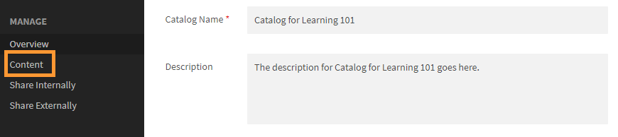
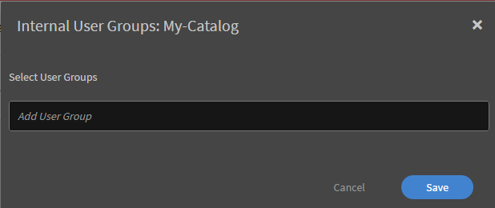
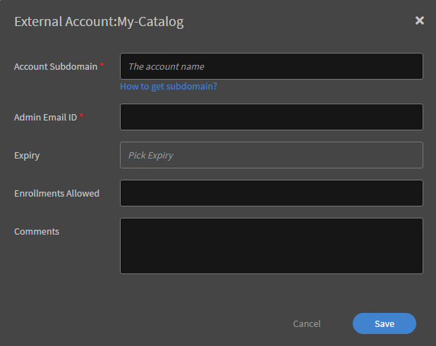

# カタログ

カタログには、コース、学習プログラム、資格認定など、学習のコレクションが含まれます。 学習者はカタログを使用して、カスタマイズされた学習オブジェクトのセットにアクセスすることができます。 新しいカタログを作成する際に、特定の学習オブジェクトをそのカタログに関連付けることができます。

管理者は、自分のアカウントまたは複数のアカウントで異なる学習者用にコースを選択して、カスタムのカタログを作成することができます。

## カタログ入門

このトレーニングでは、カタログを作成および管理する方法について学習します。

トレーニングを起動できない場合は、<almacademy@adobe.com>に書き込んでください。

## カタログの作成 {#createacatalog}

カタログを作成するには、以下の手順を実行します。

1. 管理者としてログインし、左側のペインで「カタログ」をクリックします。 カタログページに、デフォルトのカタログが表示されます。Learning Manager アカウントを作成すると、デフォルトのカタログが自動的に作成されます。 デフォルトカタログ内のすべての学習オブジェクトが、すべての学習者間でデフォルトで共有されます。
1. ページの右上隅に表示されている「**[!UICONTROL 作成]**」をクリックします。 または、カタログリストの下に表示されている「**[!UICONTROL カタログの作成]**」をクリックしてもかまいません。
1. 「**[!UICONTROL カタログの作成]**」ページで、作成するカタログの名前と説明を入力します。

   

   「次へ」をクリックします。****

   サムネールは没入型 UI でのみ表示でき、クラシックな UI では表示できません。

1. カタログページでは、以下に示す学習オブジェクトを新しいカタログに追加することができます。

   * [コース](catalogs.md#course)
   * [学習プログラム](catalogs.md#lp)
   * [資格認定](catalogs.md#cert)
   * [作業計画書](catalogs.md#job)

## コースをカタログに追加する {#course}

1. コースリストで、カタログに追加するコースを選択します。

   

   *カタログの作成*

   複数のコースをカタログに追加することができます。
1. コースをスキル、役割、言語別に絞り込むことができます。 選択したコースは、スキルや役割に興味のある学習者に推奨されます。

   * **[!UICONTROL スキル]**:スキルフィルターを使用すると、特定のスキルに焦点を当てたコースを検索できます。
   * **[!UICONTROL 役割]**：役割フィルターを使用すると、ユーザーは別の役割の責任と要件に合わせて調整されたコースにアクセスできます。
   * **[!UICONTROL 言語]** ：言語フィルターは、ユーザーが希望する言語または必要な言語で利用可能なコースを選択するのに役立ちます

1. 変更内容を保存します。 カタログリストに戻り、リスト内の新しいカタログをクリックします。
1. 新しいカタログのページが表示されたら、左側のペインで「**[!UICONTROL コンテンツ]**」をクリックします。

   

   *カタログに追加するコースを選択してください*

   追加したコースが「**[!UICONTROL コース]**」タブに表示されます。

## 学習プログラムをカタログに追加する {#lp}

1. 学習プログラムのリストで、カタログに追加する学習プログラムを選択します。
1. 変更内容を保存します。 カタログリストに戻り、リスト内の新しいカタログをクリックします。
1. 新しいカタログのページが表示されたら、左側のペインで「**[!UICONTROL コンテンツ]**」をクリックします。

   追加した学習プログラムが「**[!UICONTROL 学習プログラム]**」タブに表示されます。

## 資格認定をカタログに追加する {#cert}

1. 資格認定リストで、カタログに資格認定を選択します。
1. 変更内容を保存します。 カタログリストに戻り、リスト内の新しいカタログをクリックします。
1. 新しいカタログのページが表示されたら、左側のペインで「**[!UICONTROL コンテンツ]**」をクリックします。

   追加した資格認定が[**[!UICONTROL 資格認定]**]タブに表示されます。

## 作業計画書をカタログに追加する {#job}

1. 作業計画書リストで、カタログに追加する作業計画書を選択します。
1. 変更内容を保存します。 カタログリストに戻り、リスト内の新しいカタログをクリックします。
1. 新しいカタログのページが表示されたら、左側のペインで「**[!UICONTROL コンテンツ]**」をクリックします。

   追加した作業計画書が[**[!UICONTROL 作業計画書]**]タブに表示されます。

アカウント内でコンテンツが使用可能な状態になっている場合は、上記で説明した各タブにそのコンテンツが表示されます。 使用可能なコンテンツがない場合は、最初にコンテンツを作成する必要があります。 例えば、コースや学習プログラムがまだ Learning Manager アプリケーションに追加されていない場合は、最初にそれらを作成する必要があります。

## コース、学習パス、作業計画書の一括削除

管理者またはカスタム管理者は、コース、学習パス、作業計画書を一括で削除できます。 **[!UICONTROL カタログ]**&#x200B;に移動し、カタログを選択します。 **[!UICONTROL コンテンツ]**&#x200B;ページで、**[!UICONTROL コンテンツの編集]**&#x200B;を選択します。 次に、コース、学習パス、作業計画書の横にある「**[!UICONTROL 削除]**」オプションを選択し、「**[!UICONTROL 保存]**」を選択します。

## 学習者向けカタログへのディープリンク {#deep-link}

管理者は、学習者を特定のカタログページに誘導するためのディープリンクを生成できます。

**[!UICONTROL カタログ]**&#x200B;ページで、ディープリンクの対象となるカタログにマウスのポインターを合わせ、ハイライトされたアイコンをクリックします。

*学習者へのディープリンクを生成する*

## カタログを有効にする {#enablethecatalog}

カタログを作成して学習オブジェクトを追加したら、そのカタログを有効にする必要があります。これにより、学習者に対してカタログが表示されるようになります。

カタログを有効にするには、以下の手順を実行します。

1. カタログリストで、有効にするカタログの近くに表示されているオプションを切り替えます。 または、目的のカタログの近くに表示されているチェックボックスを選択し、右上隅の「**[!UICONTROL アクション]**」をクリックして「**[!UICONTROL 有効]**」を選択してもかまいません。

1. リスト内で複数のカタログを有効にすることもできます。 その場合は、目的のカタログを選択し、**[!UICONTROL アクション]**&#x200B;メニューの「**[!UICONTROL 有効]**」オプションを選択します。

## カタログを無効にする {#disablethecatalog}

カタログを無効にするには、目的のカタログの近くに表示されているオプションを切り替えます。

または、目的のカタログの近くに表示されているチェックボックスを選択し、右上隅の「アクション」をクリックして「**[!UICONTROL 無効]**」を選択してもかまいません。

リスト内で複数のカタログを無効にすることもできます。 その場合は、目的のカタログを選択し、アクションメニューの「**[!UICONTROL 無効]**」オプションを選択します。

## カタログを削除する {#deletethecatalog}

カタログを削除するには、リスト内で目的のカタログを選択します。 カタログの近くにある[削除]ボタンをクリックするか、**[!UICONTROL アクション]** > **[!UICONTROL 削除]**&#x200B;をクリックします。

複数のカタログを削除することもできます。

## カタログを共有する {#shared}

管理者は、社内ユーザーとカタログを共有することも、社外ユーザーとカタログを共有することもできます。 ただし、排他的な共有になります。 つまり、社内で共有されているカタログを社外グループと共有したり、社外で共有されているカタログを社内グループと共有したりすることはできません。

カタログを共有すると、そのカタログ内のコース、学習プログラム、作業計画書、資格認定を学習オブジェクトとして使用できるようになります。

### カタログの共有

このトレーニングでは、社内ユーザーグループや社外のAdobe Learning Managerアカウントとカタログを共有する方法について説明します。

トレーニングを起動できない場合は、<almacademy@adobe.com>に書き込んでください。

## 社内でカタログを共有する {#int}

社内でカタログを共有するには、目的のカタログを選択します。

左側のペインで「**[!UICONTROL 社内で共有]**」をクリックします。

グループが存在しない場合は、社内ユーザーのグループを追加する必要があります。

社内ユーザーグループを追加するには、「**[!UICONTROL ユーザーグループを追加]**」をクリックします。

*カタログを内部で共有する*

共有ユーザーグループの有効と無効を切り替えるオプションはありません。 共有ユーザーグループを無効にするには、そのユーザーグループを削除する必要があります。 ユーザーグループを削除するには、「...」にマウスポインタを置いて削除アイコンをクリックします。 または、ページ右上隅の「アクション」ドロップダウンをクリックして「削除」を選択します。

## 社外でカタログを共有する {#ext}

カタログページで、共有するカタログをクリックします。 左側のペインで「**[!UICONTROL 社外で共有]**」をクリックします。

*カタログを外部で共有する*

Learning Manager アカウントに関連付けられているサブドメインを入力します。 [**[!UICONTROL サブドメインを取得する方法]**]をクリックします サブドメインの使用方法について説明します。 「管理者」ホームページの左側のペインで「**[!UICONTROL ブランディング]**」をクリックして、組織アカウントに関連付けられているサブドメインを表示することもできます。

**登録制限**

「**許可されている登録数**」フィールドに数値を入力することにより、共有カタログ内の 1 コースあたりの登録数を制限することができます。 共有カタログの受信者は、登録数が制限されているコースを学習プランで使用することはできません。

**有効期限**

**[!UICONTROL 有効期限]**&#x200B;フィールドに有効期限を設定することで、共有カタログの有効性を設定できます。 共有カタログが期限切れになると、コースに登録できなくなります。 ただし、そのコースに既に登録している学習者は、期限切れになっても、コースのコンテンツにアクセスすることができます。 また、共有カタログが期限切れになると、そのカタログ内の学習オブジェクトが無効になりますが、バッジとスキルは有効なままです。 この状態の場合、共有カタログの受信者は、無効になった学習オブジェクトをもう一度有効にすることはできません。

必要な情報をすべて入力したら、「**[!UICONTROL 保存]**」をクリックします。 次に、ページ右上隅の「**[!UICONTROL アクション]**」ドロップダウンをクリックして「**[!UICONTROL 共有]**」を選択します。この操作により、カタログが社外アカウントで共有されます。

共有アカウントの保有者が所有しているカタログは、社外アカウントでのみ共有することができます。 その他のアカウントで既に共有されているカタログをさらに共有することはできません。

社外で共有されているアカウントの管理者は、アプリケーション内で通知を受信し、その他に電子メールを受信します。 管理者は、受信した電子メールに記載されている URL をクリックするか、アプリケーション内で通知メッセージをクリックして、共有カタログのリクエストを承認する必要があります。 管理者は、アプリケーション内で「承認」を選択することも、「拒否」を選択することもできます。 管理者は、共有カタログを承認する前に、カタログの共有ユーザー、共有日、有効期限など、カタログの詳細情報を確認することができます。

共有カタログは、管理者のアカウントに表示されます。 共有カタログに関連付けられている学習オブジェクトは、アプリケーションの管理者役割と作成者役割に表示されます。 自分が受信した共有カタログには、矢印アイコン「&lt;--」が表示されます。

登録可能状態の学習オブジェクトの追加先は、必ず共有カタログになります。

**カタログの共有を解除する**

カタログの共有を解除すると、アプリケーション内で社外アカウントが無効になります。 カタログの共有を解除するには、ページの右上隅にある&#x200B;**[!UICONTROL アクション]**&#x200B;をクリックし、**[!UICONTROL 共有解除]**&#x200B;をクリックします。 カタログの共有は、いつでも解除することができます。 カタログの共有を解除すると、そのカタログ内のすべての学習オブジェクトが無効になります。 共有が解除されたカタログは、そのカタログの受信者のアプリケーション内で無効なカタログとして表示されます。

カタログの受信者がリクエストを承認しない限り、共有リストから社外アカウントを削除することはできません。

**カタログを削除する**

共有カタログを削除するには、「**[!UICONTROL アクション]**」ドロップダウンをクリックして「**[!UICONTROL 削除]**」を選択します。

* デフォルトのカタログを社外アカウントと共有することはできません。
* 自分が社外で共有していたカタログを削除することはできません。
* 自分が別のアカウントで共有していたカタログを削除することはできません。

## 共有カタログのフルコントロールの有効化 {#enablefullcontrolofsharedcatalog}

カタログへのフルアクセス権は社外アカウントに付与できます。 その後、アカウントの管理者はカタログを承諾し、学習コンテンツやモジュールを適宜追加、削除できます。

詳細については、「[共有カタログのフルコントロールの有効化](shared-catalog-full-control.md)」を参照してください。

## 共有カタログ学習目標のプロパティ {#sharedcataloglearningobjectsproperties}

所有者アプリケーションで学習目標に対して実行された変更は、共有カタログ受信機に転送されます。 受信アプリケーションに反映される学習目標プロパティのリストを次に示します。

<table>
 <tbody>
  <tr>
   <td>
    
<strong>コース</strong>
</td>
   <td>
    
ゲーミフィケーションポイント、バッジIDを除く、コースオブジェクトの名前、説明およびその他のフィールド
</td>
  </tr>
  <tr>
   <td>
    
<strong>学習プログラム</strong>
</td>
   <td>
    
バッジID、廃止を除く、LPオブジェクトの名前、説明、およびその他のフィールド
</td>
  </tr>
  <tr>
   <td>
    
<strong>資格認定</strong>
</td>
   <td>
    
badgeIdを除く、認証オブジェクトのすべてのプロパティ、認証の廃止
</td>
  </tr>
  <tr>
   <td>
    
<strong>バッジ</strong>
</td>
   <td>
    
バッジの名前と廃止
</td>
  </tr>
  <tr>
   <td>
    
<strong>カテゴリ </strong>
</td>
   <td>
    
カテゴリの名前、説明、色、廃止、新しいレベルの追加
</td>
  </tr>
  <tr>
   <td>
    
<strong>作業計画書</strong>
</td>
   <td>
    
JobAidオブジェクトのすべてのプロパティ
</td>
  </tr>
  <tr>
   <td>
    
<strong>モジュール</strong>
</td>
   <td>
    
モジュールオブジェクトのすべてのプロパティ
</td>
  </tr>
 </tbody>
</table>

## 受信者アプリケーションの共有カタログ機能 {#sharedcatalogfeaturesinreceiverapplication}

* 共有カタログの学習目標は作成者アプリケーションと管理者アプリケーションに表示されますが、非表示のためモジュールは表示されません。
* 共有学習目標は、受信者のアカウントのすべてのワークフローで使用できます。 例えば、資格認定（永続ライセンス版と定期的なライセンス版の両方）、学習パス、カタログなどの学習目標に共有コースを追加した場合、これらの学習目標は再度共有できません（別のアカウントから既に共有学習目標を持っているため）。
* コース、学習プログラム、資格認定に関連付けられているすべての作業計画書のうち、カタログに含まれていない作業計画書は、カタログ受信者のアカウントにコピーされます。
* 共有カタログの受信者は、受信した共有カタログに学習オブジェクトを追加することはできません。
* 共有カタログの受信者は、共有学習オブジェクトのモジュールを変更することはできません。
* 共有カタログの受信者は、共有学習プログラムや共有資格認定にコースを追加することはできません。
* 共有学習オブジェクトの複製や再共有を行うことはできません。
* 共有カタログに新しく追加されたアセットは、そのカタログの受信者に対して自動的に表示されます。
* 学習オブジェクトに関連付けられているスキルは、共有カタログ受信者のアカウントにコピーされます。

* 共有カタログ受信者アカウントに同じスキル名が既に設定されている場合は、名前の後に&#42;を追加して新しいスキルが作成されます。
* コースと学習プログラムのデフォルトインスタンス内のデータ（バッジ、L1、L3、通知など）も、コースと学習プログラムとともに、カタログ受信者のアカウントにコピーされます。

繰り返しの資格認定を、社外で共有されているカタログに含めることはできません。 共有カタログ内の学習オブジェクトに登録数の制限や有効期限が設定されている場合、その共有カタログの受信者は、繰り返しの資格認定でそれらの学習オブジェクトを使用することはできません。

## 共有カタログの伝播機能 {#propagation}

組織内のアカウント管理者は、複数のアカウント間でカタログを共有することができます。 共有カタログの受信者は、その共有カタログに割り当てられている学習オブジェクトを取得することができます。 2016 年 11 月にリリースされた Learning Manager では、この機能に加えて、カタログ経由で共有されている学習オブジェクトのプロパティを取得する機能も使用できるようになりました。

カタログの共有後に、アカウントの管理者が学習オブジェクトを変更すると、共有カタログの受信者が取得したすべての学習オブジェクトに対して、その変更内容が伝播されます。

この伝播機能の対象となる学習オブジェクトは以下のとおりです。

* スキル
* コース
* 学習プログラム
* 資格認定
* 作業計画書
* コースと学習プログラムのデフォルトインスタンス

共有カタログの受信者が、Learning Manager アプリケーションで受信した学習オブジェクトフィールドを変更した場合、それらのフィールドの変更内容が学習オブジェクトに対してさらに伝播されることはありません。 例えば、カタログ受信者が「コース名」フィールドや「短い説明」フィールドなどのコースフィールドを編集した場合、これらのフィールドの所有者が変わっても、伝播処理は実行されません。 つまり、こうした方法で編集された学習オブジェクトフィールドは、カタログ受信者の Learning Manager アカウントに対してローカルなフィールドになるということです。

## よくある質問 {#frequentlyaskedquestions}

+++コース、学習プログラム、資格認定をカタログに追加する方法について教えてください。

コース、学習プログラム、資格認定をカタログに追加する方法については、[この手順](catalogs.md#q1)を参照してください。

+++

+++カタログを社内で共有する方法と社外で共有する方法について教えてください。

カタログを社内で共有する方法と社外で共有する方法については、以下の手順を参照してください。

* [社内で共有する場合の手順](catalogs.md#int)
* [社外で共有する場合の手順](catalogs.md#ext)

+++

+++特定の学習者について、その学習者が含まれているすべてのカタログを表示できるようにするにはどうすればよいですか？

ユーザーグループを使用すると、組織内の学習者間でカタログを共有することができます。 特定の学習者について、その学習者が含まれているすべてのカタログを表示できるようにするには、以下の手順を実行します。

1. カタログを開いて「**[!UICONTROL 社内で共有]**」をクリックします。
1. ページ右上隅の「**[!UICONTROL 追加]**」をクリックします。
1. **[!UICONTROL ユーザーグループ]**&#x200B;ダイアログで、カタログに学習者を追加します。
1. 「**[!UICONTROL 保存]**」をクリックします。

学習者が Learning Manager にログインすると、その学習者が共有していたカタログが表示されます。

+++

+++カタログラベルの作成方法と使用方法について教えてください。

カタログラベルを使用すると、関連するフィールド値情報に学習オブジェクトを関連付けることができます。 カタログラベルとその値は、管理者と作成者のみに表示されます。 詳細については、「[***カタログラベル***](/help/migrated/administrators/feature-summary/catalog-labels.md)」を参照してください。

以下の手順により、作成したカタログラベルを特定のカタログに適用することができます。

1. 左側のペインで「カタログ」を選択します。
1. ラベルの適用先となるカタログを選択します。
1. 左側のペインで「カタログラベル」を選択します。
1. ページ右上隅の「**[!UICONTROL 編集]**」をクリックします。 使用可能なカタログラベルが一覧表示されます。
1. **[!UICONTROL 「カタログに追加」]**&#x200B;をクリックして、ラベルをカタログに適用します。
1. カタログに適用されているラベルを削除する場合は、「**[!UICONTROL 削除]**」をクリックします。

+++

+++新しく作成した外部ユーザーに特定のカタログへのアクセスを提供する方法を教えてください。

1. 管理者は、外部ユーザープロファイルへのアクセスを提供するカタログを選択します。
1. 内部で共有／その他を追加／各外部ユーザープロファイルを選択
1. カタログを有効にするために切り替えます。

+++

+++特定のカタログのみユーザーに表示されるよう制限する方法を教えてください。 

デフォルトのカタログを無効にし、外部ユーザーに対するアクセス権を付与し作成されたカタログのみを有効にします。

+++
