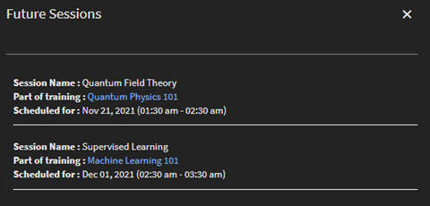

# 教室

## 概要

管理者は教室の場所のライブラリを設定することができます。 場所の名前や座席の上限のほかに、場所の URL などの情報を含むメタデータを、各教室の場所に対して設定することが可能です。 作成者と管理者は事前設定されたこれらの教室の場所を用いて、インストラクターによるトレーニングイベント（教室モジュール）を設定できます。

以下の 2 つの方法に沿って教室の場所を追加します。

## UI を用いた教室の追加

UIを使用して教室の場所を追加することができます。

1. 管理者アプリ（管理者の役割のUI）で、 **[!UICONTROL 設定]** > **[!UICONTROL 教室の場所]**.

1. クリック **[!UICONTROL 追加]** > **[!UICONTROL 新しい場所]**.

1. **[!UICONTROL 「教室の場所」]** ダイアログボックスで、以下の情報を入力します。

   * 「 **[!UICONTROL 場所名]**. 一意の名前を使用してください。 それ以外の場合は、Learning Manager でエラーメッセージが表示されます。
   * 場所の説明を&#x200B;**[!UICONTROL 「場所の情報」]**&#x200B;フィールドに入力します。 ただしこれは任意のフィールドです。
   * **[!UICONTROL 「場所の URL」]**&#x200B;を入力します。 学習者はこの情報を教室の詳細で確認することができます。 必要に応じて URL をマップの場所の URL に設定することもできます。 ただしこれは任意のフィールドです。
   * を入力し、 **[!UICONTROL 位置領域]**. このフィールドはオプションです。
   * **[!UICONTROL 「座席の上限」]**&#x200B;フィールドに使用可能な席数を入力します。 これにより教室の座席数が示されます。 この値はインストラクターによる実際のトレーニングイベントを作成する際に変更することができます。

   

   *教室の場所を追加*

場所を追加した後、 **[!UICONTROL 設定]** > **[!UICONTROL 教室の場所]** このページには、会議室の一覧が表示されます。

*すべての会議室を表示*

リストには以下のフィールドが表示されます。

**[!UICONTROL 場所名]**  – 教室の場所名

**[!UICONTROL 今後のセッション]**  – 対応する場所で発生するイベントの数 番号をクリックすると、ダイアログボックスに詳細が表示されます。

*今後のセッションを表示*

このダイアログボックスには、セッション名、セッションを含むトレーニング名、セッションスケジュールなど、各セッションの詳細が表示されます。 表示される時間は、学習者のシステムタイムゾーンに応じて調整されます。

この **[!UICONTROL 今後のセッション]** フィールドの表示 **ゼロ** 教室がどのセッションにも使用されていない場合、または教室が過去のセッションに関連付けられている場合。

**[!UICONTROL 人数制限]**  – 教室の座席数が表示されます。

**場所のURL**  – 教室の場所の作成時に入力したURL

**場所情報**  – 教室の作成時に入力した教室情報

### 教室の場所を編集

教室の場所を編集するには、次の手順に従います。

1. 管理者アプリ（管理者の役割のUI）で、 **[!UICONTROL 設定]** > **[!UICONTROL 教室の場所]**.

1. 編集したい教室の場所にカーソルを合わせます。

1. 選択 **[!UICONTROL 教室の場所を編集]** アイコンで表示されます。

1. 教室の場所を変更して選択 **[!UICONTROL 保存]**.

## CSVを使用した教室の追加

教室の情報を含む CSV をインポートし、教室の場所を追加することも可能です。

イン **[!UICONTROL 管理者アプリ]** > **[!UICONTROL 設定]** > **[!UICONTROL 教室の場所]** > **[!UICONTROL 追加]**&#x200B;を選択し、 **[!UICONTROL 一括読み込みの場所]** をクリックします。 CSV ファイルが含まれている場所を参照し、ファイルを選択します。

CSV ファイルでは以下のフィールドを用いて、教室の場所に関する情報が保存されます。

* name
* 情報
* URL
* 地区
* 座席の上限

ヘッダーはカスタマイズすることができます。

CSV ファイルには、すべての列をここで指定した順序で含めなければなりません。

CSV ファイルがシステム上でインポートされると、場所がライブラリに追加されます。

## 教室の検索

教室を検索するには、バーチャルクラスルームコースを選択して、に移動します。 **[!UICONTROL インスタンス]** > **[!UICONTROL セッション]**. 作成者または管理者は場所の名前を入力することで、表示される結果を適宜確認することができます。 表示された結果から場所を選択できます。 タイプアヘッドの結果に場所が表示されない場合でも、ユーザーは新しい教室の場所名を追加できます。 セッション作成ワークフローを用いて作成された場所の名前は、管理者が作成した場所のライブラリには追加されません。

教室が追加されると、所定期間における教室の予約状況が学習プラットフォームに表示されます。 また別の時間枠が候補として提示されるため、 作成者は同じ教室の場所を使用するにあたり、ミーティングの時間を調整することができます。

*教室の検索*

## は、

管理者は、インストラクターとコースインスタンスを管理できます。

### インストラクターの設定：

管理アプリの「 **[!UICONTROL 設定]** > **[!UICONTROL 一般]**&#x200B;管理者は、 **[!UICONTROL インストラクターの管理]** オプションです。 この機能により、インストラクターとして割り当てられた事前承認されたユーザーのみがセッションの実施に追加できるようになります。

インストラクターを割り当てるには、次の手順を実行します。

1. に移動 **[!UICONTROL はじめに]** ページを選択します **[!UICONTROL ユーザー]** をクリックします。

1. 目的のユーザーを選択します。

1. を選択して、ユーザーにインストラクターの役割を割り当てます。 **[!UICONTROL アクション]** > **[!UICONTROL 役割の割り当て]**.

### セッションをキャンセル中：

を **[!UICONTROL コースインスタンス]** ページで、管理者は1つ以上のセッションをキャンセルできます。 セッションがキャンセルされると、システムはすべてのセッションの詳細を削除しますが、人数制限は保持します。

また、管理者は次の操作を実行できます。

* **[!UICONTROL 登録を表示]**：各セッションの登録済み学習者およびキャンセル待ち学習者に関する情報を取得します。
* **[!UICONTROL 学習者の登録解除]**：登録ステータスを変更せずに、キャンセルされたセッションを含むコースから学習者を削除します。
* **[!UICONTROL 出席管理]**：セッションがキャンセルされた場合でも、セッションの出席をマークします。
* **[!UICONTROL コースの完了]**：セッションがキャンセルされた場合でも、管理者はコースを完了とマークできます。
* **[!UICONTROL 再スケジュール]**：キャンセルされたセッションを後日スケジュールし、再スケジュール中にインストラクターを追加します。

キャンセル後、学習者はトレーニングインスタンスに登録されたままになります。 登録ステータス（登録確認済み、キャンセル待ち、マネージャーの承認待ちなど）は変更されません。 管理者は、キャンセルされたセッションを後で設定およびスケジュールし直すことができるので、これは便利です。

## 作成者

管理者が **[!UICONTROL インストラクターの管理]** オプションを選択すると、作成者はインストラクターの役割を持つユーザーのみを検索し、教室セッション、バーチャル教室セッション、チェックリスト、およびファイル送信モジュールに追加することができます。

また作成者は以下の操作を実行することが可能です。

* 既存セッションのインストラクターを追加および削除。
* インストラクターが 1 人以上割り当てられている既存セッションにインストラクターを追加。

したがって、管理者は、 **[!UICONTROL インストラクターの管理]** オプションを選択すると、インストラクターの役割を持つユーザーのみをインストラクターとして追加できます。

>[!NOTE]
>
>これは、セッションのCSVファイルを使用してセッションを移行する場合には適用されません。 この場合はインストラクターの役割を持たないユーザーをインストラクターとして追加することが可能です。

を **[!UICONTROL コースインスタンス]** ページの場合、作成者は1つ以上のセッションをキャンセルできます。 セッションがキャンセルされると、システムはすべてのセッションの詳細を削除しますが、人数制限は保持します。

したがって、作成者は **[!UICONTROL セッションをキャンセル]** 同じまたは異なるコースインスタンスで使用可能な、1つ以上の教室セッションまたはバーチャル教室セッションをキャンセルするためのリンク。

## 所定のインストラクターリストに限定

教室またはバーチャル教室セッションを作成するにあたり、現在は登録ユーザーであれば誰でもインストラクターとして追加することができます。 この機能については本リリースでも変更はありません。

ただし管理者には、学習プラットフォームでインストラクターに指定されるユーザーを管理するためのオプションが別途付与されました。 これにより新しいインストラクターが、セッションの作成時に誤って追加されるのを防ぐことができます。

## 既存セッションのキャンセル

作成者または管理者は必要に応じてセッションをキャンセルし、スケジュールを再設定することができます。

ユーザーがセッションをキャンセルすると、ミーティングのキャンセルを通知する電子メールが、登録されているすべての学習者およびインストラクターにシステム上で送信されます。 電子メールには更新済みのセッション情報が記載されます。

セッションをキャンセルする際は、**[!UICONTROL 「セッションのキャンセル」]**&#x200B;テンプレートを用いるのが有効です。

**[!UICONTROL 「コースのインスタンス」]** ページでは、コースのインスタンス下に表示されるすべてのセッションで、セッションのキャンセルオプションが使用できます。

*既存のセッションのキャンセル*

**[!UICONTROL 「セッションのキャンセル」]**&#x200B;リンクをクリックすると、警告メッセージが表示されます。

警告メッセージのダイアログボックスで&#x200B;**[!UICONTROL 「続行」]**&#x200B;をクリックすると、システム上でセッションがキャンセルされます。

またセッションをキャンセルすると、システム上で以下の情報もクリアされます。

* セッションの開始日
* セッションの終了日
* セッションの開始時間
* セッションの終了時間
* セッションに追加されたインストラクター
* バーチャル教室の URL
* セッションに追加された場所 / 会場
* インストラクターが追加したキャンセル待ちの上限
