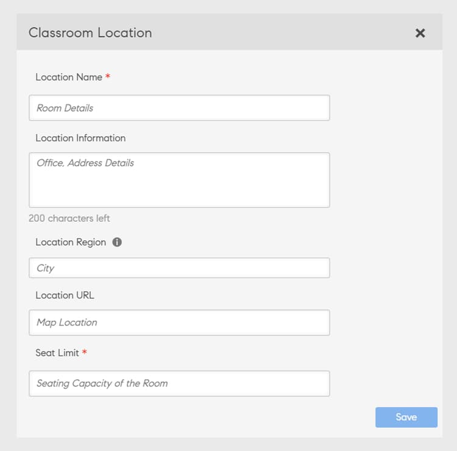
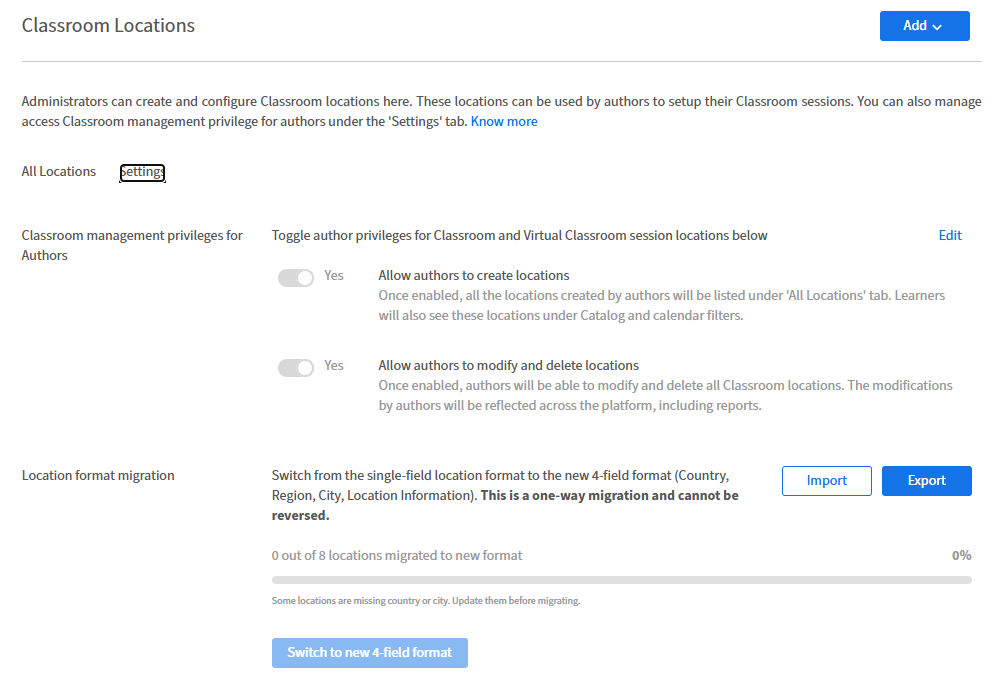
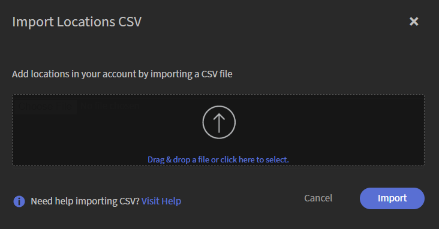

# 教室の場所を追加

管理者は、教室とバーチャルクラスルームのモジュールでインストラクターによるトレーニングイベントを設定する際に再利用できるように、教室の場所のライブラリを作成および管理することができます。 場所ごとに、場所の名前、人数制限、場所のURLなどの追加情報などの詳細を定義できます。 作成者は、コースを作成するときに、これらの定義済みの場所を選択できます。

初期設定では、Adobe Learning Managerは単一フィールドの位置書式を使用します。 複数の国や言語にまたがる教室の場所を管理する組織の場合、Learning Managerでは、**国**、**州/都道府県/地域**、**市区町村**、および&#x200B;**場所名**&#x200B;という構造化された4つのフィールド形式もサポートされます。 この形式は、場所ベースのフィルタリングや個々の場所に対する言語サポートなどの追加機能を提供します。 管理者は、1回限りの移行で4フィールド形式に切り替えることができます。

>[!NOTE]
>
>4つのフィールドの場所の形式が有効になっていない場合、作成者と学習者は引き続き通常どおり教室の場所を使用できます。 既存の単一フィールドの場所の形式は引き続き使用でき、変更は必要ありません。 詳細については、[4フィールドメソッドに移行](#migrate-classroom-locations-to-the-four-field-format)を参照してください。

## 教室の場所の設定

管理者は、作成者が教室の場所を作成および管理できるかどうかを制御できます。 **教室の場所**&#x200B;の設定を使用して、作成者が使用できるアクセスのレベルを定義します。

**教室の場所**&#x200B;の設定を構成するには：

1. **管理者**&#x200B;としてAdobe Learning Managerにログインします。
1. **設定**/**教室の場所**&#x200B;を選択します。

   これにより、**教室の場所**&#x200B;ページが表示されます。

1. 「**設定**」タブを選択します。

   ![教室の場所の[設定]タブ](assets/classroom-locations-settings-tab.png)

   *[設定]&#x200B;**タブで、教室とバーチャル教室の場所に対する作成者権限を有効にします。***

1. 「**編集**」を選択します。

   切り替えスイッチが編集可能になり、次の設定を更新できるようになります。

   | **設定** | **説明** |
   |---|---|
   | **場所の作成を作成者に許可** | このオプションを有効にすると、作成者がインストラクターによるトレーニングセッションを作成する際に、教室およびバーチャルクラスルームモジュールの場所を作成できるようになります。 |
   | **作成者に場所の変更と削除を許可する** | 作成者が教室およびバーチャルクラスルームの場所を編集または削除できるようにするには、このオプションを有効にします。 |

1. 「**保存**」を選択します。

## 教室の場所の作成と管理

管理者は、作成者が教室およびバーチャルクラスルームトレーニングセッションの作成時に再利用できる教室の場所を作成および管理できます。 Adobe Learning Managerでは、次の2つの場所の形式をサポートしています。

* **単一フィールド形式**：各教室の場所は、単一の&#x200B;**場所名**&#x200B;フィールドによって識別されます。 詳細については、[単一フィールド形式を使用して教室の場所を追加](#add-a-classroom-location-using-a-single-field-format)を参照してください。
* **4つのフィールド形式** ：各教室の場所は、**国**、**州/州/地域**、**市区町村**、および&#x200B;**場所名**&#x200B;に整理され、複数の地域にわたる場所の管理が容易になりました。 アカウントで現在シングルフィールド形式を使用している場合は、1回限りの移行を完了してから、4フィールド形式に切り替えてください。 詳細については、[4フィールドメソッドに移行](#migrate-classroom-locations-to-the-four-field-format)を参照してください。

### 単一フィールド形式を使用した教室の場所の追加

教室の場所は、単一フィールド形式を使用して追加できます。

1. **管理者**&#x200B;としてAdobe Learning Managerにログインします。
1. **設定**/**教室の場所**&#x200B;を選択します。
1. **追加** > **新しい場所**&#x200B;を選択します。
1. **教室の場所**&#x200B;ダイアログボックスで、次の詳細を入力します。

   1. **場所名**&#x200B;を入力してください。 一意の名前を使用してください。 それ以外の場合は、Learning Manager でエラーメッセージが表示されます。
   1. 場所の説明を&#x200B;**「場所の情報」**&#x200B;フィールドに入力します。 ただしこれは任意のフィールドです。
   1. **「場所の URL」**&#x200B;を入力します。 学習者は、この情報を教室の詳細で確認できます。 必要に応じて URL をマップの場所の URL に設定することもできます。 ただしこれは任意のフィールドです。
   1. **場所の地域**&#x200B;を入力して選択します。 このフィールドは任意です。
   1. 使用可能な席数を&#x200B;**座席の上限**&#x200B;フィールドに入力します。これは教室の座席数を示しています。この値は、インストラクターによる実際のトレーニングイベントを作成するときに変更できます。
      
      *単一フィールド形式を使用して教室の場所を追加します。*

### 教室の場所を4つのフィールド形式に移行する

アカウントで従来の単一フィールド教室の場所の形式が使用されている場合は、既存の教室の場所を移行してから、4つのフィールド形式を有効にしてください。 4つのフィールド形式により、場所データが&#x200B;**国**、**州/都道府県/地域**、**市区町村**、および&#x200B;**場所名**&#x200B;に整理され、複数の地域にわたる場所の管理が容易になります。

この移行は1回限りのプロセスです。 4フィールド形式に切り替えると、アカウントを1フィールド形式に戻すことはできません。

既存の場所を移行するには：

1. **管理者**/**教室の場所**&#x200B;に移動し、「**設定**」タブを選択します。
1. 「**場所の形式の移行**」セクションで「**書き出し**」を選択します。

   既存の教室の場所が記載されたCSVファイルがダウンロードされます。 次の列を使用できます。

   1. **room_id**：場所の一意の識別子。
   1. **ロケール**：翻訳された場所の名前と場所の情報のロケール。
   1. **名前**：教室の名前。
   1. **国**：教室が存在する国。
   1. **都道府県**：教室が所在する都道府県または地域。
   1. **市区町村**：教室がある市区町村です。
   1. **情報**：建物名、階床、部屋番号などの詳細を追加します。
   1. **url**：場所に関連付けられたURL （マップリンクなど）。
   1. **座席の上限**：教室の最大収容人数です。

   >[!NOTE]
   >
   >書き出されたCSVには、4フィールド形式が無効な場合でも、常に4フィールドの場所の形式列が含まれます。

   

   *4つのフィールドの場所形式に切り替える前に、移行の進行状況を確認してください。*

1. 列名ごとに、国、州、市区町村などの必要な情報と、その他の必要な情報を含むCSVファイルを更新します。
1. **読み込み**&#x200B;を選択し、更新したCSVファイルをアップロードします。

   Adobe Learning Managerはデータを検証し、移行の進行状況を更新します。

1. 移行の進行状況バーが100%に達したら、[**新しい4フィールド形式に切り替える**]を選択します。 **場所の形式の移行**&#x200B;の状態が&#x200B;**移行の完了**&#x200B;に更新されました。

   

   *場所の形式の移行は、移行の完了ステータスに更新されます。*

## 4つのフィールド形式を使用した教室の場所の追加

1回限りの移行が完了したら、管理者は4つのフィールド形式で教室の場所を作成できます。 作成者は、インストラクターによるトレーニングセッションの作成時に、これらの場所を再利用できます。 管理者は、教室の場所を個別に追加するか、CSVファイルから複数の教室の場所を読み込むことができます。

### 教室の場所を追加

教室の場所を使用して、トレーニング会場を標準化し、作成者のセッションスケジュールを簡素化します。

教室の場所を追加するには、次の手順を実行します。

1. 管理者アプリで、**設定**/**教室の場所**&#x200B;を選択します。

   ![[すべての場所]タブ](assets/all-locations-tab.png)

   *[すべての場所]&#x200B;**タブを選択して、教室の場所を追加します。***

1. 右上隅から&#x200B;**追加** / **新しい場所**&#x200B;を選択します。

   **教室の場所**&#x200B;ポップアップウィンドウが表示されます。

   

   *教室の場所ポップアップウィンドウで詳細を入力します。*

1. **教室の場所**&#x200B;ポップアップウィンドウで、次の詳細を入力します。

   | **フィールド** | **説明** |
   |---|---|
   | **国** | 教室が存在する国を選択します。 |
   | **都道府県** | 都道府県または地域を選択します。 |
   | **市区町村** | 教室がある都市を選択します。 |
   | **場所名** | 教室または部屋の名前を入力します。 |
   | **場所情報** | 建物の名前、フロア、部屋番号などの追加詳細を入力します。 |
   | **場所のURL** | 場所のURL（マップリンクなど）を入力します。 |
   | **人数制限** | 教室の最大座席数を入力します。 |

1. 「**保存**」を選択します。

   教室の場所が保存され、「**すべての場所**」タブに表示されます。

### 教室の場所を一括でインポート

一括読み込みを使用して、複数の教室の場所を追加するか、CSVファイルを使用して既存の場所を更新します。

教室の場所を一括で読み込むには：

1. 管理者アプリで、**設定**/**教室の場所**&#x200B;を選択します。
1. 「**すべての場所**」タブから「**CSVをダウンロード**」を選択します。

   既存の教室の場所が含まれるCSVファイルがダウンロードされます。 次の列を使用できます。

   1. **room_id**：場所の一意の識別子。
   1. **ロケール**：翻訳された場所の名前と場所の情報のロケール。
   1. **名前**：教室の名前。
   1. **国**：教室が存在する国。
   1. **都道府県**：教室が所在する都道府県または地域。
   1. **市区町村**：教室がある市区町村です。
   1. **情報**：建物名、階床、部屋番号などの詳細を追加します。
   1. **url**：場所に関連付けられたURL （マップリンクなど）。
   1. **座席の上限**：教室の最大収容人数です。

1. 列名ごとに、国、州、市区町村などの必要な情報と、その他の必要な情報を含むCSVファイルを更新します。
1. 右上隅から&#x200B;**追加**/**一括インポートの場所**&#x200B;を選択します。

   **場所のCSVを読み込み**&#x200B;ポップアップウィンドウが表示されます。

   

   *更新された情報を含むCSVをドラッグアンドドロップします。*

1. 更新したCSVファイルをアップロード領域にドラッグ&amp;ドロップします。
1. **インポート**&#x200B;を選択します。

   教室の場所が更新されます。

## 教室の場所の翻訳を追加

**[場所名]**&#x200B;および&#x200B;**[場所情報]**&#x200B;フィールドの翻訳を追加して、学習者が希望する言語で教室の場所の詳細を表示します。

教室の場所の翻訳を追加するには、次の手順を実行します。

1. **すべての場所** > **追加**&#x200B;を&#x200B;**教室の場所**&#x200B;から選択してください。
1. **新しい場所**&#x200B;を選択します。

   **教室の場所**&#x200B;ポップアップウィンドウが表示されます。

1. **[新しい言語の追加]**&#x200B;を選択します。

   **新しい言語の追加**&#x200B;ポップアップウィンドウが表示されます。

   

   *新しい言語の追加ポップアップウィンドウから言語を選択します。*

1. 「**保存**」を選択します。

   翻訳が保存され、ユーザーに表示されます。

>[!NOTE]
>
>翻訳をサポートしているのは、**場所名**&#x200B;および&#x200B;**場所情報**&#x200B;フィールドのみです。 **国**、**都道府県/地域**、**市区町村**&#x200B;など、場所の詳細は翻訳されていません。

## 教室の場所を編集

教室の場所を編集するには、次の手順に従います。

1. 管理者アプリで、**設定**/**教室の場所**&#x200B;を選択します。
1. 編集したい教室の場所にカーソルを合わせます。

   

   *必要な教室の場所にカーソルを合わせ、編集アイコンを選択します。*

1. **教室の場所を編集**&#x200B;アイコンを選択します。

   「教室の場所」ポップアップウィンドウが表示されます。

1. 教室の場所を変更し、**[保存]**&#x200B;を選択します。

## 教室の場所を削除

教室の場所を削除するには、次の手順に従います。

1. 管理者アプリで、**設定**/**教室の場所**&#x200B;を選択します。
1. 削除する教室の場所にカーソルを合わせます。
1. **教室の場所を削除**&#x200B;アイコンを選択します。

   [確認が必要]ポップアップウィンドウが表示されます。

   

   *「削除」を選択して、教室の場所の削除を確認します。*

1. 「**削除**」を選択します。

## よくある質問

1. **移行が完了すると、既存の教室の場所はどうなりますか？** 
4つのフィールドの場所の形式は、手動またはCSVアップロードで、既存のすべての場所が移行された後にのみ有効にすることができます。4つのフィールド形式を有効にすると、教室の場所を使用するすべての既存のコースに、場所が新しい形式で表示されます。

1. **4つのフィールドの場所の形式に一致するように、書き出されたCSVを手動で再構築する必要がありますか？** 
いいえ。書き出されたCSVファイルは、現在有効になっているかどうかに関係なく、常に4つのフィールドで構成される場所形式を使用します。ファイルを取り込む前に必要なのは、不足している値を更新することだけです。

1. **移行はAdobe Learning Managerレポートに影響しますか？** 
はい。移行後、教室の場所情報を含むレポートには、場所が次の形式で表示されます。

   **国/都道府県/地域/市区町村/場所名**

   この形式は、以前の単一フィールドの場所の値を置き換えます。

1. **4つのフィールドの場所の形式を有効にしなかった場合はどうなりますか？** 
作成者と学習者に変更はありません。教室の場所は、管理者が移行を完了して4フィールド形式を有効にするまで、既存の単一フィールド形式を使用して、現在のように表示され続けます。
