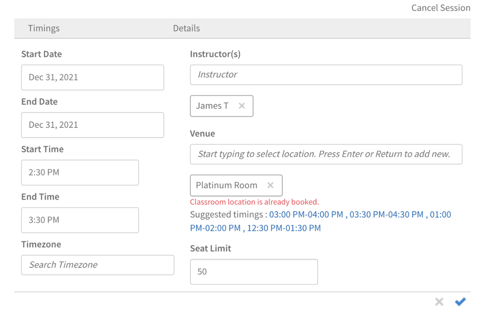

# 教室

## 概要

管理者は、教室の場所のライブラリを設定できるようになりました。 管理者は、教室の場所ごとに、場所の名前、人数制限および場所のURLなどの追加情報を含むメタデータを設定できます。 作成者と管理者は事前設定されたこれらの教室の場所を使用して、インストラクターによるトレーニングイベント（教室モジュール）を設定できます。

教室の場所を追加するには、次の2つの方法を使用できます。

## UIを使用した教室の追加

UIを使用して教室の場所を追加することができます。

1. 管理者アプリ（管理者の役割のUI）で、 **[!UICONTROL 設定]** > **[!UICONTROL 教室の場所]**.

1. 「 **[!UICONTROL さらに追加]** をクリックします。

1. を **[!UICONTROL 教室の場所]** ダイアログボックスで、次の詳細を入力します。

   * 「 **[!UICONTROL 教室の場所名]**. 一意の名前を使用してください。 それ以外の場合、Learning Managerでエラーメッセージが表示されます。
   * 場所の説明を「 **[!UICONTROL 場所情報]** フィールドに入力します。 このフィールドはオプションです。
   * 「 **[!UICONTROL 場所のURL]**. 学習者は、この情報を教室の詳細で確認できます。 必要に応じて、URLをマップの場所のURLに設定することもできます。 これはオプションのフィールドです。
   * 使用可能な席数を **[!UICONTROL 人数制限]** フィールドに入力します。 これは教室の座席数を示します。 この値は、インストラクターによる実際のトレーニングイベントを作成するときに変更できます。

   

   *教室の場所を追加*

場所を追加した後、 **[!UICONTROL 設定]** > **[!UICONTROL 教室の場所]** このページには、会議室の一覧が表示されます。

*すべての会議室を表示*

リストには次のフィールドがあります。

**[!UICONTROL 場所名]**  – 教室の場所名

**[!UICONTROL 今後のセッション]**  – 対応する場所で発生するイベントの数 番号をクリックすると、ダイアログボックスに詳細が表示されます。

*今後のセッションを表示*

このダイアログボックスには、セッション名、セッションを含むトレーニング名、セッションスケジュールなど、各セッションの詳細が表示されます。 表示される時間は、学習者のシステムタイムゾーンに合わせて調整されます。

この **[!UICONTROL 今後のセッション]** フィールドの表示 **ゼロ** 教室がどのセッションにも使用されていない場合、または教室が過去のセッションに関連付けられている場合。

**場所のURL**  – 教室の場所の作成時に入力したURL

**場所情報**  – 教室の作成時に入力した教室情報

## CSVを使用した教室の追加

教室の情報を含むCSVを読み込むことで、教室の場所を追加することもできます。

イン **[!UICONTROL 管理者アプリ]** > **[!UICONTROL 設定]** > **[!UICONTROL 教室の場所]**&#x200B;を選択し、 **[!UICONTROL 場所のCSVの読み込み]** をクリックします。 CSVファイルが含まれている場所を参照し、ファイルを選択します。

CSVファイルでは以下のフィールドを用いて、教室の場所に関する情報が保存されます。

* 名前
* 情報
* url
* seatLimit

ヘッダーはカスタマイズできます。

CSVファイルには、すべての列をここで指定した順序で含めなければなりません。

CSVファイルが読み込まれると、場所がライブラリに追加されます。

## 教室の検索

作成者または管理者は場所の名前を入力することで、表示される結果を適宜確認できます。 作成者または管理者は、表示された結果から場所を選択できます。 タイプアヘッドの結果に場所が表示されない場合でも、ユーザーは新しい教室の場所名を追加できます。 セッション作成ワークフローを使用して作成された場所の名前は、管理者が作成した場所のライブラリには追加されません。

教室が追加されると、指定した期間における教室の予約状況が学習プラットフォームに表示されます。 また、別の時間枠を候補として提示することもできます。 作成者は同じ教室の場所を使用するにあたり、ミーティングの時間を調整することができます。

*教室の検索*

## 所定のインストラクターリストに限定

教室またはバーチャルクラスルームセッションを作成するときに、現在ユーザーは登録されている任意のユーザーをインストラクターとして追加できます。 この機能は、このリリースでも変更されません。

ただし管理者には、学習プラットフォームでインストラクターに割り当てられるユーザーを管理するための追加オプションが用意されました。 これにより、セッションの作成時に新しいインストラクターが誤って追加されるのを防ぐことができます。

## Administrator

管理者は、 **[!UICONTROL インストラクターの管理]** オプション（以下で利用可能） **[!UICONTROL 管理者アプリ]** > **[!UICONTROL 設定]** > **[!UICONTROL 一般]**)を使用して、所定のインストラクターのみがセッションのインストラクターとして追加できるようにします。

インストラクターを設定する際、管理者は以下を選択することができます **[!UICONTROL 管理]** > **[!UICONTROL ユーザー]** 「ユーザー管理」ページを開くには、ユーザーを選択してから、インストラクターの役割をユーザーに割り当てます（以下を使用）。 **[!UICONTROL アクション]** > **[!UICONTROL 役割の割り当て]**)を参照してください。

## 作成者

管理者が **[!UICONTROL インストラクターの管理]** オプションを選択すると、作成者はインストラクターの役割を持つユーザーのみを検索し、教室セッション、バーチャル教室セッション、チェックリスト、およびファイル送信モジュールに追加することができます。

また、作成者は次の操作を実行することもできます。

* 既存セッションのインストラクターを追加および削除します。
* インストラクターが1人以上割り当てられている既存セッションにインストラクターを追加します。

したがって、管理者は、 **[!UICONTROL インストラクターの管理]** オプションを選択すると、インストラクターの役割を持つユーザーのみをインストラクターとして追加できます。

>[!NOTE]
>
>これは、セッションのCSVファイルを使用してセッションを移行する場合には適用されません。 この場合、インストラクターの役割を持たないユーザーをインストラクターとして追加することができます。

## 既存のセッションをキャンセル

作成者または管理者は必要に応じてセッションをキャンセルし、スケジュールを再設定することができます。

ユーザーがセッションをキャンセルすると、システムは登録されているすべての学習者およびインストラクターに会議のキャンセル電子メールを送信します。 電子メールには、更新されたセッションの詳細が含まれます。

というテンプレートがあります。 **[!UICONTROL セッションのキャンセル]** セッションをキャンセルするのに役立ちます。

を **[!UICONTROL コースインスタンス]** ページでは、コースインスタンスの下に表示されるすべてのセッションで、セッションのキャンセルオプションが表示されます。

*既存のセッションのキャンセル*

クリックすると、 **[!UICONTROL セッションをキャンセル]** リンクすると、警告メッセージが表示されます。

警告メッセージダイアログボックスで、次をクリックすると **[!UICONTROL 続行]**&#x200B;が含まれている場合、システムはセッションをキャンセルします。

また、セッションをキャンセルすると、次の詳細情報もクリアされます。

* セッションの開始日
* セッションの終了日
* セッションの開始時間
* セッションの終了時間
* セッションに追加されたインストラクター
* バーチャルクラスルームURL
* セッションに追加された場所/会場
* インストラクターが追加したキャンセル待ちの上限

## Administrator

を **[!UICONTROL コースインスタンス]** ページの場合、管理者は1つ以上のセッションをキャンセルできます。 管理者がセッションをキャンセルすると、座席の上限を除くすべてのセッション情報がシステム上でクリアされます。

また、管理者は次の操作を実行できます。

* セッションに登録されている学習者とキャンセル待ちの学習者を表示します。
* キャンセル済みのセッションを含むコースから学習者の登録を解除する。
* キャンセルされたセッションの出席をマークします。
* キャンセル済みのセッションを含むコースを完了としてマークします。
* キャンセルされたセッションをスケジュールし直します。
* スケジュールの再設定時に、キャンセル済みのセッションにインストラクターを追加できます。

トレーニングインスタンスに登録された学習者は、キャンセル後も引き続き登録が維持されます。 登録ステータス（登録確認済、キャンセル待ち、マネージャー承認待ちなど）は変更されません。 管理者はキャンセルされたセッションを後で設定およびスケジュールを再設定できるため、これは便利です。

## 作成者

を **[!UICONTROL コースインスタンス]** ページの場合、作成者は1つ以上のセッションをキャンセルできます。 作成者がセッションをキャンセルすると、座席の上限を除くすべてのセッション情報がシステム上でクリアされます。

したがって、作成者は **[!UICONTROL セッションをキャンセル]** 同じまたは異なるコースインスタンスで使用可能な、1つ以上の教室セッションまたはバーチャル教室セッションをキャンセルするためのリンク。
