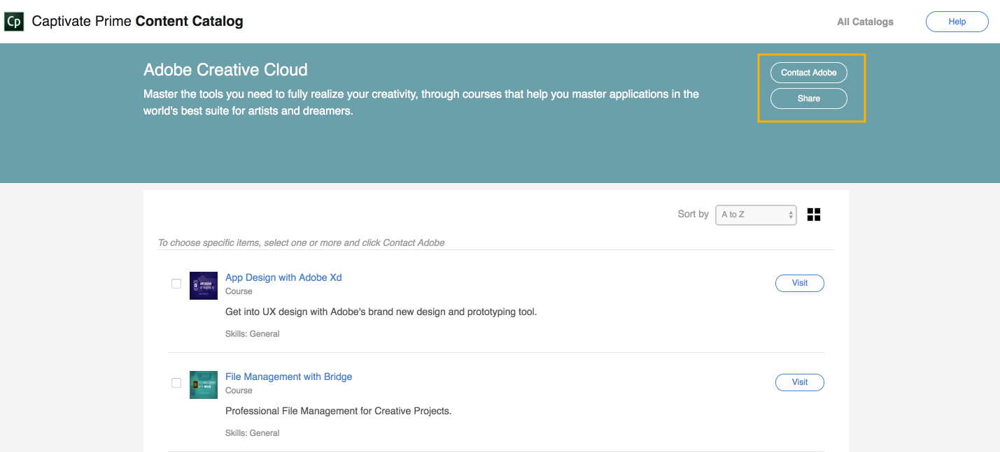

# Learning Manager コンテンツカタログ

<!--Learning Manager introduces Content Catalog-->

コンテンツカタログは、Learning ManagerのAzureインスタンスではサポートされていません。

* **コース**&#x200B;とは、Adobe Learning Managerで作成され、お客様に提供される、特定のトピックに関するワークおよびeラーニングモジュールを1つにまとめたものを意味します。
* **コンテンツコントリビューター**&#x200B;は、コースの所有権者であり、Adobe Learning Managerで当該コースの実施と再実施を行うAdobeを付与しています。

Learning Managerにコンテンツカタログが導入されました。これは、購入可能ですぐに使用できるコンテンツベースのセットです。 ビジネススキル、職場のコンプライアンス、AdobeのCreative Cloud、テクノロジーなどの既成コースを、キュレートされたコンテンツマーケットプレイスで購入できます。

左ペインで「コンテンツマーケットプレイス」をクリックし&#x200B;**[!UICONTROL 「Creative Cloud トレーニング」]**&#x200B;をクリックします。

<!---->

カタログの詳細と各カタログ内のコースを表示するには&#x200B;**[!UICONTROL 「表示」]**&#x200B;をクリックします。 新しいウィンドウにすべてのコースが表示されます。

<!---->

コースの詳細を表示するには&#x200B;**[!UICONTROL 「アクセス」]**&#x200B;をクリックします。 チェックボックスを使用して、関心のあるコースを選択します。

* 「**[!UICONTROL 共有]**」を選択すると、選択したコースをピアと共有できます。
* 「**[!UICONTROL Adobeに問い合わせる]**」を選択すると、Adobeに問い合わせることができます。

<!---->

いずれのインスタンスでも、デフォルトで電子メールクライアントが開きます。 チェックボックスを使用して特定のコースを選択した場合、そのURLが自動的に電子メールの本文に追加されます。

メールクライアントが既定で開かない場合は、関心のあるメールを`learningmanagercontentcontentadmin@adobe.com`に送信できます。

コンテンツカタログにアクセスするには、Learning Manager へのログインが必要です。
