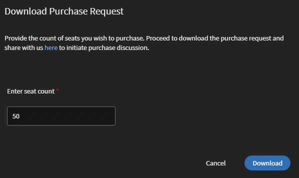

# コンテンツのマーケットプレイス

Learning Managerでは、コンテンツマーケットプレイスでトレーニングを検索および購入できるようになりました。 さまざまな形式で利用できる幅広いトピックをカバーする70,000件以上のコースを検索します。 あらゆる役割に対応しており、学習やスキルアップのニーズに合わせることが可能な、キュレートされたプレイリストから選択できます。

管理者アプリに、新しいオプションが追加されました **[!UICONTROL コンテンツマーケットプレイス]**&#x200B;左側のパネルに表示されます。

ユーザーは、様々なトピックをカバーするキュレートされたプレイリストから購入したり、カタログ全体を購入したりできます。

このページには、エンタープライズ版トレーニングとCreative Cloud版トレーニングの2つのタイルが表示されています。 最初のタイルから、学習者向けのコースを取得できるマーケットプレイスを開きます。 後者の場合は、コンテンツカタログが起動します。

管理者アプリのエンタープライズ版トレーニングページでは、ユーザーを招待して関心の度合いレポートをダウンロードし、カタログ全体またはキュレートされたプレイリストを購入することができます。

**ユーザーを招待**

ユーザーをコンテンツマーケットプレイスに招待して、コンテンツを検索してもらい、興味があることを伝えてもらいます。 管理者は、アカウントのすべての学習者を招待することも、選択した学習者を招待することもできます。 学習者にアクセスを許可するには、学習者を招待する必要があります。

学習者を「コンテンツマーケットプレイス」オプションから取り消すこともできます。 アクセス権を取り消すには、 **[!UICONTROL アクセスの取り消し]** リンク：  ユーザーは、学習者アプリで「コンテンツマーケットプレイス」ページを表示できなくなります。

このオプションは、すべての新しいアカウントでデフォルトで選択されています。 既存のアカウントの場合、管理者はユーザーがマーケットプレイスを利用できるように招待する必要があります。

## 購入

コースのライブラリ全体に無制限にアクセスできます。 「 **[!UICONTROL 購入]** 購入リクエストフォームをダウンロードするボタン。

*購入する席数を入力*

コースを購入する席数を指定します。 購入リクエストフォームをダウンロードし、Learning Managerのセールスチームにフォームを送信します。

チームが情報を検証し、キーを生成して提供します。 これは、コンテンツの提供に対するアクセス権をユーザーに付与するために使用するアクティベーションキーです。

CSAMチームがキーを生成した後、管理者はこのキーを使用してコースを読み込み、既存のカタログや新しいカタログにコースを移行できます。

コースの移行中、ステータスは次のように表示されます **[!UICONTROL コースのインポート]**. 移行が完了すると、移行が完了して正常に完了したことを示す通知が管理者に送信されます。

この **[!UICONTROL ライセンス]** 」セクションに、アカウントで取得されたすべてのライセンスが表示されます。

管理者は、カタログの概要ページで購入したカタログのリンクを確認できます。

コースがカタログに追加されたら、管理者は、トレーニングへのアクセス権を様々なユーザーまたはユーザーグループに付与できます。

*ユーザーとユーザーグループにトレーニングへのアクセス権を付与*

## 関心の度合いレポート

学習者が学習者アプリで「カタログへの関心を表す」をクリックすると、関心の度合いレポートに記録されます。 管理者はレポートをダウンロードできます。 レポート(csv)には、次のフィールドが含まれています。

* カタログ名
* 関心を表しているユーザーの数
* 関心を表しているユーザーの電子メール

## 電子メールテンプレート

このワークフローをサポートするために、次の3つの電子メールテンプレートを使用できます。

1. **[!UICONTROL コンテンツのアクティベーションに成功しました]:** これは、キー名の付いたコンテンツの購入が成功したときに送信されます。 購入したすべてのトレーニングを利用できるようになりました。
1. **[!UICONTROL 自動ユーザーアップロードの失敗]:** これは、何らかの理由でアカウントのCSVの自動更新に失敗した場合に送信されます。
1. **[!UICONTROL コンテンツを検索するようユーザーを招待]:** これは、管理者がコースを購入したときに学習者に送信される招待電子メールです。 管理者は、関心の度合いレポートを表示して、全体的な要件を理解し、購入を決定できます。

1. 購入したコースは、繰り返し行われる証明書に追加できません。
1. 購入したコースは、ピアアカウントと共有できません。
1. 購入したコースは、アクセス権を持つすべてのユーザーが利用できます。 カタログの表示を設定して、購入したコースを限られたユーザーにのみ表示するように制限できます。
1. アクティベーションキーの有効期限が切れると、購入したコースを利用できなくなります。 使用するには、別のキーを購入/アクティブ化してください。

## コンテンツマーケットプレイスのコンテンツハブ

コンテンツハブでは、管理者と主題専門家(SME)が、学習者アプリから必要なプレイリストを絞り込むことができます。 絞り込みが完了したら、管理者は購入リクエストフォームをダウンロードし、それをAdobe営業担当者と共有できます。

管理者は、SMEが関心のあるプレイリストを絞り込めるように、SMEを招待できます。

*マーケットプレイスからコンテンツハブを起動する*

コンテンツハブは、すべての管理者の学習者の役割で利用できます。 管理者は、SMEが購入を希望するプレイリストを絞り込むことを許可します。

学習者の役割を持つ管理者は常にコンテンツハブページを表示して、プレイリストを簡単に絞り込むことができます。 適切なプレイリストを絞り込みやすくするために、管理者は、アカウント内の特定の主題専門家がこのページを利用できるように設定できます。 管理者側のエンタープライズ版トレーニングページにアクセス権を提供する手順を実行するだけです。

*コンテンツハブでのリソースの表示*

また、Learning Managerでは、管理者が候補のプレイリストをダウンロードして、それをAdobeセールスチームと共有することもできます。 候補のプレイリストをダウンロードするには、まずコンテンツハブにアクセスし、ライブラリにプレイリストを追加して、プレイリストを絞り込みます。

次に、管理者として以下をクリックします。 **[!UICONTROL コンテンツマーケットプレイス]** > **[!UICONTROL Enterprise Training]** > **[!UICONTROL 購入セクション]** > **[!UICONTROL キュレートされたプレイリスト]**. 「 **[!UICONTROL 購入]** 候補のプレイリストの詳細情報を含む購入リクエストフォームをダウンロードするボタン。

*購入リクエストフォームをダウンロード*

コンテンツハブに表示されるコースとプレイリストは、コンテンツマーケットプレイスに表示されるものと同じです。 コンテンツハブは、管理者や一部のSMEが購入するプレイリストを簡単に絞り込める機能を提供するだけです。
