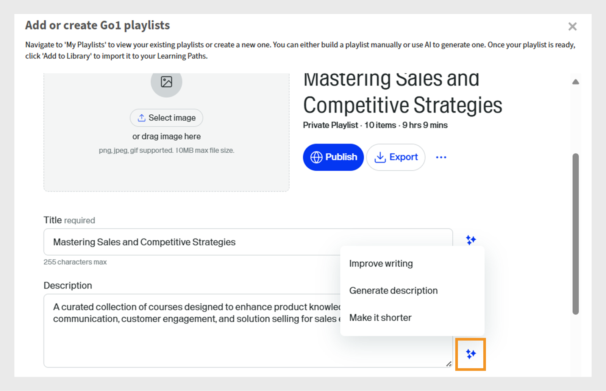
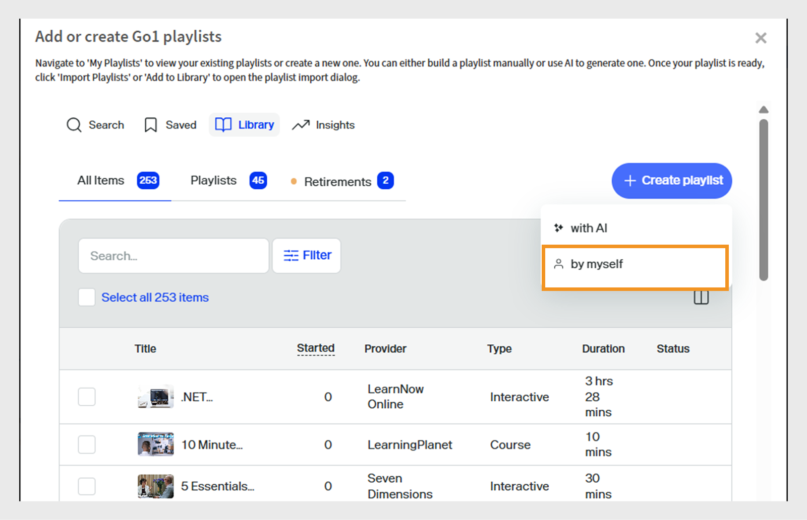

# 学習パスへのGo1コースのキュレーション

管理者は、複数のリポジトリやカタログからコースをキュレートする必要が生じることがよくあります。そのため、最適なオプションを特定するのが困難になります。 これは、何千ものコースが利用できるGo1では特に困難です。 これを簡素化するために、学習パス作成フロー内で直接AIを活用したキュレーション機能を提供しています。 これにより、管理者は最も関連性の高いコースをすばやく見つけて選択できます

Go1コースを学習パスと資格認定に直接追加します。 Go1コースを含む学習パスを作成すると、学習者はトレーニングの一部として選択したGo1コースにアクセスできます。

>[!INFO]
>
>Go1コースを学習パスまたは資格認定に追加するには、アクティブなGo1ライセンスが必要です。 Go1ライセンスの詳細については、この[記事](/help/migrated/administrators/feature-summary/content-marketplace.md)をご覧ください。

## 学習パスの作成

Go1コースを含む学習パスを作成するには：

1. Adobe Learning Managerに管理者としてログインします。
2. 左側のナビゲーションパネルで&#x200B;**[!UICONTROL 学習パス]**&#x200B;を選択します。
3. 「**[!UICONTROL 追加]**」を選択します。

   
   _「学習パス」セクションの「追加」を選択して、学習者のために構造化された新しいトレーニングプログラムを作成および整理します_

4. 必要な詳細を入力して、[**[!UICONTROL 保存]**]を選択します。 詳細については、この[記事](/help/migrated/administrators/feature-summary/learning-paths.md)を参照してください。
5. 学習パスにコースを追加するには、次の方法があります。

   * **[!UICONTROL コースまたは学習パスの追加]** : Adobe Learning Managerで利用可能な既存のコースまたは学習パスを追加します。
   * **[!UICONTROL Go1からコンテンツをキュレートする]**: Go1プラットフォームからコースを追加します。
6. **[!UICONTROL Go1]**&#x200B;からコンテンツをキュレートを選択します。

   
   _Go1コースをセールスエンジニアのスキル開発プレイリストに追加して、キュレートされたサードパーティコンテンツで学習オプションを拡張します_
7. 管理者は、次の方法で再生リストを作成できます。

   * **[!UICONTROL Go1 AIアシスタント]**&#x200B;を使用しています。 詳細については、[Go1 AIアシスタント](/help/migrated/administrators/feature-summary/content-marketplace/curate-go1-playlist.md#go1-ai-assistant)をご覧ください。
   * **[!UICONTROL ライブラリ]**&#x200B;で、**[!UICONTROL 再生リストの作成]**&#x200B;を選択し、次のいずれかを選択します。
a. **[!UICONTROL AIを活用]**:AIを活用したプレイリストを作成します。 詳細については、この[セクション](/help/migrated/administrators/feature-summary/content-marketplace/curate-go1-playlist.md#create-a-playlist-with-ai)を参照してください。
b. **[!UICONTROL 自分で]**：再生リストにコースを手動で追加して、再生リストを作成します。 詳細については、この[セクション](/help/migrated/administrators/feature-summary/content-marketplace//curate-go1-playlist.md#create-a-playlist-manually)を参照してください。

### Go1 AIアシスタント

Adobe Learning Managerでは、管理者がコースを簡単にキュレーションできるように、AIを活用したサポートを提供しています。 管理者は、コンテンツハブページで利用できるAI Assistantを使用して、質問をしたり、パーソナライズされた推奨事項を取得したり、プレイリストを即座に作成したりできます。 さらに、学習パスの作成フローにAIサポートが統合されているため、管理者はGo1などの大規模なカタログから最も関連性の高いコースをすばやく特定できます。 これらの機能により、キュレーションプロセスが合理化され、時間が節約され、学習者が最適なコンテンツを受け取れるようになります。

AIを使用して再生リストを作成するには：

1. Go1コンテンツハブで「**[!UICONTROL AIとチャット]**」オプションを選択します。

   
   _管理者がAIアシスタントと対話して質問できる、[AIとチャット]オプションが表示されているコンテンツハブ画面_

2. 質問を入力して、**[!UICONTROL 送信]**&#x200B;を選択します。

   
   _管理者が質問を入力したり、コースの推奨事項を取得したり、ニーズに合わせたプレイリストを即座に作成したりできるAIアシスタントの画面_
3. スキルを選択して、**[!UICONTROL [1つのリストにコンパイル]]**&#x200B;を選択します。

   
   _プレイリストを選択してコンパイルする関連スキルを表示するAIアシスタント画面_
4. **[!UICONTROL 再生リストに変換]**&#x200B;を選択します。

   
   _AIアシスタントの画面に[再生リストに変換]オプションが表示され、すべてのコースが再生リストにコンパイルされます_

5. **[!UICONTROL 再生リストの表示]**&#x200B;を選択します。

   
   _再生リストを表示するオプションが表示されているAIアシスタント画面。再生リストを公開して学習パスに読み込むことができます_

6. **[!UICONTROL Publish]**&#x200B;を選択して再生リストを作成します。 Go1で追加のプレイリストを作成し、それを学習パスに追加できます。
7. 確認プロンプトで「**はい**」を選択します。
8. **[!UICONTROL 読み込む再生リストの選択]**&#x200B;から再生リストを選択します。

   
   _Adobe Learning ManagerのGo1ライブラリからセールスエンジニアのスキル向上プレイリストを選択して読み込みます_

9. **[!UICONTROL [学習パスに再生リストを追加]]**&#x200B;を選択し、**[!UICONTROL Publish]**&#x200B;を選択します。

プレイリスト内のコースが、学習パスに追加されます。 管理者は学習者を登録でき、学習者はすぐにコースの受講を開始できます。

### AIを使用した再生リストの作成

管理者は、AIプロンプトで再生リストの説明を入力できます。 AIが関連コースをキュレートし、要件に基づいてプレイリストを作成します。 AIは、ユーザーが提供する学習目標またはプロンプトを解釈してプレイリストを生成します。 再生リストを作成する際、管理者は「AIを使用」してコンテンツをキュレートできます。これにより、システムは大きな言語モデルを使用して、指定された学習目標や、期間、タイプなどのコンテンツ環境設定を理解できます。 次に、AIがコンテンツライブラリを検索し、これらの条件に一致する関連する学習目標を探します。

1. **[!UICONTROL 再生リストの作成]**&#x200B;を選択し、**[!UICONTROL AIを利用]**&#x200B;を選択します。

   
   _AIを使用してキュレートされたプレイリストを作成し、学習者のニーズに合わせてコースの推奨事項を自動的に作成できます_

2. **[!UICONTROL 学習目標を入力]**&#x200B;のテキストフィールドに、再生リストに関する簡単な説明を入力します。 たとえば、_製品に関する知識、技術的なコミュニケーション、顧客とのエンゲージメント、ソリューション販売の強化に重点を置いた、セールスエンジニア向けの厳選された学習プレイリストを作成します_。

   
   _学習目標を入力してカスタムのプレイリストを作成し、Adobe Learning Managerが学習者のニーズに合わせてターゲットを絞ったコースをお勧めできるようにします_

3. 「**[!UICONTROL 次へ]**」を選択します。 プロンプトには、選択に必要なスキル、コース期間、およびコースの種類が表示されます。
4. 必要なスキルを選択します。

   
   _リストからスキルを選択して、セールスエンジニアのコースをキュレートします_

5. プレイリストのコースの期間とタイプを選択します。
   
   _セールスエンジニアのコースをキュレートするためのコースの期間と種類を選択してください_

6. **[!UICONTROL 再生リストの生成]**&#x200B;を選択します。 再生リストには2つのページに10のコースが含まれており、管理者はこの再生リストを使用して学習パスを作成できます。

   
   _Adobe Learning Managerで、キュレートされたセールスエンジニアのスキル向上プレイリストを確認してください_

7. **[!UICONTROL [画像の選択]]**&#x200B;を選択して、再生リストに画像を参照して追加します。
8. 使用可能なAIオプションを使用して、タイトルを変更します。

   * **[!UICONTROL 書き方を改善する]** ：既存のタイトルをより明確に調整します。
   * **[!UICONTROL タイトルを生成する]**:コンテンツまたはコンテキストに基づいて、自動的に新しいタイトルを作成します。

   
   _プレイリストのタイトルを強化するためのAIオプションを含むGo1プレイリスト作成画面_

9. 使用可能なAIオプションを使用して、説明を変更します。
   * **[!UICONTROL 書き方を改善する]**：既存の説明を調整してわかりやすくします。
   * **[!UICONTROL 説明の生成]**:コンテンツまたはコンテキストに基づいて、新しい説明を自動的に作成します。
   * **[!UICONTROL 短くする]** ：主要なアイデアを維持しながら、テキストまたはタイトルを短くします。

   
   _再生リストの説明を強化するためのAIオプションを含むGo1再生リスト作成画面_

10. **[!UICONTROL 項目の追加]**&#x200B;を選択して、他のコースを再生リストに追加します。

11. **[!UICONTROL Publish]**&#x200B;を選択して再生リストを作成します。 Go1で追加のプレイリストを作成し、それを学習パスに追加できます。
12. 確認プロンプトで「**はい**」を選択します。
13. **[!UICONTROL 読み込む再生リストの選択]**&#x200B;から再生リストを選択します。

    
    _Adobe Learning ManagerのGo1ライブラリからセールスエンジニアのスキル向上プレイリストを選択して読み込みます_

14. **[!UICONTROL [学習パスに再生リストを追加]]**&#x200B;を選択し、**[!UICONTROL Publish]**&#x200B;を選択します。

プレイリスト内のコースが、学習パスに追加されます。 管理者は学習者を登録でき、学習者はすぐにコースの受講を開始できます。

>[!NOTE]
>
>管理者は、コンテンツハブページから直接プレイリストを作成することもできます。 詳細については、[コンテンツハブ](/help/migrated/administrators/feature-summary/content-marketplace.md#content-hub)をご覧ください。

## 再生リストの手動作成

学習者の要件に最も合うコースを手動で選択し、関連するコースを追加でキュレートします。

再生リストを手動で作成するには：

1. **[!UICONTROL 再生リストの作成]**&#x200B;を選択し、**[!UICONTROL 自分で]**&#x200B;を選択します。

   
   _再生リストを手動で作成して、特定の学習者のニーズに基づいて管理者がコースをキュレートできるようにしておく_

2. **[!UICONTROL [画像の選択]]**&#x200B;を選択して、再生リストに画像を参照して追加します。
3. 再生リストのタイトルと説明を入力します。

   
   _Adobe Learning Managerの再生リストにタイトルと説明を追加して、その目的を明確にし、目標とするスキル開発に向けて学習者をガイドできるようにします_

4. 「**[!UICONTROL 作成]**」を選択します。
5. 関連するコースを追加するには、**[!UICONTROL [項目の追加]]**&#x200B;を選択します。

   
   _Adobe Learning Managerのセールスエンジニアのスキル開発プレイリストに項目を追加して、対象のコースをキュレートします_

6. 必要なコースを検索して選択します。
7. **[!UICONTROL Publish]**&#x200B;を選択します。 プレイリストは、関連するコースを使用して作成されています。
8. 確認プロンプトで「**はい**」を選択します。
9. **[!UICONTROL 読み込む再生リストの選択]**&#x200B;から再生リストを選択します。
10. **[!UICONTROL [学習パスに再生リストを追加]]**&#x200B;を選択し、**[!UICONTROL Publish]**&#x200B;を選択します。

プレイリスト内のコースが、学習パスに追加されます。 管理者は学習者を登録でき、学習者はすぐにコースの受講を開始できます。

## Go1プレイリストの管理

管理者は、作成したGo1プレイリストを複製、共有、または削除して管理できます。

### 再生リストの複製

再生リストを複製するには：

1. Adobe Learning Managerに管理者としてログインします。
2. **[!UICONTROL コンテンツマーケットプレイス]**&#x200B;を選択します。
3. **[!UICONTROL コンテンツハブ]**&#x200B;を選択し、**[!UICONTROL ライブラリ]**&#x200B;を選択します。
4. 再生リストを選択し、**[!UICONTROL 編集]**&#x200B;を選択します。
   
   _再生リストを編集するためのオプションを表示するGo1再生リスト画面_
5. 省略記号を選択してから、**[!UICONTROL 複製]**&#x200B;を選択してください。
   
   _再生リスト管理画面。重複オプションを強調表示します_

選択した再生リストが複製され、Go1コンテンツライブラリに追加されます

### 再生リストの削除

再生リストを削除するには：

1. Adobe Learning Managerに管理者としてログインします。
2. **[!UICONTROL コンテンツマーケットプレイス]**&#x200B;を選択します。
3. **[!UICONTROL コンテンツハブ]**&#x200B;を選択し、**[!UICONTROL ライブラリ]**&#x200B;を選択します。
4. 再生リストを選択し、**[!UICONTROL 編集]**&#x200B;を選択します。
   
   _再生リストを編集するためのオプションを表示するGo1再生リスト画面_
5. 省略記号を選択してから、**[!UICONTROL 再生リストを削除]**&#x200B;を選択してください。
   
   _再生リストの管理画面で、[再生リストの削除]オプションを強調表示します_

選択した再生リストがGo1ライブラリから削除されます。

### 再生リストの共有

Adobe Learning ManagerとのGo1連携では、「再生リストを共有」オプションはサポートされていません。 このオプションは、次回のリリースでUIから削除されます。

## コースの上限を超えました

新しく追加されたコースがAdobe Learning Managerと同期されていない場合、Go1コースを学習パスに追加すると、管理者にエラーが表示されることがあります。 これらのコースは48～72時間以内に受講できます。

今すぐ再生リストを追加すると、同期済みのコースのみが含まれます。

すべてのコースを含めるには、同期が完了するまで待って、学習パスに再生リストを追加することをお勧めします。

## 資格認定のGo1コース

管理者は、Adobe Learning Manager内の資格認定プログラムにGo1コースを追加できます。 資格認定の作成時に、管理者はGo1コンテンツカタログからコースを検索して選択できます。 Go1プランを通じて読み込まれたすべてのGo1コースは、資格認定ワークフローで選択できます。

Go1コースを含む資格認定は、永続的または定期的に設定できます。 繰り返し行われる資格認定の場合、証明書は定義された時間間隔後に自動的に更新されるため、学習者はGo1コースを再受講して、資格認定ステータスを維持できます。

証明書の作成の詳細については、[証明書](/help/migrated/administrators/feature-summary/certifications.md)を参照してください。
