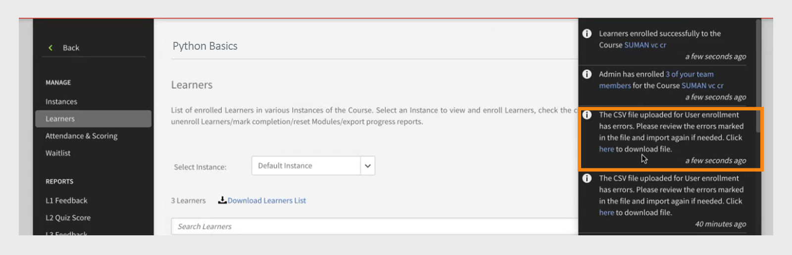
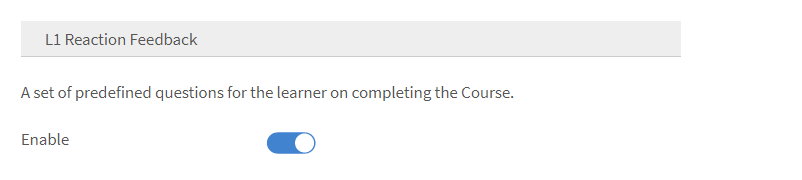
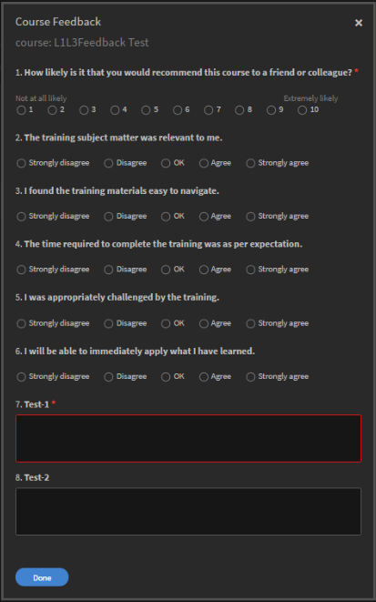

# コースインスタンスと学習パスの作成

この文書には、「管理者」役割用のコースモジュール、インスタンス、コースを作成するためのヘルプ情報が記載されています。

コースは作成者によって作成されます。学習者はコースを受講することができます。管理者は、コースの受講状況に基づいて学習者の成績を追跡できます。

## 概要 {#overview}

コースは作成者によって作成されます。学習者は、コースを受講することができます。管理者は、コースの受講状況に基づいて、学習者の成績を追跡することができます。管理者は、作成者が作成したコースを表示したり、ここで説明するいくつかのアクティビティを実行したりすることができます。また、学習者向けに事前定義された一連のコースを使用して、独自の学習プログラムを作成することができます。

## コースのインスタンスの作成 {#createinstanceofacourse}

### インスタンスの設定

このトレーニングでは、インスタンスのデフォルト設定、新しいインスタンスの追加、インスタンスの廃止と再び開き直し、インスタンスの電子メールテンプレートの設定を行う方法について説明します。

トレーニングを起動できない場合は、<almacademy@adobe.com>に書き込んでください。

### インスタンスの作成方法

作成者がコースを作成した後、そのコースのインスタンスを作成することができます。 コースのインスタンスを作成すると、学習者に対して同じコースを異なる期間で提供できるようになります。 学習者は、任意のインスタンスを選択して登録することができます。 各インスタンスを構成し、独自のバッジやフィードバックなどを設定することができます。

インスタンスを作成するには、以下の手順を実行します。

1. 管理者 Web アプリケーションの左側のペインで、「**[!UICONTROL コース]**」をクリックします。
1. コースリストで目的のコースを選択し、「**[!UICONTROL コースを表示]**」をクリックします。

   

   *コースの表示*

1. インスタンスを作成するには、左側のペインで「**[!UICONTROL インスタンス]**」をクリックします。 各コースには、デフォルトでインスタンスが設定されています。 このデフォルトのインスタンスは変更することも、別のインスタンスを追加することもできます。 ただし、このデフォルトのインスタンスを削除することはできません。
1. インスタンスを作成するには、コース情報の右上隅に表示されている「**[!UICONTROL 新しいインスタンスを追加]**」をクリックします。コースの新しいインスタンスが表示されます。
1. インスタンスのプロパティを入力します。

   * **[!UICONTROL インスタンス名]**&#x200B;フィールドに、コースに関連付けるインスタンスの名前を入力します。 その際、一意のインスタンス名を入力してください。
   * インスタンスの完了期限を指定します。 学習者は、この日までにコースを完了する必要があります。
   * **[!UICONTROL その他のオプションを表示]**&#x200B;をクリックして、他の期限のオプションを表示します。
   * **[!UICONTROL 登録期限]:**&#x200B;これは、学習者がセルフ登録の場合に学習目標に登録する予定の日付です。
   * **[!UICONTROL 登録解除期限]:**&#x200B;登録解除期限を設定することで、学習者自身による登録解除を制限できます。
   * **[!UICONTROL タイムゾーン]:**&#x200B;を検索し、ドロップダウンから&#x200B;**[!UICONTROL タイムゾーン]**&#x200B;を選択します。

   管理者は、要件に基づいて、コースまたは学習プログラムの完了期日を設定することができます。ただし、教室またはバーチャルクラスルームをベースとしたトレーニングの場合は、完了期日を 1 つだけ設定することをお勧めします。

   

   *完了期限の設定*

### インスタンスプロパティの表示 {#viewpropertiesoftheinstance}

*インスタンスのプロパティの表示*

1. **モジュール**：コースの作成者が作成したモジュールの数。
1. **登録済み学習者**：管理者によって登録された学習者の数。
1. **セッション**：コース内のバーチャルクラスルームモジュールと教室モジュールの数。
1. **有効なフィードバック**：このコースに対して、L1、L2、L3 のどのフィードバックが有効になっているかが表示されます。

>[!NOTE]
>
>管理者がインスタンス/セッションに移動し、「セッションのキャンセル」を選択してセッションをキャンセルします。

### インスタンスの管理

>[!INFO]
>
>このトレーニングでは、インスタンスの詳細とインスタンスプロパティを編集する方法を学習します。    

トレーニングを起動できない場合は、<almacademy@adobe.com>に書き込んでください。

### インスタンスの廃止 {#retireaninstance}

インスタンスを廃止するには、以下の手順を実行します。

1. インスタンスで、ドロップダウンメニューを選択し、オプション&#x200B;**[!UICONTROL インスタンスの廃止]**&#x200B;を選択します。

   

   *インスタンスの廃止*

1. 廃止されたすべてのインスタンスを検索するには、「インスタンス」ページの「**[!UICONTROL 撤回済み]**」タブをクリックします。

### インスタンスの復元 {#restoreaninstance}

廃止されたインスタンスを元の状態に戻すには、以下の手順を実行します。

1. インスタンス上でドロップダウンメニューをクリックし、「**[!UICONTROL インスタンスを再度開く]**」オプションを選択します。

   

   *インスタンスの復元*

1. これで、インスタンスが元のアクティブな状態に戻ります。

### インスタンスの削除

管理者は、作成後すぐに&#x200B;**[このインスタンスの削除]**&#x200B;オプションを使用して、インスタンスを削除できます。 インスタンスにリンクされているセッションがある場合、またはインスタンスに登録されている学習者がいる場合、インスタンスを削除することはできません。

*インスタンスの削除*

>[!NOTE]
>
>デフォルトのインスタンスは削除できません。

### 電子メールの送信（インスタンスレベル）

登録済み学習者にインスタンスレベルの電子メールを送信するには、次の手順に従います。

1. **[!UICONTROL インスタンス]**&#x200B;ページで、任意のインスタンスのオプションを選択し、**[!UICONTROL 登録された学習者を電子メールで送信]**&#x200B;をクリックします。

*電子メール学習者がインスタンスに登録されました*

1. **[!UICONTROL 通知の作成]**&#x200B;ダイアログで、[電子メールとして入力]を選択します。 メールの件名を指定し、メッセージを入力してから&#x200B;**[!UICONTROL 「保存」]**&#x200B;をクリックします。 トレーニングが自動的に選択されます。

   

   *電子メールでアナウンスを作成する*

1. **[!UICONTROL 「保存」]**&#x200B;をクリックすると、アナウンスが作成されたことを示す確認メッセージが表示されます。 アナウンスを公開するには&#x200B;**[!UICONTROL 「今すぐ公開」]**&#x200B;をクリックします。

   

## 学習者のコースへの登録

このトレーニングでは、学習者の登録、登録解除、再登録の方法を学習します。

トレーニングを起動できない場合は、<almacademy@adobe.com>に書き込んでください。

### 様々なインスタンスへの学習者の登録

1. コースリストからコースを選択します。
1. 左側のパネルで&#x200B;**[!UICONTROL 「学習者」]**&#x200B;を選択します。
1. **[!UICONTROL 「登録」]**&#x200B;を選択します。

   

   *コースをPublishする*

1. [!UICONTROL **「学習者を登録」**]&#x200B;ダイアログでは、次の操作を実行できます。

   * 「インスタンスを選択」ドロップダウンから、学習者を登録するインスタンスを選択します。
   * 「学習者を含める」フィールドで、ユーザー、ユーザーグループまたはその両方を選択します。
   * インスタンスから除外する学習者を「学習者を除外」フィールドで選択します。
   * 選択したインスタンスに学習者を登録する場合は、ダイアログの下部で「はい」を選択します。

1. **[!UICONTROL 「続行」]**&#x200B;を選択します。

   

   *学習者の登録に進む*

### インスタンスの登録レポートの表示

1. コースリストからコースを選択します。
1. 左側のパネルで&#x200B;**[!UICONTROL 「学習者」]**&#x200B;を選択します。
1. **[!UICONTROL アクション]** / **[!UICONTROL 書き出し]**&#x200B;を選択します。

Excel ファイルには、各インスタンスのワークシートが含まれています。 ワークシートは、次のフィールドで構成されます。

* 学習者
* 電子メール
* ユーザーの一意の ID
* コース名
* LO の一意 ID
* ステータス
* 選定基準
* 登録日 / 登録解除日（UTC タイムゾーン）
* 完了日（UTC タイムゾーン）
* 期日（UTC タイムゾーン）
* 開始日（UTC タイムゾーン）
* クイズスコア
* マネージャーの名前
* アドレス
* ユーザーの状態
* 専門分野
* コメント
* 訪問数
* 訪問日
* タイムスタンプ（UTC タイムゾーン）
* 所要時間（分）

>[!NOTE]
>
>複数登録を有効にすると、各コースの学習者のトランスクリプトレポートに複数の行が追加されます（各インスタンスにつき 1 行）。
>
>コースごとに1行のみを見込むレポート自動処理を設定している場合は、複数登録機能を有効にする前に、レポート自動処理に必要な調整を行う必要があります。

### コースの学習者リストを管理する {#managelearnerslistforacourse}

1. コースサムネイルのコース名をクリックします。
1. 左ペインで、**[!UICONTROL 学習者]**&#x200B;をクリックします。

*コースの学習者を選択*

「学習者」ページから次の操作を実行できます。

* 削除する学習者を選択し、[!UICONTROL **アクション**]/[!UICONTROL **削除**]&#x200B;をクリックします。
* 出席をマークする学習者を選択し、[!UICONTROL **アクション**]/[!UICONTROL **完了をマーク**]&#x200B;をクリックします。

学習者がモジュールをリセットして再び使用できるようにするには、[!UICONTROL **[リセット]**]&#x200B;をクリックします。 ポップアップダイアログボックスで、「はい」をクリックしてリセットを確定します。 完了したモジュールは、リセットできません。 失敗したモジュールまたは不完全なモジュールだけをリセットできます。

また、学習者リストを Excel シートに書き出すこともできます。 学習者リストを書き出すには、[!UICONTROL **アクション**]/[!UICONTROL **書き出し**]&#x200B;をクリックします。

>[!NOTE]
>
>コースに複数のインスタンスがある場合、Excelの学習者リストは各タブに分かれて表示されます。 学習者リストは、学習者の名前、ステータスおよび選択基準で構成されています。 学習者のステータスは、**未開始**&#x200B;か、**進行中**&#x200B;か、**完了**&#x200B;のいずれかになります。

### 承認待ち状態の学習者の書き出し

管理者、マネージャーまたはカスタム管理者は、承認待ちの登録状態にある学習者のデータを書き出せます。 **コース／「学習者」**&#x200B;タブを使用してデータを書き出して「アクション」ドロップダウンリストをクリックします。

このオプションは、マネージャーにより承認済みのコースに、どの学習者も登録／承認待ち状態ではない場合に表示され、空のレポートが生成されます。 また、学習者が承認待ち状態、登録済み状態、保留中状態および登録解除状態の場合に書き出すこともできます。

承認待ちのユーザーの場合、このレポートには、アクティブユーザー、削除されたユーザーおよび停止されたユーザーのデータが含まれます。 また、レポートには、承認待ち状態にある社内ユーザーと社外ユーザーのデータも含まれます。

承認待ち状態であった学習者が登録を取り消した場合、その記録はレポートに表示されません。 また、承認待ち状態であった学習者が、管理者／マネージャー／カスタム管理者の登録によってコースに登録された場合、その記録はレポートに表示されます。

## 学習者の登録、出席、完了を一括で管理 {#bulk-enrollment}

Adobe Learning Managerの一括登録機能を使用すると、管理者はCSVファイルをアップロードして、多数の学習者グループをコース、資格認定、または学習プログラムに効率的に登録できます。 このプロセスにより、時間の節約、一貫性の確保、組織の拡張性のサポートが実現します。 さらに、管理者とインストラクターは、CSVアップロードを使用して学習者の情報、出席、完了状況を一括で更新できるため、手作業を最小限に抑え、データの正確性を確保することができます。

登録、出席、完了に同じCSVファイル形式を使用できます。 「電子メール」列に学習者の電子メールIDを入力し、アクションに基づいた名前を付けてファイルを保存するだけです。例えば、bulk_enrollment.csv、bulk_attendance.csv、bulk_completion.csvなどです。 CSV形式のみがサポートされています。 UTF-8形式はサポートされていません。 サンプルCSVをダウンロードします[こちら](assets/Sample-Bulk-Action-CSV.csv)。

### CSVを使用した学習者の一括登録

学習者を1人ずつ追加するのではなく、CSVファイルをアップロードすることで、最大100,000人のユーザーを同時に登録できます。 ファイルには、登録する学習者の電子メールアドレスを含む&#x200B;**userEmail**&#x200B;というラベルの列が含まれている必要があります。

CSVを使用して一括学習者を登録するには：

1. 管理者してログインします。
2. 「**[!UICONTROL コース]**」セクションからコースを選択します。
3. **[!UICONTROL コースの概要]**&#x200B;ページで&#x200B;**[!UICONTROL 学習者]**&#x200B;を選択します。
4. **[!UICONTROL 登録]**&#x200B;を選択し、**[!UICONTROL CSVをアップロード]**&#x200B;を選択します。\
   
   _CSVアップロードを使用した学習者の登録_
5. CSVをアップロードして「**[!UICONTROL 続行]**」を選択します。

CSVファイルには、「ユーザーの電子メール」というラベルの列が含まれています。 この列にユーザーの電子メールアドレスを入力します。

### コースを一括で完了とマーク

管理者は、電子メールアドレスを含むCSVファイルをアップロードすることで、多くの学習者のコース完了をすばやくマークできます。 これにより、各学習者を個別に更新する場合と比べて時間を節約できます。 CSVの「userEmail」列には、更新する学習者が表示されます。 1回のアップロードで最大10,000人の学習者を完了済みとしてマークできます。

一括完了をマークするには、次の手順を実行します。

1. 「**[!UICONTROL コース]**」セクションからコースを選択します。
2. **[!UICONTROL コースの概要]**&#x200B;ページで&#x200B;**[!UICONTROL 学習者]**&#x200B;を選択します。
3. **[!UICONTROL アクション]**&#x200B;を選択し、**[!UICONTROL 完了のマーク]**&#x200B;を選択します。
4. **[!UICONTROL 一括]**&#x200B;を選択します。
5. コースを完了した学習者のリストを示すuserEmail列が含まれているCSVファイルをアップロードします。

   
   _CSVを使用して一括完了をマークしています_

### 出席を一括でマーク

管理者は、一括出席機能を使用して、多くの学習者の出席を一度にマークできます。 各学習者の出席を個別に更新する代わりに、管理者は学習者の電子メールアドレスが含まれるCSVファイルをアップロードすることができます。 CSV内の「userEmail」列は、記録する学習者の出席を識別します。 このプロセスでは、1回のアップロードで最大10,000人の学習者を処理できるため、出席マークをより迅速かつ効率的に行うことができます。

一括出席をマークする手順は、次のとおりです。

1. 「**[!UICONTROL コース]**」セクションからコースを選択します。
2. **[!UICONTROL コースの概要]**&#x200B;ページで&#x200B;**[!UICONTROL 出席とスコア付け]**&#x200B;を選択します。
3. **[!UICONTROL アクション]**&#x200B;を選択し、**[!UICONTROL 一括出席のマーク]**&#x200B;を選択します。
4. 出席を更新する学習者の電子メールアドレスを含む「userEmail」列があるCSVファイルをアップロードします。

   
   _CSVを使用した一括出席のマーク_

>[!NOTE]
>
>CSVを使用して最大10,000人のユーザーの出席を一括でマークできます。

### 一般的なCSVアップロードエラー

* CSV内の学習者の電子メールが、Adobe Learning Managerユーザーディレクトリに存在しません。
* ファイル形式が正しくありません。
* ファイルに余分な列または無効なデータが含まれています。

_エラー通知_

エラーをリストしたCSVファイルをダウンロードし、失敗したユーザーを行レベルで表示することで、簡単に識別できます。

## キャンセル待ち

キャンセル待ちセクションでは、登録順序に基づいて、席が制限されている教室コースに学習者をキャンセル待ちにできます。 管理者は、キャンセル待ちの学習者を選択し、最初の制限を超えて席を割り当てることで、この問題を管理できます。 管理者がシートを割り当てると、学習者は直ちにコースに登録されます。

### キャンセル待ちレポート

Adobe Learning Managerでは、管理者がコースのすべてのインスタンスのキャンセル待ち学習者のリストをダウンロードできます。 管理者は、**[!UICONTROL コースの概要]**&#x200B;ページのキャンセル待ちセクションからこのレポートにアクセスできます。

キャンセル待ちレポートで使用できる列は次のとおりです。

* コース名
* インスタンス名
* インスタンス ID
* インスタンスのステータス
* ユーザー名
* 電子メール
* ユーザーの一意の ID
* 登録日 (UTC タイムゾーン)
* ステータス
* キャンセル待ち番号
* キャンセル待ちの制限
* 人数制限

「管理者」セクションからレポートをダウンロードするには、次の手順を実行します。

1. **[!UICONTROL 管理者]**&#x200B;としてログインします。
2. 「**[!UICONTROL コース]**」セクションに移動し、必要なコースを選択します。
3. **[!UICONTROL コースの概要]**&#x200B;ページで&#x200B;**[!UICONTROL キャンセル待ち]**&#x200B;オプションを選択します。
4. **[!UICONTROL アクション]** / **[!UICONTROL レポートの書き出し]**&#x200B;を選択して、**[!UICONTROL キャンセル待ち]**&#x200B;レポートをダウンロードします。

   
   _レポートのエクスポート_

## 学習者の出席の書き出し {#attendance}

教室および VC コースの場合は、このコースに出席した学習者のリストをダウンロードできます。

コースの詳細ページで、右ペインにある「**[!UICONTROL 出席とスコア付け]**」をクリックします。

ページの右上隅にある「**[!UICONTROL アクション]**」ドロップダウンリストをクリックします。 次に、オプション「**[!UICONTROL 学習者リスト（PDF）を書き出し]**」をクリックします。

*学習者のリストをPDFとして書き出し*

PDF 上では、インストラクタと同じ学習者のセットを表示することができます。

PDF をダウンロードすると、コース作成時に使用されたタイムゾーン（UTC）が表示されます。

## L1 フィードバックと L3 フィードバックの追加 {#addl1andl3feedback}

コースを作成する際に、L1 と L3 のフィードバックオプションを追加することができます。

1. 管理者としてログインし、左側のペインで「コース」をクリックします。右側のページにすべてのコースが一覧表示されます。
1. L1またはL3フィードバックを追加するコースタイルをクリックします。
1. 左側のペインで「インスタンスのデフォルト」をクリックします。
1. L1 フィードバックまたは L3 フィードバックの近くに表示されている切り替えボタンの白丸部分をクリックして、フィードバックを有効にします。
1. L3 の質問の下にあるテキスト領域で、L3 フィードバックの質問を追加します。

### 必須の L1 フィードバック {#mandatory-l1-feedback}

L1フィードバックでは、すべての質問または最初の質問を必須にすることができます。

*L1フィードバックで、すべての質問または最初の質問を必須にする*

これで、必須にする質問を作成できます。

*質問の作成*

何らかの理由で2つの必須の質問にテキストがない場合、質問はフィードバックフォームに表示されません。

>[!NOTE]
>
>学習プログラムインスタンスでこれらの設定を有効にするだけでは不十分です。 これらの設定は、学習プログラムの各コースに対して、コースインスタンスレベルで有効にする必要もあります。

[インスタンスの既定値]ページで、[**[!UICONTROL すべての質問を必須にする]**]を有効にすると、それ以降に作成されるすべての新しいインスタンスに、これらの設定が継承されます。

*インスタンスの既定のページを表示する*

### コースレベルでの L1 フィードバック {#l1-feedback-course-level}

以前のバージョンの Learning Manager では、管理者が学習プログラムで L1 フィードバックを有効にすることができました。

Learning Manager の本リリースでは、学習プログラムに含まれるすべてのコースについて L1 フィードバックを管理者が送信できます。管理者は、コースインスタンスレベルのすべてのコースで、L1フィードバックが有効になっていることを確認する必要があります。

1. 各コースでL1フィードバックを有効にするには、管理者アプリで&#x200B;**[!UICONTROL 学習プログラム]** > **[!UICONTROL 学習プログラムの表示]**&#x200B;をクリックします。

1. **[!UICONTROL インスタンス]** > **[!UICONTROL L1フィードバックの有効化]**&#x200B;をクリックします。

1. オプション&#x200B;**[!UICONTROL 各コースを有効にする]**&#x200B;を有効にします。

   

   *コースのフィードバックを有効にする*

   学習プログラムレベルでこのトグルを有効にしても、このプログラム内のコースに対するL1フィードバックはトリガーされません。 L1フィードバックを有効にするには、学習プログラムの各コースに移動し、L1フィードバックの切り替えを有効にします。

   

   *各コースでL1フィードバックを有効にする*

   すべてのコースでL1フィードバックが有効になっていても、学習プログラムインスタンスで無効になっている場合は、コースに対するL1フィードバックはトリガーされません。

### 言語別クイズレポート

クイズレポートは、学習プログラムまたはコースの完了後に、学習者のパフォーマンスを評価するのに役立ちます。

Learning Manager では現在、13 のインターフェイス言語および 32 のコンテンツ言語がサポートされています。 このオプションは学習者にとって使いやすく、グローバルな学習者をサポートする上で便利ですが、管理者にとっては様々なロケールで試行されたレポートを取得するという複雑な作業が伴います。

複数の言語でコースを提供している場合、クイズレポートのデータを様々な言語で表示できます。 これまでは、管理者が作成したレポートには、クイズの対象言語に関係なく、回答がリスト形式で表示されていました。 **例**。ユーザーがオランダ語でクイズを受けた場合、管理者はオランダ語のユーザーが受けたクイズレポートのみを一度に表示できるようになりました。 インターフェイス言語として英語を選択した管理者は、テストが試行されたロケールに関係なく、すべてのユーザーのレポートを一度に表示することはできませんでした。

しかし、この問題は修正されました。管理者は、選択したコンテンツのロケールに関係なく、学習者が試行した各言語で、すべてのレポートを一度に表示できるようになりました。 様々な言語で試行されたクイズは、クイズレポートに追加列として表示されます。

### アカウントレベルの L1 フィードバックの有効化 {#l1-feedback-account-level}

*アカウントレベルでL1フィードバックを有効にする*

管理者は、アカウントレベルでこの設定をオンにすることで、新しく作成されたコースと学習プログラムについてL1フィードバックを有効にできます。 ただし、この設定をオンにしても、既存のコースや学習プログラムには影響しません

有効にすると、すべての新しいトレーニングと新しいインスタンスで、フィードバックがデフォルトで有効になります。 作成者または管理者がこのインスタンスにアクセスした場合は、インスタンスはデフォルトになるため、手動でオフに切り替えるとそれが反映されます。

L1フィードバックを有効にするには、管理者アプリで、**[!UICONTROL 設定]** > **[!UICONTROL フィードバック]**&#x200B;をクリックします。

*フィードバックの設定ページを表示する*

右上隅の&#x200B;**[!UICONTROL 編集]**&#x200B;をクリックし、オプションを切り替えてL1フィードバックを有効にします。

作成者がコースを作成すると、管理者アプリの「インスタンス」ページで、新しいコースに対して&#x200B;**[!UICONTROL L1フィードバック]**&#x200B;が自動的に有効になります。

<!---->

次に示すように、「**[!UICONTROL 有効にする]**」オプションを切り替えて、L1フィードバックを無効にすることもできます。

*L1フィードバックを有効または無効にする*

### L1 フィードバックと L3 フィードバックの記述的な質問を追加する {#descriptive}

11 月にリリースされた Learning Manager には、記述的な質問を追加するためのオプションが導入されています。管理者はこのオプションを使用して、学習者に対する記述的な質問を追加することができます。これらの質問は、Learning Manager のデフォルトの質問に追加されます。必要な場合は、質問の下に表示されているオプションを選択して、記述的な質問を必須の質問にすることができます。

L1 フィードバックには 2 つの記述的な質問を追加し、L3 フィードバックには 1 つの記述的な質問を追加できます。

L1 フィードバックを有効にすると、以下のようなオプションが表示されます。

*L1およびL3フィードバックの記述的な質問を追加します*

適切なオプションをセンタｋうすることにより、コースの完了後すぐに学習者向けのアンケートを表示することができます。

以下の画面は、L1 アンケートのサンプル出力を示しています。このような形式で、学習者に対してアンケートが表示されます。この画面の最後に表示されている項目番号 7 と 8 の質問が、記述的な質問になります。

*コースのフィードバックに関するサンプルの質問*

L3フィードバックを有効にすると、次のスナップショットに示すようにオプションを表示できます。

*L3フィードバックを有効にする*

この画面に表示されている「質問 2」は、L3 フィードバック用の記述的な質問です。この質問の下に表示されているオプションをクリックすると、この質問を必須の質問にすることができます。

以下の画面は、L3 アンケートのサンプル出力を示しています。このような形式で、学習者に対してアンケートが表示されます。

*L3フィードバック出力の表示*

### L1 フィードバックと L3 フィードバックのアンケートを作成する {#setupl1andl3feedbackquestionnaire}

L1 フィードバックと L3 フィードバックのアンケートを作成し、アカウントレベルでリマインダーを設定することができます。

1. 管理者としてログインし、**[!UICONTROL 設定]**&#x200B;をクリックして、左ペインの&#x200B;**[!UICONTROL フィードバック]**&#x200B;をクリックします。\
   フィードバックの設定ページが表示されます。このページには、次の2つのタブがあります： **[!UICONTROL L1フィードバック]**&#x200B;と&#x200B;**[!UICONTROL L3フィードバック]**。\
   「**[!UICONTROL L1フィードバック]**」タブには、教室コースとセルフペースコースで使用する、**[!UICONTROL L1フィードバック]**&#x200B;のデフォルトアンケートのリストと、リマインダー設定が表示されます。 「**[!UICONTROL L3フィードバック]**」タブには、L3フィードバックのデフォルトのステートメントとリマインダー設定が表示されます。

1. 既存のアンケートを変更する場合は、ページの右上隅に表示されている「編集」をクリックします。\
   「**[!UICONTROL L1フィードバック]**」タブの「はい」」ボタンと「いいえ」ボタンをクリックすると、各質問の有効と無効を切り替えることができます。\
   「**[!UICONTROL L3フィードバック]**」タブでは、デフォルトのフィードバックステートメントを変更できます。\
   ページ下部の「**[!UICONTROL 新しいリマインダーを追加]**」をクリックして、リマインダーを送信するタイミングを選択します。

1. ページの右上隅にある「**[!UICONTROL 保存]**」をクリックします。

「L1 フィードバック」タブでは、2 つのアンケートセットとデフォルトの質問を表示することができます。最初のアンケートセットはセルフペースコース用のアンケートですが、アクティビティベースのコースで使用することもできます。2 つめのアンケートセットは、教室コースとバーチャルクラスルームコースで使用することができます。

## L1 と L3 のフィードバックを表示する {#viewl1andl3feedback}

管理者は、コースを完了した学習者が入力した L1 フィードバックと、マネージャーが学習者用に入力した L3 フィードバックを表示することができます。

1. コースリストの任意のコースタイルをクリックします。
1. 受信したフィードバックを表示するには、左側のペインで「L1 フィードバック」または「L3 フィードバック」をクリックします。
1. ドロップダウンリストからインスタンスを選択して、その特定のインスタンスのフィードバックを表示します。

## 掲示板

ディスカッションボード機能を使用すると、学習者はコースディスカッションを表示できます。 管理者は、必要に応じてコメントを削除することができます。 管理者は、コース設定でこのオプションを有効にできます。

## コースのモデレート {#coursemoderation}

作成者が、モジュールの追加、更新、削除を行ってコースを再パブリッシュするたびに、すべての管理者に通知が送信されます。管理者は、リンクをクリックしてコンテンツの変更内容を表示し、新しいコンテンツと古いコンテンツを比較することができます。また、その変更内容の承認と拒否を行うこともできます。

コースの管理を有効にするには、**[!UICONTROL 設定]** > **[!UICONTROL 一般]**&#x200B;をクリックします。 「**[!UICONTROL コースのモデレート]**」チェックボックスを選択します。

*コースの管理を有効にする*

この通知をクリックすると、作成者がコースに対して行った変更内容が表示されます。管理者は、この変更内容の承認または拒否を行う必要があります。変更内容を承認すると、コースが再パブリシュされます。変更内容を拒否すると、現在のバージョンのコースが引き続き使用されます。いずれの場合も、作成者に通知が送信されます。

*コースの更新に関する作成者要求*

複数の作成者が同じコースを同時に変更している場合、最後に実行された変更操作が、管理者用の通知に表示されます。管理者は、この変更内容を承認することも拒否することもできます。

## チェックリストデータの書き出し {#export-checklist-data}

コースのリストから、チェックリストを含むコースを開きます。 左ペインに、**[!UICONTROL 「チェックリスト」]**&#x200B;オプションが表示されます。

*チェックリストデータのエクスポート*

オプションをクリックし、コースページで次の操作を行います。

1. インスタンスとモジュールを選択します。
1. **[!UICONTROL アクション]**/**[!UICONTROL 書き出し]**&#x200B;をクリックしてから、学習者のチェックリストレポートを書き出します。

**[!UICONTROL チェックリスト]**&#x200B;ページで、インストラクターは&#x200B;**[!UICONTROL アクション]**&#x200B;ドロップダウンリストからチェックリストレポートを書き出すことができます。

CSV レポートには、次のフィールドが含まれています。

* ユーザー名
* ユーザーのメールアドレス
* 管理者の名前とメールアドレス
* トレーニング名
* トレーニングインスタンス
* インストラクターの名前とメールアドレス
* 提出日
* 評価ステータス
* 質問と実際のテキスト
* ユーザーのステータス
* プロファイル
* アクティブなフィールド

ステータスフィルターを選択した後でレポートをダウンロードすると、ダウンロードされた学習者のトランスクリプトレポートには、適用されたステータスフィルターに基づいた学習者のデータが含まれます。 この追加されたフィルターを使用した、学習者のトランスクリプトの生成は、カスタム管理者やマネージャーにも表示されます。

## コースの表示 {#viewingcourses}

管理者は、利用可能なすべてのコースを一覧表示することができます。   左ペインで&#x200B;**[!UICONTROL 「コース」]**&#x200B;をクリックすると、検索と絞り込みのオプションがあるコースのリストが表示されます。 また、各コースの有効性を示すパーセンテージが、コースのサムネイルに表示されます。

>[!NOTE]
>
>学習者が特定のコースを完了したら、そのコースを廃止してかまいません。また、特定のコースを公開したままの状態にすることもできます。 廃止できるのは、状況が「公開済み」になっているコースのみです。**[!UICONTROL 「撤回済み」]**&#x200B;タブをクリックすると、すべての撤回されたコースのリストが表示されます。

## クイズのスコアを表示する {#viewquizscores}

1. コースサムネイルのコース名をクリックします。
1. 左側のペインで「クイズスコア」をクリックします。

ユーザー名または各質問に基づいて、特定のコースのクイズスコアを表示できます。 それに応じて「ユーザー別」または「質問別」タブを選択します。

ドロップダウンリストからインスタンスの種類を選択すると、コースの各インスタンスに基づいてスコアが表示されます。

## デフォルトのインスタンス

管理者は、**[!UICONTROL 既定のインスタンス]**&#x200B;ページで既定のバッジ、ゲーミフィケーション設定、およびリマインダーを設定できます。 既定のインスタンス設定を変更するには、**[!UICONTROL 既定のインスタンス]** > **[!UICONTROL 編集]**&#x200B;を選択します。

* **[!UICONTROL バッジ]**:ドロップダウンメニューから既定のバッジを選択します。
* **[!UICONTROL ゲーミフィケーション]**:ゲーミフィケーションの設定を構成します。完了ポイント、早期完了ポイント、タイムリーな完了ポイントが含まれます。 管理者には、アカウントレベルの設定を選択するか、このインスタンスのゲーミフィケーションポイントをカスタマイズするオプションがあります。
* **[!UICONTROL L1のリアクションフィードバック]** :コースの完了時に、学習者のフィードバックに対して事前定義された質問を有効にします。また、質問を必須にするオプションを備えています。
***[!UICONTROL L3行動変化フィードバック]**:コースの完了時に、学習者のマネージャーに対してフィードバックの質問を有効にします。
***[!UICONTROL リマインダーの設定]**：期限のリマインダーを設定および管理します。エスカレーションのオプションもあります。

### エスカレーションレベルの設定 {#escalation}

電子メール通知を送信する場合、管理者は次のエスカレーションレベルを明示的に選択する必要があります。

* マネージャー
* マネージャーとスキップレベルマネージャー

*エスカレーションレベルの設定*

## 完了コメント

管理者は、コース、学習パス、または資格認定の学習者を完了としてマークしたときにコメントを残すことができます。 これらのコメントは、コンプライアンスと監査の目的に役立ちます。 管理者は、1人または複数の学習者のコメントを一度に簡単に追加できます。

### 完了コメントを追加

完了コメントを追加するには、次の手順に従います。

1. **[!UICONTROL 管理者]**&#x200B;としてログインします。
2. **[!UICONTROL コース]**&#x200B;ページに移動し、コースを選択します。
3. コースページで&#x200B;**[!UICONTROL 学習者]**&#x200B;を選択します。
4. 個々の学習者を選択するか、複数の学習者を選択します。
5. **[!UICONTROL アクション]**&#x200B;を選択し、**[!UICONTROL 完了のマーク]**&#x200B;を選択します。
6. ダイアログボックスに完了コメントを入力します。

   
   _完了のコメント_

このプロセスは、学習パスと資格認定で同じです。 学習パスでは、すべてのコースまたは個々のコースのみを選択して、完了としてマークするようにフィルターできます。

_複数のコースを選択して完了_

コメントは、[学習者のトランスクリプト](/help/migrated/administrators/feature-summary/reports.md#learner-transcripts)レポートに表示されます。

## コースをプレビューする {#previewcourses}

管理者は、コースモジュールの表示中に&#x200B;**[!UICONTROL 「学習者としてプレビュー」]**&#x200B;オプションをクリックすることで、コースをプレビューできます。

1. 管理者としてログインし、左ペインで&#x200B;**[!UICONTROL 「コース」]**&#x200B;をクリックします。
1. ページのコースリストから任意のコースタイルをクリックします。
1. 左ペインから「学習者としてプレビュー」をクリックし、ページ上のモジュール名をクリックして、プレーヤーでコースモジュールをプレビューします。

## コースの有効性 {#courseeffectiveness}

コースの有効性とは、学習者の観点からコースの有用性を理解するための指標です。これは、コース内容に関する学習者からのフィードバック、学習者のコースのクイズ結果、およびコースでの学習に基づいて学習者を評価するマネージャーからのフィードバックの組み合わせです。

以下のスナップショットのように、コースの有効性を示すパーセンテージがコースのサムネイルに表示されます。このスナップショットでは、コースの評価スコアが 100 になっています。

<!---->

コースの有効性評価値は、L1、L2、L3 のフィードバック値を考慮して算出されます。 各フィードバックの内訳を表示するには、コースの有効性の値をクリックします。 下の図のようにポップアップが表示されます。

*L1、L2、L3フィードバックのコース効果を表示*

このサンプルスナップショットでは、全 1 人のうち 1 人のユーザーが 3 つのフィードバックをすべて受信したため、スコアは 100／100 です。 この表から、3 つのフィードバック（L1、L2、L3）のいずれかがコースに提供されない場合には、全体的な有効性に悪影響が及ぶことが理解できます。 ポップアップの右下隅にある下矢印をクリックすることで、コースの有効性の計算方法を確認できます。

*コースの有効性の計算*

上記の円グラフが示すように、マネージャーからの L3 フィードバックにはより多くの重みが与えられます。

## コースと学習プログラムの検索 {#searchingcoursesandlearningprograms}

Adobe Learning Manager を使用すると、選択したコースや学習プログラムを簡単に見つけることができます。以下の 2 つの方法でコースを検索することができます。

1. 検索フィールドを使用します。右上隅に表示されている検索アイコンをクリックします。検索フィールドが表示されます。コース名、またはコースに関連付けられているキーワードを入力して、コースや学習プログラムを検索します。 また、Captivate、C、Java、HTMLなどの定義済みのタグを使用して検索することもできます。 タグは検索フィールド内で検索可能です。つまり、入力と同時にタグが検索フィールドに表示されます。
1. フィルターを使用して、一覧表示するコースと学習プログラムを絞り込みます。コースの状態（「すべて」、「公開済み」、「撤回済み」など）に基づいて、コースをフィルタリングすることができます。管理者モードの場合、草稿フィルターは表示されません。

コンピテンシーをクリックして選択すると、コンピテンシーに基づいて検索できます。管理者は、4つの方法でコースを並べ替えて、必要なコースを見つけやすくすることができます。 「並べ替え条件」をクリックして、アルファベット昇順、アルファベット降順、コース更新日、コースの有効性を選択します。

<!---->

学習プログラムは、アルファベットの昇順、アルファベットの降順、更新日の 3 通りの方法に基づいてソートできます：

## 学習者の登録 {#enrollinglearners}

管理者は、ここで説明する手順を実行して、コース、学習プログラム、認定資格に学習者を登録することができます。マネージャーについても、ここで説明する手順を実行して、自分が管理している学習者を登録することができます。

管理者は、組織の要件に従い、特定の学習者を必須コースに登録することができます。

1. パブリッシュされたコースタイルにマウスを合わせ、「学習者を登録」をクリックします。\
   または、公開されているコースタイルをクリックし、左ペインの学習者をクリックします。 学習者のリストのページが表示されます。 「登録」をクリックします。\
   学習者の登録ダイアログが表示されます。

1. インスタンス選択ドロップダウンで、目的のインスタンスを選択します。ドロップダウンには、アクティブなインスタンス、廃止されたインスタンス、期限切れのインスタンスを含むすべてのインスタンスが一覧表示されます。

>[!NOTE]
>
>管理者は、学習者ページのドロップダウン矢印をクリックして「**[!UICONTROL アクション]**」/「**[!UICONTROL 削除]**」の順にクリックすることにより、登録されている学習者を削除できます。

*学習者の登録中にコメントを追加*

*学習者の登録*

## ユーザー

+++学習者を含める

電子メール ID または名前を使用して、含めたいユーザーグループと個々の学習者を選択します。次に、同じセットの共通部分にすべてのユーザーグループを追加します。別のユーザーグループを追加する場合は、新しい包含セットを使用します。

+++

+++学習者を除外

電子メール ID または名前を使用して、除外したいユーザーグループと個々の学習者を選択します。次に、同じセットの共通部分にすべてのユーザーグループを追加します。別のユーザーグループを除外する場合は、新しいセットを使用します。

+++

## ユーザーの電子メール ID

+++電子メールID

登録したい学習者の電子メール ID をコピーして貼り付け、コンマ、セミコロン、または改行で各 ID を区切ります。電子メール ID の形式が正しいかどうかを確認する場合は、「**[!UICONTROL 電子メール ID を検証]**」オプションを使用します。正しくない ID は、すべて赤で表示されます。正しくない ID がある場合は、その ID を削除または修正してから、「**[!UICONTROL 続行]**」をクリックしてください。

*学習者の登録*

概要ダイアログボックスが表示されます。このダイアログボックスには、包含セット内のユーザー数、除外セット内のユーザー数、コースインスタンスに既に登録されているユーザー数が表示されます。

+++

### 学習者の登録時にコメントを追加する {#enroll-comments}

<!----->

管理者とマネージャーは、学習者をコースに登録する際に、コメントを追加することができます。 また、登録する学習者グループに関する追加情報を追加することもできます。 この情報は、コースレポート内に書き出されます。

学習者にコメントが&#x200B;**表示されません**。

コメントが追加されている場合、管理者が学習者のコースレポートを生成すると、レポート内にそのコメントが表示されます。 概要ダイアログボックスが表示されます。このダイアログボックスには、包含セット内のユーザー数、除外セット内のユーザー数、コースインスタンスに既に登録されているユーザー数が表示されます。

**[!UICONTROL 学習者を登録]**&#x200B;ダイアログで「**[!UICONTROL 詳細オプション]**&#x200B;を展開し、 **[!UICONTROL 追加コメント]**&#x200B;フィールドに、必要なコメントを入力します。

*学習者向けの注釈を追加*

## 登録済みユーザーの検索 {#searchforusers}

登録済みユーザーは、「学習目標」の「学習者」セクションで先行入力検索を使用して検索できます。先行入力検索では、名前、電子メール ID、uuid を使用して、登録済みユーザーを効率的に検索できます。

*登録済みユーザーの検索に関するチュートリアル*

このような検索はオートコンプリート、インクリメンタル検索、入力と同時に検索、インライン検索、クイック検索とも呼ばれます。

検索フィールドで学習者またはユーザーグループの入力を開始すると、検索語句に一致する用語がすぐに表示されます。

このプロセスは何度も続けて検索を行う場合に比べて、検索の速度と効率性を大幅に向上できます。

検索後、すべてのインスタンスの学習者またはユーザーグループが表示されます。学習者が登録されているインスタンスは、学習者ごとに&#x200B;**[!UICONTROL [インスタンス]]**&#x200B;列に表示されます。

*検索結果の表示*

先行入力検索では以下の操作を行うことができます。

* インスタンスに関係なく登録済みユーザーをすべて表示できます。
* 1 人以上登録済みユーザーが存在するすべてのユーザーグループを表示できます。

検索を実行した後、インスタンス別に学習者をフィルタリングすることはできません。「**[!UICONTROL インスタンスを選択]**」ドロップダウンリストでインスタンスを選択するオプションは無効になっています。

さらに、検索結果を使用して、学習者またはユーザーグループを選択し、次のアクションを実行できます。

* 登録解除
* 完了のマーク
* モジュールをリセット

検索の実行中、コース/学習プログラムに対して、「アクション」ドロップダウンリストの登録解除/一括オプションを使用することはできません。

## 登録処理と完了処理を行うための QR コードを学習者と共有する {#shareqrcodewithlearnerstoenrollcompleteorboth}

Adobe Learning Manager の管理者は、QR コードを学習者と共有することにより、コースの登録を素早く行うことができます。3つの異なるQRコードを使用して、コースの「登録」、「完了」、「登録と完了」をマークします。

学習者は Adobe Learning Manager デバイスアプリを使用して各 QR コードをスキャンできます。

**QR コードをダウンロードするには、以下の手順を実行します**。

1. 左側のナビゲーションパネルの「学習」セクションで「**[!UICONTROL コース]**」をクリックします。
1. コースを選択> **[!UICONTROL コースを表示]**。
1. **[!UICONTROL インスタンス]** > **[!UICONTROL その他]** > **[!UICONTROL QRコード]**&#x200B;をクリックします。

   <!---->

1. QR コードを有効にして、「登録」、「完了」、「登録と完了」ダウンロードアイコンをクリックし、それぞれの処理を実行するための QR コードが含まれている PDF をダウンロードします。管理者は、この QR コードを学習者と共有することができます。

   

   *QRコードをlkearhersと共有する*

## コースのライフサイクル {#courselifecycle}

一般的なコースのライフサイクルは次のように変化します。

**ドラフト** – 作成者がコースの作成と保存を完了したとき。 現時点では、学習者がコースを利用することはできません。 この状態でコースを削除できます。

**公開済み** – 作成者がコースの公開を完了したとき。 この段階では、学習者はコースに登録することができます。

**撤回済み** ：作成者は、公開されているコースを「撤回済み」の状態に移行することができます。この状態のコースは、学習者用のコースカタログには表示されません。 「撤回済み」状態のコースは、再パブリッシュすることも削除することもできます。

**削除済み** - Adobe Learning Managerアプリケーションからコースが完全に削除された段階です。 作成者がコースを削除できるのは、コースが草案段階にある場合に限られます。また、撤回済みの状態からコースを削除することもできます。

*コースライフサイクルのワークフロー*

## 通知設定 {#notificationsettings}

管理者は、通知設定の調整を行うことができます。詳細については、「[通知](user-notifications.md)」を参照してください。

## よくある質問 {#frequentlyaskedquestions}

+++管理者としてモジュールをリセットするにはどうすればよいですか？

コースの「学習者」ページで、学習者またはグループを選択し、**[!UICONTROL アクション]**/**[!UICONTROL モジュールをリセット]**&#x200B;をクリックします。

*モジュールをリセットするための表示オプション*

このオプションをクリックすると、選択した学習者すべてのモジュールのステータスがリセットされます。 完了したモジュールはリセットされません。

+++

+++学習者がコースに直接リダイレクトされるように、コースのURLを追加する方法を教えてください。

コースカードの上にマウスを置き、**[!UICONTROL URL をコピー]**&#x200B;をクリックします。 URL をコピーすると、学習者は URL を使用してコースに直接アクセスできます。

+++

+++インスタンスを再び開くにはどうすればよいですか？

廃止されたインスタンスを再び開くには、インスタンスのドロップダウンメニューをクリックし、**[!UICONTROL インスタンスを再度開く]**&#x200B;をクリックします。

+++
