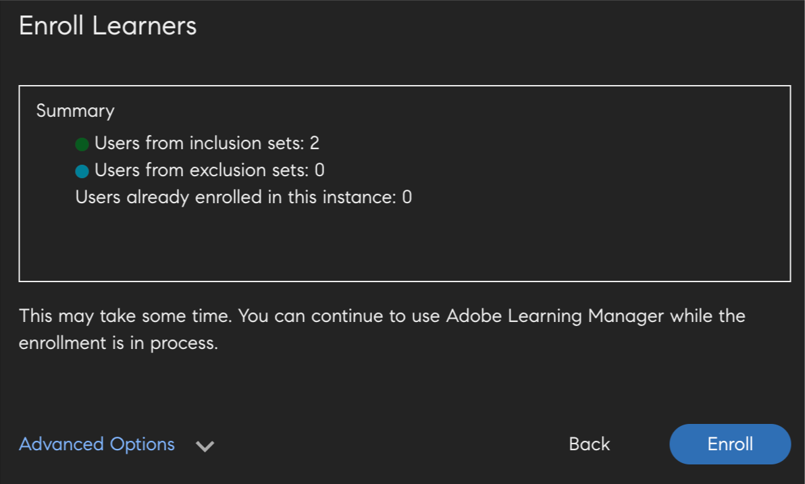
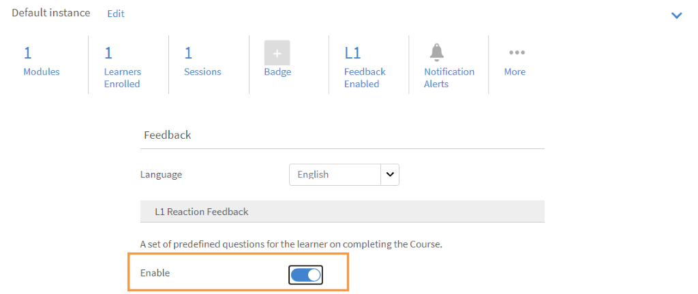

# コースモジュール、インスタンス、学習プログラムの作成

このドキュメントには、管理者の役割用のコースモジュール、インスタンス、コースを作成するためのヘルプ情報が記載されています。

作成者がコースを作成します。 学習者はコースを受講できます。管理者は、コースの消費量に基づいて学習者のパフォーマンスを追跡できます。

## 概要 {#overview}

作成者がコースを作成します。 その後、学習者がコースを受講すると、管理者はコースの消費量に基づいて学習者のパフォーマンスを追跡できます。 管理者は、このセクションで説明されているように、作成者が作成したコースを表示し、アクティビティを実行することができます。 管理者は、学習者向けに事前定義された一連のコースを含む、独自の学習プログラムを作成できます。

## コースのインスタンスの作成 {#createinstanceofacourse}

作成者がコースを作成した後でも、コースのインスタンスを作成できます。 コースのインスタンスを作成することで、異なる期間で同じコースを学習者に提供できます。 学習者は任意のインスタンスを選択して登録できます。 各インスタンスに独自のバッジ、フィードバック、その他の設定のセットを設定できます。

インスタンスを作成するには

1. 管理者Webアプリで、 **[!UICONTROL コース]** をクリックします。
1. コースのリストで、必要なコースを選択し、をクリックします **[!UICONTROL コースを表示]**.

   

   *コースの表示*

1. インスタンスを作成するには、 **[!UICONTROL インスタンス]** をクリックします。 デフォルトでは、すべてのコースにインスタンスが設定されています。 デフォルトのインスタンスを変更するか、インスタンスを追加することができます。 このコースインスタンスは削除できません。
1. インスタンスを作成するには、 **[!UICONTROL 新しいインスタンスを追加]** をクリックします。 コースの新規インスタンスが表示されます。
1. インスタンスのプロパティを入力します。

   * を **[!UICONTROL インスタンス名]** フィールドに、コースに関連付けるインスタンスの名前を入力します。 インスタンスに一意の名前を使用していることを確認します。
   * インスタンスの完了期限を指定します。 学習者は、この日付までにコース完了ステータスを達成する必要があります。
   * クリック **[!UICONTROL その他のオプションを表示]** をクリックして、他の期限オプションを表示します。
   * **[!UICONTROL 登録期限]:** 学習者がセルフ登録の場合に、学習目標への登録を期待される日付です。
   * **[!UICONTROL 登録解除の期限]:** 登録解除期限を設定することで、学習者自身による登録解除を制限できます。

   管理者は、要件に基づいて、コースまたは学習プログラムの完了期限を決定できます。 ただし、教室/バーチャルクラスルームベースのトレーニング用に1つ用意することをお勧めします。

   

   *完了期限の設定*

## インスタンスのプロパティの表示 {#viewpropertiesoftheinstance}

*インスタンスのプロパティの表示*

1. **モジュール：** コースの作成者が作成したモジュールの数
1. **登録済み学習者：** 管理者がコースに登録した学習者の数。
1. **セッション：** コース内のバーチャルクラスルームおよびクラスルームのモジュール数。
1. **フィードバックが有効になりました：** このコースでL1、L2、L3フィードバックを有効にするかどうかを表示します。

## インスタンスの廃止 {#retireaninstance}

インスタンスを廃止するには、次の手順を実行します。

1. インスタンスで、ドロップダウンメニューをクリックし、オプションを選択します **[!UICONTROL インスタンスを廃止]**.

   

   *インスタンスの廃止*

1. 廃止されたすべてのインスタンスを検索するには、タブをクリックします **[!UICONTROL 退職]** をクリックした場合。

## インスタンスの復元 {#restoreaninstance}

廃止されたインスタンスをアクティベート状態に復元するには、次の手順を実行します。

1. インスタンスで、ドロップダウンメニューをクリックし、オプションを選択します **[!UICONTROL インスタンスを再度開く]**.

   

   *インスタンスの復元*

1. これで、インスタンスがアクティブモードに復元されます。

## インスタンスレベルの電子メールを送信

登録済み学習者にインスタンスレベルの電子メールを送信するには：

1. 「インスタンス」ページで、インスタンスのオプションを選択し、 **[!UICONTROL 登録済み学習者の電子メール]**.

*インスタンスに登録されている電子メール学習者*

1. お知らせの作成ダイアログで、「電子メールとして入力」を選択します。 件名を指定し、メッセージを入力して「保存」をクリックします。 トレーニングが自動的に選択されます。

   

   *電子メールのお知らせの作成*

1. クリック後 **[!UICONTROL 保存]**&#x200B;様には、お知らせの作成が成功したことを示す確認メッセージが表示されます。 アナウンスを公開するには、 **[!UICONTROL 今すぐ公開]**.

   

### 様々なインスタンスへの学習者の登録

1. コースのリストからコースを選択します。
1. 選択 **[!UICONTROL 学習者]** をクリックします。
1. 選択 **[!UICONTROL 登録]**.

   

   *コースのパブリッシュ*

1. を [!UICONTROL **学習者の登録**] ダイアログでは、次の操作を実行できます。

   * 「インスタンスを選択」ドロップダウンから、学習者を登録するインスタンスを選択します。
   * 「学習者を含める」フィールドで、ユーザー、ユーザーグループまたはその両方を選択します。
   * インスタンスから除外する学習者を「学習者を除外」フィールドで選択します。
   * 選択したインスタンスに学習者を登録する場合は、ダイアログの下部で「はい」を選択します。

1. 選択 **[!UICONTROL 続行]**.

   

   *学習者の登録に進む*

### インスタンスの登録レポートの表示

1. コースのリストからコースを選択します。
1. 選択 **[!UICONTROL 学習者]** をクリックします。
1. 選択 **[!UICONTROL アクション]** > **[!UICONTROL エクスポート]**.

Excelファイルには、各インスタンスのワークシートが含まれています。 ワークシートは、次のフィールドで構成されます。

* 学習者
* 電子メール
* ユーザー固有ID
* コース名
* LOの一意ID
* ステータス
* 選択基準
* 登録日/登録解除日（UTCタイムゾーン）
* 完了日（UTCタイムゾーン）
* 期限（UTCタイムゾーン）
* 開始日（UTCタイムゾーン）
* クイズスコア
* マネージャー名
* 住所
* userState
* 専門分野
* コメント
* 訪問回数
* 訪問日
* タイムスタンプ（UTCタイムゾーン）
* 学習時間（分）

>[!NOTE]
>
>注：複数登録を有効にすると、各コースの学習者トランスクリプトレポートに複数の行（インスタンスごとに1行）が追加されます。
>
>コースごとに1行のみを見込むレポート自動処理を設定している場合は、複数登録機能を有効にする前に、レポート自動処理に必要な調整を行う必要があります。

## エスカレーションレベルを設定 {#escalation}

電子メール通知を送信する場合、管理者はエスカレーションレベルを明示的に選択する必要があります。

* マネージャー
* マネージャーとスキップレベルマネージャー

*エスカレーションレベルを設定*

## コースの管理 {#coursemoderation}

作成者がモジュールの追加、更新、削除を行い、コースを再度パブリッシュすると、すべての管理者がその旨の通知を受け取ります。 管理者は、変更を表示し、リンクをクリックして古いコンテンツと新しいコンテンツを比較し、それに応じて変更を承認または拒否できます。

コースの管理を有効にするには、次をクリックします。 **[!UICONTROL 設定]** > **[!UICONTROL 一般]**. を選択します **[!UICONTROL コースの管理]** チェックボックスをオンにすると、この機能が有効になります。

*コースの管理を有効にする*

通知をクリックすると、コースに対して作成者が行った変更が表示されます。 次に、作成者が行った変更を承認または拒否します。 承認を選択すると、コースが再パブリッシュされます。 更新を拒否すると、コースの以前のバージョンが引き続き存在します。 いずれの場合も、作成者に通知が送信されます。

*コースの更新に関する作成者要求*

同じコースを複数の作成者が更新している場合、管理者の通知に最新の変更または最後に実行した変更が反映されます。 その後、最新の変更を承認または拒否できます。

## L1およびL3フィードバックを追加 {#addl1andl3feedback}

コースの作成時に、L1およびL3フィードバックオプションを追加できます。

1. 管理者としてログインし、左ペインで「コース」をクリックします。 右側のページにすべてのコースが一覧表示されます。
1. L1またはL3フィードバックを追加するコースタイルをクリックします
1. 左ペインで「インスタンスのデフォルト」をクリックします。
1. L1フィードバックまたはL3フィードバックの横にある切り替えボタンの円をクリックして、有効にします。
1. L3質問の下にあるテキスト領域に、L3フィードバック質問を追加します。

## 必須のL1フィードバック {#mandatory-l1-feedback}

L1フィードバックでは、すべての質問または最初の質問を必須にすることができます。

*L1フィードバックですべての質問または最初の質問を必須にする*

これで、必須となる質問を作成できます。

*質問の作成*

何らかの理由で2つの必須の質問にテキストがない場合、質問はフィードバックフォームに表示されません。

>[!NOTE]
>
>学習プログラムインスタンスでこれらの設定を有効にするだけでは不十分です。 これらの設定は、学習プログラムの各コースに対して、コースインスタンスレベルで有効にする必要もあります。

「インスタンスのデフォルト」ページで、 **[!UICONTROL すべての質問を必須にする]**&#x200B;を追加すると、その後作成されるすべての新しいインスタンスに、これらの設定が継承されます。

*「インスタンスのデフォルト」ページの表示*

## コースレベルでのL1フィードバック {#l1-feedback-course-level}

以前のバージョンのLearning Managerでは、管理者が学習プログラムでL1フィードバックを有効にすることができました。

Learning Managerの本リリースでは、学習プログラムに含まれるすべてのコースについてL1フィードバックを管理者が送信できます。 管理者は、コースインスタンスレベルのすべてのコースで、L1フィードバックが有効になっていることを確認する必要があります。

1. 各コースでL1フィードバックを有効にするには、管理者アプリで「 **[!UICONTROL 学習プログラム]** > **[!UICONTROL 学習プログラムを表示]**.

1. クリック **[!UICONTROL インスタンス]** > **[!UICONTROL L1フィードバックが有効になりました]**.

1. オプションを有効にする **[!UICONTROL 各コースで有効にする]**.

   

   *コースフィードバックを有効にする*

   学習プログラムレベルでこのトグルを有効にしても、このプログラム内のコースに対するL1フィードバックはトリガーされません。 L1フィードバックを有効にするには、学習プログラムの各コースに移動し、L1フィードバックの切り替えを有効にします。

   

   *各コースでL1フィードバックを有効にする*

   すべてのコースでL1フィードバックが有効になっていても、学習プログラムインスタンスで無効になっている場合は、コースに対するL1フィードバックはトリガーされません。

## 言語別クイズレポート

クイズレポートは、学習プログラムまたはコースの完了後に、学習者のパフォーマンスを評価するのに役立ちます。

Learning Managerでは現在、13のインターフェイス言語および32のコンテンツ言語で学習できるようになっています。 このオプションは学習者にとって使いやすく、グローバルな学習者をサポートする上で便利ですが、管理者にとっては様々なロケールで試行されたレポートを取得するという複雑な作業が伴います。

複数の言語でコースを提供している場合、クイズレポートのデータを様々な言語で表示できます。 これまでは、管理者が作成したレポートには、クイズの対象言語に関係なく、回答がリスト形式で表示されていました。 **例**&#x200B;ユーザーがオランダ語でクイズを受けた場合、管理者はオランダ語のユーザーが受けたクイズレポートのみを一度に表示できるようになりました。 インターフェイス言語として英語を選択した管理者は、試行されたロケールに関係なく、すべてのユーザーのレポートを一度に表示することはできませんでした。

この問題は修正されました。管理者は、選択したコンテンツのロケールに関係なく、学習者が試行した各言語で、すべてのレポートを一度に表示できるようになりました。 様々な言語で試行されたクイズは、クイズレポートに追加列として追加されます。

## アカウントレベルでL1フィードバックを有効にする {#l1-feedback-account-level}

*アカウントレベルでL1フィードバックを有効にする*

管理者は、アカウントレベルでこの設定をオンにすることで、新しく作成されたコースと学習プログラムについてL1フィードバックを有効にできます。 ただし、この設定をオンにしても、既存のコースや学習プログラムには影響しません

有効にすると、すべての新しいトレーニングと新しいインスタンスで、フィードバックがデフォルトで有効になります。 作成者/管理者がインスタンスにアクセスし、インスタンスがデフォルトに設定されて手動でオフになった場合、適用されます。

L1フィードバックを有効にするには、管理者アプリで「 **[!UICONTROL 設定]** > **[!UICONTROL フィードバック]**.

*フィードバックの設定ページを表示*

クリック **[!UICONTROL 編集]** 右上隅で、オプションを切り替えてL1フィードバックを有効にします。

作成者がコースを作成すると、管理者アプリの「インスタンス」ページで **[!UICONTROL L1フィードバック]** が新しいコースに対して自動的に有効になります。

<!---->

また、L1フィードバックを無効にするには、 **[!UICONTROL 有効にする]** オプションを次に示します。

*L1フィードバックの有効化または無効化*

## L1フィードバックとL3フィードバックの記述的な質問を追加する {#descriptive}

11月にリリースされたLearning Managerには、記述的な質問を追加するオプションが用意されています。 管理者には、これらの質問を学習者に追加するオプションがあります。 この機能は、Learning Managerがデフォルトで提供する質問に追加されるものです。 質問の下のオプションを選択して、必要に応じて必須にすることもできます。

L1フィードバックには2つの記述的な質問を追加し、L3フィードバックには1つの記述的な質問を追加できます。

L1フィードバックを有効にすると、次のスナップショットに示すようにオプションを表示できます。

*L1フィードバックとL3フィードバックの記述的な質問を追加する*

コース完了後すぐに学習者にアンケートを表示する場合は、そのオプションを適宜選択します。

L1アンケートの出力例を以下に示します。 学習者は、以下の形式でアンケートを表示できます。 Test-1とTest-2は、記述的な質問です。

*コースフィードバックに関する質問の例*

L3フィードバックを有効にすると、次のスナップショットに示すようにオプションを表示できます。

*L3フィードバックを有効にする*

質問2は、L3フィードバックに関する記述的な質問です。 質問の下のオプションをクリックして、必須にすることができます。

L3アンケートの出力例を以下に示します。 学習者は、以下の形式でアンケートを表示できます。

*L3フィードバック出力の表示*

## L1およびL3フィードバックアンケートの設定 {#setupl1andl3feedbackquestionnaire}

L1およびL3フィードバックアンケートを設定したり、アカウントレベルでリマインダーを設定したりできます。

1. クリック **[!UICONTROL 設定]** その後 **[!UICONTROL フィードバック]** 管理者としてログインした後、左側のペインに表示されます。\
   フィードバックの設定ページが表示されます。このページには、次の2つのタブがあります。 **[!UICONTROL L1フィードバック]** および **[!UICONTROL L3フィードバック]**.\
   **[!UICONTROL L1フィードバック]** タブは、デフォルトのリストで構成されます **[!UICONTROL L1フィードバック]** 教室コースとセルフペースコースに関するアンケートと、リマインダーの設定。 イン **[!UICONTROL L3フィードバック]** タブには、L3フードバックのデフォルトのステートメントとリマインダー設定が表示されます。

1. 既存のアンケートを変更するには、ページの右上隅にある「編集」をクリックします。\
   イン **[!UICONTROL L1フィードバック]** タブの「はい」」ボタンと「いいえ」ボタンをクリックすると、各質問の有効と無効を切り替えることができます。\
   イン **[!UICONTROL L3フィードバック]** タブでは、デフォルトのフィードバックステートメントを変更できます。\
   クリック **[!UICONTROL 新しいリマインダーを追加]** ページ下部で、通知を送信するタイミングを選択します。

1. クリック **[!UICONTROL 保存]** をクリックします。

L1フィードバックでは、デフォルトの質問と共に2つのアンケートのセットが表示されます。 最初のアンケートのセットは、アクティビティベースのコースにも使用できるセルフペースコースを指します。 2番目のアンケートは、クラスルームとバーチャルクラスルームのタイプのコースで使用できます。

## チェックリストデータの書き出し {#export-checklist-data}

コースのリストから、チェックリストを含むコースを開きます。 左側のペインに、オプションが表示されます **[!UICONTROL チェックリスト]**.

*チェックリストデータの書き出し*

このオプションをクリックし、コースページで次の操作を実行します。

1. インスタンスとモジュールを選択します。
1. クリック **[!UICONTROL アクション]** > **[!UICONTROL エクスポート]**」を選択してから、学習者チェックリストレポートを書き出します。

を **[!UICONTROL チェックリスト]** ページの場合、インストラクターは、 **[!UICONTROL アクション]** ドロップダウンリスト。

CSVレポートには次のフィールドが含まれます。

* ユーザー名
* ユーザーの電子メール
* マネージャーの名前とメールアドレス
* トレーニング名
* トレーニングインスタンス
* インストラクターの名前とメールアドレス
* 送信日
* 評価ステータス
* 質問と実際のテキスト
* ユーザー状態
* プロフィール
* アクティブフィールド

ステータスフィルターを選択した後にレポートをダウンロードすると、適用されたステータスフィルターに基づいて、ダウンロードした学習者トランスクリプトレポートに学習者データが含まれます。 この追加されたフィルターは、学習者のトランスクリプトを生成する際にも、カスタム管理者とマネージャーに表示されます。

## コースの表示 {#viewingcourses}

管理者は、利用可能なすべてのコースを一覧表示することができます。   クリック **[!UICONTROL コース]** 左ペインに、検索オプションとフィルターオプションを含むコースのリストが表示されます。 コースのサムネールで、各コースのコースの有効性の割合を確認することもできます。

>[!NOTE]
>
>学習者が特定のコースを完了したら、そのコースを廃止してかまいません。また、特定のコースを公開したままの状態にすることもできます。 コースがパブリッシュ済み状態の場合にのみ、コースを廃止できます。 廃止されたすべてのコースのリストを表示するには、次をクリックします。 **[!UICONTROL 退職]** タブをクリックします。

## クイズのスコアを表示 {#viewquizscores}

1. コースサムネールでコース名をクリックします。
1. 左側のペインで「クイズスコア」をクリックします。

ユーザー名または各質問に基づいて、特定のコースのクイズスコアを表示できます。 必要に応じて、「ユーザー別」または「質問」タブを選択します。

ドロップダウンリストからインスタンスタイプを選択すると、コースの各インスタンスに基づいてスコアが表示されます。

## コースの学習者リストの管理 {#managelearnerslistforacourse}

1. コースサムネールでコース名をクリックします。
1. 左ペインで、 **[!UICONTROL 学習者]**.

*コース内の学習者の選択*

「学習者」ページでは、次のアクションを実行できます。

* 削除する学習者を選択して、 [!UICONTROL **アクション**] > [!UICONTROL **削除**].
* 出席をマークする学習者を選択し、「 [!UICONTROL **アクション**] > [!UICONTROL **完了をマーク**].

学習者がモジュールをリセットして、モジュールを再度使用できるようにするには、「 [!UICONTROL **リセット**]. ポップアップダイアログボックスで、「はい」をクリックして「リセット」を確定します。 完了したモジュールはリセットできません。 リセットできるのは、失敗したモジュールまたは不完全なモジュールのみです。

学習者リストをExcelシートに書き出すこともできます。 学習者リストをエクスポートするには、 [!UICONTROL **アクション**] > [!UICONTROL **エクスポート**].

>[!NOTE]
>
>コースに複数のインスタンスがある場合、Excelの学習者リストは各タブに分かれて表示されます。 学習者リストは、学習者名、ステータス、選択基準で構成されています。 学習者のステータスは次のとおりです **未開始**、または **処理中**、または **完了**.

## 学習者の出席の書き出し {#attendance}

教室およびVCコースの場合、このコースに出席した学習者のリストをあらゆるインスタンスについてダウンロードできます。

コースの詳細ページで、をクリックします。 **[!UICONTROL 出席とスコア付け]** 右側のペインに表示されます。

ページの右上隅にある **[!UICONTROL アクション]** ドロップダウンリスト。 次に、オプションをクリックします **[!UICONTROL 学習者リストの書き出し(PDF)]**.

*学習者のリストをPDFとして書き出し*

PDFでは、インストラクターと同じ学習者のセットを表示できます。

PDFをダウンロードすると、コースの作成時に使用されたタイムゾーン(UTC)が表示されます。

## 承認待ち状態の学習者の書き出し

管理者、マネージャーまたはカスタム管理者は、承認待ちの登録状態にある学習者のデータを書き出すことができます。 次の方法でデータを書き出すことができます **コース/学習者** タブをクリックし、「アクション」ドロップダウンリストをクリックします。

このオプションは、マネージャーにより承認されたコースに、登録/承認待ちの学習者が存在しない場合に表示され、空のレポートが生成されます。 また、学習者が承認待ち状態、登録済み状態、保留中状態および登録解除状態の場合に書き出すこともできます。

承認待ちのユーザーの場合、このレポートには、アクティブ、削除されたユーザーおよび一時停止されたユーザーのデータが含まれます。 また、レポートには、承認待ち状態にある社内ユーザーと社外ユーザーのデータも含まれます。

承認待ち状態であった学習者が登録を取り消した場合、その記録はレポートに表示されません。 また、承認待ち状態であった学習者が、管理者/マネージャー/カスタム管理者の登録によってコースに登録された場合、その記録はレポートに表示されます。

## L1およびL3フィードバックを表示 {#viewl1andl3feedback}

学習者がコースに関して提供するL1フィードバックと、マネージャーが学習者向けに提供するL3フィードバックを表示できます。

1. 「コース」リストの任意のコースタイルをクリックします。
1. 左側のパネルで「L1フィードバック」または「L3フィードバック」をクリックして、受け取ったフィードバックを表示します。
1. ドロップダウンリストからインスタンスを選択して、その特定のインスタンスのフィードバックを表示します。

## コースのプレビュー {#previewcourses}

管理者はコースをプレビューできます。 **[!UICONTROL 学習者としてプレビュー]** コースモジュールの表示中のオプション。

1. クリック **[!UICONTROL コース]** 管理者としてログインした後、左側のペインに表示されます。
1. ページ上のコースのリストから任意のコースタイルをクリックします。
1. 左ペインで「学習者としてプレビュー」をクリックし、ページ上のモジュール名をクリックして、プレーヤーでコースモジュールをプレビューします。

## コースの有効性 {#courseeffectiveness}

コースの有効性は、学習者の観点からコースの有用性を理解するために評価されます。 これは、コース内容に関する学習者からのフィードバック、学習者のコースのクイズ結果、およびコースでの学習に基づいて学習者を評価するマネージャーからのフィードバックの組み合わせです。

管理者は、以下のスナップショットに示すように、コースのサムネールでコースの有効性の評価を表示できます。 このコースの評価は100になっています。

<!---->

L1、L2、L3フィードバック値を考慮して、コースの有効性の評価値が届きます。 各フィードバックの内訳を表示するには、「コースの有効性」の値をクリックします。 次のようなポップアップが表示されます。

*L1、L2、L3フィードバックのコースの有効性を表示*

このサンプルスナップショットでは、1人のうち1人のユーザーが3つのフィードバックをすべて受信したため、スコアは100/100です。 この表から、3つのフィードバック（L1、L2、およびL3）のいずれかがコースに提供されていない場合、全体的な有効性に悪影響を及ぼすことが分かります。 ポップアップの右下隅にある下矢印をクリックし、コースの有効性の計算方法を表示します。

*コースの有効性の計算*

上記の円グラフのように、マネージャーからのL3フィードバックにはより多くの重みが与えられます。

## コースと学習プログラムの検索 {#searchingcoursesandlearningprograms}

AdobeのLearning Managerでは、選択したコースや学習プログラムをすばやく簡単に見つけることができます。 コースは、次の2つの方法で検索できます。

1. 検索フィールドを使用します。 右上隅に表示されている検索アイコンをクリックします。 検索フィールドが表示されます。 コース名、またはコースに関連付けられているキーワードを入力して、コースや学習プログラムを検索します。 また、Captivate、C、Java、HTMLなどの定義済みのタグを使用して検索することもできます。 タグは検索フィールド内で検索可能です。つまり、入力と同時にタグが検索フィールドに表示されます。
1. フィルターを使用して、コースや学習プログラムのリストをフィルタリングします。 「すべて」、「公開済み」、「草案」、「撤回済み」などの状態で、コースを絞り込むことができます。 管理者モードで、ドラフトフィルターが表示されない。

「コンピテンシー」をクリックして選択すると、コンピテンシーに基づいて検索できます。 管理者は、4つの方法でコースを並べ替えて、必要なコースを見つけやすくすることができます。 「並べ替え条件」をクリックして、アルファベット昇順、アルファベット降順、コース更新日、コースの有効性を選択します。

<!---->

学習プログラムは、アルファベットの昇順、アルファベットの降順、更新日の3通りの方法でソートできます。

## 学習者の登録 {#enrollinglearners}

同じ手順に従って、学習者をコース、学習プログラムおよび資格認定に登録できます。 マネージャーは、次の手順を使用して、自分の下に学習者を登録することもできます。

管理者は、組織の要件に従って一部の学習者を必須コースに登録します。

1. パブリッシュされたコースタイルにマウスを合わせ、「学習者を登録」をクリックします。\
   または、公開されているコースタイルをクリックし、左ペインの学習者をクリックします。 学習者のリストを含むページが表示されます。 「登録」をクリックします。\
   学習者の登録ダイアログが表示されます。

1. 「インスタンスを選択」ドロップダウンからインスタンスを選択します。 ドロップダウンには、アクティブなインスタンス、廃止されたインスタンス、期限切れのインスタンスを含むすべてのインスタンスが一覧表示されます。

>[!NOTE]
>
>管理者は、学習者ページのドロップダウン矢印をクリックして「 」をクリックすることにより、登録されている学習者を削除することができます。 **[!UICONTROL アクション]** > **[!UICONTROL 削除]**.

*学習者の登録時のコメントの追加*

*学習者の登録*

## ユーザー

+++学習者を含める

含めるユーザーグループと個々の学習者を（電子メールIDまたは名前を使用して）選択します。 同じセットの下の交差点にすべてのユーザーグループを追加します。 ユニオンに別のユーザーグループを追加するには、新しい包含セットを使用します。

+++

+++学習者を除外

除外するユーザーグループと個々の学習者を（電子メールIDまたは名前を使用して）選択します。 同じセットの下の交差点にすべてのユーザーグループを追加します。 ユニオンに別のユーザーグループを追加するには、新しい包含セットを使用します。

+++

## ユーザーの電子メールID

+++電子メールID

登録する学習者の電子メールIDをセミコロン、カンマ、行間で区切ってコピー&amp;ペーストします。 次を使用します **[!UICONTROL 電子メールIdの検証]** エントリを検証するオプション。 すべての無効なエントリは赤でマークされて表示されます。 これらのエントリを削除または修正し、をクリックして続行します。 **[!UICONTROL 続けて。]**

*学習者の登録*

概要ダイアログボックスが表示され、包含セット、除外セットおよびコースインスタンスに登録済みのユーザーの数が示されます。

+++

### 学習者の登録時のコメントの追加 {#enroll-comments}

<!----->

管理者またはマネージャーは、コースへの学習者の登録時にコメントを追加できます。 登録を受けるユーザーのグループに関する追加情報を記載できます。 このデータは、コースレポートに書き出されます。

コメントは **ない** 学習者に表示されます。

管理者が学習者のコースレポートを生成すると、コメントが追加されている場合はそのコメントがレポートに表示されます。 概要ダイアログボックスが表示され、包含セット、除外セットおよびコースインスタンスに登録済みのユーザーの数が示されます。

を **[!UICONTROL 学習者の登録]** ダイアログで、オプションを展開 **[!UICONTROL 詳細オプション]**. を **[!UICONTROL 追加コメント]** フィールドに、必要なコメントを入力します。

*学習者向けのコメントを追加*

## 登録済みユーザーの検索 {#searchforusers}

先行入力検索を使用して、学習目標の「学習者」セクションで登録ユーザーを検索します。 先行入力検索を使用すると、名前、電子メールID、およびuuidを使用して、登録されたユーザーを段階的に検索できます。

*登録済みユーザーの検索に関するチュートリアル*

このタイプの検索は、オートコンプリート、インクリメンタル検索、入力中の検索、インライン検索、またはクイック検索とも呼ばれます。

検索フィールドに学習者またはユーザーグループを入力すると、検索語に一致する1つ以上の項目が検索され、すぐに表示されます。

このプロセスを使用すると、連続して多数の検索を実行する場合に比べて、より迅速かつ煩雑に探しているものを見つけることができます。

すべてのインスタンスの学習者またはユーザーグループは、検索後に表示されます。 学習者が登録されているインスタンスは、学習者ごとに「 **[!UICONTROL インスタンス]** 列に追加します。

*検索結果の表示*

先行入力機能を使用すると、次の操作を実行できます。

* 登録されているユーザーを、インスタンスに関係なくすべて表示します。
* 1人以上のユーザーが登録されているすべてのユーザーグループを表示します。

検索の実行後は、インスタンスで学習者をフィルタリングすることはできません。 インスタンスを選択するオプション **[!UICONTROL インスタンスを選択]** ドロップダウンリストは無効になっています。

さらに、検索結果を使用して、学習者またはユーザーグループを選択し、次のアクションを実行できます。

* 登録解除
* 完了のマーク
* モジュールのリセット

検索の実行中、コース/学習プログラムに対して、「アクション」ドロップダウンリストの登録解除/一括オプションを使用することはできません。

## 登録、完了、またはその両方のためにQRコードを学習者と共有 {#shareqrcodewithlearnerstoenrollcompleteorboth}

AdobeのLearning Manager管理者は、QRコードを学習者と共有することで、コースへの登録をすばやく行うことができます。 3つの異なるQRコードを使用して、コースの「登録」、「完了」、「登録と完了」をマークします。

学習者は、AdobeのLearning Managerデバイスアプリを使用して各QRコードをスキャンするだけで済みます。

**QRコードをダウンロードするには、次の手順を実行します**:

1. クリック **[!UICONTROL コース]** 左側のナビゲーションパネルの「学習」セクションから。
1. コースを選択> **[!UICONTROL コースを表示]**.
1. クリック **[!UICONTROL インスタンス]** > **[!UICONTROL その他]** > **[!UICONTROL QRコード]**.

   <!---->

1. QRコードを有効にしてから、「登録」、「完了」、「登録して完了」の各ダウンロードアイコンをクリックして、それぞれのQRコードを含むPDFをダウンロードします。 これにより、管理者はQRコードを学習者と共有できるようになります。

   

   *QRコードを学習者と共有*

## コースのライフサイクル {#courselifecycle}

一般的なコースのライフサイクルは次のようになります。

**ドラフト**  – 作成者がコースの作成と保存を完了したとき。 現時点では、学習者がコースを利用することはできません。 この状態でコースを削除できます。

**公開日**  – 作成者がコースの公開を完了したとき。 この状態では、学習者がコースを登録できます。

**退職**  – 作成者は、公開されているコースを「撤回済み」の状態に移行することができます。この状態のコースは、学習者用のコースカタログには表示されません。 この状態でコースを再パブリッシュまたは削除できます。

**削除済み** - AdobeのLearning Managerアプリケーションからコースが完全に削除された段階です。 作成者がコースを削除できるのは、コースがドラフト状態のときのみです。 また、撤回済みの状態からコースを削除することもできます。

*コースライフサイクルのワークフロー*

## 通知設定 {#notificationsettings}

管理者は、通知設定を調整できます。 詳しくは、「 [通知。](user-notifications.md)

## よくある質問 {#frequentlyaskedquestions}

+++管理者としてモジュールをリセットするにはどうすればよいですか？

コースの「学習者」ページで、学習者またはグループを選択して、をクリックします。 **[!UICONTROL アクション]** > **[!UICONTROL モジュールのリセット]**.

*モジュールをリセットするオプションの表示*

オプションをクリックすると、選択したすべての学習者のモジュールのステータスがリセットされます。 完了したモジュールはリセットされません。

+++

+++学習者がコースに直接リダイレクトされるように、コースのURLを追加する方法を教えてください。

コースカードにマウスのポインターを合わせてクリック **[!UICONTROL URLをコピー]**. URLをコピーすると、学習者はURLを使用してコースに直接アクセスできます。

+++

+++インスタンスを再び開くにはどうすればよいですか？

廃止されたインスタンスを再度開くには、インスタンスのドロップダウンメニューをクリックし、 **[!UICONTROL インスタンスを再度開く]**.

+++
