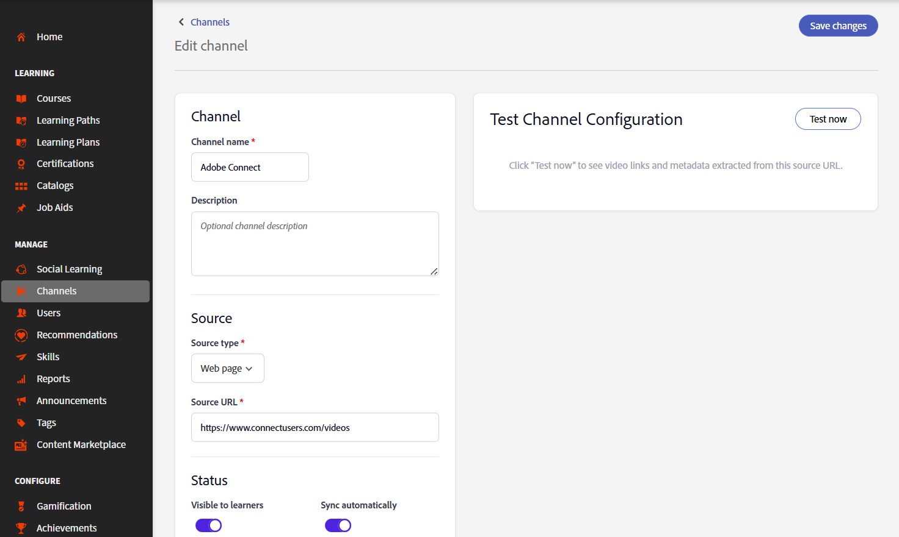

# チャンネルの作成（ベータ版）

>[!IMPORTANT]
>
>ベータ版の機能には不具合が含まれている場合があり、いかなる種類の保証も付けずに「現状のまま」提供されます。 Adobeは、ベータ版機能の一般提供の有無について独自の判断を行います。 Adobeは、（Adobeサポートサービスまたはその他の方法による）ベータ版機能を維持、修正、更新、変更、またはその他の方法でサポートする義務を負いません。 ベータ版の機能が一般に公開された場合は、適用される料金を含め、追加の利用条件が適用される場合があります。 ベータ版の機能は、提供の終了を含め、予告なく変更される場合があります。 お客様には、ベータ版機能の中断またはエラーのない機能やパフォーマンスに注意して使用し、いかなる方法でも信頼しないことを推奨します。 したがって、ベータ版機能の使用は、完全にお客様自身の責任で行うものとします。 製品機能および関連ドキュメントは、機能の進化に伴って変更される場合があります。 このドキュメントは、現在のベータ版のエクスペリエンスを反映しているため、最終的な製品ドキュメントまたは完全な製品ドキュメントと見なすことはできません。

組織では、非公式の学習コンテンツをキュレートしたwebページやConfluence Cloudページに、知識共有セッション、トレーニング記録、その他のビデオコンテンツを保存することがよくあります。 チャンネルを使用してAdobe Learning Managerをこれらのコンテンツソースに接続することで、学習者は複数のシステムを移動する必要がなくなり、ビデオの検索と使用が容易になります。 チャンネルを使用すると、企業のWebページやConfluence Cloudページにあるビデオベースの学習コンテンツを、検索可能な1つの場所で整理して共有できます。 学習者は、複数の社内サイトを検索する代わりに、Adobe Learning Managerから関連する録画を直接検索してアクセスできます。 詳細については、[チャネルを見つけて参加する](../../learners/feature-summary/discover-and-engage-with-channels.md)を表示してください。

管理者は、学習者がチャネルにアクセスできるようにする前に、チャネルの作成と管理、表示設定の構成、コンテンツとソースの同期、ビデオが利用可能かどうかの確認を行うことができます。 サポートされているビデオ形式は&#x200B;**MP4**&#x200B;および&#x200B;**WebM**&#x200B;です。

この記事では、これらのチャネル管理タスクを実行する方法について説明します。

**主な利点**

- 複数の社内ソースからのビデオベースの学習コンテンツを1つの場所に統合します。
- 複数のイントラネットの場所にあるビデオコンテンツをwebページにキュレートし、ALMのチャンネルとして表示します。
- 学習者は、複数のサイトに移動せずに、コンテンツを検索し、再生し、利用できます。
- コンテンツを元のソースと同期します。

## チャンネルを有効にする

チャネルは、管理者がアカウントに対して有効にする機能です。 有効にすると、エンタープライズWebページと、ビデオコンテンツを含むCloud Confluenceページに接続するチャンネルを作成できます。

チャンネルクローラーは、次の形式でコンテンツを表示するソースページからビデオを確実に抽出します。

- 表
- 箇条書きリスト
- 記事

**チャネル**&#x200B;機能を有効にするには：

1. Adobe Learning Managerに管理者としてログインします。

1. 左側のナビゲーションから&#x200B;**チャネル**&#x200B;を選択します。
     **チャネル**&#x200B;ページが開きます。

1. 「**設定**」タブを選択します。

   

   *管理者がアカウントのチャネルを作成できるように、**設定**&#x200B;タブでチャネル機能を有効にしてください。*

1. **チャネル機能**&#x200B;を有効にします。

    アカウントに対してチャネルが有効になっています。

## チャンネルの作成

チャンネルを作成して、Adobe Learning Managerでビデオをスキャンするコンテンツソースを定義し、チャンネルとビデオページの外観をカスタマイズします。

1. 「**チャンネル**」タブに移動し、「**チャンネルを追加**」を選択します。
     **チャネルの作成**&#x200B;ページが開きます。

   

   *チャネルの作成時に、コンテンツソースを定義し、表示と同期のオプションを構成します。*

1. **チャネル**&#x200B;セクションで、**チャネル名**&#x200B;と&#x200B;**説明**&#x200B;を入力します。

1. ドロップダウンメニューから&#x200B;**ソースの種類**&#x200B;を選択します。 次のオプションを使用できます。

   1. **Webページ**: Webページをクロールし、関連するメタデータと共にビデオリンクをインポートするには、このオプションを選択します。

   1. **Confluenceページ**: Confluence Cloudページからビデオリンクとメタデータを取得するには、このオプションを選択します。 Confluence Cloudに接続するには、次の詳細を入力します。
      - **Atlassianの電子メールアドレス**: Atlassianアカウントに関連付けられている電子メールアドレスを入力してください。
      - **Atlassian APIトークン**: Atlassianアカウントから生成されたAPIトークンを入力してください。 APIトークンの生成手順については、**APIトークンの作成方法**&#x200B;を選択してください。 このトークンは、ソースのクロール時の認証に使用され、暗号化されて格納されます。

      

      *Confluence Cloudでの認証に使用するAtlassianの電子メールアドレスとAPIトークンを入力してください。*

1. 選択したソースの種類のコンテンツの&#x200B;**ソースURL**&#x200B;を入力します。

1. 「**ステータス**」セクションで、次のオプションを設定します。

   1. **学習者に表示** ：学習者がチャネルを使用できるようにするには、このオプションを有効にします。 設定またはテストを続ける間は、この設定を無効にしてチャネルを非表示にします。

   1. **自動的に同期** ：このオプションを有効にすると、新しいビデオがソースに追加されたときに、チャンネルが自動的に更新されます。 チャンネルを手動で同期する場合は、この設定を無効にします。

1. （オプション） **[詳細設定の表示]**&#x200B;を選択し、必要に応じて次のオプションを構成します：

   1. **チャネルテーマの色**：色を選択して、チャネルの視覚的な外観をカスタマイズします。

   1. **クロール深度**:ビデオコンテンツをスキャンするリンクされたページのクロール深度を入力します。 最大クロール深度は&#x200B;**2**&#x200B;です。

   1. **クロールの頻度（時間単位）**: Adobe Learning Managerが新しいコンテンツや更新されたコンテンツのソースをチェックする頻度を入力します。

      

      *[詳細設定の表示]を選択して、チャネルテーマの色、クロールの深度、およびクロールの頻度を構成します。*

1. 「**今すぐテスト**」を選択して、ソースを検証します。 サンプルビデオは、設定されたソースから取得され、表示されます。

   

   ***今すぐテスト**&#x200B;を使用して、チャンネルを作成する前にビデオがソースから取得されることを確認します。*

1. **チャネルの作成**&#x200B;を選択します。 チャネルが作成され、**チャネル**&#x200B;リストに追加されました。

## チャンネルの検索

検索ボックスを使用して、名前でチャンネルをすばやく検索します。

1. 「**チャネル**」タブを選択します。
1. **チャネルの検索**&#x200B;ボックスを選択します。
1. **[チャンネルの検索]**&#x200B;ボックスに、チャンネル名またはその一部を入力します。
    検索に一致するチャネルのみを表示するようにリストフィルターを適用します。

   

   *検索ボックスにチャネル名を入力して、**チャネル**&#x200B;リストをフィルター処理します。*

## チャネル表示の管理

**アクション**&#x200B;メニューを使用して、1つまたは複数のチャンネルを同時に無効にしたり非表示にしたりします。

### チャンネルを無効にする

チャンネル設定を保持したまま学習者がコンテンツにアクセスできないようにするには、1つ以上のチャンネルを無効にします。

チャンネルを無効にするには：

1. **チャネル**&#x200B;に移動します。
1. 1つ以上のチャンネルの横にあるチェックボックスをオンにして、**アクション**&#x200B;を選択します。

   ![選択したチャンネルを無効にするには、[操作]メニューの[無効]をクリックします。](assets/disable-channels.png)
   *選択した1つ以上のチャネルを無効にするには、[アクション]メニューの[無効]を選択します。*
1. 「**無効**. 」を選択します **チャンネルを無効にする**&#x200B;ポップアップウィンドウが表示されます。
1. 「**無効**. 」を選択します 選択したチャンネルが無効になります。

### 学習者のチャンネルを非表示

1つ以上のチャンネルを非表示にすると、学習者は削除せずに利用できなくなります。

学習者に対してチャネルを非表示にするには：

1. **チャネル**&#x200B;に移動します。
1. 1つ以上のチャンネルの横にあるチェックボックスをオンにして、**アクション**&#x200B;を選択します。
1. 「**学習者から非表示**. 」を選択します。 **学習者に対して非表示**&#x200B;ポップアップウィンドウが表示されます。

   
   *チャネル構成を削除せずに、学習者のチャネルを非表示にします。*

1. 「**学習者に対して非表示**」を選択します。
    選択したチャネルは学習者から非表示になっています。

## チャンネルの編集

既存のチャンネルを編集して、設定を更新することができます。

チャンネルを編集するには：

1. **チャネル**&#x200B;リストから必要なチャネルを選択します。
     **チャネルの編集**&#x200B;ページが開き、現在のチャネル構成が表示されます。

1. 必要に応じてチャンネル設定を更新します。

   

   ***チャネルの編集**&#x200B;ページから、チャネルの名前、説明、ソース、および設定を更新します。*

1. （オプション）「**今すぐテスト**」を選択します。

1. 「**変更を保存**」を選択します。
    更新されたチャネル設定は保存されます。

## チャンネルの削除

不要になったチャンネルを削除することができます。

1. 「**チャネル**」タブに移動します。

1. 削除する各チャンネルの横にあるチェックボックスをオンにします。

1. チャンネルリストの右下から「**削除**」を選択します。  **チャンネルの削除**&#x200B;ポップアップウィンドウが表示されます。

   

   *選択したチャンネルの確認ダイアログが表示されます。*

1. 「**削除**」を選択します。
    選択したチャネルは完全に削除されます。 この操作は元に戻せません。
