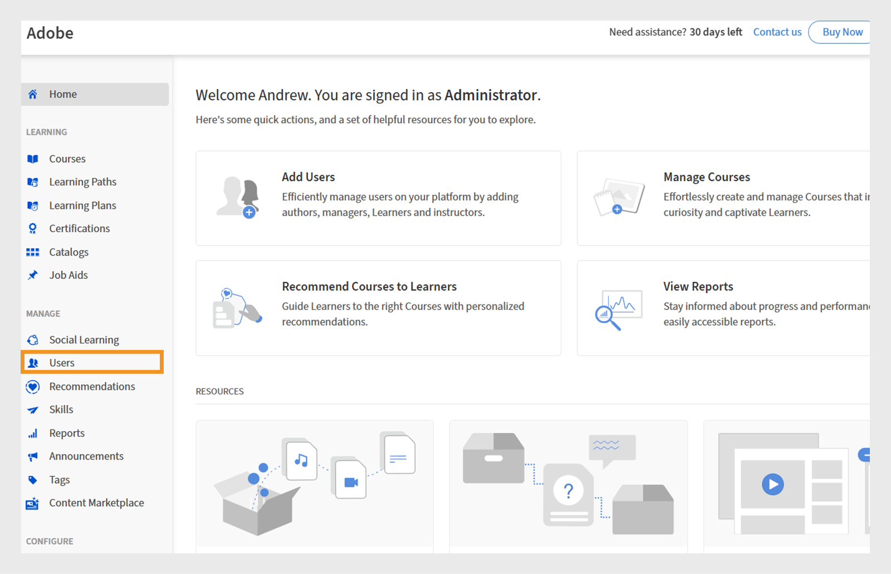

# スコープ指定のアナウンス権限を持つカスタムの役割

管理者は、特定のカタログおよびユーザーグループに制限されたアナウンス権限を持つカスタムの役割を作成できます。 これにより、アナウンスがターゲットとして指定され、関連性があり、意図する学習者にのみ表示されるようになります。 範囲を指定したアナウンスを使用すると、適切なユーザーが、他のユーザーに詳細を送信することなく、関連するアナウンスを受信できます。

## 特定のスコープを持つカスタムの役割を作成する

管理者は、特定のカタログおよびユーザーグループに限定されたアナウンス権限を持つカスタムの役割を作成できます。

特定の範囲を持つカスタムの役割を作成するには、次の手順を実行します。

1. Adobe Learning Managerに管理者としてログインします。
2. 左側のナビゲーションウィンドウで&#x200B;**[!UICONTROL ユーザー]**&#x200B;を選択します。

   
   _Adobe Learning Managerでユーザーにカスタムロールを割り当て、対象となるアクセス許可と責任を設定する_

3. 「カスタムの役割」を選択します。
4. 「カスタムの役割を作成」を選択します。

   
   _ユーザーにカスタムの役割を割り当てて、特定のユーザーグループまたはカタログのアクセス許可をカスタマイズし、管理制御を効率化する_

5. カスタムの役割の名前と説明を入力します。
6. 「アカウント権限」で「通知」を選択します。

   
   _カスタム管理者がスコープ内のターゲットの通信を管理できるようにするには、アカウント権限でアナウンスのアクセス許可を有効にします_

7. 「機能権限の範囲」で「カタログごとにアクセスを設定」を選択し、カタログを選択します。
8. 同じセクションで、「ユーザーグループごとにアクセスを設定」を選択し、必要な項目を選択します
ユーザーグループ。

   
   _ユーザーグループとカタログのスコープを設定して、カスタム管理者が割り当てられたスコープ内でのみアクセス許可を管理できるようにします_

9. このカスタムの役割を割り当てるユーザーを選択して追加します。 割り当てられたユーザーは、自分の範囲のアナウンスを作成できます。

カスタム管理者は、割り当てられたユーザーグループとカタログに限定してアナウンスを作成できます。これにより、メッセージが適切なオーディエンスに届き、不要な通知を防ぐことができます。 通知および電子メールのお知らせの場合、管理者はユーザーグループを追加できますが、追加できるのは定義された範囲内のユーザーのみです。 推奨およびマストヘッドアナウンスの場合は、割り当てられたスコープ内のユーザーグループのみを選択できます。

## 割り当てられたスコープのアナウンスを作成します

カスタム管理者は、割り当てられたユーザーグループとカタログに限定してアナウンスを作成できます。これにより、メッセージが適切なオーディエンスに届き、不要な通知を防ぐことができます。

割り当てられた範囲の通知を作成するには、次の手順を実行します。

1. Adobe Learning Managerにカスタム管理者としてログインします。
2. 左側のナビゲーションウィンドウで[**[!UICONTROL 通知]**]を選択します。
3. 「**[!UICONTROL 追加]**」を選択します。

   
   _管理者が対象のユーザーグループのアナウンスを作成および管理できるAdobe Learning Managerのアナウンスページ_

4. ドロップダウンメニューから「**[!UICONTROL お知らせタイプ]**」を選択します。
a. **[!UICONTROL 通知として]**
b. **[!UICONTROL マストヘッドとして]**
c. **[!UICONTROL 推奨事項として]**
d. **[!UICONTROL 電子メールとして]**
5. **[!UICONTROL マストヘッドとして]**&#x200B;を選択します。
6. 言語を選択し、マストヘッドの画像をアップロードします。
7. 必要に応じて、アクションボタンのURLを追加します。

   
   _アナウンスの種類の設定、添付ファイルのアップロード、操作ボタンの追加を管理者が実行できるアナウンスの作成画面_

   割り当てられたスコープは&#x200B;**[!UICONTROL スコープ]**&#x200B;セクションで事前に選択されているため、カスタム管理者が変更することはできません。

   >[!NOTE]
   >
   >**[!UICONTROL 通知]**&#x200B;および&#x200B;**[!UICONTROL 電子メール]**&#x200B;のアナウンスの場合、割り当てられた範囲と重複する場合は、追加のユーザーグループとカタログを含めることができます。

8. 「**[!UICONTROL 保存]**」を選択します。

カスタム管理者の範囲内の学習者のみがアナウンスを表示できます。 複数の種類のお知らせを作成する方法については、この[記事](/help/migrated/administrators/feature-summary/announcements.md)を参照してください。

## カスタム管理者による範囲のリセット

カスタム管理者は、管理者が公開されたアナウンスの範囲を変更した場合、その範囲をリセットできます。 範囲がリセットされると、更新された範囲がアナウンスに適用され、新しい範囲内の学習者のみがアナウンスを確認できるようになります。

範囲をリセットするには：

1. Adobe Learning Managerにカスタム管理者としてログインします。
2. 左側のナビゲーションウィンドウで[**[!UICONTROL 通知]**]を選択します。
3. 「**[!UICONTROL 公開済み]**」タブを選択します。
4. アナウンスを選択し、設定アイコンを選択します。
5. 「**[!UICONTROL 編集]**」を選択します。

   
   _編集、公開、その他のオプションを含む公開されたアナウンスを表示するアナウンス画面_

6. 「**リセット**」を選択します。

   
   _範囲の変更通知を示すアナウンス。カスタム管理者が範囲の選択をリセットして更新し、新しいアクセス許可を反映できるようにするオプションがあります_

範囲が更新され、更新された範囲内のユーザーのみが通知を表示できるようになります。

## 管理者UIで通知を編集する

管理者は、カスタム管理者が作成したすべてのアナウンスを編集および管理できます。 特定の範囲を持つカスタム管理者が作成したアナウンスを管理者が編集しようとすると、そのアナウンスに「**[!UICONTROL 削除]**」の範囲を示す警告メッセージが表示されます。 管理者は、通知を全員が利用できるように、範囲を削除することができます。 この場合、カスタム管理者は、アナウンスの範囲が変更されたことを知らせる警告を受け取ります。

管理者UIで通知を編集するには、次の手順を実行します。

1. Adobe Learning Managerに管理者としてログインします。
2. 左側のナビゲーションウィンドウで[**[!UICONTROL 通知]**]を選択します。
3. 「**[!UICONTROL 公開済み]**」タブを選択します。
4. アナウンスを選択し、設定アイコンを選択します。
5. 「**[!UICONTROL 編集]**」を選択します。

   
   _編集、公開、その他のオプションを含む公開されたアナウンスを表示するアナウンス画面_

6. 「**[!UICONTROL 削除]**」を選択します。

   
   _スコープが指定されたユーザーグループ用に作成されたお知らせを管理者が編集できるようにするには、スコープを削除する必要があることを示す[お知らせ]画面_

管理者は、範囲を削除した後で、アナウンスを編集できます。
