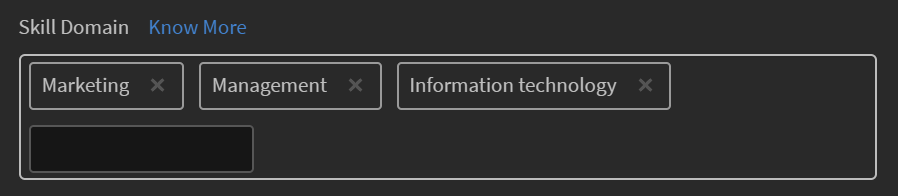

# スキルドメインへのスキルのマッピング

ユーザーが投稿した投稿をAI対応のキュレーションエンジンで特定のスキルドメインに自動キュレーションするには、ユーザーの企業で、カスタマイズしたスキルがLearning Manager LMSでサポートされるスキルドメインにマッピングされている必要があります。

スキルの作成時、管理者はLearning Managerがサポートする最も関連性の高いスキルドメインにスキルをマッピングできます。 この設定は、自動キュレーションプロセスで考慮されます。 Learning Manager LMSには、次のスキルが含まれています。

* サプライチェーン管理
* 会計
* 科学研究と工学
* コンピューターのセキュリティ
* 戦略的管理
* ソーシャルメディア
* 医学
* 財務
* 事業場の安全
* ソフトスキル
* 商法
* 管理
* 人事管理
* 技術的コミュニケーション
* ビジネス倫理
* 顧客関係管理
* 情報技術
* 生産と製造
* Marketing
* 品質管理
* ビジネスプロセス
* ラーニング
* デザイン
* Analytics
* Sales

スキルドメインを追加するには、次の手順に従います。

1. 管理者アプリの左側のペインで、 **[!UICONTROL スキル]**.
1. スキルを追加するには、 **[!UICONTROL 追加]** をクリックします。
1. を **[!UICONTROL スキルを追加]** ダイアログで、スキルとスキルの説明を追加します。
1. を **[!UICONTROL スキルドメイン]** セクションで、スキルドメインを追加します。 ドメインを入力すると、ドメインが追加されます。 これらのドメインは、上記のリストから入力されます。

   

   *「スキルドメイン」セクションにスキルドメインを追加します*

1. 変更を保存するには、 **[!UICONTROL 保存]**.

ユーザーが掲示板にコンテンツを投稿すると、掲示板にマッピングされたスキルに対する信頼度のスコアに応じて、コンテンツがキュレートされ、承認または却下されます。

<!---->

アップロードされているコンテンツの信頼度スコアが50%を超えているかどうかによって、そのコンテンツは掲示板にアップロードされます。 コンテンツが基準を満たしている場合は、コンテンツが正常にキュレートされ、掲示板で利用できるようになったことを示す通知が表示されます。

*信頼度スコアに応じた通知の表示*

