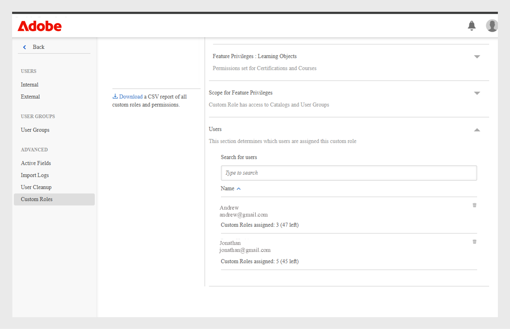
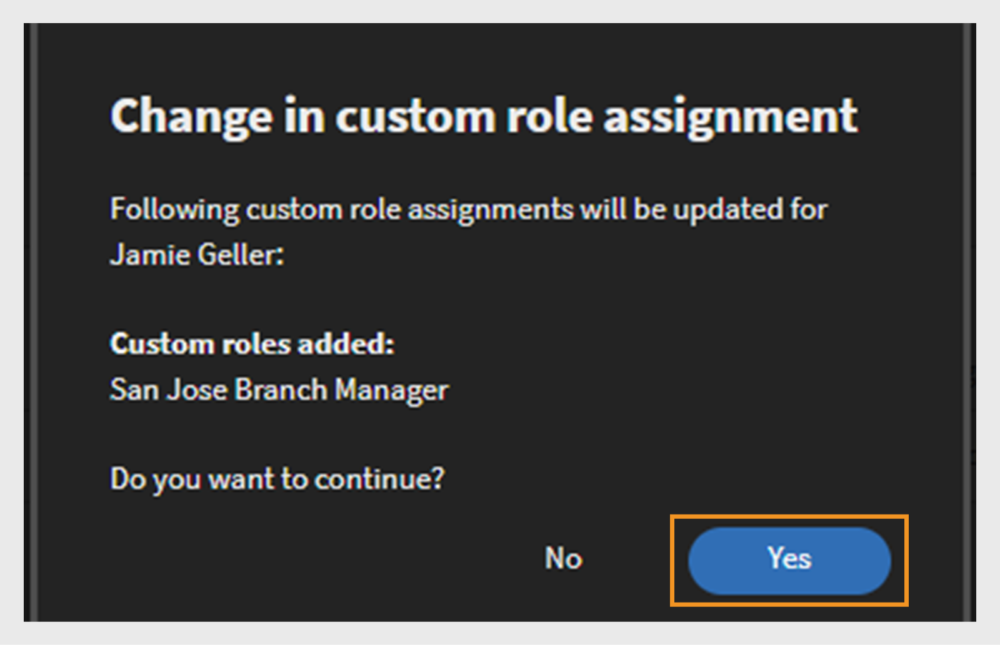
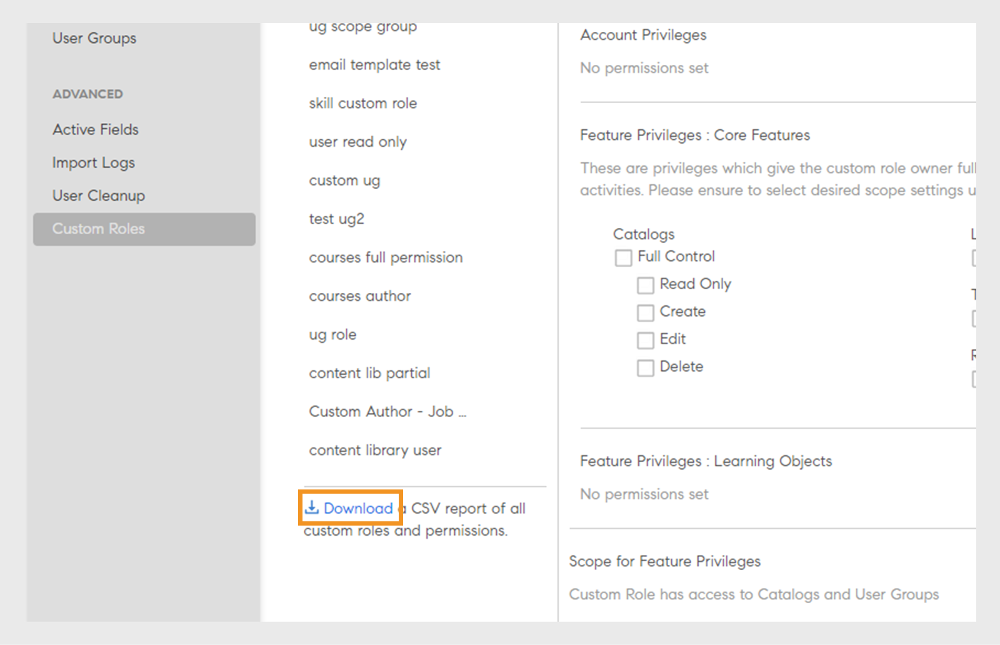

# カスタム役割

この機能を使用すると、カスタムの役割を定義し、特定の責任を一連のユーザーに割り当てることができます。 この機能を使用すると、個人の既存の役割の範囲外の責任を割り当てることができます。

カスタムの役割を作成して、作成機能を特定のカタログに限定することができます。 また、レポート管理専用の役割を作成することもできます。 このような役割は、これらの特定の責任を負うことになる個人に割り当てることができます。

>[!NOTE]
>
>新しいカスタム役割を追加しても、既存のカスタムユーザーグループや、すべての管理者、すべての作成者などの役割ベースのグループには影響しません。

管理者は、役割ごとにカスタマイズされた権限を持つ、カスタムの管理者およびカスタムの作成者の役割を作成できます。 各ロールに関連付けられている権限の概要を次に示します。

**カスタム作成者の役割のアクセス許可**

カスタム作成者は、次のタスクを実行できます。

* コンテンツライブラリにアクセスして、コアコンテンツを追加、編集、または削除します。
* 作成、編集、削除：
   * コース
   * 作業計画書
   * 資格認定
   * 学習パス
   * 学習プラン

管理者および作成者（カスタム管理者およびカスタム作成者を含む）は、学習オブジェクト(LO)を外部で共有されたカタログと共有できます。 管理者と作成者は、学習目標(LO)の作成時に外部で共有されたカタログを検索できる必要があります。

**カスタム管理者の役割のアクセス許可**

カスタム管理者の役割は、アカウントレベルの権限へのアクセスを含む、一連の管理者の責任を複製します。 カスタム管理者には、次のような学習アクティビティに関連する主な機能を管理するための権限が付与されます。

* 学習プラン
* カタログ
* レポート
* タグ

さらに、カスタム管理者は次の操作を実行できます。

* コースと作業計画書（ユーザーの登録と削除など）を管理します。
* 資格認定、学習パス、学習プランを作成、編集、削除できます。
* すべての学習目標(LO)のレポート機能と登録機能にアクセスできます。

管理者は、CSVで作成された権限をAdobe Learning Manager内で表示できるようになりました。 「フィルター」オプションは、作成された管理者とCSVを介して読み込まれた管理者によって、カスタムの役割をフィルターします。 カスタムの役割を選択すると、その役割の権限が表示されます。

_カスタムの役割のフィルター処理_

## カスタム役割の作成 {#create-role}

1. 管理者としてログインします。 **[!UICONTROL ユーザー]** > **[!UICONTROL カスタムロール]**&#x200B;を開きます。
2. **[!UICONTROL ロールの作成]**&#x200B;を選択します。 [**[!UICONTROL 新しいロールの作成]**]タブが開きます。

   

   *カスタムの役割の作成*

3. **[!UICONTROL ロールの名前]**&#x200B;フィールドに名前を入力します。
4. **[!UICONTROL アカウント権限]**：これらの権限により、ロールの所有者は特定のシステム構成の側面にアクセスでき、アカウント全体で動作します。 必要なアクセス権限を選択してください。 ユーザーに対して、割り当てられた権限に対するフルコントロールが付与されます。

   管理者は、「ユーザー」セクションに内部/外部ユーザー、ユーザーグループ、および詳細ユーザーを含む詳細な権限を付与できます。

   >[!NOTE]
   >
   >   これらの権限にはスコープは適用されません。

   

   *範囲を設定する*

5. **機能の特権 – コア機能**：学習活動を管理するための特定の機能へのアクセスを許可するために使用されます。 このオプションを使用して、以下の機能に対する権限を付与することができます。

   管理者は、カタログの読み取り専用、作成、編集、削除の権限など、詳細な権限を付与できます。

   * カタログ
   * レポート
   * タグ

   

   *カタログ、レポート、およびタグの範囲を設定する*

6. **機能の特権 – 学習目標：**&#x200B;このオプションを使用して、LOに関連する機能へのアクセスを提供します。 管理者は、コース、学習パス、資格認定、作業計画書など、すべての学習目標に対する詳細な権限を付与できます。 ユーザーは、作成、編集、削除、または読み取り専用アクセスなどの権限をユーザーに割り当てることができます。

   * 資格認定
   * コース
   * 作業計画書
   * 学習プログラム

   また、学習目標に特定の操作制御を付与することもできます。 以下に示すいずれかの権限を付与することができます。

   * 読み取り専用
   * Create
   * 編集
   * 削除
   * 登録
   * レポート

   また、LOにフルコントロールを付与することもできます。

   

   *特定のアクセス許可を付与する*

7. **機能の特権のスコープ：**&#x200B;この役割に割り当てられている機能の特権のスコープは、特定のユーザーグループまたは1つ以上のカタログに制限できます。

   カタログの場合：**[!UICONTROL すべてのカタログ]**&#x200B;に対するアクセス権を指定する場合は該当するラジオボタンを選択し、特定のカタログに対するアクセス権を指定する場合は「**[!UICONTROL カタログごとにアクセス権を設定]**」オプションを選択します。 複数のカタログを選択することもできます。

   ユーザーグループの場合：**[!UICONTROL すべてのユーザーグループ]**&#x200B;に対するアクセス権を指定する場合は該当するラジオボタンを選択し、特定のユーザーグループに対するアクセス権を使用する場合は「**[!UICONTROL ユーザーグループごとにアクセス権を設定]**」オプションを選択します。 ユーザーグループを 1 つだけ指定することもできます。

   >[!NOTE]
   >
   >アカウント権限で「アナウンス」、「ゲーミフィケーション」、「電子メールテンプレート」、「スキル」、「ユーザー」を選択した場合、ユーザーグループへのアクセス権はデフォルトですべてのユーザーグループに提供され、このオプションは無効になっています。

   「アカウント権限」で「学習プラン」が選択されている場合、すべてのカタログとすべてのユーザーグループに対するアクセス権がデフォルトで指定され、「カタログごとにアクセス権を設定」オプションと「ユーザーグループごとにアクセス権を設定」オプションが無効になります。

   

   *特権の範囲を定義する*

>[!NOTE]
>
>   Learning Manager 27.6 では、各カタログに異なる権限セットを付与することにより、複数のカタログに対する範囲が設定されたカスタム役割を作成することができます。

カタログに対して各種の権限を設定するには、以下の手順を実行します。

1. 「**[!UICONTROL カタログごとにアクセス権を設定]**」オプションをクリックします。
1. 目的のカタログを選択して、そのカタログの権限レベルを表示します。 以下の権限が表示されます。

   <table>
        <tbody>
        <tr>
          <td>
          
<b>権限</b>
</td>
          <td>
          
<b>説明</b>
</td>
        </tr>
        <tr>
          <td>
          
フルコントロール
</td>
          <td>
          
すべての学習目標に対してフルコントロールが設定されます。 設定される権限は、「追加」、「編集」、「削除」、「読み取り専用」、「登録」、「レポート」です。 
</td>
        </tr>
        <tr>
          <td>
          
レポート
</td>
          <td>
          
学習目標の「レポート」タブに対するアクセス権だけが設定されます。
</td>
        </tr>
        <tr>
          <td>
          
登録
</td>
          <td>
          
学習目標に対する登録権限だけが設定されます。
</td>
        </tr>
        <tr>
          <td>
          
読み取り専用
</td>
          <td>
          
カタログ内の学習目標の表示権限だけが設定されます。
</td>
        </tr>
        </tbody>
      </table>

1. 要件に応じて、権限の有効と無効を切り替えます。
1. 「**[!UICONTROL OK]**」をクリックして変更内容を保存し、「**[!UICONTROL 保存]**」をクリックしてカスタム役割の変更内容を保存します。

ここで、以下のケースを例として考えてみます。

カスタムユーザーが特定の学習目標に対して持つ権限は、その学習目標とカタログで共通する権限ということになります。

カスタムユーザーに対して、コースに対するフルアクセス権、カタログ A に対する読み取り専用アクセス権、カタログ B に対するフルアクセス権限が設定されているとします。この場合、カタログ A のコースに対しては読み取り専用アクセス権が設定され、カタログ B のコースに対してはフルアクセス権限が設定されることになります。

カスタム役割が割り当てられているユーザーは、以下の操作を実行することができます。

* 自分がアクセス権を持っているカタログのコンテンツだけを表示する。
* 学習目標が含まれているカタログに対する権限に従い、その学習目標にアクセスする。

  管理者は、次の操作を実行できます。

* カスタム役割に対して複数のカタログを選択する。
* 任意のタイミングで権限を変更する。
* 権限を設定する必要がなくなった範囲からカタログを削除する。
* カタログに対する権限を設定する際に、そのカタログに対して暗黙的に読み取り専用権限を設定する。

  以下の表に、権限がどのように設定されるかを示します。

  <table>
    <tbody>
     <tr>
      <td>
       
<strong> </strong>
</td>
      <td>
       
<strong>カタログレベルの権限</strong>
</td>
     </tr>
     <tr>
      <td>
       
<strong>学習目標レベルの権限</strong>

       
<strong>（コースなど）</strong>
</td>
      <td>
       
フルコントロール
</td>
      <td>
       
登録
</td>
      <td>
       
レポート
</td>
      <td>
       
読み取り専用
</td>
     </tr>
     <tr>
      <td>
       
フルコントロール
</td>
      <td>
       
フルコントロール
</td>
      <td>
       
登録
</td>
      <td>
       
レポート
</td>
      <td>
       
読み取り専用
</td>
     </tr>
     <tr>
      <td>
       
登録
</td>
      <td>
       
登録
</td>
      <td>
       
登録
</td>
      <td>
       
読み取り専用
</td>
      <td>
       
読み取り専用
</td>
     </tr>
     <tr>
      <td>
       
編集と削除
</td>
      <td>
       
編集と削除
</td>
      <td>
       
読み取り専用
</td>
      <td>
       
読み取り専用
</td>
      <td>
       
読み取り専用
</td>
     </tr>
     <tr>
      <td>
       
レポート
</td>
      <td>
       
レポート
</td>
      <td>
       
読み取り専用
</td>
      <td>
       
レポート
</td>
      <td>
       
読み取り専用
</td>
     </tr>
    </tbody>
   </table>

1. **ユーザー：**&#x200B;このオプションを使用して、このロールを割り当てるユーザーを決定します。 検索ボックスを使用して、1人以上のユーザーを選択することができます。

   **カスタムロールCSVアップロードにユーザーを追加：** CSVアップロードを使用してユーザーを追加するには、管理者がユーザーをインポートするために使用した.csvファイルにCustomRole列を追加します。 カスタムの役割を割り当てるユーザーのCustomRole列に、ユーザーの役割を入力します。 CSVファイルをアップロードするには、**[!UICONTROL 追加/CSVをアップロード]**&#x200B;をクリックします。

   * ユーザーグループを検索することはできません。
   * 既に管理者ロールが割り当てられているユーザーを検索することはできません。
   * ユーザーに新しいカスタム役割を割り当てると、以前のユーザーのカスタム役割が上書きされます。

   <!---->

   * 設定へのアクセス許可を持つカスタム管理者は、ユーザーエンティティへのアクセス許可がない場合でも、データソースからユーザーを同期または同期するためのスケジュールを構成できます。
   * ユーザーのエンティティに対する権限を持っているカスタム管理者は、自分自身に管理者の役割を割り当て、標準の管理者になることができます。

## ユーザーに複数のカスタムの役割を割り当てる

次の方法で、複数のカスタムの役割をユーザーに割り当てることができます。

* UIを使用する場合：Adobe Learning Managerインターフェイスから複数のカスタム役割を1人のユーザーに直接割り当てることができます。
* CSVアップロードの使用： CSVファイルをアップロードして、複数のユーザーに複数のカスタム役割を一度に割り当てることができます。

これにより、システム全体でのユーザーアクセスの管理と権限の制御が容易になります。

### ユーザーインターフェイスを使用した複数のカスタムの役割の割り当て

Adobe Learning ManagerのAdmin Consoleを通じて複数のカスタムロールを割り当てる機能は、オンボーディング、権限調整、小規模なアップデートなどに最適な、迅速で直感的なオプションです。 CSVアップロードを使用せずに役割を視覚的に割り当てることができるため、エラーのリスクが軽減され、リアルタイムの可視性が実現します。 この方法は、責任のシフトに応じた迅速な更新をサポートし、必要に応じて役割の切り替えおよび委任が可能です。

ユーザーに複数のカスタムの役割を割り当てるには、次の手順に従います。

1. 管理者としてログインし、**[!UICONTROL ユーザー]**&#x200B;を選択します。
2. 左側のパネルで「**[!UICONTROL カスタムの役割]**」を選択します。
3. 新しいカスタム役割を作成し、アカウント権限、カタログ、学習目標、またはスコープを追加します。 [ここに記載されている手順](#create-a-custom-role)を参照してください。
4. ユーザーをカスタムの役割に追加します。

   
   _ユーザーをカスタムの役割に割り当てる_

5. 「**[!UICONTROL 保存]**」を選択します。

必要に応じて、ユーザーに複数のカスタムの役割を選択します。 各ユーザーには、最大50個のカスタムの役割を割り当てることができます。 使用可能なロールの数は、割り当てごとに減少します。

ユーザーを追加のカスタム役割に割り当てた後、各ユーザーが使用できる役割の割り当て数を表示できます。

>[!NOTE]
>
>各ユーザーに最大50個のロールを割り当て、各ロールに最大500個のユーザーを追加できます。

### CSVを使用した複数のカスタムの役割の割り当て

Adobe Learning ManagerでCSVファイルをアップロードすると、カスタムロールを効率的に一括割り当てできます。 このプロセスは、多数の従業員のオンボーディング、チームの再編成、または新しいトレーニングへのアクセスの更新に特に有益です。 CSVを読み込むと、手作業を節約し、割り当ての一貫性を確保し、エラーを減らすことができます。 この方法は、合併、部門全体の更新、またはグローバルなトレーニング展開の際に特に便利です。 この方法は、管理者が時間を節約し、役割を標準化し、ガバナンスを維持するのに役立ちます。

次の2つのファイルをBoxにアップロードすることで、CSV読み込みを使用して複数のロールをユーザーに割り当てることができるようになりました。

* [role.csv](assets/role.csv)
* [user_role.csv](assets/user_role.csv)

user_role.csvファイルには、「カスタム役割」フィールドと「ユーザーID」フィールドが含まれています。

role.csvファイルには、フィールド、カスタム役割、作成のソース、カタログ、ユーザー、コース、学習パスなどの詳細情報が含まれています。

CSVファイルに誤ったデータが含まれている場合、または制限（ユーザーあたり50のロールと、ロールあたり500のユーザー）を超えている場合は、エラーを示すメッセージが表示されます。

_カスタムロールのエラー通知_
ユーザーは、ロールが割り当てられたときに、ロールの名前などのメール通知を受信します。

### カスタム役割を管理

管理者は、責任の変更に応じて、Adobe Learning Managerでユーザーのカスタムロールを更新、追加、削除できます。 これにより、学習履歴や登録データに影響を与えることなく、現在の役割に合わせてアクセスできるようになります。 管理者は、**[!UICONTROL ユーザー]**&#x200B;ページからユーザーを検索し、その役割を表示し、「カスタムの役割を管理」オプションを使用して調整することができます。 このガイド付きインターフェイスを使用すると、ガバナンスとセキュリティを維持しながら、役割を簡単に追加または削除できます。

>[!NOTE]
>
>カスタム管理者は、カスタムの役割を管理（カスタムの役割を追加または削除）したり、自分自身を管理者役割に昇格したりすることはできません。

ユーザーにカスタムの役割を割り当てた後、**[!UICONTROL ユーザー]**&#x200B;ページからカスタムの役割を追加または削除できます。

1. **[!UICONTROL ユーザー]**&#x200B;ページでユーザーを検索します。

   
   _ユーザーページでユーザーを検索する_

2. ユーザー名が表示されている行の最後にあるドロップダウン矢印を選択し、[**[!UICONTROL カスタムロールの管理]**]を選択します。

   
   _[ユーザーページのカスタムの役割の管理]を選択します_

3. ユーザーに割り当てられたカスタムの役割のリストを表示するダイアログが表示されます。 ユーザーに割り当てられたカスタムの役割を追加または削除するには、**[!UICONTROL 役割の追加と削除]**&#x200B;を選択します。

   
   _[カスタムの役割の管理]プロンプトで[役割の追加と削除]を選択する_

4. ユーザーに割り当てるその他のカスタムの役割を検索します。 役割を見つけたら、カスタムの役割を選択します。

   
   _カスタムの役割を選択してください_

5. 「**[!UICONTROL 保存]**」を選択します。 カスタムの役割の変更に関する確認ダイアログが表示されます。 「**[!UICONTROL はい]**」を選択します。

   
   _確認プロンプトで[はい]を選択します_

3番目のカスタム役割がユーザーに割り当てられます。

カスタムの役割を削除するには、次の手順に従います。

1. **[!UICONTROL ユーザー]**&#x200B;ページでユーザーを検索します。
2. ユーザーの近くにあるドロップダウンを選択し、**[!UICONTROL カスタムの役割の管理]**&#x200B;を選択します。
3. カスタムの役割を追加または削除するには、**[!UICONTROL 役割の追加と削除]**&#x200B;を選択します。
4. **[!UICONTROL 削除アイコン]**&#x200B;を選択して、カスタムの役割を削除します。

   
   _カスタムの役割の削除_

### カスタムの役割の切り替え

割り当てられたカスタムの役割を表示して選択するには、[**[!UICONTROL カスタムの役割の切り替え]**]オプションを使用します。

_カスタムの役割の選択_

ユーザーは、カスタムの役割が割り当てられたときにメール通知を受け取ります。 分かりやすくするために、電子メールに役割名が含まれるようになりました。

## カスタム役割レポートのダウンロード

管理者は、すべてのカスタムの役割とそれらに関連付けられた権限をリストするCSVレポートをダウンロードできます。 レポートには、各ロールが手動で作成されたか、CSVアップロードによって作成されたかが示され、各ロールに割り当てられたアクセス権および権限の概要が提供されます。

レポートをダウンロードするには、次の手順に従います。

1. **[!UICONTROL 管理者]**&#x200B;としてログインします。
2. **[!UICONTROL ユーザー]** > **[!UICONTROL カスタムロール]**&#x200B;を選択します。
3. CSVレポートをダウンロードするには、**[!UICONTROL ダウンロード]**&#x200B;オプションを選択します。

_カスタムの役割のレポートをダウンロードします_

レポートには、role.csvとuser_role.csvの2つのCSVファイルが含まれています。 role.csvファイルには次が含まれます。

* カスタムの役割
* ユーザーID
* 創作の源泉。

user_role.csvファイルには、フィールド、カスタム役割、作成ソース、カタログ、ユーザー、コース、学習パスなどの詳細情報が含まれています。

## カスタム役割の監査証跡

管理者は、カスタムの役割の監査レポートをダウンロードして、カスタムの役割と関連する機能アクセスの作成、変更、削除など、カスタムの役割に加えられたすべての変更を追跡することができます。

詳細については、この記事[カスタムロールの監査追跡](/help/migrated/administrators/feature-summary/reports.md#audit-trail-for-custom-roles)を参照してください。

## カスタム作成者のフォルダーアクセスを制限 {#folder-custom-author}

Learning Managerでは、カスタムの役割を使用してコンテンツライブラリへのアクセスを許可する機能が既にサポートされています。 コンテンツライブラリに既にアクセス可能なすべてのカスタム作成者は、コンテンツフォルダを設定した後も、引き続きすべてのコンテンツファイルにアクセスできます。 これは、従来の動作を維持するためです。 管理者は、現在の動作を継続したい場合に備えて、変更を行う必要はありません。

これらのカスタム作成者にアクセスを制限する場合、管理者は既存のカスタム役割を編集し、特定のコンテンツフォルダーにのみアクセスを許可して設定する必要があります。

*カスタム作成者のフォルダーアクセスを制限*

カスタム作成者を作成する際に、作成者に対してコンテンツフォルダーを割り当てることができるようになりました。 オプション&#x200B;**選択したフォルダー**&#x200B;を選択します。

このオプションをクリックすると、新しいダイアログが開き、カスタム作成者にフォルダーを割り当てることができます。

*カスタム作成者のフォルダーを選択してください*

フォルダーを選択し、[**[!UICONTROL OK]**]をクリックします。

## カスタム管理者用の学習概要ダッシュボード {#custom-admin-dashboard}

カスタム管理者には、管理者に表示されるビューと同じビューを表示できます。 カスタム管理者は、範囲外のデータを扱う場合があります。 これは、カスタム管理者が完全なスコープを持っている場合にのみ適用されます。 カスタム管理者を作成する際に、全範囲に対する権限を付与するには、アカウントの概要レポートのオプション&#x200B;**[!UICONTROL 完全制御]**&#x200B;を有効にします。

*カスタムの役割の作成*

その結果、**[!UICONTROL すべてのカタログ]**&#x200B;と&#x200B;**[!UICONTROL すべてのユーザーグループ]**&#x200B;のオプションが選択され、残りは無効になります。

*特権の範囲を定義する*

## 暗黙的な権限 {#implicitpermissions}

ユーザーに特定のエンティティを持つロールが割り当てられている場合、そのユーザーが付与されたエンティティに対してタスクを実行できるようにするには、他のエンティティにもアクセスする必要がある場合があります。 例えば、ユーザーにコースエンティティに対する作成アクセス権が付与されている場合、ユーザーはスキルとタグエンティティにアクセスして、作成するコースに関連付ける必要があります。 このテーブルは、そのような暗黙的なアクセス許可に関する情報を提供します。

<table>
 <tbody>
  <tr>
   <th>アクセス権限のタイプ</th>
   <th>管理者によって付与されたエンティティ権限</th>
   <th>暗黙的なエンティティ許可</th>
   <th>暗黙的なアクセス権限</th>
  </tr>
  <tr>
   <td>管理</td>
   <td>ユーザー</td>
   <td>グループ</td>
   <td>Crud</td>
  </tr>
  <tr>
   <td>登録</td>
   <td>すべての学習目標（コース、作業計画書、学習プログラム、資格認定）</td>
   <td>ユーザー 
     学習プラン</td>
   <td>読み取り</td>
  </tr>
  <tr>
   <td>作成</td>
   <td>
    
コンテンツグループ 
      作業計画書 
</td>
   <td>タグ</td>
   <td>読み取り</td>
  </tr>
  <tr>
   <td>作成</td>
   <td>コース</td>
   <td>コンテンツグループ 
     タグ 
     スキル 
     バッジ 
     作業計画書</td>
   <td>すべてに対する読み取り</td>
  </tr>
  <tr>
   <td>作成</td>
   <td>学習プログラム 
     資格認定 </td>
   <td>コース 
     タグ 
     スキル 
     バッジ</td>
   <td>読み取り</td>
  </tr>
  <tr>
   <td>作成</td>
   <td>学習プラン</td>
   <td>カタログ 
     グループ 
     スキル 
     すべてのコース（コース、作業計画書、学習プログラム、資格認定）</td>
   <td>読み取り</td>
  </tr>
  <tr>
   <td>作成</td>
   <td>アナウンス</td>
   <td>ユーザー 
     グループ 
     すべてのコース（コース、作業計画書、学習プログラム、資格認定）</td>
   <td>読み取り</td>
  </tr>
  <tr>
   <td>作成</td>
   <td>ゲーミフィケーション</td>
   <td>ブランディング</td>
   <td>書き込み</td>
  </tr>
  <tr>
   <td>*</td>
   <td>ユーザー</td>
   <td>請求</td>
   <td>読み取り</td>
  </tr>
  <tr>
   <td>*</td>
   <td>カタログ</td>
   <td>グループ 
     すべてのコース（コース、作業計画書、学習プログラム、資格認定）</td>
   <td>読み取り</td>
  </tr>
  <tr>
   <td>*</td>
   <td>設定</td>
   <td>ブランド 
     ユーザー</td>
   <td>読み取り</td>
  </tr>
  <tr>
   <td>*</td>
   <td>ブランディング</td>
   <td>設定</td>
   <td>読み取り</td>
  </tr>
  <tr>
   <td>*</td>
   <td>請求 
     ゲーミフィケーション</td>
   <td>ユーザー</td>
   <td>読み取り</td>
  </tr>
 </tbody>
</table>

## カスタム役割へのアクセス {#accessacustomrole}

管理者がカスタム役割を割り当てると、電子メール通知を受け取ります。

注：カスタム役割で既に Learning Manager にログインしている場合は、再度ログインして新しい役割にアクセスする必要があります。

役割を切り替えるには、Learning Manager の右上隅にあるプロフィールアイコンをクリックし、役割を選択します。

## 設定可能な役割によって学習プランの範囲を定義 {#scopeconfigure}

以前のバージョンの Learning Manager では、学習プランを作成する権限を持つカスタム役割は、すべてのタイプのユーザーグループと学習目標に対して学習プラン範囲を設定することができました。

学習プランへのアクセスが許可されると、範囲設定が無効にされ、ユーザーはデフォルトですべてのカタログとすべてのユーザーグループにアクセスできるようになりました。

管理者が作成したすべての学習プランは、デフォルトですべてのユーザーに適用されます。 また、ユーザーには、任意の「学習目標」を割り当てることもできます。 カスタム役割を持つユーザーの場合は、「すべてのカタログ」、「学習目標」、「ユーザーグループ」など、すべての範囲にアクセスできます。 そのため、管理者は範囲が限られているユーザー向けに学習プランへのアクセスを許可するカスタムの役割を期待どおりに作成できませんでした。

Learning Manager のこのアップデートでは、ユーザーおよび学習目標の範囲を指定できる学習プランのカスタム役割を作成することができます。具体的には、管理者のカスタム役割の範囲から継承された限定的な範囲を持つ学習プランを作成することができます。

管理者は学習プラン管理アクセス権を付与する際に、範囲を定義または制限できるようになりました。

カスタム管理者は、カスタム管理者が構成可能な役割の範囲によって決まる、制限された範囲で学習プランを作成できます。 このような学習プランは、同じ役割を持つカスタム管理者のみがアクセスでき、通常の管理者はアクセスできます。 また、カスタム管理者は、アカウント内の他の学習プランを見ることはできません。

学習プランにアクセスできる既存のカスタム管理者には、常に（定義上）全範囲が与えられます。 通常の管理者と同様に、アカウント内のすべての学習プランにアクセスできます。 フルスコープで作成された新しいカスタムの役割と、この役割に追加された新しいカスタム管理者には、引き続きすべての学習プランへのアクセス権が付与されます。

管理者と全範囲のカスタム管理者が作成する学習プランは、通常どおりに作成され、範囲による制限はありません。

「**機能の権限の範囲**」セクションでは、カスタム役割の「ユーザーグループ」や「カタログ」にアクセスを付与することができます。

*カスタムロールのユーザーグループやカタログへのアクセスを許可する*

ユーザーをカスタム役割に割り当てます。

*ユーザーをカスタムロールに割り当てる*

ユーザーがカスタム管理者としてLearning Managerにログインし、学習プランを追加できるようになりました。

新しい学習者が追加された場合、カスタム管理者は、設定可能な役割の範囲が設定されたカタログからのみトレーニングを選択できます。

この学習プランは、ユーザーが学習プランの対象範囲であるユーザーグループ内のグループにも追加されている場合にのみ、学習者に適用されるようになりました。 他のすべての学習者は、この学習プランから除外されます。

## グループへの学習者の追加 {#learnergetsaddedtothegroup}

<!---->

カスタム管理者は、役割の範囲が定義されたユーザーグループ内から、ユーザーを持つ任意のユーザーグループを選択できます。

指定したグループにユーザーを追加する場合、既に学習プランの範囲が定義されたユーザーグループに属するユーザーで、指定したユーザーグループに追加されたユーザーのみが学習目標に割り当てられます。

## 範囲の変更 {#changeinscope}

管理者がカスタムの役割の範囲を変更すると、その変更はカスタム管理者にもカスケードされます。 カスタム管理者が、以前のカスタムの役割によって既に範囲が設定されている学習プランを選択すると、次のようなメッセージが表示されます。

*スコープ変更後のメッセージ*

ここで、カスタム管理者は以前のスコープを新しいスコープに更新または更新する必要があります。

「**[!UICONTROL 範囲を更新]**」をクリックすると、範囲が更新されます。 警告メッセージが表示されます。

*スコープの更新後の警告メッセージ*

「**[!UICONTROL はい]**」をクリックすると、範囲が更新されます。

## カスタム役割へのゲーミフィケーションレポートの追加 {#gamification-custom}

管理者は、カスタムユーザーのゲーミフィケーションレポートを有効にすることができます。

1. 「**[!UICONTROL カスタム役割]**」ページで、カスタム役割の名前を入力します。
1. **[!UICONTROL 機能の特権：コア機能]**&#x200B;セクションで、カテゴリ&#x200B;**[!UICONTROL レポート]**&#x200B;のオプション&#x200B;**[!UICONTROL フルコントロール]**&#x200B;を有効にします。

1. 「**[!UICONTROL ユーザー]**」セクションで、新しく作成したカスタム役割を割り当てるユーザーを選択します。
1. 「**[!UICONTROL 保存]**」をクリックします。

ユーザーがカスタム管理者としてログインし、左ペインで「**[!UICONTROL レポート]**」をクリックすると、次のようにトランスクリプトが表示されます。

*ゲーミフィケーションのトランスクリプトをダウンロードする*

「**[!UICONTROL ゲーミフィケーショントランスクリプト]**」をクリックし、ユーザーを選択してレポートを生成します。

管理者がレベルポイントを変更すると、レポートには現在のポイントに応じたレベルが表示されます。

ゲーミフィケーションをリセットしても、レベルの達成日はリセットされません。

## よくある質問 {#frequentlyaskedquestions}

+++カスタムの役割を作成するにはどうすればよいですか？

カスタムの役割は作成者や管理者の役割のサブセットのようなものです。 1 つ以上の権限を許可して範囲を定義し、役割をユーザーに割り当てます。

**[!UICONTROL ユーザー]** > **[!UICONTROL カスタムロール]**&#x200B;をクリックします。 カスタムの役割ページで、**[!UICONTROL 「役割の作成」]**&#x200B;をクリックします。 カスタムの役割の名前を入力し、役割の権限を設定します。 詳しくは、「[カスタム役割の作成](custom-role.md#create-role)」を参照してください。
+++

