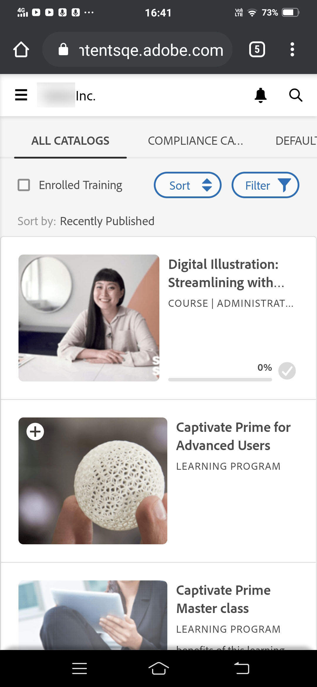
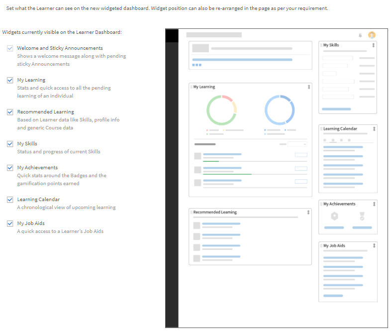

# 学習者ホームページのカスタマイズ

## 概要 {#overview}

管理者は、学習者に合わせた、コンテンツ重視の現代的なホームページになるよう、学習者ホームページをカスタマイズすることができます。

パーソナライズされたアプローチでは、組織の管理者が管理者ユーザーインターフェイスでWYSIWYG方式で設定できる学習者ホームページを作成するためのウィジェットベースの方法を提供します。

このエクスペリエンスは、AI主導型アルゴリズムが提供するパーソナライズされたトレーニング推奨事項によって推進されます。このアルゴリズムでは、業界スキルに関するサードパーティコンテンツの分析、ピアアクティビティの組み込み、学習者が関心を持つ領域の明示的および暗黙的なデータの使用を行います。

### 学習者ホームページのカスタマイズ

このトレーニングでは、学習者ホームページをカスタマイズする方法について説明します。

トレーニングを起動できない場合は、にメッセージを送信してください。 <almacademy@adobe.com>.

## 学習者ホームページの設定 {#configurethelearnerhomepage}

を **ブランディング** > **学習者ホームページ** ページを使用すると、管理者は学習者のホームページエクスペリエンスをカスタマイズできます。学習者が学習者アプリにログインすると、ホームページの外観が全面的に改善されます。

管理者は管理アプリ(**ブランディング** > **学習者ホームページ** タブ)。

管理者は、没入型 UI ウィジェットビューに切り替えることで、目的に応じてウィジェットや機能をカスタマイズしたり、没入型 UI を有効にしたりすることができます。

この **学習者ホームページ** 画面には次のセクションがあります。

## 没入型レイアウトのオプション {#immersivelayoutoption}

没入型ページのレイアウトを表示するには&#x200B;**「没入型」**&#x200B;オプションを有効にします。 このオプションは&#x200B;**ブランディング／一般**&#x200B;で切り替えることができます。

以前のバージョンでは、「学習者ホームページ」オプションは「設定」にありました。

設定できるオプションは次のとおりです。

**ホームページの操作性：** 次のいずれかを有効にする： **クラシック** または **没入型**. 「没入型」を選択した場合、次のオプションが表示されます。

* **トレーニングの種類：** 次のいずれかを選択します **業界** または **カスタム揃え**. カスタムトレーニングは社内で作成します。 業界に合わせたトレーニングでは、サードパーティのプロバイダーが提供する既製のコンテンツが用意されています。

*「業界」または「カスタム調整」を選択してホームページのエクスペリエンスを設定する*

オプション **学習者が関心のある分野を検索できるようにする** クラシックエクスペリエンスと没入型エクスペリエンスの両方で使用できます。

<table>
 <tbody>
  <tr>
   <td>
    
<b>「カスタム」を選択した場合</b>
</td>
   <td>
    
<b>「業界に適合」を選択した場合</b> 
</td>
  </tr>
  <tr>
   <td>
    
「内部」および「外部」アクティブフィールドを 1 つのみ選択できます。
</td>
   <td>
    
1～5 個のフィールドを選択できます。 デフォルトでは<b>「プロファイル」</b>オプションが選択されています。
</td>
  </tr>
 </tbody>
</table>

学習者が 1000 人未満の場合、アカウント全体が 1 つの範囲とみなされます。 これは、特にカスタムトレーニングタイプ向けです。 アカウントのユーザー数が1000人未満の場合は、完全なアカウントをその範囲と見なします。

>[!NOTE]
>
>チェックボックス **スキルを見る** は、設定/一般に移動しました。

没入型エクスペリエンスを選択した場合、このオプションは有効になり、グレー表示されます。 このチェックボックスは、クラシックエクスペリエンスでのみ有効になります。

*学習者ホームページ設定*

没入型レイアウトは、すべての新しいアカウントのデフォルトです。 レイアウトは、管理者が有効または無効にできるウィジェットによって制御されます。 ウィジェットの配置方法に基づいて、ウィジェットが学習者ホームページに反映されます。

有効/無効にできるウィジェットは次のとおりです。

これを使用すると、学習者 UI を決定する前に学習者 UI をプレビューできます。

既存のアカウントの場合は、 **没入型** 次のようになります **オフ**. この機能は、ソーシャルとゲーミフィケーションがオンになっている新しいアカウントで有効になります。

*学習者UIのプレビュー*

<table>
 <tbody>
  <tr>
   <td>
    
<b>ウィジェット</b>
</td>
   <td>
    
<b>説明</b>
</td>
  </tr>
  <tr>
   <td>
    
マストヘッド
</td>
   <td>
    
<b>マストヘッドとは何ですか？また、学習者のマストヘッドをカスタマイズするにはどうすればよいですか？ </b> 

    
これは、学習者向けのウェルカムバナーです。 バナーには、画像またはビデオを使用できます。 マストヘッドは特定のユーザーグループをターゲットにすることができ、学習者はホームページにアクセスするとすぐにマストヘッドを表示できます。 ユーザーグループには、管理者が設定したターゲットプランに従って、複数のhero imagesまたはビデオが表示される場合があります。 

    
管理者がバナーをアップロードする方法は次のとおりです。

    <ol>
     <li>左側のパネルで、 <b>アナウンス</b>. </li>
     <li>ページの右上隅にある<b>追加</b>をクリックします。</li>
     <li><b>タイプ</b>ドロップダウンリストで、<b>マストヘッドとして</b>を選択します。</li>
     <li>マストヘッドに含まれるメッセージを書きます。</li>
     <li>画像またはビデオをアップロードします。</li>
     <li>対象ユーザーを選択します。 マストヘッドが表示されるユーザーグループやトレーニングを選択します。</li>
     <li>マストヘッドのアナウンスを保存します。</li>
    </ol></td>
  </tr>
  <tr>
   <td>
    
学習状況
</td>
   <td>
    
学習者が最近アクセスした学習目標を表示します。 
</td>
  </tr>
  <tr>
   <td>
    
カレンダー
</td>
   <td>
    
学習者向けに予定されているさまざまな教室やバーチャルクラスルームトレーニングを月ごとに表示します。 学習者が登録できるトレーニングや既に登録済みのトレーニングが表示されます。これにはマネージャーが承認したトレーニングも含まれます。 
</td>
  </tr>
  <tr>
   <td>
    
ゲーミフィケーション
</td>
   <td>
    
学習アクティビティに基づいてリーダーボードを表示します。
</td>
  </tr>
  <tr>
   <td>
    
ソーシャル学習機能
</td>
   <td>
    
学習者と同じユーザー範囲のユーザーによるアクティビティと投稿を一覧表示します。 
</td>
  </tr>
  <tr>
   <td>
    
組織による推奨
</td>
   <td>
    
このウィジェットを有効にすると、特定のユーザーグループこのウィジェットを有効にすると、特定のユーザーグループにトレーニングが推奨されます。 に対するトレーニングを推奨します。 各ユーザーグループは、1つ以上のトレーニングを対象とすることができ、ターゲットプランは時間枠に基づきます。  

    <ul>
     <li>
      
まず、管理者です。 <a href="announcements.md#recommendation">通知を作成します</a> タイプ <b>おすすめ</b> 次に、必要なトレーニングを選択し、グループを使用します。 ユーザーグループに属する学習者が、推奨トレーニングを確認できます。
</li>
     <li>
      
管理者は、推奨がすぐ開始されるか、指定した日付に開始されるかを決定することもできます。
</li>
    </ul></td>
  </tr>
  <tr>
   <td>
    
関心領域に基づく推奨事項
</td>
   <td>
    
学習者が選択した関心領域に基づいて、学習目標を表示します。 推奨は、機械学習アルゴリズムによって行われます。
</td>
  </tr>
  <tr>
   <td>
    
カタログ別に参照 
</td>
   <td>
    
カタログをタイルとしてホームページに表示します。 
</td>
  </tr>
  <tr>
   <td>
    
ピアアクティビティに基づく推奨事項 
</td>
   <td>
    
学習者のピアが受講している内容に基づいてトレーニングを表示します。 これは、機械学習アルゴリズムによって再度駆動されます。
</td>
  </tr>
 </tbody>
</table>

変更を保存すると、学習者ホームページにすべての変更が反映されます。

学習者がブラウザーを介して学習者アプリにログインすると、次のような没入型レイアウトが表示されます。

<table>
 <tbody>
  <tr>
   <td>
    
<strong>ホームページ</strong>
</td>
   <td>
    
<strong>学習リスト</strong>
</td>
   <td>
    
<strong>カタログを表示</strong>
</td>
  </tr>
 </tbody>
</table>

*ホームページ上の様々なセクションの没入型レイアウトの表示*

## クラシックレイアウトオプション {#classiclayoutoption}

これまでのユーザーインターフェイスのレイアウトは、「クラシックレイアウト」と呼ばれるようになりました。 このオプションを選択すると、学習者のホームページビューがクラシックレイアウトに戻ります。

*クラシックレイアウトのプレビュー*

## 推奨設定の構成 {#configurerecommendationsettings}

オン **ブランディング** > **一般**&#x200B;を使用している場合は、社内外の学習者の推奨範囲を設定し、学習者ホームページで学習者がスキルを選択できるようにすることができます。

を **一般** ページには、次のオプションがあります。

<table>
 <tbody>
  <tr>
   <td>
    
組織名
</td>
   <td>
    
学習者が属する組織の名前。
</td>
  </tr>
  <tr>
   <td>
    
サブドメイン
</td>
   <td>
    
組織のサブドメイン。
</td>
  </tr>
  <tr>
   <td>
    
ロゴのスタイル
</td>
   <td>
    
Learning Managerにおけるロゴや会社名の表示方法。 
</td>
  </tr>
  <tr>
   <td>
    
テーマ
</td>
   <td>
    
学習マネージャーに適用されるテーマ。
</td>
  </tr>
  <tr>
   <td>
    
カスタマイズ
</td>
   <td>
    
Adobe Learning Managerでは、アカウントをカスタマイズして、ユーザーエクスペリエンスを拡張できます。 
</td>
  </tr>
  <tr>
   <td>
    
学習者ホームページ
</td>
   <td>
    
<b>「クラシック」</b>または<b>「没入型」</b>のいずれかを選択します。 「没入型」を選択すると、他のオプションが表示されます。
</td>
  </tr>
  <tr>
   <td>
    
トレーニングの種類 
</td>
   <td>
    
<b>「カスタム」</b>または<b>「業界に適合」</b>のいずれかを選択します。 学習者が 1000 人未満の場合、アカウント全体が 1 つの範囲とみなされます。 この推奨事項は、すべての学習者に基づいています。 
</td>
  </tr>
  <tr>
   <td>
    
推奨の範囲設定 
</td>
   <td>
    
1 つ以上のアクティブフィールドを選択します。 <b>「カスタム」</b>の場合は、1 つのアクティブフィールドしか選択できません。 対象 <b>業界に適合</b>を選択した場合、最大5つのアクティブフィールドを選択できます。 
</td>
  </tr>
  <tr>
   <td>
    
関心のある分野を学習者が検索できるようにする
</td>
   <td>
    
クラシック環境のみ。 を選択 <b>はい </b>または <b>いいえ</b>. 
</td>
  </tr>
  <tr>
   <td>
    
関心のある分野（スキル）を選択するようにユーザーを促す  
</td>
   <td>
    
没入型環境のみ。 を選択 <b>はい</b> または <b>いいえ</b>.  
</td>
  </tr>
 </tbody>
</table>
