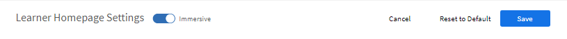

# 学習者ホームページのカスタマイズ

## 概要 {#overview}

管理者は、学習者のホームページをカスタマイズして、学習者に合わせてカスタマイズされた、コンテンツ重視の最新のホームページを作成できます。

パーソナライズされたアプローチでは、組織の管理者が管理者ユーザーインターフェイスでWYSIWYG方式で設定できる学習者ホームページを構築するための幅広い方法を提供します。

このエクスペリエンスは、AI主導型アルゴリズムが提供するパーソナライズされたトレーニング推奨事項によって推進されます。このアルゴリズムでは、業界スキルに関するサードパーティコンテンツの分析、ピアアクティビティの組み込み、学習者が関心を持つ領域の明示的および暗黙的なデータの使用を行います。

## 学習者ホームページの設定 {#configurethelearnerhomepage}

を **ブランディング** > **学習者ホームページ** ページを使用すると、管理者は学習者のホームページエクスペリエンスをカスタマイズできます。学習者が学習者アプリにログインすると、ホームページの外観が全面的に改善されます。

管理者は管理アプリ(**ブランディング** > **学習者ホームページ** タブ)。

管理者は、没入型UIウィジェットビューに切り替え、適宜ウィジェット/機能をカスタマイズしてから、没入型UIを有効にできます。

この **学習者ホームページ** 画面には次のセクションがあります。

## 没入型レイアウトオプション {#immersivelayoutoption}

没入型ページのレイアウトを表示するには、このオプションを有効にします **没入型**. このオプションは、 **ブランディング/一般**.

以前のバージョンでは、学習者ホームページオプションは「設定」にありました。

設定できるオプションは次のとおりです。

**ホームページの操作性：** 次のいずれかを有効にする： **クラシック** または **没入型**. 「没入型」を選択すると、次のオプションが表示されます。

* **トレーニングの種類：** 次のいずれかを選択します **業界** または **カスタム揃え**. カスタムトレーニングは社内で作成します。 業界に合わせたトレーニングには、サードパーティプロバイダーが提供する既製のコンテンツが含まれます。

*「業界」または「カスタム調整」を選択してホームページのエクスペリエンスを設定する*

オプション **学習者が関心のある分野を検索できるようにする** クラシックエクスペリエンスと没入型エクスペリエンスの両方で使用できます。

<table>
 <tbody>
  <tr>
   <td>
    
<b>「カスタム」を選択した場合</b>
</td>
   <td>
    
<b>「業界に適合」を選択した場合</b> 
</td>
  </tr>
  <tr>
   <td>
    
内部および外部のアクティブフィールドは、最大1つのみ選択できます。
</td>
   <td>
    
最大5つのフィールドと少なくとも1つのフィールドを選択できます。 デフォルトでは、 <b>プロフィール </b>が選択されています。
</td>
  </tr>
 </tbody>
</table>

学習者が1000人未満の場合、アカウント全体が1つの範囲とみなされます。 これは、カスタムトレーニングタイプ専用です。 アカウントのユーザー数が1000未満の場合は、完全なアカウントが対象となります。

>[!NOTE]
>
>チェックボックス **スキルを見る** は、設定/一般に移動しました。

没入型エクスペリエンスを選択した場合、このオプションは有効になり、グレー表示されます。 このチェックボックスは、Classicエクスペリエンスでのみ有効になります。

*クラシックエクスペリエンスの選択*

没入型レイアウトは、すべての新しいアカウントのデフォルトです。 レイアウトは、管理者が有効または無効にできるウィジェットによって制御されます。 ウィジェットの配置方法に基づいて、ウィジェットが学習者ホームページに反映されます。

有効/無効にできるウィジェットは次のとおりです。

これを使用すると、学習者UIが有効になる前に学習者UIをプレビューできます。

既存のアカウントの場合は、 **没入型** 次のようになります **オフ**. この機能は、ソーシャルとゲーミフィケーションがオンになっている新しいアカウントで有効になります。

*学習者UIのプレビュー*

<table>
 <tbody>
  <tr>
   <td>
    
<b>Widget</b>
</td>
   <td>
    
<b>説明</b>
</td>
  </tr>
  <tr>
   <td>
    
マストヘッド
</td>
   <td>
    
<b>マストヘッドとは何ですか？また、学習者のマストヘッドをカスタマイズするにはどうすればよいですか？ </b> 

    
これは、学習者向けのウェルカムバナーです。 バナーには、画像またはビデオを使用できます。 マストヘッドは特定のユーザーグループをターゲットにすることができ、学習者はホームページにアクセスするとすぐにマストヘッドを表示できます。 ユーザーグループには、管理者が設定したターゲットプランに従って、複数のhero imagesまたはビデオが表示される場合があります。 

    
管理者がバナーをアップロードする方法は次のとおりです。

    <ol>
     <li>左側のパネルで、 <b>アナウンス</b>. </li>
     <li>ページの右上隅にあるをクリックします。 <b>追加</b>.</li>
     <li>から <b>種類 </b>ドロップダウンリストで <b>マストヘッドとして</b>.</li>
     <li>マストヘッドに含まれるメッセージを書きます。</li>
     <li>画像またはビデオをアップロードします。</li>
     <li>対象ユーザーを選択します。 マストヘッドが表示されるユーザーグループまたはトレーニングを選択します。</li>
     <li>マストヘッドのアナウンスを保存します。</li>
    </ol></td>
  </tr>
  <tr>
   <td>
    
学習状況
</td>
   <td>
    
学習者が最近アクセスした学習目標を表示します。 
</td>
  </tr>
  <tr>
   <td>
    
カレンダー
</td>
   <td>
    
学習者に対して今後予定されている様々な教室およびバーチャルクラスルームのトレーニングを月別に表示します。 学習者が登録できるトレーニングや、すでに登録されているトレーニング（マネージャーにより承認済みのトレーニングなど）が表示されます。 
</td>
  </tr>
  <tr>
   <td>
    
ゲーミフィケーション
</td>
   <td>
    
学習活動に基づいてリーダーボードを表示します。
</td>
  </tr>
  <tr>
   <td>
    
ソーシャル学習
</td>
   <td>
    
学習者と同じユーザー範囲のユーザーによるアクティビティと投稿を一覧表示します。 
</td>
  </tr>
  <tr>
   <td>
    
組織による推奨
</td>
   <td>
    
有効にすると、このウィジェットは特定のユーザーグループに対するトレーニングを推奨します。 各ユーザーグループは、1つ以上のトレーニングを対象とすることができ、ターゲットプランは時間枠に基づきます。  

    <ul>
     <li>
      
まず、管理者です。 <a href="announcements.md#recommendation">通知を作成します</a> タイプ <b>おすすめ</b> 次に、必要なトレーニングを選択し、グループを使用します。 ユーザーグループに属する学習者が、推奨トレーニングを確認できます。
</li>
     <li>
      
次に、管理者は、推奨事項をすぐに開始するか、指定した日に開始するかを決定することもできます。
</li>
    </ul></td>
  </tr>
  <tr>
   <td>
    
関心領域に基づく推奨事項
</td>
   <td>
    
学習者が選択した関心領域に基づいて、学習目標を表示します。 推奨は、機械学習アルゴリズムによって行われます。
</td>
  </tr>
  <tr>
   <td>
    
カタログ別に参照 
</td>
   <td>
    
ホームページにタイルとしてカタログを表示します。 
</td>
  </tr>
  <tr>
   <td>
    
ピアアクティビティに基づく推奨事項 
</td>
   <td>
    
学習者のピアが受講している内容に基づいてトレーニングを表示します。 これは、機械学習アルゴリズムによって再度駆動されます。
</td>
  </tr>
 </tbody>
</table>

変更を保存すると、学習者ホームページにすべての変更が反映されます。

学習者がブラウザーを介して学習者アプリにログインすると、次のような没入型レイアウトが表示されます。

<table>
 <tbody>
  <tr>
   <td>
    
<strong>ホームページ</strong>
</td>
   <td>
    
<strong>学習状況リスト</strong>
</td>
   <td>
    
<strong>カタログの表示</strong>
</td>
  </tr>
 </tbody>
</table>

*ホームページ上の様々なセクションの没入型レイアウトの表示*

## クラシックレイアウトオプション {#classiclayoutoption}

従来から存在していたユーザーインターフェイスのレイアウトは、クラシックレイアウトと呼ばれるようになりました。 このオプションを選択すると、学習者のホームページビューがクラシックレイアウトに戻ります。

*クラシックレイアウトのプレビュー*

## 推奨設定の構成 {#configurerecommendationsettings}

オン **ブランディング** > **一般**&#x200B;を使用している場合は、社内外の学習者の推奨範囲を設定し、学習者ホームページで学習者がスキルを選択できるようにすることができます。

を **一般** ページには、次のオプションがあります。

<table>
 <tbody>
  <tr>
   <td>
    
組織名
</td>
   <td>
    
学習者が属する組織の名前。
</td>
  </tr>
  <tr>
   <td>
    
サブドメイン
</td>
   <td>
    
組織のサブドメイン。
</td>
  </tr>
  <tr>
   <td>
    
ロゴのスタイル
</td>
   <td>
    
Learning Managerにおけるロゴや会社名の表示方法。 
</td>
  </tr>
  <tr>
   <td>
    
テーマ
</td>
   <td>
    
Learning Managerに適用されるテーマ。
</td>
  </tr>
  <tr>
   <td>
    
カスタマイズ
</td>
   <td>
    
AdobeのLearning Managerでは、アカウントをカスタマイズして、ユーザーエクスペリエンスを拡張することができます。 
</td>
  </tr>
  <tr>
   <td>
    
学習者ホームページ
</td>
   <td>
    
次のいずれかを選択します <b>クラシック </b>または <b>没入型</b>. 「没入型」を選択すると、他のオプションが表示されます。
</td>
  </tr>
  <tr>
   <td>
    
トレーニングタイプ 
</td>
   <td>
    
次のいずれかを選択します <b>カスタム </b>または <b>業界に適合</b>. 学習者が1000人未満の場合、アカウント全体が1つの範囲とみなされます。 この推奨事項は、すべての学習者に基づいています。 
</td>
  </tr>
  <tr>
   <td>
    
推奨スコープ設定 
</td>
   <td>
    
1つ以上のアクティブフィールドを選択します。 対象 <b>カスタム</b>を選択した場合、1つのアクティブフィールドのみ選択できます。 対象 <b>業界に適合</b>を選択した場合、最大5つのアクティブフィールドを選択できます。 
</td>
  </tr>
  <tr>
   <td>
    
学習者が関心のある分野を検索できるようにする
</td>
   <td>
    
Classicエクスペリエンスのみ。 を選択 <b>はい </b>または <b>いいえ</b>. 
</td>
  </tr>
  <tr>
   <td>
    
関心のある分野（スキル）の選択を促す  
</td>
   <td>
    
没入型エクスペリエンスのみ。 を選択 <b>はい</b> または <b>いいえ</b>.  
</td>
  </tr>
 </tbody>
</table>
