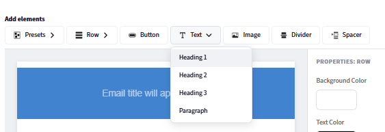
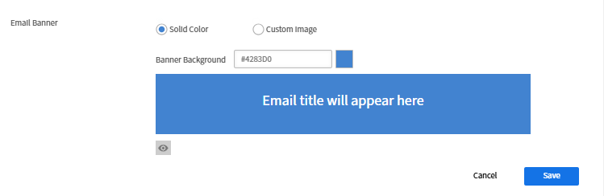
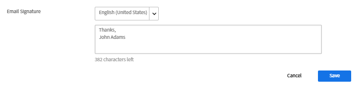
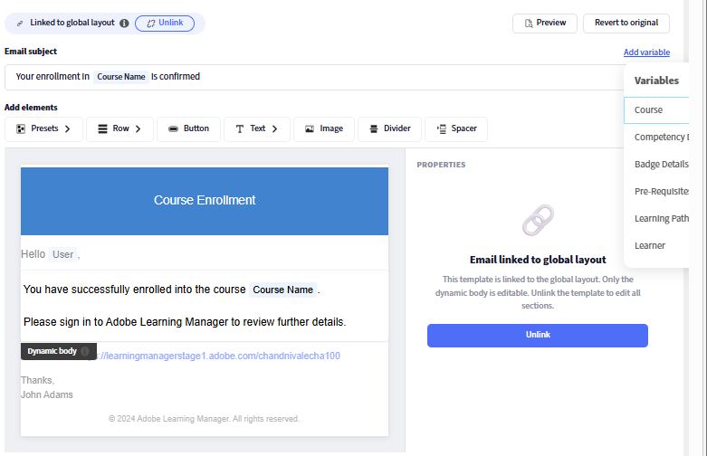

## コンポーネントベースの電子メールビルダー

Adobe Learning Managerには、管理者と作成者がHTMLを記述することなく、最新のビジュアルエディターを使用してエンタープライズグレードのフルブランド電子メールを作成できる、コンポーネントベースの電子メールビルダーが含まれています。 登録確認からセッションのリマインダーまで、組織が送信するすべてのメールが、ブランドのルックアンドフィールと正確に一致します。

**管理者向け：**&#x200B;すべての電子メールを自動的に折り返す再利用可能なヘッダーとフッターを1回*作成し、グローバルレイアウトをデザインします。その後、必要に応じて個々のテンプレートをカスタマイズします。 リッチコンポーネント（フルリッチテキストフォーマットのテキスト、画像、バナー、ボタン、ソーシャルメディアリンク、仕切りなど）を使用して、インラインのドラッグ&amp;ドロップエディターで電子メールを作成します。

**作成者：**&#x200B;特定のコースやインスタンスを範囲とする電子メールに同じエディター機能を適用すると、アカウント全体の設定に影響を与えることなく、各学習エクスペリエンスに合わせてトレーニングのコミュニケーションをカスタマイズできます。

ビルダーは階層モデルをサポートしています。同じ電子メールテンプレートをインスタンスレベル、コースレベルまたはアカウントレベルで設定できます。 テンプレートを個別に編集していない場合は、親レベルの設定が自動的に継承されます。 完全なカスタムデザインが必要な場合は、テンプレートのリンクを解除して、完全に制御します。 組み込みのプレビューを使用すると、電子メールが送信される前に受信者の受信トレイで電子メールがどのように表示されるかを正確に確認できます。

## 電子メールテンプレートシステムの仕組み

Adobe Learning Managerの送信メールはすべて、次の3つの要素で構成されます。

* **ヘッダー：**&#x200B;バナーの画像または色と組織名
* **本文：**&#x200B;各電子メールの種類に固有の動的コンテンツゾーンです。メッセージテキストと変数プレースホルダーが含まれます
* **フッター：**&#x200B;アカウントURL、電子メール署名、ヘルプリンク、およびその他の要素

**グローバルレイアウト**&#x200B;は、130を超えるすべての電子メールテンプレートに同時に適用されるマスターデザインです。 グローバルレイアウトを更新すると、そのレイアウトにリンクされているすべてのテンプレートに、変更が自動的に反映されます。 テンプレートは、いつでもグローバルレイアウトからリンクを解除して、個別にカスタマイズできます。

### 電子メールの階層

設定とデザインは、継承によって上位レベルから下位レベルにフローします。 各レベルは、継承する内容をオーバーライドまたは完全にカスタマイズできます。

| レベル | 誰が設定したか | 初期設定のステート | 編集可能な項目 |
| --- | --- | --- | --- |
| **グローバルレイアウト** | は、 | ルート、親なし | フルレイアウト：すべてのパーツ、すべてのコンポーネント |
| **アカウントの電子メールテンプレート** | 管理者 | グローバルレイアウトにリンク | 本文のみ（リンクあり）；レイアウト全体（リンクなし） |
| **作成者 – LOレイアウト** | 作成者 | アカウントテンプレートにリンク | LOスコープでのフルレイアウト |
| **作成者 – LOメールテンプレート** | 作成者 | LOレイアウトにリンク | 本文のみ（リンクあり）；レイアウト全体（リンクなし） |
| **作成者 – インスタンス電子メールテンプレート** | 作成者 | LOテンプレートにリンク | 本文のみ（リンクあり）；レイアウト全体（リンクなし） |

### コア継承ルール

* すべてのレベルは、明示的に変更されるまで、直接の親にリンクされます。
* テンプレートの&#x200B;**body**&#x200B;を編集しても、リンクは解除されません。 ヘッダーとフッターには引き続き親ページが反映されます。
* **レイアウト**&#x200B;を編集するか、**リンク解除**&#x200B;を選択すると、そのテンプレートの親接続のみが切断されます。
* **元の状態に戻す**&#x200B;テンプレートをその親に再リンクし、レイアウトと本文の両方を親のバージョンにリセットします。
* あるレベルでリンクを解除しても、そのレベルの上または下のレベルには影響しません。

## グローバルレイアウトの設定

グローバルレイアウトは、すべてのリンクされた電子メールに送信される共有ヘッダー、フッター、および構造ラッパーを定義します。 すべてのテンプレートが一貫したブランディングで始まるように、最初に設定します。

### グローバルレイアウトエディターを開く

1. Adobe Learning Managerに管理者としてログインします。
2. 左側のナビゲーションで、**電子メールテンプレート**&#x200B;を選択します。
3. 「**グローバルレイアウト**」タブを選択します。

   エディターのカンバスが現在のグローバルレイアウトで読み込まれます。 中央にプレースホルダーとして表示される&#x200B;**ダイナミックボディ**&#x200B;ゾーンは、各テンプレートの一意のメッセージコンテンツが表示される領域を表します。 グローバルレイアウトからダイナミックボディを編集することはできません。

   

### 電子メールコンテナの設定

電子メールコンテナは、すべての電子メールの最も外側のラッパーです。 この設定は、すべてのコンテンツを囲む視覚的なフレームに影響します。

1. **グローバル電子メールレイアウト**&#x200B;の近くにある&#x200B;**編集**&#x200B;を選択します
2. カンバス上の電子メールコンテナを選択します。
3. 右側の&#x200B;**プロパティ**&#x200B;パネルで、次のように設定します。
   * **背景色：**&#x200B;すべての電子メールコンテンツの背景色

   

   * **境界線：**&#x200B;外枠のスタイル、幅、色

   

   * **間隔：**&#x200B;電子メールコンテンツの方向の周囲のパディング

   

   * **行間隔：**&#x200B;レイアウトのすべての行の間に適用される垂直方向の間隔

   

### 行と列の操作

電子メールエディターのすべてのコンテンツは&#x200B;**行**&#x200B;に配置されます。 各行には1つ以上の&#x200B;**列**&#x200B;が含まれ、各列には1つ以上の&#x200B;**コンポーネント**&#x200B;が含まれています。

行を追加するには、次の手順に従います。

1. キャンバスの上部にある&#x200B;**行**&#x200B;を選択します。

   

2. 列レイアウトを選択してください： **1列**、**2列**、**3列**、または&#x200B;**4列**。

   

   新しい行がコンポーネント用にカンバスに表示されます。

行を構成するには、次の手順に従います。

1. カンバス上の行を選択します。

   

2. **プロパティ**&#x200B;パネルで、次の項目を設定します。
   * **背景色：**&#x200B;行レベルの背景。この行のコンテナーの色を上書きします
   * **境界線：**&#x200B;行の境界線のスタイル、幅、および色
   * **間隔：**&#x200B;この行の列間の水平方向の間隔

   

**行を並べ替えるには：**

* 任意の行のハンドル（左端にカーソルを合わせたときに表示される）をドラッグして、上または下に移動します。

**行を削除するには：**

* 行を選択し、行ツールバーの&#x200B;**削除**&#x200B;アイコンを選択します。

### コンポーネントの追加と整列

コンポーネントは、電子メールコンテンツの構成要素です。 上部の&#x200B;**コンポーネント**&#x200B;パネルからそれらをドラッグし、任意の列セルにドロップします。 左側の&#x200B;**プロパティ**&#x200B;パネルを使用して、選択したコンポーネントをカスタマイズします。

コンポーネントをドラッグアンドドロップすると、コンポーネントを配置できる場所に青色の「+」インジケータが表示されます。

**コンポーネントを追加するには：**

1. コンポーネントパネルで、目的のコンポーネントを見つけます。

   

2. カンバスの列セルにドラッグします。

   

3. コンポーネントがそのセルに追加されます。 選択すると、右側のパネルにそのプロパティが表示されます。

   

**コンポーネントを移動するには：**

* ハンドルでコンポーネントを別の列または行の位置にドラッグします。

**コンポーネントを削除するには：**

* コンポーネントを選択して、コンポーネントツールバーの&#x200B;**削除**&#x200B;アイコンを選択します。

### プリセットコンポーネントの編集

**グローバルレイアウト**&#x200B;には、電子メール設定で構成された共有フィールドに対応する組み込みのプリセットコンポーネントが含まれています。 プリセットコンポーネントは、カンバス上で直接編集したり、完全に削除したりできます。

| プリセットコンポーネント | デフォルトコンテンツ | 削除できますか？ |
| --- | --- | --- |
| **バナー** | デフォルトのバナー画像またはカラー | 可 |
| **あいさつ** | 「こんにちは、{{user}}さん」 | 可 |
| **ダイナミックボディ** | テンプレートごとのコンテンツのプレースホルダー | いいえ – 必須 |
| **アカウントURL** | アカウントのプラットフォームURL | 可 |
| **署名** | 設定済みの署名テキスト | 可 |

**プリセットコンポーネントを編集するには**

1. プリセットコンポーネント（例：バナー）を追加します。

   

2. カンバスでバナーを選択します。
3. **プロパティ**&#x200B;パネルで、バナーのフォント、フォントサイズ、その他の視覚的プロパティを変更します。

   

**すべての電子メールからプリセットコンポーネントを削除するには**

1. カンバス上のプリセットコンポーネントを選択します。
2. コンポーネントツールバーで&#x200B;**削除**&#x200B;を選択します。

プリセットコンポーネントをグローバルレイアウトから削除すると、リンクされているすべての電子メールから削除されます。 リンクされていないテンプレートは、各テンプレートから手動で削除するまでコンポーネントを保持します。

### グローバルレイアウトの保存

レイアウトが完成したら、「**保存**」を選択します。 更新されたデザインは、グローバルレイアウトにリンクされたままのすべての電子メールテンプレートにすぐに適用されます。

## グローバル電子メールプリセットの設定

バナー、あいさつ、署名などの一般的な要素を定義して、電子メール全体で再利用します。 これらは、グローバルレイアウトまたはAdobe Learning Manager内の個々のイベントベース電子メールテンプレートで使用できます。 ここで行った変更は、これらのプリセットが使用されている場所に自動的に反映されます。 また、これらのプリセットを上書きして、電子メールビルダーで直接カスタム要素をデザインすることもできます。

次の設定を行います。

### 電子メールのバナー

1. **電子メールバナーの横にある**&#x200B;編集&#x200B;**を選択します。**
2. バナー画像をアップロードするか、単色の背景色を設定します。

   

3. 「**保存**」を選択します。

### 電子メールの挨拶文

1. **あいさつメール**&#x200B;の横にある&#x200B;**編集**&#x200B;を選択します
2. デフォルトは「Hello {{user}}」です。{{user}}変数は、実行時に受信者の名前を設定します。

   

3. あいさつ文を変更したり、あいさつ文全体を削除したりします。
4. 「**保存**」を選択します。

### アカウント URL

1. **アカウントURL**&#x200B;の横にある&#x200B;**編集**&#x200B;を選択します。
2. 学習プラットフォームのURLを入力します。この情報は、すべての送信メールに表示されます。

   

3. 「**保存**」を選択します。

### 電子メールの署名

1. **電子メール署名**&#x200B;の横にある&#x200B;**編集**&#x200B;を選択します
2. 終了テキストを入力します。

   

3. 「**保存**」を選択します。

## 個々のコンポーネントの追加と構成

### テキストコンポーネント

テキストコンポーネントは、フルリッチテキスト編集をサポートしています。

1. **Text**&#x200B;コンポーネントを列のセルにドラッグします。
2. 選択して編集モードにします。

   

3. コンテンツを入力またはペーストします。
4. 次の書式設定オプションを適用します。
   * **フォント：** webセーフフォント（Arial、Helvetica、Georgiaなど）またはアカウントに設定されているカスタムフォントから選択します
   * **サイズ:**&#x200B;フォントサイズ（ポイント）
   * **太字**、**斜体**、**下線**、**打ち消し線**
   * **上付き文字**&#x200B;と&#x200B;**下付き文字**
   * **テキストの色**&#x200B;と&#x200B;**背景色** （テキストのハイライト表示）
   * **整列：**&#x200B;左揃え、中央揃え、右揃え、均等配置
   * **行間：**&#x200B;行高さの乗数
   * **水平方向および垂直方向のパディング：**&#x200B;テキストブロック内の内部間隔
5. ハイパーリンクを追加するには：
   * リンクするテキストを選択します
   * ツールバーで&#x200B;**リンク**&#x200B;アイコンを選択します
   * リンク先のURLを入力します

   

6. **適用**&#x200B;を選択

### 画像コンポーネント

1. **Image**&#x200B;コンポーネントを列のセルにドラッグします。
2. 「**アップロード**」を選択して、新しい画像ファイルをアップロードするか（JPEGーとGIFがサポートされています）、「**参照**」を選択して画像ライブラリから選択します。
3. イメージを選択した状態で、次の設定を行います。

   

   * **画像の変更：**&#x200B;新しい画像をアップロードするか、現在選択されている画像を置き換えます。
   * **画像のURL:**&#x200B;表示する画像のソースURLを指定します。 画像はこの場所から読み込まれます。
   * **リンク：**&#x200B;画像にクリック可能なハイパーリンクを追加します。 画像をクリックすると、指定したURLにユーザーがリダイレクトされます。
   * **境界線の種類：**&#x200B;画像の境界線のスタイルを定義します。 使用可能なオプションは、「なし」、「実線」、「点線」です。
   * **境界線の色：**&#x200B;境界線スタイルが適用される場合に、画像の境界線の色を設定します。
   * **角丸の半径：**&#x200B;画像の角の丸みを制御します。 値が大きいほど、角が丸くなります。
   * **境界線：**&#x200B;画像の境界線の太さ（幅）を調整します。
   * **上の間隔：**&#x200B;画像の上にスペースを追加します。
   * **下の間隔：**&#x200B;画像の下にスペースを追加します。
   * **左の間隔：**&#x200B;画像の左側にスペースを追加します。
   * **右の間隔：**&#x200B;画像の右側にスペースを追加します。
   * **水平方向の配置：**&#x200B;コンテナ内の画像の位置を決定します。 オプションには通常、左揃え、中央揃え、右揃えがあります。

### ボタンコンポーネント

1. **Button**&#x200B;コンポーネントを列のセルにドラッグします。
2. 選択して、以下を設定します。

   

   * ボタンのテキスト&#x200B;**ラベル：**
   * **リンク：**&#x200B;ボタンをクリックしたときのリンク先のURL
   * ボタンラベルの&#x200B;**フォント：**&#x200B;のフォントファミリとサイズ
   * **テキストの色：**&#x200B;ラベルの色
   * **背景色：**&#x200B;ボタンの塗りつぶしの色
   * **サイズ:**&#x200B;ボタンの幅と高さ
   * **角のスタイル:**&#x200B;角丸、正方形、または円形
   * **配置：**&#x200B;列の左揃え、中央揃え、右揃え
   * **パディング：**&#x200B;ラベルテキストとボタンのエッジの間の内部間隔

### 仕切りコンポーネントとスペーサコンポーネント

**区切り線：**&#x200B;は、コンテンツセクション間に表示される水平線を追加します。

1. **区切り線**&#x200B;コンポーネントを列にドラッグします。
2. **線のスタイル** （実線、破線、点線）、**色**、**幅**、および&#x200B;**高さ** （線の上下の垂直方向の間隔）をプロパティパネルで設定します。

   **Spacer:**&#x200B;を使用すると、表示される線のない要素間に非表示の垂直方向の間隔が追加されます。

3. **Spacer**&#x200B;コンポーネントをドラッグし、プロパティパネルで&#x200B;**高さ**&#x200B;を設定します。

## 変数の挿入と管理

変数は、電子メールの送信時に、実際のデータに置き換えられる動的プレースホルダーです。 使用できる変数は、特定のテンプレートタイプによって異なります。 登録確認メールに、セッションリマインダーとは異なる変数が記載されている。

### ピッカーを使用した変数の挿入

1. 変数を表示するテキストコンポーネント内にカーソルを置きます。
2. テキストエディターツールバーで&#x200B;**変数の挿入**&#x200B;を選択します。 変数ピッカーが開き、このテンプレートタイプで使用できるすべての変数が表示されます。
3. 変数を選択する 例： **コース名**、**学習者名**、**学習パス名**。

   

### 変数を入力して挿入する

中かっこ({\{variable_name}\})で囲まれた変数名を直接入力します。 エディターは変数トークンとして自動的に認識し、ハイライト表示します。

**一般的な変数の例：**

| 変数 | 置換後の文字列 |
| --- | --- |
| 受信者の氏名 | {\{learnerName}\} |
| 受信者の電子メール | {\{learnerEmail}\} |
| 受信者のユーザー名 | {\{user}\} |
| ユーザータイプ | {\{userType}\} |
| 組織名 | {\{organizationName}\} |
| コース名 | {\{courseName}\} |
| コースの説明 | {\{courseDescription}\} |
| コース作成者 | {\{courseAuthor}\} |
| コースリンク | {\{courseLink}\} |
| コースに必要なスキル | {\{courseSkillDetails}\} |
| コースのバッジ | {\{courseBadge}\} |
| コースの登録期限 | {\{courseEnrollmentDeadline}\} |
| コースの完了期日 | {\{courseCompletionDeadline}\} |
| コース完了日 | {\{courseCompletionDate}\} |
| 学習パスの名前 | {\{LPName}\} |
| 学習パスリンク | {\{LPLink}\} |
| 学習パスの登録期限 | {\{LPEnrollmentDeadline}\} |
| 学習パスの完了期日 | {\{LPCompletionDeadline}\} |
| 学習パスの終了日 | {\{LPCompletionDate}\} |
| 資格認定名 | {\{certificationName}\} |
| 資格認定の登録期限 | {\{certificationEnrollmentDeadline}\} |
| 資格認定の終了日 | {\{certificationCompletionDate}\} |
| コースの期限の期間 | {\{deadlineDuration}\} |
| コースの有効期限 | {\{expiryDuration}\} |
| コースの有効期限 | \{\{expiryDate\}\} |
| セッション名 | \{\{sessionName\}\} |
| セッションの開始日 | \{\{sessionDate\}\} |
| セッション終了日 | \{\{endSessionDate\}\} |
| セッション開始時間 | \{\{sessionTime\}\} |
| セッション終了時刻 | \{\{endSessionTime\}\} |
| 会場名 | \{\{venueName\}\} |
| 会場情報 | \{\{venueInfo\}\} |
| 会場URL | \{\{venueURL\}\} |
| 会場地域 | \{\{venueRegion\}\} |
| バーチャル教室の URL | \{\{vcUrl\}\} |
| バーチャルクラスルームプロバイダーアカウントが必要です | \{\{VCProviderAccountReq\}\} |
| インストラクターの名前 | \{\{instructorName\}\} |
| モジュール名 | \{\{moduleName\}\} |
| 学習目標名 | \{\{learningObjectName\}\} |
| 学習目標完了日 | \{\{loCompletionDate\}\} |
| 代替学習目標名 | \{\{alternateLoNameList\}\} |
| 代替学習目標のリンク | \{\{alternateLoNameListLinks\}\} |
| 代替学習目標を削除しました | \{\{removedAlternateLo\}\} |
| 前提条件テキスト | \{\{preRequisiteText\}\} |
| 前提条件の数 | \{\{preRequisiteCountText\}\} |
| 構成項目名 | \{\{ciName\}\} |
| レポートダッシュボード名 | \{\{reportDashboardName\}\} |
| 作業計画書の名前 | \{\{jobAidName\}\} |
| 通知コンテンツ | \{\{announcementContentText\}\} |
| プロファイル名 | \{\{profileName\}\} |
| コースの人数制限 | \{\{seatLimit\}\} |
| ヘルプドキュメントのホームページへのリンク | \{\{captivatePrimeHelp\}\} |
| ヘルプページへのリンク | \{\{helpPageLink\}\} |
| カウント | \{\{count\}\} |

>[!NOTE]
>
>変数はテンプレートに固有です。 すべてのテンプレートですべての変数が使用できるわけではありません。 **変数を挿入**&#x200B;ピッカーを使用して、編集中のテンプレートに適用される変数のみを表示します。 認識できない変数名を中括弧で囲んで入力しても、エディターでエラーは発生しませんが、送信された電子メールではリテラルテキストとして表示されます。

### バナー内の変数

1. 電子メールの件名の行でも変数を使用できます。 変数を件名に追加するには、次の手順を実行します。
2. テンプレートを開き、**電子メールの件名**&#x200B;フィールドを見つけます。
3. 変数を直接入力します。 例：「{\{course_name}\}への登録が確認されました」 電子メールの送信時に、変数は実際のコース名でレンダリングされます。
4. または、「**変数を追加**」を選択して、「**コース**」を選択します。

   

### 変数とグローバルレイアウト

グローバルレイアウトの変数はテンプレートに依存せず、コンテキストに応じて異なる方法で解決されます。 グローバルレイアウトでは、{\{user}\}や{\{account_url}\}など、例外なく使用できる変数のみを使用してください。 テンプレート固有の変数（{\{course_name}\}など）は、グローバルレイアウトではなく、個々のテンプレート本文に配置する必要があります。

## テンプレートのリンクとリンク解除

### リンクされた状態とリンクされていない状態

すべてのテンプレートは、**親にリンク**&#x200B;されているか、**リンク解除**&#x200B;されており、完全に独立しています。

**リンク時：**

* エディターでヘッダーとフッターが&#x200B;**グレー表示**&#x200B;されています。 これは、テンプレートがリンクされていることを示す視覚的なインジケーターです

* 編集できるのはボディのみです
* 親レイアウトフローに対するこのテンプレートへの変更の自動反映

**リンク解除時：**

* ヘッダーとフッターは完全に編集可能です。 グレー表示されたゾーンはありません
* テンプレートは完全に独立しています。親の変更はテンプレートに影響しません
* リンクを解除すると、テンプレートは親のデザインから開始されます

**キールール：** **本文**&#x200B;を編集しても、テンプレートのリンクは解除されません。 **レイアウト**&#x200B;を編集するか、**リンク解除**&#x200B;を明示的に選択すると、親の接続が解除されます。

### リンクするタイミング（リンクを維持する）

* グローバルブランディングを自動的に流し込み続ける
* このテンプレートのメッセージテキストまたは変数を変更するだけで済みます
* テンプレートの大規模なライブラリを管理しており、ブランド管理を一元化したい場合

### リンク解除のタイミング

* 特定のテンプレートには、別のバナー、カラースキーム、または構造レイアウトが必要です
* 特定のコース、資格認定、または対象者に対して異なるブランドのエクスペリエンスを構築する場合
* 1つの学習目標またはインスタンスの完全なデザインコントロールを必要とする作成者

### アカウントレベルのテンプレートと管理者のリンクの解除

1. **電子メールテンプレート**&#x200B;を選択し、テンプレートを開きます。 例えば、「コース – セルフ登録」を選択します。
2. 「**リンク解除**」を選択します。

   

3. 確認メッセージを読み、[**はい**]を選択します。
4. ヘッダーとフッターが完全に編集可能になります。
5. テンプレートの任意の部分をカスタマイズします。
6. 「**保存**」を選択します。

テンプレートでは、親のレイアウトが開始点として保持されますが、今後、親の更新内容は受け取られなくなります。

### テンプレートを親バージョンに戻す

「元に戻す」は、テンプレートを再リンクし、親が提供する内容に正確にリセットします。

* テンプレートが&#x200B;**ボディ編集のみ**&#x200B;の場合（まだリンクされている場合）：本文メッセージを親のデフォルトに戻します。 ヘッダーとフッターは、既に親から取得されているため、変更されません。
* テンプレートが&#x200B;**完全にリンク解除**&#x200B;の場合：すべてのヘッダー、本文、フッターを親バージョンで置き換えます。 すべての独立したカスタマイズは完全に削除されます。

>[!CAUTION]
>
>元に戻した場合、元に戻すことはできません。 元に戻す前に、保持するコンテンツをコピーします。

**元に戻すには**

1. エディターでテンプレートを開きます。
2. **元に戻す**&#x200B;を選択します。

   

### インスタンスレベルのテンプレートのリンク解除 – author

1. コースを開き、**電子メールテンプレート**&#x200B;を選択します。
2. テンプレートを開きます（例：コース完了）。
3. 「**リンク解除**」を選択して確定します。
4. 変更を加えて、[**保存**]を選択します。

これは、このインスタンスにのみ影響します。 他のインスタンスは影響を受けません。 インスタンステンプレートは、グローバルレイアウトからではなく、リンク解除の時点でLOレベルのテンプレートデザインから開始します。

管理者テンプレートがグローバルレイアウトバージョンに戻り、グローバルレイアウトに再リンクする。 作成者のLOテンプレートが管理者アカウントテンプレートのバージョンに戻ります。 オーサーインスタンステンプレートがLOテンプレートのバージョン（LOテンプレートがリンクされている場合はアカウントテンプレート）に戻ります。

## 個々のテンプレートをカスタマイズする

### テンプレートに移動

1. **電子メールテンプレート**&#x200B;で、リストからカテゴリを選択します。 例： **全般**、**学習アクティビティ**、**リマインダーとアップデート**。
2. テンプレートを名前で検索します。 テンプレートは、トリガーイベントと現在の有効/無効ステータスとともに一覧表示されます。
3. テンプレート名を選択して、エディターで開きます。

### 本文の編集（リンクされたテンプレート）

テンプレートがリンクされている場合は、本文のみが編集可能です。 ヘッダーとフッターがグレー表示されます。

1. テンプレートを開きます。 ヘッダーとフッターがグレー表示（リンクされた状態）されていることを確認します。
2. ボディ内の任意の場所を選択して、編集モードに入ります。
3. 本文のメッセージテキスト、書式、変数、および任意のコンポーネントを編集します。
4. 「**保存**」を選択します。

### 完全にカスタマイズされたテンプレートの編集（リンク解除）

リンクを解除した後は、グローバルレイアウトと同じドラッグ&amp;ドロップエディターを使用して、ヘッダー、ボディ、フッターの3つの部分をすべて編集できます。

1. 任意のパーツの行とコンポーネントを追加、削除、または並べ替えます。
2. プリセットコンポーネント（バナー、あいさつ、署名、アカウントURL）を個別に編集します。
3. このテンプレートタイプに固有の変数を挿入します。
4. 「**保存**」を選択します。

### 複数の言語でのテンプレートの編集

すべてのテンプレートは、アカウントに設定されているすべてのコンテンツ言語をサポートしています。

1. テンプレートを開きます。
2. 「**言語**」ドロップダウンを選択します。 アカウントで使用可能なすべての言語が表示されます。
3. 編集する言語を選択します。
4. その言語の本文（およびリンクされていない場合はレイアウト）を編集します。
5. 「**保存**」を選択します。

各言語バージョンは個別に保存されます。 1つの言語を編集しても、他の言語には影響しません。 言語バージョンがカスタマイズされていない場合、学習者はその言語のデフォルトコンテンツを受け取ります。

>[!NOTE]
>
>テンプレートがリンク解除されていて、そのレイアウトを1つの言語で編集する場合、レイアウトの変更はその言語バージョンにのみ適用されます。 他の言語バージョンでは、独自の状態が保持されます。

### エディターでのプレビュー（ビジュアルチェック）

1. エディターツールバーで&#x200B;**プレビュー**&#x200B;を選択します。
2. プレビューモーダルが開き、受信者に表示される電子メールが表示されます。
3. レイアウト、間隔、画像、変数のプレースホルダートークンを確認します。
4. 編集を続行するには、プレビューを閉じます。

## 下位互換性

### 既存のアカウント

以前に設定されたすべての電子メールテンプレートは、そのまま保持されます。 新しいビルダーは、既存のエディターと一緒に使用できます。 アップデート前に設定されたテンプレートは、新しい形式に自動的に移行されません。 これらは以前と同じように機能し続けます。

### 新しいアカウント

新しいビルダーとクリーンなデフォルトのグローバルレイアウトから始めます。 デフォルトのレイアウトでは簡素化されたデザインが使用されており、古い設定で発生する既知のレンダリングの問題（バナー画像の表示エラーなど）が回避されます。

アカウントに古い形式のテンプレートと新しい形式のテンプレートの両方がある場合、これらの2つは競合することなく共存します。 個々のテンプレートを新しいエディターで開いて保存することで、独自のペースで新しい形式に移行できます。

## 電子メールテンプレートのトラブルシューティング

**グローバルレイアウトの変更がテンプレートに表示されません**

テンプレートのリンクが解除されました。 確認して修正するには、次の手順に従います。

1. テンプレートを開きます。
2. ヘッダーとフッターが&#x200B;**編集可能** （灰色表示されていない）の場合、テンプレートのリンクは解除されます。
3. グローバルレイアウトの継承を復元するには、**元に戻す**&#x200B;を選択して確認してください。

**テンプレートの外観がグローバルレイアウトと異なります**

上記と同じ原因です。 テンプレートは、意図的に、または以前のレイアウト編集のために、リンクが解除されました。 元に戻して再リンクします。

**送信されたメールの変数がリテラルテキストとしてレンダリングされています**

変数名のスペルが間違っているか、このテンプレートの種類では使用できません。

1. テンプレートを開き、変数を見つけます。
2. 変数を削除し、**変数を挿入**&#x200B;ピッカーを使用して再度挿入します。
3. ピッカーには、このテンプレートに対して有効な変数のみが表示されます。 入力ミスを防ぐには、リストから選択します。
