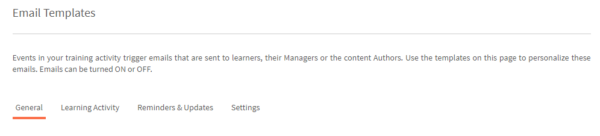
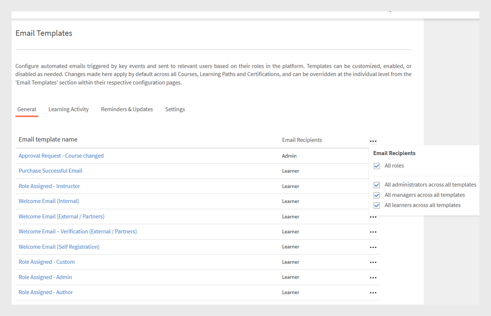

# 電子メールテンプレート

トレーニング活動内のイベントにより、学習者に電子メールが送信されます。 管理者は、電子メールテンプレートの有効と無効の切り替えや変更を簡単に行うことができます。

Learning Manager アプリケーションでは、イベントに基づき複数のロールを持つユーザーに電子メール通知が送信されます。

管理者は、内容の追加や編集を行い、学習者、マネージャー、作成者によってトリガーされた各種イベントについてユーザーに通知を送信することにより、電子メールテンプレートをカスタマイズすることができます。

管理者は、特定のイベントについて電子メール通知の送信を無効に設定することもできます。

## 電子メールテンプレートの概要

このトレーニングでは、個々の電子メールテンプレートをカスタマイズする方法、および電子メールテンプレートのコースレベルとアカウントレベルの設定をカスタマイズする方法について説明します。

<!--In this training, you will learn how to create a user group by names, email IDs, and combining multiple auto-generated user groups.-->

トレーニングを起動できない場合は、<almacademy@adobe.com>に書き込んでください。

## 電子メールテンプレートの設定 {#configureemailtemplates}

管理者は、電子メールテンプレートの有効と無効の切り替えや変更を簡単に行うことができます。

1. テンプレートにアクセスするには、左側のペインで「**[!UICONTROL 電子メールテンプレート]**」をクリックします。 このページには、**[!UICONTROL 全般]**、**[!UICONTROL 学習アクティビティ]**、**[!UICONTROL リマインダーとアップデート]**&#x200B;という3つの異なるカテゴリのテンプレートが表示されます。 4つ目のタブ&#x200B;**[!UICONTROL 設定]**&#x200B;では、テンプレートを設定できます。

   

   *[全般]タブを選択する*

2. 特定の役割の電子メールテンプレートを一括で有効または無効にするには、列見出しの省略記号(...)を選択し、**[!UICONTROL 電子メールの受信者]**&#x200B;で該当するすべての役割を有効にします。

   
   _ロールレベルのすべての電子メールテンプレートを送信する_

3. ロールの特定の電子メールテンプレートを有効または無効にするには、そのテンプレートの省略記号(...)を選択し、ロールを選択または選択解除します。

   
   _ロールレベルの電子メールテンプレートを送信する_

4. テンプレートの内容を変更するには、そのテンプレートの名前をクリックします。 異なるタイプのユーザーに対して各種のテンプレートが設定されていることがわかります。

   

   *電子メールのテンプレートを表示する*

5. この電子メールテンプレートの内容を変更するには、電子メールの本文をクリックします。 次に、テンプレートの内容を変更します。 テキストを変更することも、いずれかの変数を電子メール内で使用することもできます。 メール本文に対する変更を、この電子メールテンプレート以外に適用することはできません。 ただし、この電子メールの署名を変更した場合は、その変更内容をすべてのテンプレートに対してグローバルに適用することができます。

   各アイコンの上にマウスを置くと、名前が表示されます。

   

   *電子メールテンプレートを変更する*

   テンプレート上部の「**[!UICONTROL 元に戻す]**」をクリックすると、メッセージ本文をリセットすることができます。

6. このテンプレートに対する変更内容を確定するには、「保存」をクリックします。 これで、変更後の電子メールテンプレートを使用して、電子メール通知の送受信を行うことができます。

## 電子メールテンプレート設定のカスタマイズ {#customizesettingsofanemailtemplate}

1. 「**[!UICONTROL 設定]**」をクリックして設定ページを開きます。 これにより、電子メールテンプレートをカスタマイズできる状態になります。
1. 学習者が電子メールを受信する際に使用する名前と電子メールIDをカスタマイズするには、**[!UICONTROL 送信者の名前とアドレス]を編集します。**

   これらの詳細を構成または変更するには、[***Adobeサポート***](https://helpx.adobe.com/contact/enterprise-support.other.html#learning-manager)にお問い合わせください。

1. **[!UICONTROL 電子メールバナー]**&#x200B;のオプションから電子メールバナーをカスタマイズします。 **[!UICONTROL バナーの背景]**&#x200B;を選択して、バナーの色を変更します。

   「**[!UICONTROL カスタム画像]**」オプションを選択すると、カスタム画像をバナーとして使用できます。 変更が完了したら、「**[!UICONTROL 保存]**」をクリックします。

    

   *バナーの画像をカスタマイズする*

   カスタム画像のサイズは、1240 x 200 ピクセルにする必要があります。サポートされているファイル形式は、.jpg、.jpeg、.png です。

1. 「**[!UICONTROL 編集]**」をクリックして、電子メールの署名を編集します。 必要な変更を行い、変更内容を保存します。

   

   *電子メール署名のカスタマイズ*

1. オプション&#x200B;**[!UICONTROL [アカウントURL]]**&#x200B;の[編集]をクリックして、アカウントURLを編集します。

   「アカウント URL」リンクは、すべての電子メールで、署名の直前に表示されます。 必要な URL を入力して「**[!UICONTROL 保存]**」をクリックします。 ここで入力した URL は、内部ユーザーにのみ表示されます。

   

   *アカウントURLのカスタマイズ*

1. マネージャーが直属の部下に送信する電子メールも、**[!UICONTROL オプションのマネージャー電子メール]**&#x200B;オプションのチェックボックスを使用して受信する必要があるかどうかを構成します。

## ダイジェスト電子メールの頻度設定 {#setfrequencyofdigestemails}

管理者は、**[!UICONTROL 電子メールテンプレート]** > **[!UICONTROL 設定]**&#x200B;ページで、学習者に送信するダイジェスト電子メールの頻度を変更できます。

**[!UICONTROL 「ダイジェスト電子メール設定」]**&#x200B;セクションで、**[!UICONTROL 「編集」]**&#x200B;をクリックします。

ドロップダウンで、**[!UICONTROL 隔週]**&#x200B;または&#x200B;**[!UICONTROL 毎月]**&#x200B;のいずれかを選択します。

* **[!UICONTROL 隔週]:**&#x200B;頻度を&#x200B;**[!UICONTROL 隔週]**&#x200B;に設定した場合、学習者は2週間に1回電子メールを受け取ります。

* **[!UICONTROL 毎月]:**&#x200B;頻度を&#x200B;**[!UICONTROL 毎月]**&#x200B;に設定した場合、学習者は毎月1回電子メールを受け取ります。

*ダイジェスト電子メールの頻度設定*

このオプションを有効にすると、既定では、既存または新規のアクティブなアカウントの頻度が&#x200B;**[!UICONTROL 隔週]**&#x200B;に設定されます。

### 学習者の DND リスト

DND リストに含まれている学習者には、ダイジェスト電子メールのユーザー設定が表示されません。 このオプションは無効となるため、学習者が電子メールを受信することはありません。

## 学習者へのダイジェスト電子メールのサンプル {#digest-email}

次のサンプルは、学習者が受け取るメールを表します。

*サンプルメール*

### トレーニングアクティビティ

*トレーニング活動の電子メール*

### 推奨トレーニング

*推奨トレーニングの電子メール*

### リーダーボード

*リーダーボードの電子メール*

### 最新の投稿

*最新の投稿の電子メール*

### 電子メールアクセスレポートのダウンロード

**[!UICONTROL [ダウンロード]]**&#x200B;ボタンをクリックすると、電子メールアクセスレポートをダウンロードできます。 このレポートには、電子メールを受信したユーザーの数、およびリンクを開いてクリックしたユーザーの数が含まれます。

## 電子メールドメインのカスタマイズ {#customizeemaildomain}

学習者が通知を受信する電子メールドメインと電子メールIDをカスタマイズする場合は、[***Learning Managerサポート***](https://helpx.adobe.com/contact/enterprise-support.other.html#learning-manager)に連絡し、追加するドメインの詳細情報と新しい電子メールIDを伝えてください。

この依頼が処理されると、確認用のリンクが記載された電子メールが、指定した新しいメールアドレスに送信されます。 電子メール内の確認用リンクをクリックすると、確認プロセスが実行されます。

## 「おやすみモード」メールの設定 {#dnd}

管理者は、Learning Manager からの電子メールを受信できるユーザーと受信できないユーザーを選択することができます。

この操作を実行するには、[**[!UICONTROL 設定]**]タブの[**[!UICONTROL 応答不可]**]オプションを使用します。 ユーザー名、電子メール ID、一意のユーザー ID を使用して、「おやすみモード」リストにユーザーを追加することができます。

リストに追加するユーザーを検索することができます。

<!---->

## ブロックされた電子メール {#blockedemails}

各ユーザーの&#x200B;**ブロックされた電子メール**&#x200B;ドロップダウンリストから、ブロックする電子メールの種類を選択します。

<!---->

以下のオプションを使用することができます。

* **学習者に電子メールを送信：**&#x200B;このオプションでは、学習者に送信する電子メールを制限または許可します。
* **学習者のマネージャーへのエスカレーション電子メール**：このオプションを使用すると、学習者のマネージャーに対する電子メールの送信を許可したり制限したりすることができます。
* **直属の部下について**：このオプションを使用すると、直属の部下について、ユーザーに送信されるエスカレーション電子メールを許可したり制限したりすることができます。
* **スキップレベルレポートについて**：このオプションを使用すると、第 2 レベルの部下について、ユーザーに送信されるエスカレーション電子メールを許可したり制限したりすることができます。

リストからユーザーを削除する場合は、「ユーザー」タブで、ユーザーごとに「削除」オプションを使用します。

CSV を使用して、ユーザーを「おやすみモード」リストに追加することができます。 次の各コラムに対して、True/False/Blank値を含めます。

* ダイレクト電子メールをブロック
* ユーザーエスカレーションをブロック
* 受信ダイレクトエスカレーションをブロック
* 受信スキップエスカレーションをブロック

選択したオプションに関する電子メールの受信をユーザーがブロックするには、値フィールドにtrueを入力します。 値として false を入力すると、ユーザーの電子メール受信ブロックが解除されます。 列が空白になっている場合、以前の選択内容が変更されることはありません。

## テンプレートのカスタマイズにおける柔軟性

Learning Manager の電子メールテンプレートに、自由に編集できるセクションが追加されました。これにより、メッセージングやブランディングの好みに合わせて、電子メールでのコミュニケーションをより柔軟にカスタマイズできるようになります。

電子メールテンプレートのカスタマイズに関する主な改善点は次のとおりです。

### アカウントレベルでの電子メールの挨拶文のカスタマイズ

**[!UICONTROL 電子メールテンプレート]**/**[!UICONTROL 設定]**&#x200B;を選択します。 **[!UICONTROL 電子メールの挨拶文]**&#x200B;セクションで、**[!UICONTROL 「編集」]**&#x200B;を選択します。

*あいさつメールのカスタマイズ*

以下をカスタマイズすることもできます。

* コースレベルおよびインスタンスレベルでの電子メールのバナーと署名。
* 電子メールフッターを編集します。 フッター領域には、アカウントURL、署名、およびユーザーが追加する自由形式テキストの定義済み変数が含まれます。

また、テンプレートでは、高度な編集機能もサポートされており、Microsoft Word との間でコンテンツのコピーおよび貼り付けが行われた場合でも書式設定が保持されます。

## インライン招待状 {#inlineinvitations}

Learning Managerユーザーに、インラインのメール招待が送信されるようになりました。 ICSの添付ファイルは、招待状の送信には使用されなくなりました。 招待状に変更を加えると、カレンダーに自動的に反映されます。

<!---->

## よくある質問 {#frequentlyaskedquestions}

+++電子メールテンプレートのヘルプを無効にする方法

現時点では、Learning Manager の電子メールテンプレートで&#x200B;**ヘルプ**&#x200B;機能を無効にすることはできません。

+++

+++電子メールテンプレートを変更するにはどうすればよいですか？

1. 管理者として、自分の Learning Manager アカウントにログインします。
1. 左側のパネルで「**[!UICONTROL 電子メールテンプレート]**」をクリックし、変更したい電子メールテンプレートを選択します。
1. 各テンプレートをカスタマイズするには、目的のテンプレートの本文内のテキストをクリックします。 スナップショットに表示されている適切なアイコンをクリックすると、テキスト内に変数を挿入することができます。 各アイコンの上にマウスを置くと名前が表示され、その名前がテンプレートに適用されます。
1. テンプレートに変更を加えたら、[**[!UICONTROL 保存]**]をクリックします。

+++

+++独自の電子メールテンプレートを作成する方法

現時点では、カスタムの電子メールテンプレートを作成することはできません。 ただし、既存のテンプレートを編集することはできます。

+++

+++電子メールテンプレートをオフにするにはどうすればよいですか？

電子メールテンプレートをオフにするには、目的のテンプレートを選択し、「はい」または「いいえ」の切り替えボタンをクリックします。

+++

+++テンプレートで送信者の名前とアドレスを変更するにはどうすればよいですか？

送信者の名前と電子メールアドレスを変更するには、[Adobe Learning Managerサポート](https://helpx.adobe.com/contact/enterprise-support.other.html#learning-manager)に連絡してください。

+++
