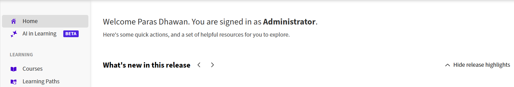

# Adobe Learning Managerでライブハブ（ベータ版）を有効にする

管理者は、Adobe Learning ManagerアカウントでLive Hubを有効にし、ライブセッション中にAIを使用したアシスタントがインストラクターをサポートするように設定できます。 ライブハブを有効にすると、作成者は、ライブハブのバーチャルトレーニングツールを使用して、コース用のバーチャルクラスルームモジュールを作成および管理できます。

ライブハブを有効にするには：

1. Adobe Learning Managerに管理者としてログインします。

1. 左側のナビゲーションパネルで「学習の&#x200B;**AI**」を選択します。

   学習ナビゲーションの
   *ラーニングでAIを選択して、ライブハブを有効にします。*

1. **Live Hub**&#x200B;を選択します。  **Live Hub**&#x200B;ページが開きます。

   
   *ライブハブ設定には、ALMでライブハブを有効にするオプションが表示されます。*

1. **このアカウントでライブハブを有効にする**&#x200B;に切り替えます。  **Live Hubを既定として設定**&#x200B;ダイアログボックスが表示されます。

   
   *ポップアップウィンドウで「デフォルトに設定」を選択します。*

1. 次のいずれかのオプションを選択します。

   1. **既定として設定**: Live Hubを既定のバーチャルクラスルームプロバイダーにします。 ライブハブは、作成者がコース用のバーチャルクラスルームモジュールを作成するときに事前選択されます。

   1. **今は実行しない**：既定のバーチャルクラスルームプロバイダーを変更せずに、ダイアログボックスを閉じます。 この設定は、後でライブハブページから有効にすることができます。

1. **ライブハブのAI**&#x200B;をオンにして、AIを利用したアシスタントをライブセッションで利用できるようにします。

   
   *Live HubでAIを有効にして、Live Hubエージェントを有効にします。*

1. ライブハブエージェントからアシスタントを有効にします。

   1. **投票アシスタント**:コースのコンテンツとライブセッションのトランスクリプトから投票を生成し、ワンクリックで確認および起動できるアイスブレーカーまたはナレッジチェックを作成します。 詳細については、[投票を作成して開始する](../../getting-started-with-live-hub/create-and-launch-a-poll.md#create-a-poll-using-ai)を参照してください。

   1. **Q&amp;Aアシスタント** ：セッションチャットの参加者の質問を検出し、アップロードされたコンテンツとセッションのトランスクリプトに基づいて回答をドラフトし、インストラクターがレビュー、調整、共有できるようにします。 詳細については、[インストラクターとしてチャットパネルを使用](../../getting-started-with-live-hub/use-the-chat-panel-as-an-instructor.md#draft-replies-to-participant-questions-with-ai)してください。

   1. **ブレイクアウト監視アシスタント**：各ブレイクアウトルームのトランスクリプトをインストラクターの目標に照らして読み取り、数分ごとにステータスカードを投稿し、ルームごとのディスカッションの概要に加えて、テーマ、決定事項、ギャップをルーム間で1つ統合したレポートを提供して、簡単に概要を伝えます。 詳細については、[ブレークアウトセッションを作成および管理](../../getting-started-with-live-hub/create-and-manage-breakout-rooms.md#view-ai-generated-summaries-of-breakout-rooms)を参照してください。

   1. **トピックのレコーディング生成**:セッションのレコーディングを、タイムスタンプと構造化されたメモを持つ名前付きのトピックに自動的にセグメント化します。これにより、参加者は完全なレコーディングを見ることなく、必要なものにすぐにアクセスしたり、メモから学んだりできます。 詳細については、[録音と文字起こしについて](../../getting-started-with-live-hub/record-a-session.md#generate-topics-in-recording)を参照してください。

   1. **インストラクターファインダーアシスタント** ：スキル、利用可能な時間帯、利用状況、優先指導時間などの条件を検討して、セッションのインストラクターに推奨するコンテンツを提供します。 詳細については、[Live Hubセッションの作成](../../getting-started-with-live-hub/create-a-live-hub-session.md#add-instructors-using-instructor-finder)を参照してください。

>[!NOTE]
>
> AIアシスタントは、ライブハブでAIが有効になっている場合にのみ設定できます。 インストラクターは、セッションの準備中にアシスタントを無効にすることはできますが、管理者が無効にしたアシスタントを有効にすることはできません。

詳細については、[Live Hubの概要](../../getting-started-with-live-hub/getting-started-live-hub.md)を参照してください。