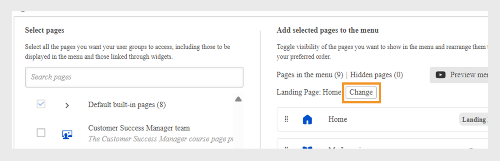

# メニューの作成

2つの主要なチーム、SalesとCustomer Success Manager(CSM)を持つ金融会社の管理者は、それぞれのページで個別のメニューを作成する必要があります。 これにより、学習者は自分の役割に関連するコースを自分のメニューから簡単に見つけることができます。

既定では、管理者は&#x200B;**[!UICONTROL メニュー]**&#x200B;ページで既定のメニューを表示できますが、このメニューは削除できません。 このメニューには、学習者アプリに現在表示されているすべての組み込みページが含まれています。

メニューを作成するには：

1. Adobe Learning Managerに管理者としてログインします。
2. 左側のナビゲーションウィンドウで[**[!UICONTROL ブランド]**]を選択します。
3. **[!UICONTROL メニュー]**&#x200B;を選択し、**[!UICONTROL 作成]**&#x200B;を選択します。

   
   _様々な学習者グループ向けにカスタマイズしたメニューを表示、整理、作成するためのオプションが表示されているメニュー画面_

4. **[!UICONTROL メニュー名]**&#x200B;を入力し（例： Product Training）、**[!UICONTROL 表示可能]**&#x200B;オプションでユーザーグループを選択します。

   
   _管理者が内部で使用するメニュー名を入力し、メニューの表示を制御するユーザーグループを指定できるメニューの作成画面_

5. メニューで使用可能なページの種類は次のとおりです。
   * **[!UICONTROL 組み込みページ]**:ホーム、学習状況、カタログなど、Adobe Learning Managerに付属するデフォルトのページです。 管理者は、メニューから組み込みページを削除することはできません。 メニューからページを非表示にすることができます。
   * **[!UICONTROL カスタムページ]**:エクスペリエンスビルダーを使用して管理者が作成したページです。 カスタムページを使用すると、組織は、様々な学習者グループに合わせてカスタマイズされたウィジェット、レイアウト、メニューを追加して、ブランド化されたエクスペリエンス、役割固有のエクスペリエンス、またはイベントベースのエクスペリエンスをデザインできます。
6. 学習者のランディングページを更新するには、**[!UICONTROL ランディングページ]**&#x200B;の横にある「**[!UICONTROL 変更]**」を選択します。

   
   _学習者のインターフェイスのランディングページを変更するためのページを選択するオプションを示すメニュー設定画面_

7. **[!UICONTROL [ページの選択]]**&#x200B;オプションからカスタムページを選択します。 管理者は、公開されたカスタムページのみを選択でき、下書き状態のページは選択できない必要があります。

   
   _ページ選択画面。ユーザーグループのカスタムページを含め、メニューの順序をカスタマイズするオプションを強調表示します_

8. ドラッグ&amp;ドロップして、メニューのページを並べ替えます。
9. **[!UICONTROL プレビューメニュー]**&#x200B;を選択して、メニューを表示してから保存します。
10. 「**[!UICONTROL 保存]**」を選択します。

作成されたメニューは、選択した学習者に対して表示されます。 学習者UIからカスタムページにアクセスできます。

_カスタムページを表示する学習者UIには、主なトレーニングモジュールとサイドバーメニューからの簡単なナビゲーションが含まれています_

## サブメニューの作成

管理者は、メニュー内にサブメニューを作成し、カスタムページを追加できます。 サブメニューにはランディングページがありません。

サブメニューを作成するには：

1. **[!UICONTROL メニュー構成]**&#x200B;ページで&#x200B;**[!UICONTROL サブメニューの作成]**&#x200B;を選択します。

   
   _学習者のサブメニューを作成するための「サブメニューを作成」オプションを強調したメニュー設定ページ_

2. 言語を選択し、サブメニューのタイトルを入力します。
3. サブメニューの横に表示するアイコンを選択します。
4. **[!UICONTROL [新しい言語の追加]]**&#x200B;を選択して、別のロケールに対して同じサブメニューを作成します。 例えば、英語とフランス語を追加した場合、インターフェイス言語として「英語」を選択した学習者には「英語」サブメニューが表示され、フランス語を選択した学習者には「フランス語」サブメニューが表示されます。

   
   _サブメニューのタイトル、言語、およびメニューに表示するアイコンを選択するオプションを表示するサブメニューのプロンプト_

5. **[!UICONTROL 「続行」]**&#x200B;を選択します。
6. サブメニューの下にページをドラッグ&amp;ドロップします。

## 非表示ページの設定

**[!UICONTROL ページを非表示]**&#x200B;オプションを使用すると、表示するページ数を減らして学習者UIをクリーンな状態に保つことができます。 管理者は、ページをメニューから非表示にして、学習者が学習者UIにページを表示できないようにすることができますが、学習者は他の方法でこれらのページにアクセスすることもできます。 例えば、カタログページはメニューからは非表示にして、学習者ホームページからアクセスすることができます。

_カタログ、ソーシャルラーニング、スキル、バッジなどの非表示ページが表示されたメニュー設定画面_

>[!NOTE]
>
>サブメニュー内のページを直接非表示にすることはできません。 ページを非表示にするには、サブメニューの外にページをドラッグして非表示にします。

## 次のステップ

ページ、ウィジェット、メニューを設定したら、JavaScriptとCSSを使用してカスタマイズし、学習者の全体的なエクスペリエンスを向上させます。

