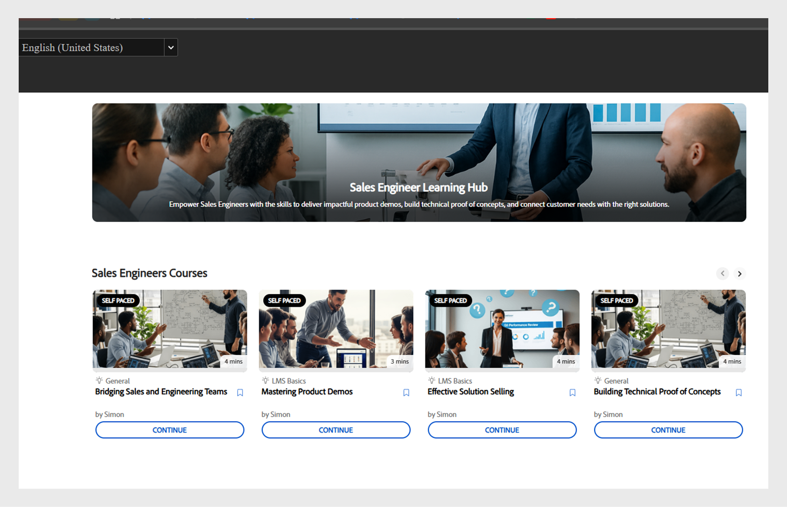

# Experience Builderでのカスタムページの作成

金融サービス企業の管理者は、セールスとカスタマーサクセスの2つのチームを管理しています。 各チームには固有の学習要件がありますが、どちらも同じ標準学習ポータルを使用しています。 これにより、混乱が生じ、混乱が生じ、学習者のエンゲージメントが低下しています。
ヘッドレスビルドに投資したり、カスタムのデベロッパーソリューションを待ったりすることなく、この課題を解決するには、Adobe Learning ManagerでExperience Builderを使用できます。 ページ、ウィジェット、メニューを使用すると、コーディングなしで、わずか数ステップでブランド化されたロール固有のポータルをデザインできます。

Adobe Learning Managerでセールスエンジニアリングチーム用のカスタムページを作成するには：

1. Adobe Learning Managerに管理者としてログインします。
2. 左側のナビゲーションウィンドウで[**[!UICONTROL ブランド]**]を選択します。
3. **[!UICONTROL カスタムページ]**&#x200B;を選択します。
4. **[!UICONTROL ページの作成]**&#x200B;を選択します。

   
   _新しいカスタム学習体験をデザインするための[ページの作成]オプションが表示されたカスタムページ画面_

5. **[!UICONTROL ページ名]**&#x200B;を入力してください（例：セールスチームのセールストレーニング）。
6. **[!UICONTROL ページの説明]**&#x200B;を入力します。

   
   _Adobe Learning Managerのセールストレーニングページの設定。ページ名、説明、種類、URL、およびターゲットのセールストレーニングポータルを作成するためのアイコン構成のフィールドが表示されます_

7. 次からページの種類を選択します。

   * **[!UICONTROL ALMウィジェットを使用してビルド]**：管理者は、既存のAdobe Learning Managerウィジェットを使用してページを作成できます。 ページURLフィールドにカスタムストリングを入力します。 この文字列は、カスタムページのURLに追加されます。
   * **[!UICONTROL 外部ページ]**：管理者は、外部ページのURLを追加できます。 ページタイプとして「外部」を選択した場合は、「ページURL」テキストフィールドに外部ページURLを入力します。

8. **[!UICONTROL 変更アイコン]**&#x200B;を選択して、ページのアイコンを変更します。
9. **[!UICONTROL [新しい言語の追加]]**&#x200B;を選択して、ページの既定の言語を追加します。
10. 「**[!UICONTROL 保存]**」を選択します。

ページが作成され、「カスタムページ」セクションに下書きとして保存されている。 管理者は、ウィジェットを使用してドラフトされたページを編集および設計できます。

次の手順は、ウィジェットを追加および設定できるカスタムページにレイアウトを追加することです。

## エクスペリエンスビルダーのページレイアウト

ドロップダウンメニューから適切なセクションレイアウトを選択して、ページをデザインします。 レイアウトの最大幅は1212ピクセルです。 追加するウィジェットの数と目的のサイズに基づいて、次のセクションオプションから選択します。

* **[!UICONTROL 1列 – セクション全体の幅]**:コンテンツはセクションの幅全体に広がり、最大のスペースを提供します。
* **[!UICONTROL 2列 – 1/2セクション幅の各列]**:セクションは均等に2つの等幅の列に分割されます。
* **[!UICONTROL 2列 – セクション幅2/3および1/3]**:メインコンテンツは幅の3分の2を占め、サイドコンテンツは3分の1を占めています。
* **[!UICONTROL 2列 – セクション幅1/3および2/3]**：横の内容が3分の1、メインの内容がセクションの3分の2になります。
* **[!UICONTROL 3列 – 1/3セクションの幅ごとに]**:セクションは3つの等幅の列に分割されます。

>[!NOTE]
>
>最大10個のウィジェットを、1列 – 全幅セクションのレイアウトを除くすべてのレイアウトに垂直に追加できます。

Experience Builderの「Sales training」ページのレイアウトを選択するには、次の手順を実行します。

1. Adobe Learning Managerに管理者としてログインします。
2. 左側のナビゲーションウィンドウで[**[!UICONTROL ブランド]**]を選択します。
3. **[!UICONTROL カスタムページ]**&#x200B;を選択し、必要なページを選択します。
4. **[!UICONTROL ページデザイン]**&#x200B;を選択します。
5. 「**[!UICONTROL 編集]**」を選択します。

   
   _セールストレーニングのカスタムページのページデザイン編集画面。ページセクション、ウィジェット、レイアウトを追加するための「編集」ボタンがハイライト表示されます。_

6. **[!UICONTROL 「セクションレイアウトを選択」]**&#x200B;ドロップダウンからオプションを選択します。

   
   _セクションレイアウトの選択ダイアログを使用すると、管理者はカスタムページデザインの1列または複数列のウィジェットの並べ替えを選択できます_

7. **[!UICONTROL 「続行」]**&#x200B;を選択します。

追加されたレイアウトには、次のオプションがあります。

* **[!UICONTROL 行の削除]**:レイアウトから行を削除します。
* **[!UICONTROL 画面の幅に合わせる]**：画面に合わせて自動的にサイズが変更されるようにレイアウトを調整して、視認性を高めます。
* **[!UICONTROL 並べ替え]**:レイアウトを目的の位置にドラッグアンドドロップして、レイアウトの順序を変更します。

_セクションの並べ替え、展開、削除を行うためのレイアウトオプションを表示するページレイアウト_

次に、カスタムページにウィジェットを追加して設定します。

## ウィジェットの追加と設定

要件に基づいて、必要なウィジェットをセールストレーニングのカスタムページに追加します。

セールストレーニングカスタムページでウィジェットを設定するには：

1. レイアウトで「**[!UICONTROL ウィジェットを追加]**」を選択します。

   
   _ページデザイン画面では、管理者はウィジェットを選択および追加して、コースページをカスタマイズできます_

2. **[!UICONTROL コンテンツボックスウィジェット]**&#x200B;を選択し、**[!UICONTROL 続行]**&#x200B;を選択します。

   
   _コンテンツボックスウィジェットをハイライト表示したウィジェット選択画面で、カスタム画像、テキスト、および操作ボタンを表示して、学習者のエンゲージメントを高めます_

3. **[!UICONTROL タイトル]**&#x200B;と&#x200B;**[!UICONTROL 説明]**&#x200B;を入力します。
4. **[!UICONTROL アクションボタンのラベル]**&#x200B;にテキストを入力し、リンクを提供します。
5. 残りのオプションを設定します。 この[セクション](/help/migrated/administrators/feature-summary/experience-builder/add-a-widget.md#content-box-widget)を表示して、**[!UICONTROL コンテンツボックスウィジェット]**&#x200B;の詳細を確認してください。

   
   _ウィジェットを構成するオプションを示すコンテンツボックスウィジェット画面_

6. セールスエンジニアの&#x200B;**[!UICONTROL コンテンツボックスウィジェット]**&#x200B;設定画面で、タイトル、説明、およびアクションボタンラベルを入力します
7. 「**[!UICONTROL ウィジェットを追加]**」を選択します。
8. 「**[!UICONTROL 保存]**」を選択し、次のいずれかのオプションを選択します。
a. **[!UICONTROL 下書きとして保存]**:ページは下書きとして保存されます。 管理者は後でページを編集できます。
b. **[!UICONTROL 保存してPublish]**：このページは公開されます。管理者はこのページをメニューに追加できます。

   
   _保存オプションを使用すると、管理者はページを将来の編集のために下書きとして保存するか、学習者アクセスのために公開するかを選択できます_

ページはドラフトとして保存したり、公開したりできます。 管理者は、公開する前に下書きを編集できます。また、公開したページを更新して再公開することもできます。

同じ手順に従って、カスタマーサクセスマネージャーチームのページを作成します。

## ページのプレビュー

ページをプレビューするには：

1. Adobe Learning Managerに管理者としてログインします。
2. 左側のナビゲーションウィンドウで[**[!UICONTROL ブランド]**]を選択します。
3. **[!UICONTROL カスタムページ]**&#x200B;を選択します。
4. 必要なページを選択して、**[!UICONTROL ページデザイン]**&#x200B;を選択します。
5. **[!UICONTROL 編集]**&#x200B;を選択し、**[!UICONTROL プレビューページ]**&#x200B;を選択して、ポータルのプレビューを表示します。

   
   _バナー、おすすめのコースを含むカスタムページレイアウトを表示したページプレビュー_

6. Inspectモードを選択して、ウィジェットの高さと幅を表示します。

   
   _Experience Builderのページプレビュー画面でInspectモードの切り替えがハイライト表示され、管理者がウィジェットを確認および確認できる_

## 別の言語でのページの作成

管理者は、ページの作成時に「新しい言語を追加」で必要な言語を選択して、ロケール固有の複数のカスタムページを作成できます。 複数の言語を追加する場合、ウィジェットの詳細は、デフォルト言語タブの横にある対応するタブで、言語ごとに個別に設定する必要があります。

_管理者は、フランス語など、追加の言語のウィジェットの詳細と既定言語を追加できます_

## ページライフサイクルの管理

管理者は、「カスタムページ」セクションを使用して、ページを編集、削除、複製できます。

### ページの編集

カスタムページを編集するには：

1. Adobe Learning Managerに管理者としてログインします。
2. 左側のナビゲーションパネルで「ブランディング」を選択します。
3. 「カスタムページ」を選択します。
4. 必要なページを選択し、「編集」を選択します。
5. 「保存」を選択します。

ページが変更を反映して更新されます。

_ユーザー設定のページを編集して、管理者がページ名、説明、および種類を更新できるようにします_

### ページを削除

ページを削除するには、次の手順を実行します。

1. Adobe Learning Managerに管理者としてログインします。
2. 左側のナビゲーションパネルで「ブランディング」を選択します。
3. 「カスタムページ」を選択します。
4. 必要なページを選択します。
5. 「アクション」を選択し、「削除」を選択します。

_製品トレーニング用に作成されたカスタムページを削除するオプションを表示するカスタムページ画面_

### ページを複製

ページを複製するには、次の手順を実行します。

1. Adobe Learning Managerに管理者としてログインします。
2. 左側のナビゲーションパネルで「ブランディング」を選択します。
3. 「カスタムページ」を選択します。
4. 必要なページを選択します。
5. 「アクション」を選択し、「複製」を選択します。

_製品トレーニング用に作成されたカスタムページを複製するオプションを表示するカスタムページ画面_

## 次のステップ

ページを作成したら、トレーニングのニーズに応じて、カスタムページにウィジェットを追加して設定します。
