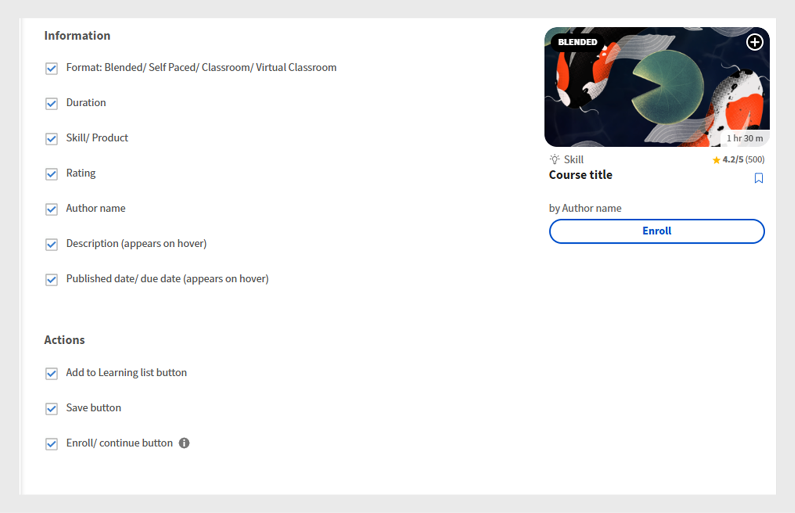
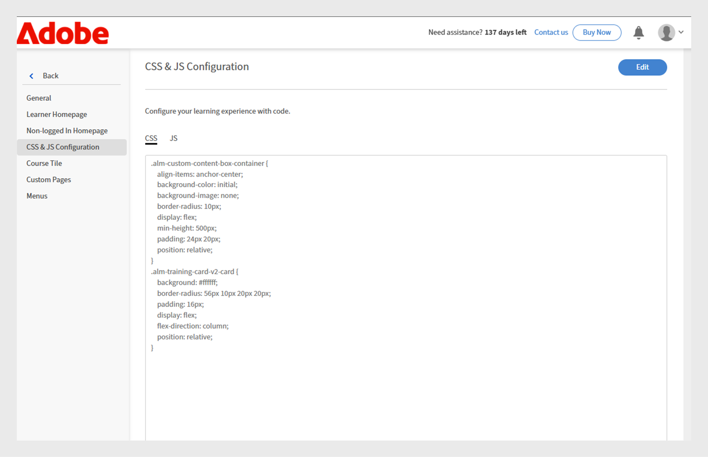
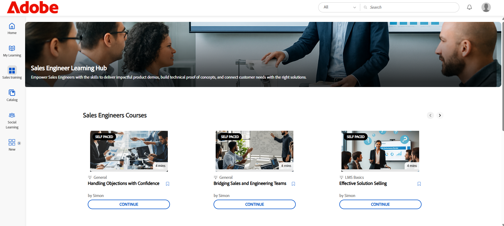

# Experience Builderのカスタマイズ

## フッターのカスタマイズ

フッターは学習者インターフェイスの下部に表示され、通常は管理者設定で設定されたデフォルト情報が表示されます。 管理者は、これをカスタムフッターに置き換えて、ブランドエクスペリエンスを作成できます。 HTMLとCSSを使用して、組織の要件に合わせてフッターのデザイン、レイアウト、コンテンツを定義できます。

金融会社の管理者は、カスタムオプションを使用してフッターを設定できます。 このオプションを使用すると、独自のHTMLとCSSを追加して、フッターを柔軟にデザインできます。

フッターをカスタマイズするには：

1. Adobe Learning Managerに管理者としてログインします。
2. **[!UICONTROL ブランド]**&#x200B;を選択し、**[!UICONTROL 全般]**&#x200B;を選択します。
3. 「**[!UICONTROL フッターのカスタマイズ]**」オプションの横にある&#x200B;**[!UICONTROL 編集]**&#x200B;を選択します。

   
   _Adobe Learning Managerの一般設定画面で、フッターのカスタマイズを有効にするオプションが表示されます_

4. トグルボタンを選択して、**[!UICONTROL フッターのカスタマイズ]**&#x200B;を有効にします。

   
   _Adobe Learning Managerのフッターのカスタマイズ設定。カスタマイズされたブランディング用のHTMLやCSSを追加するための、カスタムフッターとフィールドを有効にするトグルが表示されます_

5. それぞれのタブに&#x200B;**[!UICONTROL HTML]**&#x200B;と&#x200B;**[!UICONTROL CSS]**&#x200B;を入力してください。

   
   _Adobe Learning Managerのフッターカスタマイズ画面。学習者インターフェイスフッターの追加、編集、スタイル設定を行うためのカスタムHTMLセクションが表示されます_

6. **[!UICONTROL プレビュー]**&#x200B;を選択して、カスタマイズしたフッターを保存する前に表示します。

   
   _カテゴリ化されたリンクを使用して、Adobe Learning Managerでカスタマイズされた学習者インターフェイスフッターのプレビュー_

7. 「**[!UICONTROL 保存]**」を選択します。

カスタマイズされたフッターが、すべての学習者に表示されます。

## コースタイルのカスタマイズ

金融会社では、管理者がコースタイルを設定して、学習者に表示する詳細を決定できます。 例えば、コンプライアンストレーニングのコースの説明とスキル名は表示されても、評価や作成者の名前は表示されないので、必須要件に注意を払う必要があります。

コースタイルをカスタマイズするには：

1. Adobe Learning Managerに管理者としてログインします。
2. **[!UICONTROL ブランディング]**&#x200B;を選択し、**[!UICONTROL コースタイル]**&#x200B;を選択します。
3. 「**[!UICONTROL 編集]**」を選択します。

   
   _Adobe Learning Managerの「コースタイル設定」画面に「編集」オプションが表示され、タイルをカスタマイズできます_

4. コース情報に関連する詳細を表示または非表示にするには、以下のオプションを選択します。

   a. **[!UICONTROL 形式]** :ミックス済み/セルフペース/教室/バーチャルクラスルーム：学習目標のタイプ
b. **[!UICONTROL 期間]**：学習目標の期間。
c. **[!UICONTROL スキル/製品]**:コースの対象となる主要なスキルや製品を表示します。
d. **[!UICONTROL 評価]**:コースの学習者の評価を表示します。
e. **[!UICONTROL 作成者名]**:コース作成者の名前が表示されます
f. **[!UICONTROL 説明（カーソルを合わせると表示）]** ：学習者がカードにカーソルを合わせると、コースの簡単な概要が表示されます。
g. **[!UICONTROL 公開日/期日（ホバー時に表示）]**:コースが公開された日時または完了の期限を表示します。

5. コースアクションに関連する詳細を表示または非表示にするには、以下のオプションを選択します。

   a. **[!UICONTROL 「学習リストに追加」ボタン]** ：今後の参照用に、学習者が個人の学習リストにコースを保存できるように許可します。
b. **[!UICONTROL 保存ボタン]**:コース設定または環境設定に加えられた変更を保存します。
c. **[!UICONTROL 登録/続行ボタン]**：学習者は、新しいコースに登録するか、既に開始しているコースを続行することができます。 このオプションを非表示にすると、その横に表示される「お勧めしません」および「ダウンロード」のアクションも削除されます。

   
   _Adobe Learning Managerのコースタイル設定画面。学習者に表示する情報とアクションを管理者が選択できます_

6. 画面の右側に、コースタイルのプレビューが表示されます。

   
   _Adobe Learning Managerのコースタイル設定画面。コースタイルのプレビューが強調表示されています_

7. 「**保存**」を選択します。

カスタマイズされたコースタイルが、すべての学習者に表示されます。

**カスタマイズ前**


_カスタマイズ前のAdobe Learning Managerのコースタイル_

**カスタマイズ後**


_カスタマイズ後のAdobe Learning Managerのコースタイル_

## JavaScriptとCSSを使用したカスタマイズ

財務会社の管理者は、自社のブランディングおよび規制要件に合わせてCSSおよびJavaScriptを注入して学習者アプリをカスタマイズし、アプリの外観、レイアウト、およびインタラクティブな機能を完全に制御できます。

CSSとJSを使用して学習者インターフェイスをカスタマイズするには：

1. Adobe Learning Managerに管理者としてログインします。
2. **[!UICONTROL ブランディング]**&#x200B;を選択し、**[!UICONTROL CSS &amp; JS設定]**&#x200B;を選択します。
3. 「**[!UICONTROL 編集]**」を選択します。
4. それぞれのタブにカスタムCSSとJSを入力します。

   
   _Adobe Learning ManagerのCSS &amp; JS設定画面。管理者は、カスタムCSSおよびJSを追加できます_

5. 「保存」を選択します。

カスタマイズは、すべての学習者に表示されます。

**カスタマイズ前**

学習者ホームページのメニューデザインは、Adobe Learning Managerのデフォルトデザインに基づいています。


_カスタマイズ前のAdobe Learning Manager学習者ホームページ_

**カスタマイズ後**

次のCSSとJSを追加すると、カスタマイズに基づいて学習者のホームページメニューが更新されます。

サンプルCSS:

```
p{
display:block;
}

.withExtraMargin{
margin-right: 100px!important;
}
.alm-footer-extraMargin{
margin-top:0;
}

.alm-layout-almLayoutContainer{
margin: 0;
    margin-bottom: 5rem;
}
#page-756 #category-970151 .alm-category-card-cardLink
{
    height: 400px;

}
#page-756 #category-970151 .alm-category-card-header
{
height: 240px!important;
}
#page-656 .alm-category-card-cardLink{
    height: 380px;
background: white;
}
#page-656 .alm-category-card-header{
height: 200px!important;
}

#page-746 #html-636797 {
    background-color: #f7f9fc;
}

#page-746 .alm-layout-almLayoutContainer{
row-gap:0;
margin-bottom:0;
}

.alm-category-card-cardLink{
transition: border .3s ease;
}
.navText{
       font-size: 16px;
    cursor: pointer;
}
.submenuDownCaret{
display:none;}
.alm-catalog-container-pageContainer{
max-width: 1720px;
    width: 100%;
    padding: 0 40px;
    padding: 0 40px;
}


.pagenavbarcontainer.newNavbarContainer{
width: 1230px;
    margin: 0 auto;
}
div[automationid="learner-menu-inside-header"]{
margin-right:100px!important;
}
#searchScope,.searchSeparator,#searchInDropdown{
display:none!important;
}
#right-navbar{
    margin-right: 0;
}
#companyLogoImg{
cursor:pointer;
max-width:190px;
}
.alm-catalog-container-filtersContainer{
width:340px;
}
.alm-training-card-v2-imageFlipContainer{
border:none;
}
.newSearchBoxContainer{
border-radius: 5px !important;
    border-width: 2px !important;
    border-color: rgb(5, 32, 34) !important;
}
.searchBoxFlex{
width:250px!important;
flex-direction: row-reverse;
    padding-right: 10px;
}
.searchPlaceholderIcon svg{
    height: 16px;
    width: 16px;
}
.searchPlaceholderIcon svg path{
fill: black;
}
#page-656 .alm-layout-almLayoutContainer {
    padding-bottom: 5rem;
margin-bottom:0!important;
}
#page-656 .alm-strip-widget-header-stripHeaderContainer{
display:none;
}
#page-656 .content-wrapper{
padding-bottom:50px;
}
.myspan{
position: absolute;
    bottom: 10px;
    display: block;
    width: 85%;
    margin-left: 20px;
    margin-right: 20px;
    border-top: 1px solid #efefef !important;
    color: #5a697c !important;
    text-align: right;
    padding-top: 5px;
}
.alm-app-wrapperComponent{
padding-bottom:100px;}


@media (max-width: 768px) {
#page-656 .alm-category-widget-cardRow{
   flex-direction: column;
gap: 40px;
 }
#page-656 .alm-category-widget-stripCardContainerRow{
    width: 100%;
    display: flex;
    justify-content: center;
  }
}

@media (max-width: 768px) {
    .container2-right {
        display: none!important;
    }
.container-1 .content-wrapper{
    padding: 0 20px!important;
 }
}
```

サンプルJS:

```
console.error("Hello Error")

setTimeout(() =>{
// Step 1: Check if #category-284977 is present
const categoryElement = document.querySelector('#category-284977');

if (categoryElement) {
  // Step 2: Find all elements with .alm-category-card-cardLink
  const cardLinks = categoryElement.querySelectorAll('.alm-category-card-cardLink');

  // Step 3: Loop over them and append span with random calculation
  cardLinks.forEach((link, index) => {
    const span = document.createElement('span');


    // Calculate number = (index+1) * 5
    let number = (index + 1) * 5;
if(index === 2){
number = number +2;
}
if(index == 3){
number = number - 7;
}

    span.textContent = `${number} courses`;
    span.classList.add('myspan');
    link.appendChild(span);
  });
}

},2000)
```


_カスタマイズ後のAdobe Learning Manager学習者ホームページ_

## ウィジェットのカスタマイズ

管理者は、CSSクラスを適用して、カスタムページ上のウィジェットをカスタマイズできます。 例えば、コンテンツボックスウィジェットのテキストを揃えたり、「コースとパス」ウィジェットでコースタイル間の間隔を調整したりできます。

>[!TIP]
>
>「学習者」ページをInspectし、変更するスタイルを指定します。 関連するCSSクラスをコピーしてCSS &amp; JS設定ページにペーストし、カスタマイズを適用します。

**カスタマイズ前**

次の画面は、CSSのカスタマイズを追加する前の、Sales Engineersのトレーニングページです。


_カスタマイズ前のセールスエンジニアの学習者ページ_

**カスタマイズ後**

次のCSSクラスを追加すると、それらのクラスで定義されたスタイルに従って学習者ページが更新されます。 CSSに基づいて、コンテンツボックスWidgetのテキストが左揃えになり、コースタイルの間隔が広がりました。

```
.alm-custom-content-box-center {
    align-items: baseline;
    text-align: initial;
}
.alm-training-card-v2-imageContainer {
    border: 14px solid var(--prime-color-white);
    border-radius: -1px;
    height: 106%;
    position: relative;
    transition: all .1s ease-in-out;
}
.alm-course-path-widget-cardRow {
    display: flex;
    gap: 135px;
    margin: 0 0 21px;
    padding: 10px;
}
```


_カスタマイズ後のセールスエンジニアの学習者ページ_

### ウィジェットの定義済みCSSクラス

次に、ウィジェットで使用できる定義済みのCSSクラスをいくつか示します。

| ウィジェット名 | コンテナCSS |
|---|---|
| カレンダー | alm-calendar-widget-container |
| カテゴリ | alm-category-widget-container |
| カテゴリカード | alm-category-card-container |
| コンプライアンス | alm-compliance-container |
| コースとパス | alm-course-path-widget-container |
| コースとパスのLOカード | alm-training-card-v2-card |
| コンテンツボックス | alm-custom-content-box-container |
| ゲーミフィケーション | alm-leaderboard-container |
| ソーシャル学習機能 | alm-social-learning-container |


