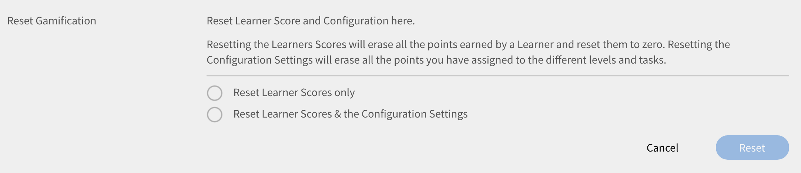

# ゲーミフィケーション

ゲーミフィケーションとは、ゲームとは無関係の文脈でゲームの考え方と仕組みを使用し、学習しながらポイントの獲得にユーザーを引き込むことです。

## 概要 {#overview}

Learning Managerでは、構造的なゲーミフィケーションレイヤーをコンテンツに適用して、学習者を引き付け、学習目標の達成に向けて動機付けすることができます。 これにより、学習者は様々な学習活動でポイントを獲得し、ブロンズ、シルバー、ゴールド、プラチナのレベルを達成できます。

デフォルトでは、ユーザーがパターンを理解できるように、一部のゲーミフィケーションポイントとデータが用意されています。 必要に応じて点を修正できます。

<!--A sample illustration is provided below that shows all the tasks and points.

-->

## ゲーミフィケーション設定 {#gamificationsettings}

設定にアクセスするには、次の手順に従います。

1. 管理者としてログインし、左側のペインで、をクリックします。 **[!UICONTROL ゲーミフィケーション]**.
1. 新しいLearning Managerアカウントを作成すると、ゲーミフィケーションはデフォルトで無効になります。 有効にするには、 **[!UICONTROL 有効にする]** をクリックします。

## 管理者のアクション {#administratoractions}

管理者は、機密ユーザーのリストの作成、ゲーミフィケーションポイントのリセット、学習者に対するゲーミフィケーション機能の無効化/有効化を行うことができます。 ページの右上隅にある「アクション」ドロップダウンリストをクリックすると、以下のスナップショットに示すようなアクションが表示されます。

*管理者のゲーミフィケーションオプション*

## 機密性設定 {#confidentialitysettings}

必要に応じて、より高度な管理ユーザーを機密ユーザーにすることができます。 ユーザーの機密ゲーミフィケーションアクティビティは、リーダーボードの他の学習者には表示されません。

機密性設定は、社内ユーザーと社外ユーザーの両方に適用できます。

1. クリック **[!UICONTROL ゲーミフィケーション]** > **[!UICONTROL 設定]** > **[!UICONTROL 機密性設定]**.

*機密性設定の表示*

1. リストされたユーザーのユーザー名のチェックボックスをクリックし、「非表示」をクリックして、そのユーザーを機密ユーザーにします。

   >[!NOTE]
   >
   >ユーザー名のチェックボックスをオンにすると、リストされたユーザーの機密ユーザーを識別できます。

1. 「機密ユーザー」タブをクリックして、機密ユーザーのリストを表示します。 デフォルトでは表示されません。 ドロップダウン矢印アイコンをクリックして、リストを表示します。
1. 機密ユーザーリストのユーザー名のチェックボックスをクリックし、「追加」をクリックして機密リストからユーザーを削除します。

## ゲーミフィケーションのリセット {#resetgamification}

学習者が獲得したゲーミフィケーションポイントをリセットしたり、構成設定をリセットしたりできます。 ユーザーのスコアをリセットすると、ユーザーが獲得したすべてのポイントが消去され、ゼロにリセットされます。 ユーザー・スコアおよび構成設定をリセットするように選択すると、レベルおよびタスクに割り当てられたすべてのデフォルト・ポイントがゼロにリセットされます。

ゲーミフィケーションのリセット設定は、社内ユーザーと社外ユーザーの両方に適用できます。

学習者のスコアと設定をリセットするには、「ゲーミフィケーションをリセット」をクリックし、必要に応じてオプションを選択します。 「学習者のスコアのみをリセット」または「学習者のスコアをリセット&amp;環境設定」のいずれかを選択できます。 選択したら、「OK」をクリックします。

*ゲーミフィケーションポイントをリセット*

## ゲーミフィケーションを無効にする {#disablegamification}

クリック [!UICONTROL **ゲーミフィケーション**] > [!UICONTROL **ゲーミフィケーション機能**]. これにより、ゲーミフィケーション機能とリーダーボードを、学習者ごとに個別に有効にすることができます。 要件に応じて「社内学習者に対して有効にする」または「社外学習者に対して有効にする」を選択し、「OK」をクリックします。 ゲーミフィケーションを再度有効にすると、すべてのポイントが保持されます。

*ゲーミフィケーションを無効にする*

社内ユーザーと社外ユーザーの両方のゲーミフィケーションを無効にできます。

## ポイントを設定する {#setuppoints}

管理者は、以下の手順に従って、学習者のゲーミフィケーションポイントを設定できます。

1. クリック **[!UICONTROL ゲーミフィケーション]** 管理者としてログインした後\
   ブロンズ、シルバー、ゴールド、およびプラチナというレベルの一覧と、各レベルに到達するために必要なポイントが記載されたページが表示されます。 タスクと対応するポイントの一覧が表示されます。
1. 各タスクの横にある「編集」アイコンをクリックして、ポイントを設定します。
1. 月、四半期、または年に特定の数のコースを完了するなどのタスクの出現頻度を変更します。
1. クリック **[!UICONTROL 保存]**.

## タスク {#tasks}

学習者のゲーミフィケーションタスクは5つあり、管理者はこれらに対してポイントを設定できます。 すべての学習者のタスクとポイントを示す図を以下に示します。

>[!NOTE]
>
>特定のタスクでは、学習者のゲーミフィケーションポイントが累積されません。 ただし、異なるタスク間で学習者にこれらのポイントが付与された場合、ポイントは学習者アカウントに累積されて追加されます。

管理者はポイントにコースを割り当てる際、学習者がポイントを累積できるように設定する必要があります。

**学習ペースが速い学習者の場合**

このタスクは、学習者が1か月、四半期、または1年以内に特定の数のコースを完了した場合に適用されます。 このタスクは、速い学習者を奨励することです。

次のシナリオが考えられます。

1. 1か月、四半期または1年以内に2つのコースを完了すると、20ポイントが付与されます。
1. 1か月、四半期または1年以内に4つのコースを完了すると、100ポイントが付与されます。
1. 学習者は8つのコースを完了すると300ポイントを獲得します。
1. 学習者は10のコースを完了すると500ポイントを獲得します。

>[!NOTE]
>
>管理者はポイントを獲得するために必要な期間とコース数を変更できます。

タスク内で付与されるポイントは累積されません。 例えば、学習者が2つのコースを完了し、20ポイントを獲得したとします。 学習者が4つのコースを完了すると100ポイントを獲得しますが、既存の20ポイントは累積されません。

**自己学習タイプの学習者の場合(a)**

このタスクは、学習者が規定数のコースを登録し、1か月、四半期、または1年以内に完了した場合に適用されます。 この場合、管理者はこのタスクを有効にしてポイントを割り当て、ポイントを推奨できます。

考えられるシナリオ：

1. 1か月、四半期、または1年以内に1つのコースに登録すると、50ポイントが付与されます。
1. 1か月、四半期または1年以内に2つのコースに登録すると、150ポイントが付与されます。

>[!NOTE]
>
>管理者は期間とコース数を変更できます。

**自己学習タイプの学習者の場合(b)**

このタスクは、1か月、四半期、または1年間に完了する必要があるコース数を超えて学習者が登録および完了する場合に適用されます。 このような場合、管理者はこのタスクを有効にしてポイントを割り当て、ポイントを奨励できます。

学習者が割り当てられたコースに加えてコースを登録する際に考えられるシナリオは次のとおりです。

1. 1か月、四半期または1年以内に1つのコースに登録すると、20ポイントが付与されます。
1. 1か月、四半期または1年以内に2つのコースに登録すると、100ポイントが付与されます。
1. 1か月、四半期または1年以内に3つのコースに登録すると、300ポイントが付与されます。
1. 1か月、四半期または1年以内に4つのコースに登録すると、500ポイントが付与されます。

>[!NOTE]
>
>管理者は期間とコース数を変更できます。 例えば、3つ目のシナリオでは、3つのコースではなく5つのコースに変更し、80ポイントを獲得できます。

**上位レベルを達成した場合(a)**

このタスクは、特定の数のコンピテンシーを完了した学習者に適用されます。 管理者はこのタスクを選択して、できるだけ多くのコンピテンシーを達成するよう学習者に促すことができます。

例えば、達成したコンピテンシー数に応じて以下を適用することができます。

1. 学習者が1つのコンピテンシーを達成すると、100ポイントが付与されます。
1. 学習者は2つのコンピテンシーを達成すると、300ポイントを獲得します。
1. 学習者は3つのコンピテンシーを達成すると、600ポイントを獲得します。
1. 学習者は4つのコンピテンシーを達成すると、900ポイントを獲得します。

>[!NOTE]
>
>このタスクには期間が適用されません。 管理者は、シナリオごとにコース数を変更できます。

**上位レベルを達成した場合(b)**

このタスクは、学習者がコンピテンス内の上位レベルを完了する場合に適用されます。

特定のコンピテンス内のレベルが上位である場合に考えられるシナリオ：

1. 学習者が1レベルに達すると100ポイントが付与されます。
1. 学習者が2つのレベルに到達すると200ポイントが付与されます。
1. 学習者が3つのレベルに到達すると、500ポイントが付与されます。

>[!NOTE]
>
>このタスクには期間を適用できません。 学習者が高いレベルのコンピテンシーを達成してから低いレベルのコンピテンシーを達成した場合は、高いレベルのポイントだけが付与されます。

**早期完了ポイント**

このタスクは、コースを最初に完了したN人の学習者に適用されます。

考えられるシナリオ：\
コースを最初に完了した10人には100ポイントが付与されます。

**タイムリーな完了ポイント**

このタスクは、コースへの登録後、規定日数以内にコースを完了した学習者に適用されます。

考えられるシナリオ：\
コースの開始時点から10日以内にコースを完了すると100ポイントが付与されます。

## グループレベルのゲーミフィケーション {#grouplevelgamification}

管理者は、範囲設定を変更することで、ゲーミフィケーションの範囲を定義できます。 類似するプロファイルのユーザー、グループ、または場所に対して、ゲーミフィケーションを選択的に有効にできます。

1. 管理者ログインで、 **[!UICONTROL ゲーミフィケーション]** をクリックします。
1. 開く **[!UICONTROL ゲーミフィケーション]** > **[!UICONTROL 設定]** > **[!UICONTROL 範囲設定]**. この [!UICONTROL ゲーミフィケーションスコープ設定] ダイアログが表示されます。

   

   *ゲーミフィケーションスコープ設定ダイアログの表示*

1. オプションをクリックします **[!UICONTROL 範囲設定を有効にする]**.

1. ドロップダウンリストから「ユーザー特性」を選択します。

   <!---->

1. 選択したユーザー特性に対応する値を選択します。 たとえば、プロファイルとしてユーザー特性を選択した場合、ドロップダウンリストから値を選択する必要があります。 プロファイル値のサンプルを以下のスクリーンショットに示します。

   <!---->

1. クリック **[!UICONTROL 保存].**
