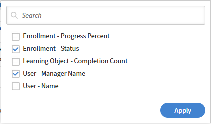

# Report Builderのグループ化と集計を適用する

## 概要

グループ化と集計により、インストラクターごとの完了数、カタログごとの登録数、地域ごとのコンプライアンス率などの概要レポートを生成できます。

## グループ化の条件

レコードごとに1行ではなく、カテゴリごとに1行を必要とする場合は、[グループ化]を使用します。 以下に例を示します。

* インストラクター1人につき1行、教えたセッション数
* カタログあたり1行、登録合計を示す
* ユーザーグループあたり1行、コンプライアンスの割合を示す

個々の学習者レコードまたは登録行を表示する場合は、「グループ化」を適用しないでください。

1つの列にグループ化を適用する場合、レポート内の他のすべての列に集計関数が適用されている必要があります。 グループ化された列と共に生のフィールド値を表示することはできません。計算値（カウント、合計、平均など）のみを表示します。

例えば、**インストラクター名**&#x200B;でグループ化した場合、個々の&#x200B;**セッション名**&#x200B;の値を横に表示することはできません。 代わりに、「セッションID」フィールドに&#x200B;**カウント**&#x200B;を適用して、各インストラクターが教えたセッションの数を表示します。

## グループ化と集計を適用する

この例では、登録状況を学習者間で比較します。 このレポートを使用して、登録の進行状況と完了に関するさまざまなマネージャの実績を把握します。

### 列を選択

1. Report Builderを起動して、**レポートの作成**&#x200B;を選択します。
2. レポートの名前と説明を入力してください：

   * **名前：**&#x200B;登録の進行状況をユーザー間で比較します
   * **説明：**&#x200B;このレポートでは、マネージャー別に学習者がグループ化され、登録状況=COMPLETEDの学習者合計、平均進捗状況、完了数などの概要メトリックが計算されます

3. 次の列を選択します。 <dataset>:<column name>

   * ユーザー – マネージャー名
   * ユーザー – 名前
   * 登録 – ステータス
   * 登録 – 進捗率
   * 学習目標 – 完了数

### 「列でグループ化」を選択します

1. **グループ化**&#x200B;セクションで次の列を選択してください：

   * 登録 – ステータス
   * ユーザー – マネージャー名

   

2. 「**適用**」を選択します。

### 集約する列の選択

集計関数は、マネージャーおよび登録ステータス別に学習者の登録パフォーマンスを集計し、個別の学習者カウント、平均トレーニング進捗率、およびグループ化されたトレーニングレコード全体の平均学習オブジェクト完了数を示します。

1. User-Nameに&#x200B;**Count Distinct**&#x200B;を選択します。
2. 登録 – 進行状況の割合の&#x200B;**平均**&#x200B;を選択します。
3. 学習目標 – 完了数の&#x200B;**平均**&#x200B;を選択します。

   

### フィルターを適用

フィルターを適用して、完了した登録のみを含め、マネージャー名が欠落しているレコードを除外します。これにより、レポートで有効な学習者データが分析され、マネージャー別のトレーニングの進捗状況と完了に関するインサイトが正確に把握されます。

1. 登録 – ステータスが完了に等しいフィルターを適用します。
2. User - Manager Nameが空でない2つ目のフィルタを適用します。
3. AND条件を使用して両方のフィルターを組み合わせ、完了した有効な学習者レコードのみを含めます。

### レポートの保存とダウンロード

**レポートを保存**&#x200B;を選択し、**アクション** > **ダウンロード**&#x200B;を選択してレポートをダウンロードします。 準備が整うと、レポート(CSV)をダウンロードするための通知が届きます。

CSVには、完了した学習者の登録とトレーニングの進捗状況に関するマネージャーごとの概要が含まれます。 各行はマネージャーを表し、学習者カウント、登録ステータス、平均進捗率および平均完了カウントが含まれます。

全体として、このレポートではマネージャー間でトレーニングの完了と学習アクティビティを比較し、学習者のエンゲージメントと完了した学習目標の数の違いを強調します。
