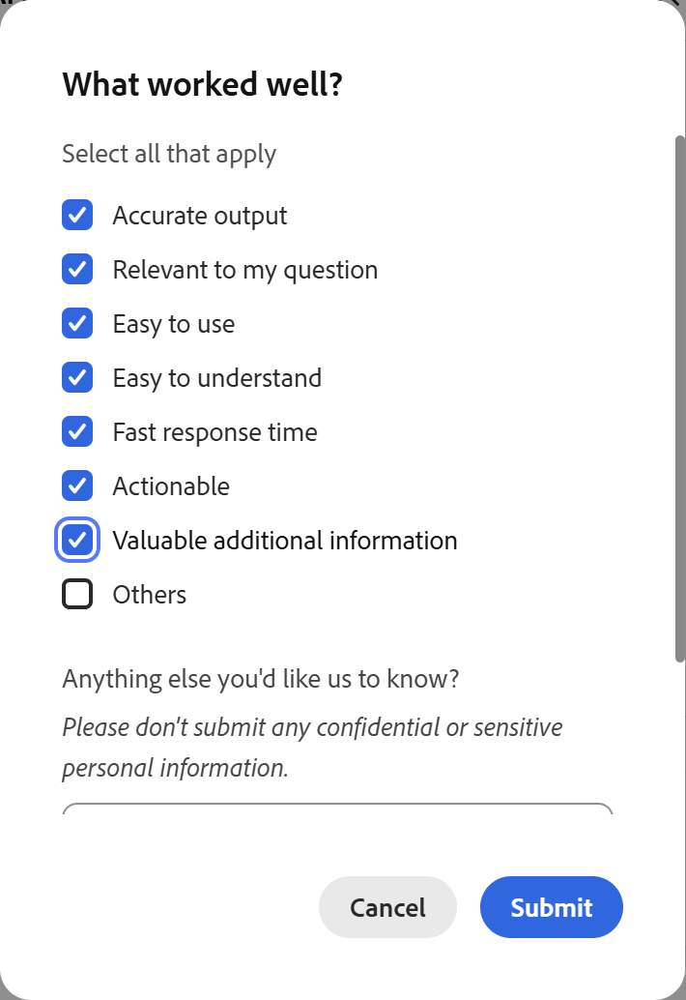

# Insights Agentとは

Insights Agentは、Adobe Learning ManagerのAIを活用した機能で、管理者は自然言語を使用して学習者のデータを照会できます。 レポートをダウンロードしてスプレッドシートを操作する代わりに、「アカウントの過去3か月間に作成されたコースの数は？ 月々のレポートを提供してください」と入力すると、インサイトエージェントがデータを直接取得して表示します。 結果をテーブルとして表示したり、CSVファイルとしてダウンロードしたりできます。

Insights Agentは、データに関する質問から回答を得るまでの手順を軽減するように設計されています。 現在Excelピボット、BIチーム、または複数の結合レポートを使用している管理者は、Insights Agentを使用すると、回答を迅速に得ることができます。

## Insights Agentでできること

Insights Agentを使用して、次の操作を実行できます。

- リージョン、部門またはユーザー・グループ別に完了およびコンプライアンス・メトリックを確認します。
- 複数の学習プログラムにわたる登録トレンドの分析
- 特定のコースまたは学習パスの進捗状況データの表示
- 結果をテーブルまたはダウンロード可能なCSVファイルで取得する
- 結果がどのように計算されたかについて、分かりやすい説明を得る

## Data Insights Agentでサポートされていない機能

次のデータ型は、このリリースの範囲外です。

- フィードバックおよび調査データ
- ゲーミフィケーションポイントとバッジ
- 監査履歴と変更ログ

これらのデータ型を参照するクエリは、結果を返しません。 例：「前四半期に獲得したゲーミフィケーションポイントの数」 または「コンプライアンスバッジを獲得したのはどの学習者ですか？」 エラーまたは不完全なデータを返します。

## Insights AgentとReport Builderの違い

どちらの機能も同じ基礎となる学習データを使用しますが、動作は異なります。 Insights Agentは会話型です。 必要な情報を入力すると、担当者が取得します。 Report Builderは構造化されています。 データセット、列、フィルターを選択して、再利用可能なレポートを作成できます。

| **使用事例** | **おすすめ** |
|---|---|
| データに関する簡単な質問 | インサイトエージェント |
| スキーマを知らずにデータを検索 | インサイトエージェント |
| 構造化された、繰り返し可能なレポートの作成 | レポートビルダー |
| カスタム結合を使用して複数のデータセットを結合 | レポートビルダー |
| レポート購読のスケジュール | レポートビルダー |
| データセットをカスタム結合または高度なデータモデリングと結合する | レポートビルダー |

**重要**:インサイトエージェントとReport Builderの統合は今後のリリースで計画されており、現在のベータ版では利用できません。

## Insights Agentの仕組み

質問を入力すると、Insights Agentは4つの段階で質問を処理します。

1. **解釈**:エージェントが質問を解析し、必要なデータを特定します。 質問の一部があいまいな場合は、続行する前に明確な質問をします

2. **アプローチ**：担当者は、回答を見つけるために必要な手順について説明します。 このセクションでは、特に複雑なクエリの場合に、意図したとおりにデータが取得されたかどうかを確認できます。

3. **結果**:エージェントはデータをテーブルとして提示します。 結果の行数が50行以下の場合は、言語形式の概要が含まれる場合があります。

4. **ダウンロード**：結果はCSVファイルとしてダウンロードできます。 サイズの大きいレポートの場合は、さらに時間がかかることがあります。ファイルの準備ができたら、エージェントから通知が届きます。

**アプローチ**&#x200B;セクションは、複雑なクエリを実行する場合に特に便利です。 エージェントが使用したロジックが表示されます。これは、BIアナリストがクエリを手動で実行した場合に説明するロジックに似ています。 この方法を確認すると、出力が信頼できるものかどうかを事前に確認できます。

## Insights Agentを使用した質問

Adobe Learning ManagerのInsights Agentを使用すると、学習者のデータに平易な質問を使用してクエリを実行し、結果をテキスト、テーブル、またはダウンロード可能なCSVファイルとして取得できます。

管理者は、Learning ManagerのAIアシスタントパネルからインサイトエージェントを利用できます。 パネルはサイズ変更可能です。 結果が読みやすくなるように展開できます。 既定では、パネルを開くと&#x200B;**[インサイトの取得]**&#x200B;モードが選択されます。 製品の使用方法に関する説明を参照するために、別の&#x200B;**学習**&#x200B;モードも利用できます。 **ラーニング**&#x200B;モードでは、Learning Managerの使用方法に関する説明の質問に回答します。 例：「学習パスを作成するにはどうすればよいですか？」 学習者データは問い合わせられません。

### 質問する

**インサイトの取得**&#x200B;モードが既定で選択されている場合、アシスタントにアクセスするたびにモードを調整する必要がなく、直ちに学習者データのクエリを開始できます。 ただし、説明のための質問を&#x200B;**学ぶ**&#x200B;モードに切り替えた場合は、クエリを送信する前に&#x200B;**インサイトを取得**&#x200B;を再度選択してください。

1. Learning ManagerのAIアシスタントアイコンを選択して、アシスタントパネルを開きます。

2. 既定で選択されていない場合は、モードセレクターで&#x200B;**インサイトの取得**&#x200B;を選択します。
   

3. テキストフィールドに質問を入力します。 分かりやすい言葉を使いなさい。 例： **過去3か月間に作成されたコースの数**

4. 「**送信**」を選択するか、**Enter**&#x200B;を押して質問を送信します。

### 回答を確認する

質問を送信すると、Insights Agentがリクエストを処理し、最大4つの要素から成る応答を返します。

1. **あいまいさ回避（必要な場合）:**&#x200B;質問に\&quot;学習活動\&quot;、\&quot;パフォーマンス\&quot;、「過去3か月のパフォーマンスデータを取得する」などのあいまいな用語が含まれている場合、アシスタントによってオプションの一覧が表示され、処理を続行する前にオプションを選択するように求められます。 お探しのオプションに最も合うオプションを選択します。 最初の質問の後に、他の指示を入力することはできません。 クエリインターフェイスを使用して新しいクエリを開始するまで、表示されるオプションから選択することだけが可能なインタラクションです。 あいまいさがない場合は、表示されるオプションからしか選択できません。フリーテキストによるフォローアップはこのリリースでは利用できません。

&#x200B;2. **アプローチ：** 「**アプローチ**」セクションには、担当者がデータを取得するためにかかった手順が記載されています。 質問の下にスクロール可能なパネルとして表示されます。 展開アイコンを選択して、フルアプローチを表示します。 このセクションを確認すると、特に複雑なクエリの場合に、目的に合ったロジックを確認できます。 例えば、「過去1年間に登録されたすべての学習者」という回答を求めると、すべての登録レコードではなく、各学習者の最新の登録が担当者によって返される場合があります。 **アプローチ**&#x200B;のセクション&#x200B;**5月**&#x200B;または&#x200B;**では、この決定について**&#x200B;説明します。 ロジックが意図と一致しない場合は、より具体的な用語を使用して新しいクエリを開始します。

&#x200B;3. **結果：**&#x200B;インサイトエージェントは、結果をテキストまたはテーブルとして生成します。 表形式で最も適切に解釈されるデータポイントの場合、Insights Agentは表を返します。 Insights Agentはチャートやグラフを生成しません。 データを視覚化するには、CSVをダウンロードして、ご希望のツールで開きます。 結果の行数が50行以下の場合は、表の上に単純な言語の概要が表示される場合があります。 例：「過去1年間に作成された登録数が5つ以上のコースはどれですか。また、作成者はだれですか？」

また、応答には次の概要が含まれます。

***要約***

- *一致したコース： 102*
- *登録数の範囲： 24 ～ 2019*
- *一致したコースあたりの平均登録数： 589.6*
- *一致したコースあたりの登録数の中央値： 553.5*

*書き出しの準備ができると、完全なレポートのダウンロードリンクが提供されます。*

**注意：**&#x200B;インサイトエージェントは確率的です。 同じクエリを2回実行すると、応答の文言や結果の順序がわずかに異なる場合があります。 取得される基礎データは同じですが、出力は実行によって異なる場合があります。

### レポートのダウンロード

「**レポートをダウンロード**」を選択して、結果をCSVファイルとして書き出します。 結果セットが大きい場合、ダウンロードに時間がかかることがあります。 ファイルの準備が完了すると、エージェントはメッセージを表示します。また、通知も受信します。

## 新しいクエリの開始

各Insightsエージェントのセッションは、一度に1つの質問を処理します。 結果を確認したら、**新しい質問**&#x200B;を選択して別の質問をします。 同じセッションでフォローアップの質問を入力したり、返された結果を調整または拡張するように担当者に依頼したりすることはできません。

>[!TIP]
>
>関連データを検索する場合は、最初に学習した内容を組み込んだ新しいクエリを開始します。 たとえば、リージョン別に登録合計を表示した後、新規の問合せを開始して、同じリージョンの完了率をチェックします。

## フィードバックの提出

各応答の後、上向きまたは下向きの親指のアイコンを選択して結果を評価します。 出力が不正確だったか、理解しにくかったか、返すのに時間がかかりすぎたかを指定することもできます。 このフィードバックは、担当者の経時的な改善に役立ちます。

## ベストプラクティス

- 最初は広範な質問ではなく、具体的な質問から始めてください。 「北米ユーザーグループの安全トレーニングコースの完了率は？\」と入力すると、「完了データを表示」よりも便利な結果が表示されます。\
- コンテンツや学習者グループに名前を付ける場合は、正確なAdobe Learning Managerの用語を使用してください。 クエリ記述ガイドには、使用する正しい用語が記載されています。
- 担当者から明確な質問を求められた場合は、その質問を合図として取り扱い、元のクエリを調整します。 質問が具体的であるほど、必要な説明は少なくなります。
- 結果を確認する前に、**アプローチ**&#x200B;セクションを確認してください。特に、正確性が重要なコンプライアンス関連のクエリの場合は確認してください。

## Insights Agentの効果的なクエリを記述する

クエリの品質は、Insightsエージェントが返す結果の品質に直接影響します。 適切な形式のクエリには、コンテキスト（どのコンテンツをどの学習者が使用するか）、範囲（ステータス、時間範囲、ユーザーの状態）および列（出力に必要な正確なフィールド）の3つの要素が含まれています。 適切な用語、クエリ構造、サンプルクエリを出発点として使用する方法について説明します。

### 3つの部分からなるクエリ式

効果的なInsights Agentのクエリには、次の3つのコンポーネントが含まれています。

| **コンポーネント** | **意味** | **例** |
|---|---|---|
| **コンテキスト** | 確認しているコンテンツと学習者 | 「。..場所101のセールス・アソシエイト学習者向けの新規採用オンボーディング学習パス。」 |
| **スコープ** | 登録ステータス、時間範囲およびユーザー状態 | 「。..登録されているが、まだ完了していないユーザー。この90日間で…」 |
| **列** | 出力に必要なすべてのフィールド | 「。..名前、電子メール、場所、登録日を表示します」 |

これらのコンポーネントのいずれかが欠落していると、結果があいまいになったり、担当者から明確な質問が返されることがあります。

### 正しいALMの用語を使用する

Insights Agentは、クエリをAdobe Learning Managerのデータモデルと照合します。 間違った用語を使用すると、間違った用語が返されたり、結果が返されなかったりする場合があります。 以下の左側の列の用語を使用してください。

| **この用語を使用** | **この項目を除く** |
|---|---|
| **学習パス** | プログラム/トラック/カリキュラム |
| **コース** | モジュール/クラス/レッスン |
| **資格認定** | バッジ/証明書 |
| **学習者** | 学生/従業員 |
| **セッション** | クラス/予定日 |
| **ユーザーグループ** | チーム/部署/グループ |
| **アクティブなフィールド** | カスタムフィールド/属性 |
| **登録** | 登録/譲渡 |
| 「**完了**」チェックボックス | 完了/完了/合格 |
| **カタログラベル** | カテゴリ/タググループ |

Insights Agentでは大文字と小文字は区別されませんが、完全一致の用語の照合により精度が向上します。

### コンテンツの固定

どの学習項目を参照すべきかを担当者が把握できるように、すべてのクエリにコンテンツアンカーが必要です。 次のいずれかの方法で固定できます。

| **アンカーの種類** | **例** |
|---|---|
| 名前 | 「。..新入社員オンボーディングの学習パス」 |
| カタログ | 「。..オンボーディングカタログ内のすべての学習パス」 |
| カタログラベル | &quot;...カタログラベルRegion = Northを含むすべてのコース |
| タグ | 「。..コンプライアンスのタグが付いたすべてのコース」 |
| スキル | 「。..カスタマーサービスのスキルにマッピングされたすべてのコース」 |
| 準拠ラベル | 「。..すべてのコンプライアンスラベル付き資格認定」 |
| コンテンツタイプ | 「。..すべての公開済みコース」/「。..すべての資格認定」 |

### 学習者を固定

次のいずれかの方法を使用して、含める学習者を指定します。

- **アクティブなフィールド値** — 「アクティブなフィールドの役職が営業担当者である学習者」または「アクティブなフィールドの場所が101である学習者」
- **ユーザーグループ** — 「Sales Associatesユーザーグループの学習者」
- **セッション** — 「職場の安全コースの6月15日のセッションに登録された学習者」

### 範囲の定義

明確な範囲がない場合、結果には間違ったステータス、期間、またはユーザー状態が含まれる可能性があります。

| **スコープの種類** | **オプション** |
|---|---|
| 登録ステータス | 登録済み/完了/未登録/期限切れ |
| 時間範囲 | すべての時間/過去30日間/過去90日間/特定の日付範囲 |
| ユーザー状態 | アクティブユーザーのみ（デフォルト）/非アクティブに「削除されたユーザーを含める」を追加 |

### すべての出力列に名前を付ける

列を指定しない場合は、Insightsエージェントによって自動的に選択されます。 出力に必要なすべてのフィールドに名前を付けます。

| **あいまいな** | **特定** |
|---|---|
| 場所番号の表示 | 「場所ごとの学習者数、登録済み者数、未登録済み者数」 |
| 完了率の表示 | 「各学習パスの名前、合計登録済み、合計完了済み、完了%」 |
| 「誰が失敗したのか見せてくれ」 | 「完了していない学習者の学習者名、電子メール、コース名、完了ステータスを表示する」 |

### クエリの例

これらを出発点として使用してください。 アカウントに適用するコンテンツ名、ユーザーグループ、時間範囲を置き換えて、適応させます。

**完了と準拠**

- 「北米ユーザーグループの安全トレーニングコースの完了率は？」
- 「コンプライアンスラベルのコースの完了率をユーザーグループ別に表示する。 ユーザーグループ名、登録済みユーザーの合計、完了済みユーザーの合計、および完了率を含めます。」
- 「有効な役職名= VPの場合、すべての学習者のコンプライアンス率はどれくらいですか？」

**登録の分析**

- 「新規採用オンボーディングの学習パスに登録されている学習者の人数は、事業所別に何人ですか？」
- 「過去90日間の登録を地域別に表示します。 地域名と登録数を含めます。」
- 「職場の安全コースに登録されているが、まだ完了していない学習者の名前、電子メール、登録日をすべてリストします。」

**プログラムとコースの進捗状況**

- 「リーダーシップデベロップメントの学習パスの完了ステータスの内訳は何ですか。完了済み、進行中、未開始の数が表示されます。」
- 「先月データのプライバシーに関するコースを修了した学習者は何人ですか？」

**組織ビュー**

- 「コンプライアンスラベルが適用されたすべての資格認定の完了率を部門別に表示する。 部署名、合計登録済み、および完了率を含めます。」
- 「過去30日間の登録配分を地域ごとに確認できますか？」

### 避けるべき一般的な間違い

| **回避** | **代わりに実行する** |
|---|---|
| コンテンツアンカーなし（「すべてを表示」） | 特定のパス、コース、カタログ、タグ、スキルに名前を付ける |
| 曖昧な指標（「なぜ完了が低いのですか？」） | 測定可能な質問をする：「完了率が30%未満の学習パスを、場所ごとに確認する」 |
| ユーザー状態を指定しない | 「アクティブなユーザーのみ」または「削除されたユーザーを含める」を明示的に追加する |
| 予測を求める | 現在のデータが何を示しているかを尋ねる（何が起こるかを尋ねる） |
| サポートされていないデータ（フィードバック、スキル、バッジ）に関する質問 | レポートセクションの既存のレポートを使用する |
| 1回のクエリで複数の質問をする（地域ごとの登録の表示と安全教育を修了していないユーザーのリスト） | クエリごとに1つのフォーカスされた質問をします。 担当者は、複合クエリの一部にのみ回答できます。それ以外の問い合わせに対応する保証はありません。 |

## リリースの制限

**繰り返し行われる資格認定では、あいまいさの除去手順で複数のオプションが表示される場合があります**

繰り返し行われる資格認定に関するデータをクエリする場合、Insights Agentは資格認定を1つのエントリとして表示するのではなく、資格認定の繰り返しごとに1つずつ、確認手順の中で複数のオプションを表示することがあります。 これらのオプションのいずれかを選択すると、誤ったデータや不完全なデータが返される場合があります。 繰り返し行われる資格認定のクエリにInsights Agentを使用しないことをお勧めします。

**繰り返し行われる資格認定の一部であるコースでは、あいまいさの除去手順で複数のオプションが表示される場合があります**

繰り返し行われる資格認定に関連するコースのデータを問い合わせる場合、Insights Agentでは、1つのエントリとして表示するのではなく、資格認定サイクルで作成されたコースのバージョンごとに1つずつ、複数のオプションを表示する場合があります。 これらのオプションのいずれかを選択すると、誤ったデータや不完全なデータが返される場合があります。

**新しく追加されたデータが結果に表示されるまでに最大30分かかる場合があります**

コンテンツの作成後、学習者が登録されるか、完了レコードが更新されると、そのデータがクエリ結果で利用できるようになるまでに最大30分かかる場合があります。 結果が不完全である場合や、最近のアクティビティが反映されていない場合は、30分待ってからクエリを再試行してください。

**登録および完了データには、直接登録と間接登録の両方が含まれます**

コースまたは学習パスの登録または完了データを照会すると、直接登録（そのコースまたは学習パスに特別に登録されている学習者）と間接登録（別の学習パスまたは資格認定の一部として同じコンテンツにアクセスした学習者）の両方を含むカウントの合計がInsights Agentによって返されます。 この2つの登録タイプは区別されません。

**ラテン語以外のスクリプトで送信されたクエリはサポートされていません**

Insights Agentは、フランス語やスペイン語など、英語とラテン文字の言語で書かれたクエリをサポートしています。 日本語、中国語、アラビア語、韓国語、ヒンディー語、ロシア語など、ラテン語以外のスクリプトを使用して送信されたクエリは処理できず、エージェントはクエリが完了できなかったことを示すメッセージを表示します。 これらの言語のいずれかでクエリを送信する場合は、新しいクエリを開始して、英語で言い換えます。 今後のリリースでは、追加の言語のサポートが検討される可能性があります。

**結果には、すべての州のコンテンツと学習者が含まれる場合があります**

Insights Agentでデータをクエリすると、特に指定しない限り、利用可能なすべての状態のレコードが結果に含まれる場合があります。 例えば、登録済み学習者に対して、キャンセル待ちリストに登録されている学習者や、アカウントが削除された学習者のクエリを実行できます。 コースまたは学習パスのクエリには、公開されたコンテンツと撤回されたコンテンツの両方が含まれる場合があります。 結果を絞り込むには、質問するときに明示的な条件を含めます。 例えば、アクティブなユーザーのみを指定したり、キャンセル待ちの学習者を除外したり、結果を公開コンテンツに制限したりして、表示するレコードのみが出力に反映されるようにします。

