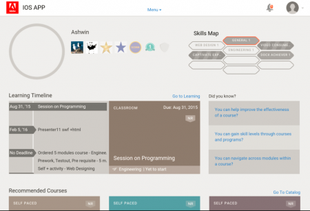

# iPad および Android タブレットのユーザー

iPadまたはGoogle Nexus 9 Androidタブレット向けのLearning Managerアプリに学習者としてログインすると、次の&#x200B;**ホーム**&#x200B;画面が表示されます。

*アプリのホーム画面*

学習機能とカタログ機能に移動するには、**メニュー**&#x200B;のドロップダウンをタップし、適切なオプションを選択します。

<!---->

## アプリへのオフラインでのアクセス {#accesstheappoffline}

iPadおよびGoogle Nexus 9 Androidタブレットから、Learning Managerアプリにオフラインでアクセスできます。 コースをダウンロードしてオフラインモードで受講し、ネットワークへの接続時にオンラインでアプリのコンテンツを同期します。

1. 上部の&#x200B;**メニュー**&#x200B;ドロップダウンをタップし、**学習**&#x200B;オプションをタップします。 利用可能なすべてのコースがタイルで一覧表示されます。
1. 学習コンテンツをダウンロードするには、各学習目標タイルの下部にあるダウンロードアイコンをタップします。

   <!---->

1. オンラインになっている場合は、オンラインでコンテンツを同期するかどうかを確認するプロンプトが、アプリの上部にあるバーに表示されます。同期する場合は、赤色のバーをタップします。緑色のバーは、アプリのコンテンツがオンラインで同期済みであることを示します。

<!--## Track device storage {#trackdevicestorage}

You can monitor your device storage periodically.

Tap the profile icon at the upper-right corner of the app and tap **Device Storage** menu option.

An app storage information dialog appears as shown below.

Using the app storage information, you can check the total space of device, app and the downloaded courses. This information enables you to download courses accordingly. To delete the downloaded courses in the device, tap X icon adjacent to each course name.-->
