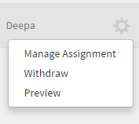
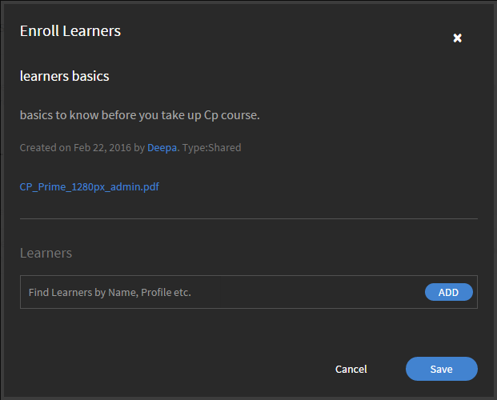

# 作業計画書

Learning Managerの管理者向けの作業計画書。

作業計画書とは、登録や完了条件なしに学習者がアクセスできるトレーニングコンテンツのリポジトリです。 学習者は、これらの作業計画書を参照して、組織内のアクティビティやタスクの実行に関するサポートを受けることができます。

作業計画書は、個別に使用することも、Learning Managerでコースを受講しながら使用することもできます。

組織の管理者は、学習者への作業計画書の割り当てを管理したり、作業計画書を取り消したり、再公開したりできます。

## 作業計画書の取り消し/再公開 {#withdrawrepublishjobaids}

「管理者ログイン」で、 **[!UICONTROL 作業計画書]** 左側のペインで、作業計画書にアクセスします。

公開済みの作業計画書を取り消すには、作業計画書の横にある設定アイコンをクリックして **[!UICONTROL 撤回]**.

*作業計画書の管理*

「取り消し」タブをクリックして、取り消した作業計画書を表示します。 取り消したジョブを再公開するには、設定アイコンをクリックして「公開」を選択します。 設定で「プレビュー」をクリックし、プレーヤーで作業計画書をプレビューします。

## 作業計画書の割り当ての管理 {#managejobaidassignments}

1. 「公開済み」タブで、作業計画書の横にある設定アイコンをクリックします。

1. クリック **[!UICONTROL 割り当ての管理]**.

   この **[!UICONTROL 学習者の登録]** ポップアップダイアログが表示されます。

   

   *学習者の登録ダイアログを表示*

1. を **[!UICONTROL 学習者]** フィールドに学習者の名前を入力し、ドロップダウンリストから学習者を選択します。 名前、プロファイルなどによって学習者を検索することもできます。
1. クリック **[!UICONTROL 追加].**
1. クリック **[!UICONTROL 保存]**.

## よくある質問 {#frequentlyaskedquestions}

+++作業計画書レポートを書き出す方法

画面の右上隅で、をクリックします。 **[!UICONTROL アクション]** > **[!UICONTROL レポートを書き出し]**.

+++

+++作業計画書の割り当てを管理する方法

イン **[!UICONTROL 公開日]** タブで、作業計画書の近くにある設定アイコンをクリックします。 学習者を追加して「 **[!UICONTROL 追加]**.

+++

+++作業計画書を撤回する方法

イン **[!UICONTROL 公開日]** タブで、作業計画書の近くにある設定アイコンをクリックします。 クリック **[!UICONTROL 撤回]**. 作業計画書が「公開済み」タブに表示されなくなりました。 取り消した作業計画書を表示するには、「取り消し」タブをクリックします。

+++
