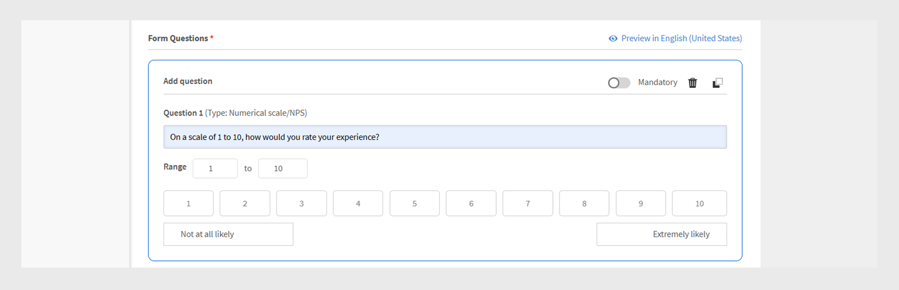
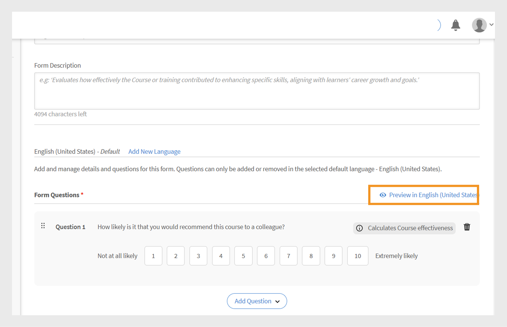
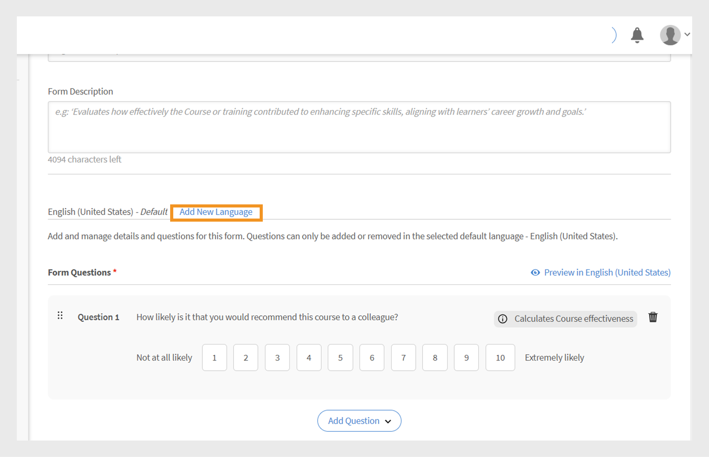
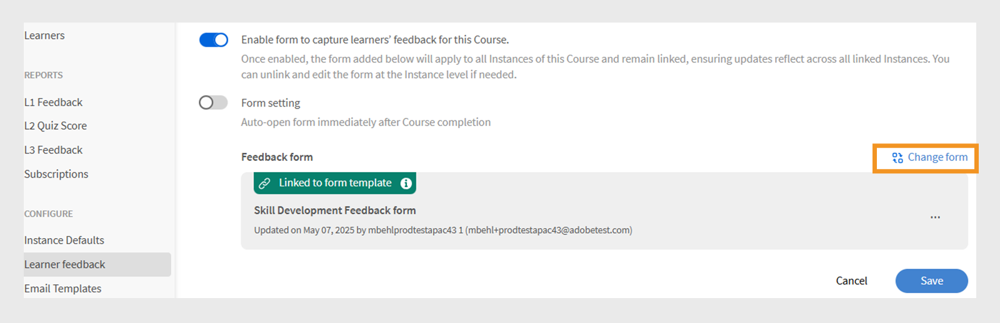
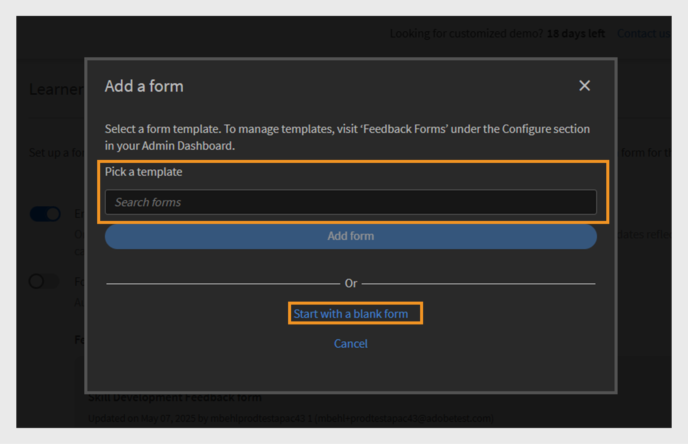

# L1フィードバックフォーム

>[!IMPORTANT]
>
>一部のお客様に対して、強化されたL1フィードバック機能が展開されています。 アカウントにこの機能が表示されない場合、既存のフィードバック機能について詳しくは、[L1およびL3フィードバックを追加](/help/migrated/administrators/feature-summary/courses.md#add-l1-and-l3-feedback)を参照してください。
>
>新しいフィードバックシステムを有効にし、移行のタイムラインについて詳しくは、カスタマーサクセスマネージャー(CSM)チームにお問い合わせください。

Adobe Learning Managerのレベル1(L1)のフィードバック機能では、学習者がコースや学習パスを完了した後に、フィードバックを共有できます。 このフィードバックは、管理者がコースの品質、インストラクターの有効性、全体的な学習経験を評価する際に役立ちます。

管理者は、再利用可能なフィードバックフォームを複数作成して管理し、それらを特定のコースや学習パスに割り当てることができるようになりました。

この機能により、管理者は次のことが可能になり、柔軟性が向上します。

* 再利用可能なフィードバックフォームの作成
* 様々なコースや学習パスのフィードバックをカスタマイズする
* 必要に応じたフォームの割り当て

**[!UICONTROL L1フィードバックレポート]**&#x200B;と&#x200B;**[!UICONTROL フィードバックレポート]** （カスタムレポート）に、2つの新しい列（フィードバックフォーム名とフィードバックバージョン）が追加されました。 これらの列には、使用されているフィードバックフォームの詳細が表示されます。

## L1フィードバックフォームを作成

管理者は、アカウントレベルで複数のL1フィードバックフォームを作成し、コース、学習パス、または資格認定に適切なフォームを割り当てることができます。

L1フィードバックフォームを作成するには：

1. Adobe Learning Managerに管理者としてログインします。
2. **[!UICONTROL フィードバックフォーム]**&#x200B;を選択します。

   
   _フィードバックフォームを作成および管理するための「フィードバックフォーム」オプションが表示されている管理者ホームページ_
3. 「**[!UICONTROL フォームを追加]**」を選択します。

   
   _フィードバックフォームを作成するための[フォームの追加]ボタンが表示されたフィードバックフォーム画面_
4. **[!UICONTROL 既定のテンプレート言語]**&#x200B;を選択し、**[!UICONTROL 保存]**&#x200B;を選択します。

   
   _既定の言語を選択するオプションを示す新しいテンプレートプロンプトを追加します_
5. フォームのタイトルと説明を入力します。

   
   _フォームタイトルとフォームの説明を入力するオプションを表示する[フィードバックフォームの追加]ページ_
6. **[!UICONTROL 質問を追加]**&#x200B;メニューから、次の質問の種類を選択します。

   a. **[!UICONTROL フリーテキスト]** ：学習者が自分の言葉で回答できます。

   * 「**[!UICONTROL 質問]**」テキストフィールドに質問を入力します。
   * 質問を必須にするには、**[!UICONTROL 必須]**&#x200B;の切り替えを選択します。
     
     _自由形式のテキストの質問をフィードバックフォームに追加_

   b. **[!UICONTROL 数値スケール/NPS]**：学習者は、コースの満足度または推奨する可能性を数値スケール（通常1 ～ 10）で評価できます。

   * 「**[!UICONTROL 質問]**」テキストフィールドに質問を入力します。
   * 評価範囲(1 ～ 10)を選択します。
   * 質問を必須にするには、**[!UICONTROL 必須]**&#x200B;の切り替えを選択します。
     \
     _数値/NPSスケールの質問をフィードバックフォームに追加_

   c. **[!UICONTROL リカート尺度]**：学習者は、強く同意しない尺度から強く同意する尺度まで、文に同意する度合いを指定できます。

   * 「**[!UICONTROL 質問]**」テキストフィールドに質問を入力します。
   * 質問を必須にするには、**[!UICONTROL 必須]**&#x200B;の切り替えを選択します。
     
     _リカートスケールの質問をフィードバックフォームに追加_

   d. **[!UICONTROL コースの有効性スコア]**：相対評価システムを使用して、コースが学習者に与える影響を測定する尺度です。

   * 1 ～ 10のLikertスケールであらかじめ定義された質問がフィードバックフォームに追加されます。
   * **[!UICONTROL コースの有効性スコア]**&#x200B;の質問は1つしか追加できず、編集できません
     
     _フィードバックフォームへのコースの有効性スコアの質問の追加_
7. 「**[!UICONTROL 保存]**」を選択します。 作成されたフォームは、「フィードバックのForms」セクションで確認できます。

### フィードバックフォームのプレビュー

「英語（米国）」でプレビューを選択すると、フィードバックフォームをプレビューできます。 複数の言語でフォームを作成した場合は、各言語でフォームをプレビューすることもできます。 この[セクション](/help/migrated/administrators/feature-summary/l1-feedback-form.md#add-feedback-forms-in-other-languages)を参照して、他の言語でフィードバックフォームを追加する方法を確認してください。

_既定の言語でフィードバックフォームを表示するためのプレビューオプションが表示されたフィードバックフォーム画面_

### 他の言語でのフィードバックフォームの追加

複数の言語にわたるフィードバックフォームで、質問の翻訳を作成します。 ただし、質問の追加または削除はデフォルト言語（英語など）でのみ実行できます。 その他の言語の場合は、最初にデフォルトの言語で追加された質問のみを翻訳できます。 翻訳済みバージョンに直接質問を追加または削除することはできません。

1. フィードバックフォームで「**[!UICONTROL 新しい言語を追加]**」を選択します。

   
   _フィードバックフォームに新しい言語バージョンを追加_
2. 目的の言語を選択し、「**[!UICONTROL 保存]**」を選択します。
3. 追加した言語のタブに移動します。
4. 各質問の横にある&#x200B;**[!UICONTROL 翻訳]**&#x200B;を選択して、翻訳を追加します。

   
   _質問をそれぞれの言語に翻訳するための[翻訳]オプションが表示されているフィードバックフォーム画面_

   >[!NOTE]
   >
   >コースの有効性スコアの問題は自動的に変換されます。

5. 翻訳を追加したら、**[!UICONTROL [保存]]**&#x200B;を選択します。

## フィードバックフォームをデフォルトとして設定

管理者は、セルフペース、クラスルーム、バーチャルクラスルーム、ミックス済みコースに対して、デフォルトのフィードバックフォームを設定できます。 設定すると、コースの完了時に、このデフォルトフォームが自動的に学習者に表示されます。 管理者が特定のコースに別のフィードバックフォームを割り当てない限り、このデフォルトフォームはすべてのコースに適用されます。

_既定のフィードバックフォームを設定するオプションを表示するフィードバックフォーム画面_

## 学習者フィードバック設定の構成

管理者は、「学習者のフィードバック」セクションで次の設定を構成できます。

* **[!UICONTROL このコースに関する学習者のフィードバックを収集するフォームを有効にする]** ：このオプションを有効にすると、コースに関するフィードバックを学習者から収集できます。 有効にすると、学習者はコースを完了した後にフィードバックを提供するように求められます。
* **[!UICONTROL フォームの設定]**：有効にすると、学習者がコースを完了した直後にフィードバックフォームが自動的に開くので、タイムリーなフィードバックの収集が容易になります。

_学習者フィードバックの設定が表示された学習者フィードバック画面_

>[!NOTE]
>
>コースインスタンスは、コースレベルのデフォルトのフィードバックフォームを使用します。 新しいインスタンスを作成する場合、アカウントレベルではなくコースレベルのデフォルトフォームが使用されます。

### コースのデフォルトのフィードバックフォームの変更

デフォルトのフィードバックフォームはすべてのコースに適用されます。 管理者は、新しいフォームを作成するか、既存のリストからフォームを選択することができます。 デフォルトのフィードバックフォームを変更するには、このコースで学習者フィードバックを有効にする必要があります。

デフォルトのフィードバックフォームを変更するには：

1. 管理者ホームページで&#x200B;**[!UICONTROL コース]**&#x200B;を選択します。
2. **[!UICONTROL 「コース」]**&#x200B;セクションで任意のコースを選択します。
3. **[!UICONTROL 「コースを表示」]**&#x200B;を選択して、**[!UICONTROL 「学習者のフィードバック」]**&#x200B;を選択します。

   
   _学習者フィードバック画面に、フォームを変更するための「編集」オプションが表示されます_
4. 「**[!UICONTROL 学習者のフィードバック]**」セクションで「**[!UICONTROL 編集]**」を選択します。
5. **[!UICONTROL [フォームの変更]]**&#x200B;を選択します。

   
   _学習者フィードバック画面に、コースのフィードバックフォームを変更するための「フォームを変更」オプションが表示されます_
6. メニューから別のフィードバックフォームを選択するか、**[!UICONTROL 空白のフォームで開始]**&#x200B;を選択して、新しいフォームを作成します。

   
   _使用可能なテンプレートから選択するオプションを表示するフォーム画面を追加するか、新しいフォームを作成してください_
7. 「**[!UICONTROL 保存]**」を選択して変更を適用します。

コースでデフォルトのフィードバックフォームが使用されており、デフォルトのフォームがアカウントレベルで更新されている場合、それらすべてのコースに新しいフォームが自動的に反映されます。 ただし、管理者がフォームを変更したり、コースレベルで新しいフォームを割り当てたりした場合、デフォルトのフォームに対する今後の変更は、コースのフィードバックフォームに影響しません。

インスタンスは、コースレベルのフィードバックフォームをデフォルトとして使用します。 管理者がフィードバックフォームをコースレベルで変更しても、既にインスタンスレベルで設定されているフォームには影響しません。 ただし、変更後に作成された新しいインスタンスでは、更新されたコースレベルのフィードバックフォームがデフォルトで使用されます。

同じ手順に従って、学習パスのデフォルトのフィードバックフォームを変更します。

>[!NOTE]
>
>フォームを変更しない場合、コースではデフォルトのフィードバックフォームが使用されます。

