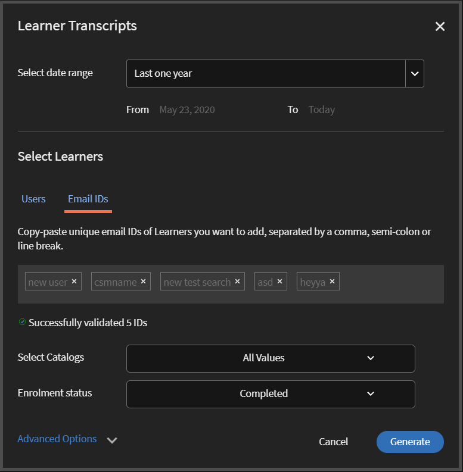

# 学習者のトランスクリプト

Learning Manager を使用して学習者のトランスクリプトをダウンロードし、レポートを管理します。

組織の管理者は Adobe Learning Manager を使用して、学習者に関連するトランスクリプトを生成できます。

## 学習者のトランスクリプトの生成 {#generatelearnertranscripts}

1. 学習者のトランスクリプトを生成するには、管理者ログインの左側のペインにある **[!UICONTROL レポート]** をクリックします。

   管理者は、**[!UICONTROL レポート]**&#x200B;ページ内の&#x200B;**[!UICONTROL カスタムレポート]** > **[!UICONTROL Excelレポート]**&#x200B;タブに移動します。

1. リンク **[!UICONTROL 学習者の成績証明書]**&#x200B;をクリックします。

   **[!UICONTROL 学習者トランスクリプト]**&#x200B;履歴ページには、**学習者トランスクリプトはまだ生成されていません**&#x200B;というメッセージが表示されるか、ラーニングトランスクリプト履歴ページの実装後にトリガーされたダウンロードのリストが表示されます。

   <!---->

   学習者のトランスクリプトダイアログが表示されます。生成するトランスクリプトの日付範囲を選択します。

   >[!NOTE]
   >
   >デフォルトでは、開始日から学習者の登録日であり、終了日は常に現在の日付です。 データが必要な場合は、「開始日」のみを変更できます。

1. **[!UICONTROL 学習者の選択]**&#x200B;フィールドから学習者の名前を選択し、**[!UICONTROL 生成]をクリックします。**
1. 単一の学習者または学習者のグループを選択できます。複数の学習者を追加するには、「**[!UICONTROL 他の学習者を追加]**」をクリックします。

   

   *学習者を追加する*

1. チェックボックスをオンにすると、特定のカタログを選択できます。 トランスクリプトは、指定したカタログでのみダウンロードできます。 特定のカタログを選択するには、 **[!UICONTROL カタログを選択]** ドロップダウンリストからカタログを選択します。

   

1. 学習者の成績証明書をエクスポートする場合、 **[!UICONTROL 登録ステータス]**&#x200B;というオプションがあります。 このドロップダウンには、次のオプションが含まれます。

   * すべて選択
   * 完了
   * 進行中
   * 未開始
   * 登録解除

   

   *カタログを選択*

1. アカウントから削除された学習者の成績証明書をダウンロードすることもできます。

   削除されたユーザーの学習者トランスクリプトをダウンロードするには、 **[!UICONTROL 詳細オプション]** 矢印をクリックし、 **[!UICONTROL 削除された学習者のデータを含める]**&#x200B;チェックボックスをオンにします。

   

   *削除された学習者の学習者トランスクリプトのダウンロード*

1. 「**[!UICONTROL モジュールレベル情報を有効にする]**」チェックボックスをオンにすることで、学習者のトランスクリプトでモジュールレベルの情報をダウンロードすることを選択できます。 このオプションを有効にすると、モジュール名と各モジュールで費やされた時間がトランスクリプトの一部として取得されます。
1. 「**[!UICONTROL スキルデータとサマリーシートを含める]**&#x200B;オプションを有効にすることで、スキルデータとサマリーシートをダウンロードすることを選択できます。

   成績証明書は生成され、スキルデータが含まれていない場合は.zipファイルとしてコンピューターにダウンロードされます。 「スキルデータとサマリーシートを含む」チェックボックスが選択されている場合は、トランスクリプトが生成されて、.xls ファイルとしてダウンロードされます。

## コピーと貼り付けを使用した学習者のトランスクリプトの生成

学習者のトランスクリプトは、学習者またはユーザーグループに対して 1 度に 1 つか取得できません。そのためトランスクリプトの取得プロセスには時間がかかります。 ここでは、コピーと貼り付け機能を使用して、学習者の電子メール ID リストを一度にコピーして貼り付ける方法を説明します。

1. **[!UICONTROL 管理者]**&#x200B;または&#x200B;**[!UICONTROL マネージャ]**&#x200B;としてログインします。
1. **[!UICONTROL 管理]**&#x200B;の下の&#x200B;**[!UICONTROL レポート]**&#x200B;に移動し、**[!UICONTROL ユーザーアクティビティ]**&#x200B;ページを読み込みます。
1. 左側のペインで **[!UICONTROL カスタムレポート]** をクリックし、リストから **[!UICONTROL 学習者の成績証明書]** を選択します。
1. **[!UICONTROL 学習者の成績証明書]**&#x200B;ページで、左上隅にある&#x200B;**[!UICONTROL 新規生成]**&#x200B;ボタンをクリックします。
1. **[!UICONTROL 期間を選択]**&#x200B;ドロップダウンをクリックして、希望する日付を選択します。**[!UICONTROL 電子メール ID]**&#x200B;タブをクリックして、コピーされた一意の電子メール ID のリストを入力します。

   

   *メールIDをコピーして貼り付ける*

1. **[!UICONTROL 電子メール ID の検証]**&#x200B;を使用して、入力された ID が正しいかどうかを確認します。

   

   *電子メール ID を検証する*

   入力した電子メール ID が正しくない場合は、上記のように赤で強調表示され、検証メッセージが表示されます。

   **[!UICONTROL 生成]** 入力されたすべての電子メールIDが正しくない限り、ボタンは使用できません。

   

   *学習者のトランスクリプトを生成する*

1. **[!UICONTROL 生成]**&#x200B;ボタンをクリックして、上記のすべての電子メールIDの学習者トランスクリプトを生成します。レポートの生成を通知する、次のような確認メッセージが表示されます。

   

   *レポート生成の確認メッセージ*

   学習者のトランスクリプトの生成は、 **[!UICONTROL ユーザー]** タブと **[!UICONTROL 電子メールID]** タブの両方で入力された電子メールIDに対して組み合わせることができます。

## 学習者のトランスクリプトのダウンロード履歴 {#ltdownload}

**[!UICONTROL 学習者トランスクリプト]**&#x200B;ダウンロードページでレポートを生成するには、**[!UICONTROL 新規作成]**&#x200B;ボタンをクリックすると、学習者トランスクリプトダイアログが表示されます。

*すべての学習者トランスクリプトのレポートを生成する*

「**[!UICONTROL 詳細オプション]**」をクリックし、パネルを展開します。

ユーザーと所属するカタログを選択します。 「**[!UICONTROL 生成]**」ボタンをクリックすると、レポートのダウンロードにかかるおおよその時間を示すダイアログが表示されます。レポートを生成するには、「**[!UICONTROL 生成]**」をクリックします。

*[生成] ボタンを選択します*

トランスクリプトはバックグラウンドで生成され、Learning Manager で作業を続行することができます。トランスクリプトが生成されたら、リストからトランスクリプトをダウンロードすることができます。

管理者は、システム内の任意のユーザーが生成したすべてのトランスクリプトを表示できます。

*ダウンロードの履歴を表示する*

ダウンロードリストには、以下の属性が表示されます。

* **学習者:** トランスクリプトをダウンロードする学習者/学習者グループ。
* 「**データが追加されました**」：「学習者のトランスクリプトを追加」モーダルにある詳細オプションから管理者がダウンロードする追加データに依存する。
* **状態:** ダウンロード済み、キューに登録済み、または進行中です。
* 「**開始**」および「**終了**」：ダウンロードされるトランスクリプトの期間。
* **適用されたフィルター：** 登録ステータスにフィルターを適用したかどうか。
* **作成者:** ダウンロードを要求したラーニング マネージャ ユーザーのユーザー ID。
* **状態:** ダウンロード済み、キューに登録済み、または進行中です。

ダウンロードは、いつでもキャンセルすることができます。ジョブが管理者によってキャンセルされると、Learning Manager は学習者のトランスクリプトをトリガーしたユーザーにアプリ内通知を送信します。

*学習者トランスクリプトのダウンロードキュー*

ダウンロードはいつでも **キャンセル** できます。 ジョブがキャンセルされると、ラーニングマネージャーはジョブをキャンセルしたユーザーにアプリ内通知を送信します。

## 削除された学習者のデータ {#dataofdeletedlearners}

削除された学習者のデータを「学習者のトランスクリプト」リストに含めることができます。 学習者のトランスクリプトダイアログで、 **[!UICONTROL 削除された学習者のデータを含める]**&#x200B;オプションを有効にします。

このオプションを有効にして「**[!UICONTROL 生成]**」をクリックすると、以下に示すように、「学習者のトランスクリプト」ダウンロードページで削除された学習者のデータ機能が表示されます。

*削除されたリアバーのデータを表示する*

## 列のカスタマイズ {#customize-columns-lt}

管理者が学習者のトランスクリプトレポートに列を書き出す際に、カスタマイズすることが可能です。 レポートを書き出す前に列を設定できるのは、管理者、カスタム管理者、マネージャーです。

**[!UICONTROL 学習者の成績証明書]**&#x200B;ダイアログで、**[!UICONTROL 詳細オプション]**&#x200B;をクリックします。[ **[!UICONTROL エクスポート形式の設定]** セクションで、エクスポートする列を選択します。

*エクスポートする列のカスタマイズ*

カスタマイズが可能なのは、ユーザーが学習者のトランスクリプトを .CSV 形式でダウンロードした場合のみです。 .XLSX 形式でダウンロードする場合は列を任意で設定できないため、すべての列がデフォルトで書き出されます。

## 学習者のトランスクリプトファイルのコンテンツ {#learnertranscriptfilecontent}

学習者のトランスクリプトファイルは通常、6 つの Excel シートで構成されている単一ファイルです。学習者のトランスクリプトシートは、コースごとに関与する学習者の数、スキル、コースまたは学習者に基づく完了率、コンプライアンスダッシュボードなどのデータに対する全体的な洞察を提供します。 次に学習者のトランスクリプトで使用可能なダッシュボードを示します。

**学習者のトランスクリプト**

学習者のトランスクリプトの Excel シートには、学習者のプロファイルの詳細に加えて、学習目標の使用状況の詳細（登録日、開始日、獲得したグレード、獲得したクイズスコアなど）が表示されます。コースが学習プログラムの一部である場合は、個々のコース消費の詳細とは別にリストされます。

**1- 学習活動ダッシュボード**

この LO 固有のダッシュボードでは、個々のコース、学習プログラム、または資格認定の学習者数を表示できます。特定の学習目標に対する学習者の進行状況シートを表示できます。このシートにはコースまたは学習プログラムを完了した学習者数、進行中の学習者、学習者の期日といったデータが表示されます。

特定のコースに関するユーザーの進行状況は、入力フィールドに指定する期日と進行状況 % のしきい値に基づいて計算されます。例えば、入力フィールドに 7 日、70% とそれぞれ指定した場合、7 日以内に期日を迎えるコースのうち、進行状況が 70% を超えているコースの進行状況が表示されます。このシートの期間は変更することもできます。変更されたデータはこのダッシュボードに自動的に表示されます。

**2 - 学習活動ダッシュボード**

この学習ダッシュボードは特定のユーザーのデータを表示します。このダッシュボードでは、特定のユーザーが登録しているコース、学習プログラム、または資格認定を表示できます。テーブルにはユーザーが完了した学習目標に関するデータ、進行中の学習目標、ユーザーに予定されている期日も表示されます。

各コースに関するユーザーの進行状況は指定する出力に基づいて計算されます。つまり、期日と進行状況 % 値を指定します。 例えば、入力フィールドに 7 日、70% とそれぞれ指定した場合、7 日以内に期日を迎える各種コースのうち、進行状況が 70% を超えているコースの進行状況が表示されます。

**スキル**

スキルシートには、スキル名、スキルレベル、必要な単位、獲得した単位、達成度（パーセンテージ）、その他のプロファイルの詳細が表示されます。スキル Excel シートのサンプルスナップショットを次に示します。

*スキルエクセルシートのサンプル*

**1- スキルダッシュボード**

このダッシュボードでは、組織が各種スキルに対応しているかどうかを確認できます。特定のスキルに関して、組織内でそのスキルを取得する必要のあるユーザーの数と、そのスキルを実際に取得しているユーザーの数を確認できます。このダッシュボードはスキルを更新する必要のあるユーザーも指定します。この値は入力フィールドに指定する値に基づいて計算されます。例えば、50 日と入力した場合、ダッシュボードには 50 日後にスキルを更新する必要のあるユーザーのデータが表示されます。

**2- スキルダッシュボード**

このスキルダッシュボードはユーザー固有の情報を表示します。特定のユーザーまたは複数のユーザーへの絞り込みを行って、ユーザーのスキルレベルをダッシュボードに表示できます。このシートを使用すると、マネージャーや管理者は各学習者のスキルを追跡し、各学習者のスキルの期待値と比較できます。スキルダッシュボードはスキルを更新する必要のある学習者を特定する際にも役立ちます。学習者の更新に関するリストは、入力フィールドに指定する日数に基づいて計算されます。

**準拠ダッシュボード**

準拠ダッシュボードは、ユーザーごとの準拠レポート、トレーニングごとの準拠レポートの 2 つから構成されます。ユーザーベースのレポートでは、準拠ダッシュボードを使用して、準拠する必要のある重要な取り組みの期日が予定されているユーザーを追跡できます。トレーニングベースのレポートでは、学習プログラムまたは資格認定を使用して絞り込みを行うことができます。

適切な日付を表示するには、どちらの準拠レポートにおいても期日を使用して絞り込みを行ってください。

### トランスクリプトの日付と時刻の列 {#datetime}

以下の列の値は、分が最も近い分の数値に丸められ、秒が 00 に丸められます。

* 登録日（UTC タイムゾーン）
* 開始日（UTC タイムゾーン）
* 完了日（UTC タイムゾーン）

*Excel シートの時刻と日付の列*

### トランスクリプトのモジュールの長さと ID 列 {#moduledurationandidcolumnsinthetranscript}

学習者のトランスクリプトには、 **[!UICONTROL モジュール期間]** 列と **[!UICONTROL ID]**&#x200B;列も表示されます。

*トランスクリプトのモジュールの期間と ID 列*

### トランスクリプトのその他の列 {#ModuledurationandIDcolumnsinthetranscript-1}

| **コラム** | **説明** |
|---|---|
| 後 | 入力した日数（値）前にスキルを獲得した学習者のうち、スキルの更新が必要な学習者の数。 |
| スキル | 学習者に割り当てられるスキル名 |
| マネージャーの名前 | 部下のスキルのエンゲージメントデータが「スキルの概要」テーブルに表示されるように設定されているマネージャーの名前 |
| 行ラベル | 割り当てられたスキルのリストがある学習者の名前 |
| 各ユーザーが達成する必要のあるスキルの数 | 学習者に割り当てられたスキルの数 |
| 各ユーザーが達成しているスキルの数 | 学習者が達成したスキルの数 |
| 更新が必要なスキルの数 | スキルの更新が必要な学習者の数 |
| 準拠パーセント | 割り当てられたスキルの進捗率 |
| 埋め込みパス | これらの行には、埋め込み学習プログラムの名前が表示されます。 |
| 埋め込みパスの ID | これらの行には、埋め込み学習プログラムの ID が表示されます |
| 埋め込みパスの言語 | これらの行には、学習プログラムが作成された言語が表示されます。 |
