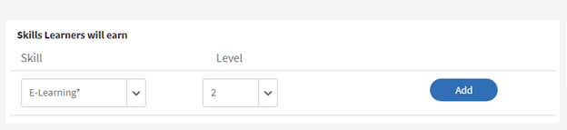
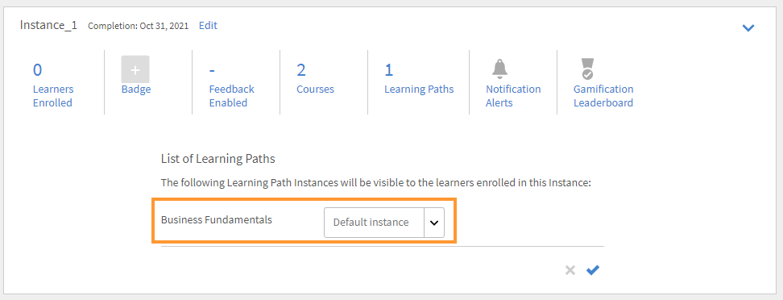

# 学習パス

## 学習パスとは何ですか？

多くの場合、管理者は特定のトピックや専門分野の深い知識を提供する詳細なカリキュラムを作成したいと考えています。 また、従業員やお客様が完了する予定の一連のトレーニングコースとしても使用できます。 カリキュラムでは、コースとプログラムを 1 つにまとめて、完全なトレーニングパッケージを作成する必要があります。

そこで登場するのが学習パスです。 学習パスとは、学習者が何らかの主題を時間をかけて習得するために通過する必要がある過程です。 学習者は自分のトレーニングエクスペリエンスを管理し、自分のペースで知識を習得、保持できるため、より高い効果を得ることができます。

例えば新入社員のオンボーディングでは、ポリシーや手続き、文化、歴史などに関する研修を行います。 学習パスでは、従業員のニーズに基づいてコースが設定されるため、従業員は自分たちに合わせて設定された学習パスに従ってコースの受講登録を行うことができます。 を選択すると、このパスにユーザーを登録して、ユーザーがコースを順に進められるようになります。

## 学習パスの作成と設定

このトレーニングでは、学習パスの作成、学習パスへのコースの追加、学習パスの公開と廃止、学習パス内のインスタンスの設定をおこなう方法を学習します。

トレーニングを起動できない場合は、<almacademy@adobe.com>に書き込んでください。

## 学習パスのメリット

学習パスを使用すると、トレーニングプログラムを簡単に提供できます。 以下に学習パスの主なメリットを示します。

1. 学習パスにスキルとスキルレベルを直接割り当てることができます。 スキルの単位と一致させる必要はありません。 学習者は、学習パスを完了すると、指定のスキルレベルを達成します。
1. 既存の学習パスを新しい学習パスに埋め込むことができます。 埋め込み機能は、1レベルの埋め込みでのみ使用できます。 したがって、既に埋め込みパスを含んでいる学習パスを、新しいパスに埋め込むことはできません。
1. 学習パスレベルで、前提条件、作業計画書、リソースを追加することができます。
1. セクションを作成することができます。 各セクションにはタイトルを付けることができます。
1. セクションを必須にし、完了条件を設定できます。

## Learning Managerでの学習パスの追加

Learning Managerの管理者アプリで、左側のパネルの&#x200B;**[!UICONTROL 学習パス]**&#x200B;をクリックします。

**[!UICONTROL 学習パス]**&#x200B;ページで、[**[!UICONTROL 追加]**]をクリックします。 詳細を入力します。

*新しい学習パスの追加*

**登録の種類**&#x200B;オプションで、**セルフ登録**&#x200B;を選択するか、**管理者登録**&#x200B;を選択します。

>[!NOTE]
>
>**管理者登録**&#x200B;オプションを選択した場合、学習者には、マネージャーによりノミネートされたコースまたはマネージャーにより承認されたコースのみが表示されます。 学習者は、推奨セクションに学習パスを表示できません。

学習パスの作成後、新しく作成した学習パスを選択し、そのパスにコースを追加します。

学習パスにスキルを追加し、バッジを割り当てることができます。 スキルを追加するには、**[!UICONTROL スキルの選択]**&#x200B;ドロップダウンリストから必要なスキルを選択します。 さらにスキルのレベルを選択します。

*スキルの追加*

学習パスにバッジを割り当てます。 使用可能なバッジのリストからバッジを選択します。

製品、役割、および役割のレベルを「**[!UICONTROL 推奨]**」セクションから選択して、これらの製品や役割に興味を示したユーザーに、この学習パスを提案します。

*おすすめ*

セクションとトレーニングのシーケンスタイプとして、「順序付け済み」または「順序付けなし」を選択します。

「順序付け済み」を選択すると、コースが作成順に表示されます。「順序付けなし」を選択すると、コースは作成順に表示されません。この場合、学習者は、任意の順序でコースを完了することができます。

学習パスにコースを追加するには、**[!UICONTROL 「コースまたは学習パスの追加」]**&#x200B;をクリックします。

表示されるダイアログで、学習パスに追加するトレーニングを選択します。

*学習パスへのトレーニングの追加*

割り当てられたスキル、変更日、コースの有効性に基づいて、コースをさらに並べ替えることができます。

コースまたは学習パスを選択したら、**[!UICONTROL [保存]]**&#x200B;をクリックします。

学習パスでは、次の操作を実行できます。

**セクションを作成および構成する：**&#x200B;セクションを作成し、複数のトレーニングコースをグループ化します。グループ化された複数のトレーニングコースは、トレーニングの1つの領域または重要なコンポーネントを完了します。 各セクションにはタイトルを付けることができます。 各セクションには、必須とマークを付け、特定の完了要件を指定することもできます。

**各セクションのコースを必須にする：**&#x200B;学習パス内のトレーニングを必須にする/しない場合は、[必須]チェックボックスをオンまたはオフにします。 このチェックボックスをオンにすると、すべてのトレーニングまたは一部のトレーニングを必須にすることができます。

*各セクションのコースを必須にする*

**順序を変更する：**&#x200B;コースを上下に移動し、順序を変更できます。

*トレーニングの順序を変更する*

**コースを削除する：**&#x200B;コースカードで「X」をクリックし、学習パスからコースを削除します。

*学習パスからコースを削除する*

変更が完了したら、学習パスを公開するために「Publish」をクリックします。

## ネストされた、または拡張された学習パス

ネストされた学習パスまたは拡張された学習パスには、複数の学習パスが含まれています。 学習パスを挿入するには、学習パス内にコースを追加するのと同じプロセスに従います。

*ネストされた、または拡張された学習パス*

## 学習パスの設定

「設定」セクションでは、学習パスを開始する前に学習者が確認する必要のある前提条件と作業計画書を追加できます。 また、学習者に役立つリソースを追加することもできます。

*学習パスの設定を変更する*

## インスタンス

学習パスインスタンスには、追加のタイル、**[!UICONTROL 学習パス]**&#x200B;が表示されます。 タイルには 学習パスに追加された学習プログラムの番号が表示されます。

**コース**&#x200B;タイルでは、このインスタンスに登録されている学習者に表示されるコースインスタンスを確認できます。

**[!UICONTROL 「学習者がインスタンスを選択できるようにする（柔軟な学習パス）」]**&#x200B;チェックボックスは、コースにのみ適用できます。 すべての子学習パスには、学習プログラムインスタンスを学習パスにマップするオプションがあります。 デフォルトでは、マッピングは「デフォルトのインスタンス」に設定されています。

*学習パスインスタンス*

## 通知

オプションは以下の 3 つです。

1. **[!UICONTROL すべてのスキルレベルのコースと学習パス（デフォルトで選択）]:**&#x200B;学習パス内のレベルに関係なく、学習者は不完全なコースに関する通知を受け取ります。
1. **[!UICONTROL ルート学習パス]:**&#x200B;学習者は、親学習パスに属する未完了のコースに関する通知を受け取ります。
1. **[!UICONTROL 学習パス+最初のスキルレベルの子のみ]:**&#x200B;学習者は、親の学習パスの最初の子である未完了コースについて通知を受け取ります。

通知リマインダーは、このオプションに基づいてトリガーされます。 デフォルトでは、インスタンスに対して&#x200B;**[!UICONTROL 「すべてのレベルのコースと学習パス」]**&#x200B;オプションが有効になっています。

## 購読

個々の学習パスをサブスクライブして、クイズスコアや学習者のステータスなどの包括的なデータを受信トレイに直接送信できます。

次の手順に従います。

1. 任意の学習パス/サブスクリプションに移動します。
1. 「さらに追加」を選択します。
1. 詳細を選択して、レポートを受信するための電子メールIDを入力します。

*個々の学習パスを購入*

## 重要な注意

学習プログラムの既存の機能は、リリース直後に「学習パス」に名前が変更されることに注意してください。 引き続き「学習プログラム」と呼びたい場合は、「用語」機能を使用して、必要な用語を適用することをお勧めします。 これにより「学習プログラム」という用語を使用できます。

学習パスを使用すると、さまざまな機能を利用できます。 一部の機能はリリース直後に使用可能になります。 管理者/作成者は、これらの機能の使用を開始できます。 セクションや、別のパスに学習パスを追加するといった拡張機能 は無効になっており、以下のチェックボックスをオンにすると有効になります。

学習者は学習プログラム（現在の学習パス）を引き続き使用でき、作成者/管理者も学習プログラムを引き続き作成できます。 上記の学習パスの拡張機能を利用するには、管理者は以下のように設定を有効にする必要があります。 有効にすると、学習パスの新しい拡張機能がすべて使用可能になります。

**[!UICONTROL 設定]** > **[!UICONTROL 一般]**&#x200B;ページには、学習パスを有効にする新しいオプションが追加されています。 このオプションを有効にすると、学習パスにコースと学習プログラムを追加できるようになります。 このオプションは、一度有効にすると変更できません。

<!-- ## Other Learning Path-related details 

### Learning Path option is disabled/unchecked in Admin Settings

**Accounts using Native Web apps**

**Learners**

* By default, learners will notice a change in terminology from "Learning Program" to Learning Path". This has been done to make the interface more intuitive. If you do not want this change, refer to the below points.  

* This change however will not be reflected in the UI if you have already used the 'Custom Terminology" function to replace the terminology "Learning Programs" with some custom text. 
* In case you had not used the Custom Terminology function yet but now wish to retain "Learning Programs" as the terminology, you can do so via the 'Custom Terminology' feature post the release.

* The overall cosmetic look and feel of erstwhile 'Learning Programs' will get updated to a more visually rich look and feel.

**Authors and Admins**

* The terminology within the Admin/Author apps is the same as that of learners.
* The UI for Authors and Admins to create, update the erstwhile 'Learning Program' objects will now be updated to the new UI. There is no loss of functionality, just that the User Interface to do the operation will be much more intuitive. These UI changes will reflect in your account, even if you have chosen not to enable 'Extended Features of Learning Path', with no loss in functionality. 

* Note that any existing Learning Program objects will not change so there is no impact on learners (other than the terminology point noted above). Authors/Admins might notice a default grouping called "Section" within their existing objects, which would be of no material impact as far as functionality goes. Authors/Admins will also see added functionalities like Skills, Job Aids etc. But as you haven't used it yet, it will not create any impact on the learner side till you actually start using it.

**Reporting**

* If you do not enable the option, Learning Path , there are no changes in the Learner Transcript report structure due to Learning Path. But as communicated in earlier notice (refer to the table shared in earlier communication); one new column will get added to the extreme right of the Learner Transcript immediately after the release.

**Accounts using Headless LMS**

**Learners**

* There are no changes for learners in headless interface. APIs as well that are used to generate the reports does not have immediate changes. 

**Authors and Admins**

* Same changes as that of Authors/Admins stated above.

**Reporting**

* Same changes as that of Reporting stated above.

### Learning Paths option is enabled/checked in Admin Settings

**Accounts using Native Web apps**

**Learners**

* Same changes as that of Learners when the option is disabled.
* As you start using the extended functionality of Learning Paths, Learners will benefit from seeing more elaborate paths with embedded paths and sections, Skills and badges being earned on path completion, resources at path level, and other benefits.

**Authors and Admins**

* Same changes as that of Authors and Admins when the option is disabled.

* Users will get more functionality in crafting elaborate paths. You can define Skill-Levels that would automatically be achieved by a learner on completion of path (not have to focus on the arithmetic of Credits for the levels). Resources can be added at the path level (Not possible as of today). Sections can be created with each section having the ability to have X of Y options. One can embed a Learning Path within another Learning Path (one level of hierarchy supported)

**Reporting**

* A few new columns will get added to the 'Learner Transcript' and 'Content Report' structures to incorporate the new feature of embedding of paths within paths. This may impact integration code that you may have written to export this data to your custom data warehouse/DB outside Learning Manager. This information is communicated in the table provided in earlier communication.

**Accounts using Headless LMS**

**Learners**

* There is no change for your learners, unless you make changes to your headless LMS implementation, as the APIs on which you have built your headless interface will not be changing.
* If you do start using the extended features of Learning Paths by creating new Learning Paths, however you will have to make changes to the headless LMS implementation to reflect those on your learner app. The Learning Manager APIs will allow you to do that.

**Authors and Admins**

* Same changes as that of Authors/Admins stated above.

**Reporting**

* Same changes as that of Reporting stated above. -->
