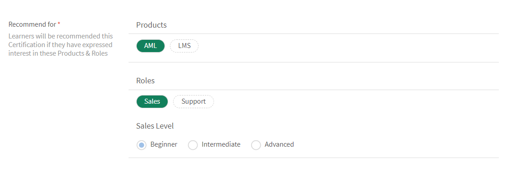

# 学習パス

## 学習パスとは何ですか？

多くの場合、管理者は特定のトピックや専門分野の深い知識を提供する詳細なカリキュラムを作成したいと考えています。 また、従業員やお客様が完了する予定の一連のトレーニングコースとしても使用できます。 カリキュラムでは、コースとプログラムを 1 つにまとめて、完全なトレーニングパッケージを作成する必要があります。

そこで登場するのが学習パスです。 学習パスとは、学習者が何らかの主題を時間をかけて習得するために通過する必要がある過程です。 学習者は自分のトレーニングエクスペリエンスを管理し、自分のペースで知識を習得、保持できるため、より高い効果を得ることができます。

例えば新入社員のオンボーディングでは、ポリシーや手続き、文化、歴史などに関する研修を行います。 学習パスでは、従業員のニーズに基づいてコースが設定されるため、従業員は自分たちに合わせて設定された学習パスに従ってコースの受講登録を行うことができます。 を選択すると、このパスにユーザーを登録して、ユーザーがコースを順に進められるようになります。

## 学習パスの作成と設定

このトレーニングでは、学習パスの作成、学習パスへのコースの追加、学習パスの公開と廃止、学習パス内のインスタンスの設定をおこなう方法を学習します。

トレーニングを起動できない場合は、にメッセージを送信してください。 <almacademy@adobe.com>.

## 学習パスのメリット

学習パスを使用すると、トレーニングプログラムを簡単に提供できます。 以下に学習パスの主なメリットを示します。

1. 学習パスにスキルとスキルレベルを直接割り当てることができます。 スキルの単位と一致させる必要はありません。 学習者は、学習パスを完了すると、指定のスキルレベルを達成します。
1. 既存の学習パスを新しい学習パスに埋め込むことができます。 埋め込み機能は、1レベルの埋め込みでのみ使用できます。 したがって、既に埋め込みパスを含んでいる学習パスを、新しいパスに埋め込むことはできません。
1. 学習パスレベルで、前提条件、作業計画書、リソースを追加することができます。
1. セクションを作成することができます。 各セクションにはタイトルを付けることができます。
1. セクションを必須にし、完了条件を設定できます。

## Learning Managerでの学習パスの追加

Learning Managerの管理者アプリで、以下をクリックします。 **[!UICONTROL 学習パス]** をクリックします。

を **[!UICONTROL 学習パス]** ページをクリック **[!UICONTROL 追加]**. 詳細を入力します。

*新しい学習パスを追加*

学習パスの作成後、新しく作成した学習パスを選択し、そのパスにコースを追加します。

学習パスにスキルを追加し、バッジを割り当てることができます。 スキルを追加するには、必要なスキルを「 **[!UICONTROL スキルを選択]** ドロップダウンリスト。 さらにスキルのレベルを選択します。

学習パスにバッジを割り当てます。 使用可能なバッジのリストからバッジを選択します。

次から、製品、ロール、およびロールレベルを選択します **[!UICONTROL おすすめのプラン]** これらの製品や役割に興味を示したユーザーに、この学習パスを提案するセクション。

セクションとトレーニングのシーケンスタイプとして、「順序付け済み」または「順序付けなし」を選択します。

「順序付け済み」を選択すると、コースが作成順に表示されます。「順序付けなし」を選択すると、コースは作成順に表示されません。この場合、学習者は、任意の順序でコースを完了することができます。

学習パスにコースを追加するには、 **[!UICONTROL コースまたは学習パスの追加]**.

表示されるダイアログで、学習パスに追加するトレーニングを選択します。

*学習パスへのトレーニングの追加*

割り当てられたスキル、変更日、コースの有効性に基づいて、コースをさらに並べ替えることができます。

コースまたは学習パスを選択したら、 **[!UICONTROL 保存]**.

学習パスでは、次の操作を実行できます。

**セクションを作成および設定します。** セクションを作成し、複数のトレーニングコースをグループ化します。セクションでは、トレーニングの1つの領域または重要なコンポーネントを修了します。 各セクションにはタイトルを付けることができます。 各セクションには、必須とマークを付け、特定の完了要件を指定することもできます。

**セクションごとにコースを必須にする：** 学習パス内のトレーニングを必須にする/しない場合は、 「必須」チェックボックスをオン/オフにします。 このチェックボックスをオンにすると、すべてのトレーニングまたは一部のトレーニングを必須にすることができます。

*セクションごとにコースを必須にする*

**順序を変更します。** コースを上下に移動し、順序を変更できます。

*トレーニングの順序を変更する*

**コースの削除：** コースカードで「X」をクリックし、学習パスからコースを削除します。

*学習パスからのコースの削除*

変更が完了したら、学習パスを公開するために「公開」をクリックします。

## ネストされた学習パス

学習パスを学習パス内に含めることができます。ただしネストできる学習パスは 1 つです。

コースの挿入と同様に学習パスを挿入します。

*学習パス内に学習パスを追加する*

## 学習パスの設定

「設定」セクションでは、学習パスを開始する前に学習者が確認する必要のある前提条件と作業計画書を追加できます。 また、学習者に役立つリソースを追加することもできます。

*学習パスの設定の変更*

## インスタンス

学習パスインスタンスには、追加のタイル、**[!UICONTROL 学習パス]**&#x200B;が表示されます。 タイルには 学習パスに追加された学習プログラムの番号が表示されます。

を **コース** タイルを使用すると、このインスタンスに登録されている学習者に表示されるコースインスタンスを確認できます。

この **[!UICONTROL 学習者がインスタンスを選択できるようにする（柔軟な学習パス）]** チェックボックスはコースにのみ適用されます。 すべての子学習パスには、学習プログラムインスタンスを学習パスにマップするオプションがあります。 デフォルトでは、マッピングは「デフォルトのインスタンス」に設定されています。

*学習パスインスタンス*

## 通知

オプションは以下の 3 つです。

1. **[!UICONTROL すべてのスキルレベルのコースと学習パス（デフォルトで選択）]:** 学習者は、学習パス内のレベルに関係なく、完了していないコースに関する通知を受け取ります。
1. **[!UICONTROL ルート学習パス]:** 学習者は、親学習パスに属する未完了のコースに関する通知を受け取ります。
1. **[!UICONTROL 学習パス+最初のスキルレベルの子のみ]:** 学習者は、親の学習パスの最初の子である未完了コースについて通知を受け取ります。

通知リマインダーは、このオプションに基づいてトリガーされます。 デフォルトでは、 **[!UICONTROL すべてのレベルのコースと学習パス]** がインスタンスに対して有効になっています。

## 重要な注意

学習プログラムの既存の機能は、リリース直後に「学習パス」に名前が変更されることに注意してください。 引き続き「学習プログラム」と呼びたい場合は、「用語」機能を使用して、必要な用語を適用することをお勧めします。 これにより「学習プログラム」という用語を使用できます。

学習パスを使用すると、さまざまな機能を利用できます。 一部の機能はリリース直後に使用可能になります。 管理者/作成者は、これらの機能の使用を開始できます。 セクションや、別のパスに学習パスを追加するといった拡張機能 は無効になっており、以下のチェックボックスをオンにすると有効になります。

学習者は学習プログラム（現在の学習パス）を引き続き使用でき、作成者/管理者も学習プログラムを引き続き作成できます。 上記の学習パスの拡張機能を利用するには、管理者は以下のように設定を有効にする必要があります。 有効にすると、学習パスの新しい拡張機能がすべて使用可能になります。

この **[!UICONTROL 設定]** > **[!UICONTROL 一般]** ページには、学習パスを有効にする新しいオプションが追加されています。 このオプションを有効にすると、学習パスにコースと学習プログラムを追加できるようになります。 このオプションは、一度有効にすると変更できません。

## その他の学習パス関連の詳細

### 管理者設定で学習パスオプションをオン/オフにする

**ネイティブ Web アプリを使用するアカウント**

**学習者**

* デフォルトでは、「学習プログラム」から「学習パス」に用語が変更されています。 この変更は、インターフェイスをより直感的にするために行われました。 この変更が不要な場合は、以下の点を参照してください。

* ただし、「カスタム用語」機能を使用して、用語「学習プログラム」をカスタムテキストに置き換えた場合、この変更はUIに反映されません。
* カスタム用語機能をまだ使用していないが、用語「学習プログラム」を引き続き使用したい場合は、リリース後にカスタム用語機能を使用して、用語「学習プログラム」を使用できるように設定できます。

* 以前の「学習プログラム」の外観は、全体的に視覚的に豊かな外観に更新されます。

**作成者と管理者**

* 管理者/作成者アプリ内の用語は、学習者の用語と同じです。
* 作成者と管理者が学習プログラムオブジェクトの作成、更新を行うUIは、新しいUIに更新されます。 操作を行うユーザーインターフェイスがより直感的になるだけで、機能性は失われません。 学習パスの拡張機能を有効にしていない場合でも、これらのUIの変更はお客様のアカウントに反映されます。機能は失われません。

* 既存の学習プログラムオブジェクトは変更されないため、学習者に影響はありません（前述の用語以外）。 作成者/管理者は、既存のオブジェクト内に「セクション」と呼ばれるデフォルトのグループがあることに気付くかもしれません。これは、機能的には大きな影響はありません。 またスキル、作業計画書などの機能も追加されます。 まだ使用していないため、実際に使用を開始するまで、学習者側に影響はありません。

**報告**

* 「学習パス」オプションを有効にしなければ、学習者のトランスクリプトレポートの構造が学習パスによって変更されることはありません。 ただし、前の通知で示したように（前の通知で共有した表を参照）、リリース直後に、学習者トランスクリプトの右端に新しい列が1つ追加されます。

**ヘッドレスLMSを使用するアカウント**

**学習者**

* ヘッドレスインターフェイスには、学習者に関する変更はありません。 レポートの生成に使用されるAPIも、直ちに変更されることはありません。

**作成者と管理者**

* 上記の作成者/管理者と同じ変更。

**報告**

* 上記の報告と同じ変更。

### 管理者設定で学習パスオプションをオン/オフにする

**ネイティブ Web アプリを使用するアカウント**

**学習者**

* このオプションが無効になっている場合は、学習者と同じ変更。
* 学習パスの拡張機能を使い始めると、パスやセクションが埋め込まれた入念なパスや、パス完了時に獲得されるスキルとバッジ、パスレベルのリソースなどのメリットを享受できます。

**作成者と管理者**

* このオプションが無効になっている場合は、作成者および管理者と同じ変更。

* ユーザーは、高度な学習パスを作成する際に、より多くの機能を利用できます。 パスの完了時に学習者が自動的に達成するスキルレベルを定義できます（レベルの単位の計算に注力する必要はありません）。 リソースは学習パスレベルで追加できます（現在は追加できません）。 セクションは、X/Y オプションを持つ各セクションを使用して作成できます。 学習パスを別の学習パス内に埋め込むことができます（サポートされているのは 1 レベルの階層です）。

**報告**

* パス内にパスを埋め込む新しい機能を組み込むために、学習者のトランスクリプトとコンテンツレポートの構造に新しい列が追加されます。 これは、Learning Manager 外のカスタムデータウェアハウス/DB にこのデータを書き出すために作成した、統合コードに影響を与える可能性があります。この情報は、以前の通知で提供された表に示されています。

**ヘッドレスLMSを使用するアカウント**

**学習者**

* ヘッドレスインターフェイスを構築した API は変更されないため、ヘッドレス LMS の実装を変更しない限り、学習者に関する変更はありません。
* ただし、新しい学習パスを作成して学習パスの拡張機能を使い始める場合は、学習者アプリにその拡張機能を反映するために、ヘッドレス LMS の実装を変更する必要があります。 Learning Manager API を使用すると、この操作を実行できます。

**作成者と管理者**

* 上記の作成者/管理者と同じ変更。

**報告**

* 上記の報告と同じ変更。
