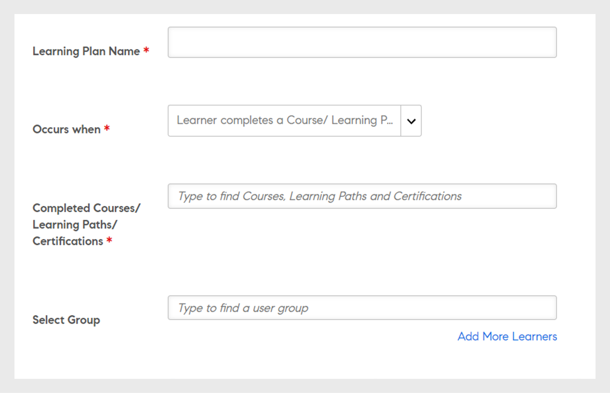

# 学習プラン

Learning Managerで管理者向けの学習プランを作成します。

## 概要 {#overview}

学習プランとは、特定の条件に基づいて特定のトレーニングに学習者を登録する一連のルールです。

学習プランを使用すると、管理者は、新しい従業員のオンボーディング、従業員の指名や場所の変更など、特定のイベントの発生に基づいて、コース、学習プログラム、または資格認定を自動的に割り当てることができます。

たとえば、ある従業員が組織に参加すると、新しい従業員向けプログラムがその従業員に自動的に割り当てられます。 同様に、従業員がマネージャとして昇格された場合、新しいマネージャ指向プログラムが自動的に従業員に割り当てられます。

事前定義されたイベントセットに基づいて、学習者を任意のコースや学習プログラムに自動的に登録できます。 学習者がスキル、コースまたは学習プログラムを完了した後に、フォローアップ学習活動を自動的に割り当てることで、学習者に学習パスを作成できます。

## 学習プランの作成 {#createlearningplans}

学習プランを作成するには、管理者としてログインする必要があります。

1. 左側のペインで、 **[!UICONTROL 学習プラン]**. 既存のイベントがある場合は、ページに一覧表示されます。 ただし、学習プラン機能を初めて設定する場合は、次の手順に進みます。
1. ページの右上隅にあるをクリックします。 **[!UICONTROL 追加]**. を **[!UICONTROL 学習プランを追加]** ダイアログで、従業員が受講する必要がある学習プランの名前を入力します。

   

1. を **[!UICONTROL 発生するタイミング]** ドロップダウンリストで、必要なイベントを選択します。 このオプションは、学習者がコースを受講するタイミングを決定します。 イベントのタイプを選択した後、適切なトレーニング、コース、学習プログラム、または資格認定を選択します。

   **注意：** 管理者と作成者の両方が自動登録イベントを作成できます。

   イベントは次のとおりです。

   **1 – 新しい学習者が追加されます。** 新しいユーザーまたは従業員が組織に参加したとき。

   

   **2 – 学習者をグループに追加するには：** 新しいユーザーまたは従業員がグループに参加するとき。  このイベントを適用できるユーザーグループをドロップダウンリストから入力して選択します。 複数のグループを選択できます。 また、このオプションを選択すると、このイベントをこれらのグループのすべての既存のメンバーに割り当てることができます。

   

   この学習プランは、特に ***カスタム – グループ化*** ユーザー： フィールドにグループの名前を入力し、先行入力検索を使用してグループを選択します。

   **3 – 学習者が学習目標を完了します。** 学習者がコースや学習プログラムなどの学習目標を完了すると、イベントがトリガーされます。 このイベントを適用できる学習目標を選択します。 イベントの完了ステータスを選択します。 必要に応じて、この学習者が属するユーザーグループを選択することもできます。 学習目標を完了した後に、このイベントがトリガーされるまでの日数を入力します。 この学習目標を既に完了している既存のユーザーにこのイベントを割り当てる場合は、このオプションを選択します。

   

   **4 – 学習者が達成するスキルレベル：** スキル名を入力し、スキルレベルを選択します。 また、この学習者が属するユーザーグループを選択することもできます。 これはオプションです。 スキルを達成した後、このイベントがトリガーされるまでの日数を入力します。 このスキルを既に達成している既存の学習者にこのイベントを割り当てる場合は、このオプションを選択します。

   

   さらに、学習プランを学習者に割り当てる必要がある日数を設定します。

   

   **5 – 特定の日付：** 特定の日付にイベントが発生する必要がある場合。 イベントを割り当てる必要がある日付を選択します。 イベントを自動的に割り当てる必要があるユーザーグループを選択します。 割り当てる必要があるインスタンスを選択し、イベントをトリガーする必要がある日数の経過後に入力します（オプション）。

   

1. すべてのイベントについて、次からインスタンスを選択できます **[!UICONTROL インスタンス]** ドロップダウンリスト。 任意のイベントに割り当てられた学習のインスタンスを選択することもできます。

   

   Learning Managerでは、学習プランによって独自のインスタンスである自動が作成されます。 「すべての学習者」などのグループを選択すると、デフォルトで、学習プランのすべての学習者がインスタンス「自動」に登録されます。

   学習プランを保存すると、インスタンス「自動」が **[!UICONTROL インスタンスを選択]** コースの「学習者」セクションのドロップダウンリスト。

1. 学習プランを保存するには、 **[!UICONTROL 保存]**.

## トレーニングの登録解除 {#unenroll-training}

学習プランを追加する際、管理者は特定のトリガーに基づいて、特定のトレーニングからユーザーの登録を解除できます。

管理者アプリで、以下をクリックします。 **[!UICONTROL 学習プラン]** > **[!UICONTROL 追加]**.

次のセクションは、オプションが **[!UICONTROL トレーニングから登録解除]** が追加されました。

## 学習者をグループから削除 {#learnergetsremovedfromagroup}

1. ユーザーグループを1つ以上追加します。 複数のグループを選択した場合、追加されたグループのいずれかから学習者が削除されたときにプランがトリガーされます。
1. アクションを **[!UICONTROL トレーニングの登録解除]**.

   1. 管理者は、ユーザーグループからユーザーを削除するときに、そのユーザーの登録を解除するトレーニングを選択できます。
   1. このシナリオでは、インスタンスと完了日は適用されません。

## 学習者がトレーニングを完了した場合 {#learnercompletesatraining}

1. ユーザーグループを1つ以上追加します。 複数のグループを選択した場合、指定されたトレーニングを学習者が完了するときにプランがトリガーされます。
1. アクションを **[!UICONTROL トレーニングの登録解除]**.

   1. 管理者は、ユーザーグループにユーザーを追加するときに、そのユーザーの登録を解除するトレーニングを選択できます。
   1. この場合、インスタンスと完了日は適用されません。

## 学習者をグループに追加 {#learnergetsaddedtoagroup}

1. ユーザーグループを1つ以上追加します。 複数のグループを選択した場合、いずれかのグループに学習者が追加されたときにプランがトリガーされます。
1. トレーニングから登録解除のアクションを選択します。

   1. 管理者は、ユーザーグループにユーザーを追加するときに、そのユーザーの登録を解除するトレーニングを選択できます。
   1. この場合、インスタンスと完了日は適用されません。

## 学習者がスキルレベルを達成する場合 {#learnerachievesaskilllevel}

1. 達成するスキルを指定します。
1. ユーザーグループを1つ以上追加します。 複数のグループを選択した場合、選択されたスキルを学習者が達成するときにプランがトリガーされます。

## 特定の日付 {#onaspecificdate}

1. 学習者の登録を解除する日付を選択します。
1. ユーザーグループを1つ以上追加します。 複数のグループを選択した場合、選択した日にプランがトリガーされ、選択したグループに属するユーザーが登録解除されます。
1. トレーニングから登録解除のアクションを選択します。

   1. 管理者は、指定した日に登録解除するときに、そのユーザーの登録を解除するトレーニングを選択できます。
   1. この場合、インスタンスと完了日は適用されません。

## 学習プランを編集 {#editalearningplan}

学習プランを作成した後、管理者はいつでも学習プランを編集/更新できます。 編集するには、学習プランの名前をクリックして、 **[!UICONTROL 学習プランを編集]** 表示されるポップアップダイアログ。 クリック **[!UICONTROL 保存]**.

## 学習プランを有効にする {#enablealearningplan}

デフォルトでは、作成した新しい学習プランはすべて無効な状態です。 学習者を割り当てるプランを有効にする必要があります。 チェックボックスを有効にした場合 **[!UICONTROL 現在の学習者]**&#x200B;を指定した場合、イベントは自動的に有効になります。

学習プランを有効にするには：

1. 学習プランのリストから、有効にするプランを選択します。

   

1. ページの右上隅にあるをクリックします。 **[!UICONTROL アクション]** > **[!UICONTROL 有効にする]**. これにより、学習プランが有効になります。

## 学習プランを削除する {#deletealearningplan}

学習プランを削除するには：

1. 学習プランのリストから、削除するプランを選択します。
1. ページの右上隅にあるをクリックします。 **[!UICONTROL アクション]** > **[!UICONTROL 削除]**.

## 学習プランを無効にする {#disablealearningplan}

学習プランを無効にするには：

1. タブをクリック **[!UICONTROL 有効]**.
1. 学習プランのリストから、無効にするプランを選択します。
1. ページの右上隅にあるをクリックします。 **[!UICONTROL アクション]** > **[!UICONTROL 無効]**. これにより、プランが **[!UICONTROL 無効]** タブをクリックします。

## 学習プランをフィルター {#filteralearningplan}

学習プランの作成時に使用したイベントのタイプに従って、学習プランをフィルタリングできます。 クリック **[!UICONTROL 種類]** いずれかのオプションを選択して、選択内容に一致する学習プランを表示します。

## よくある質問 {#frequentlyaskedquestions}

1. Learning Managerを設定して、新入社員のオンボーディングの自動登録を設定する方法を教えてください。

   を **[!UICONTROL 発生するタイミング]** ドロップダウンリストで、オプションを選択 **[!UICONTROL 新規学習者が追加されました]**. 次に、学習者の学習目標、インスタンス、および完了日を割り当てます。 管理者と作成者の両方が自動登録イベントを作成できます。 作成後にイベントを有効にします。

1. 教室およびバーチャルクラスルームコースの学習プラン/自動登録を設定するにはどうすればよいですか？

   コースインスタンスは、必要なセッションの詳細で設定することをお勧めします。 次に、学習プランを設定し、既に作成済みのコースインスタンスにマップします。

1. 特定の学習プランに登録された学習者のリストを表示するにはどうすればよいですか？

   インスタンスAutoが作成されたら、をクリックします。 **[!UICONTROL コース]** > **[!UICONTROL 学習者]**&#x200B;を選択し、必要なインスタンスを **[!UICONTROL インスタンス]** ドロップダウンリスト。
