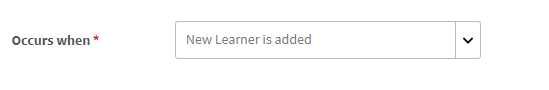
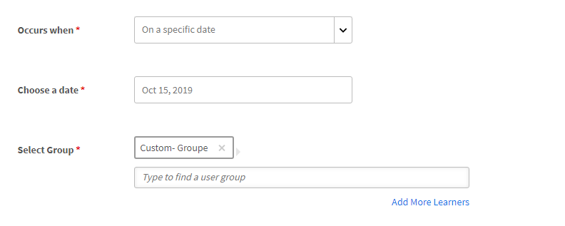
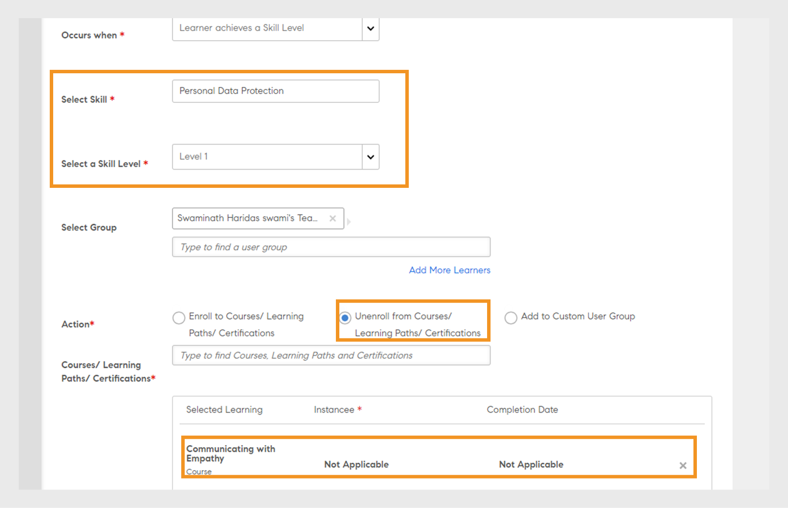

# 学習プラン

Learning Manager で管理者向け学習プランを作成します。

## 概要 {#overview}

学習プランは、特定の条件に基づいて、指定したトレーニングに学習者を登録する一連のルールです。

学習プランを使用すると、管理者は新しい従業員のオンボーディング、従業員の勤務地の指定や異動など特定のイベントの発生に基づいて、自動的にコース、学習プログラム、認定制度を割り当てることができます。

例えば、従業員が組織に入社すると、新入社員用のオリエンテーションプログラムが自動的に従業員に割り当てられます。同様に、従業員がマネージャーとして昇進すると、新しいマネージャー用のオリエンテーションプログラムが自動的に従業員に割り当てられます。

定義済みのイベントセットに基づいて、学習者を任意のコースおよび学習プログラムに自動的に登録できます。学習者がスキル、コース、または学習プログラムを完了した後に、フォローアップの学習活動を自動的に割り当てることで、学習者に学習パスを作成できます。

## 学習プランの作成 {#createlearningplans}

学習プランを作成するには、管理者としてログインする必要があります。

1. 左ペインで、「**[!UICONTROL 学習プラン]**」をクリックします。既存のイベントがある場合は、ページにそのリストが表示されます。ただし、学習プランの機能を初めて設定する場合は、次の手順に進みます。
1. ページの右上隅にある「**[!UICONTROL 追加]**」をクリックします。**[!UICONTROL 学習プランを追加]**&#x200B;ダイアログで、従業員が受講する必要がある学習プランの名前を入力します。

   

1. 「**[!UICONTROL 次の場合に発生]**」ドロップダウンリストで、必要なイベントを選択します。このオプションは、学習者がコースを受講するタイミングを決定します。 イベントのタイプを選択した後、適切なトレーニング、コース、学習プログラム、または資格認定を選択します。

   **注意：** 管理者と作成者の両方が自動登録イベントを作成できます。

   以下にイベントを示します。

   **1 – 新しい学習者が追加されます。** 新しいユーザーまたは従業員が組織に参加したとき。

   

   **2 – 学習者をグループに追加するには：** 新しいユーザーまたは従業員がグループに参加するとき。  このイベントを適用できるユーザーグループをドロップダウンリストから入力して選択します。 複数のグループを選択することができます。また、オプションを選択して、このイベントをこれらのグループのすべての既存メンバーに割り当てることもできます。

   

   この学習プランは、***カスタムグループ***&#x200B;ユーザー専用に作成されています。フィールドにグループの名前を入力し、先行入力検索を使用してグループを選択します。

   **3 – 学習者が学習目標を完了します。** 学習者がコースや学習プログラムなどの学習目標を完了すると、イベントがトリガーされます。 このイベントが適用可能な学習目標を選択します。イベントの完了ステータスを選択します。必要に応じて、この学習者が所属するユーザーグループを選択することもできます。学習目標を完了した後に、このイベントがトリガーされるまでの日数を入力します。この学習目標を既に完了している既存のユーザーにこのイベントを割り当てる場合は、このオプションを選択します。

   

   **4 – 学習者が達成するスキルレベル：** スキル名を入力し、スキルレベルを選択します。 また、この学習者が所属するユーザーグループを選択することもできます。これはオプションです。スキルを達成した後に、このイベントがトリガーされるまでの日数を入力します。このスキルを既に達成した既存のユーザーにこのイベントを割り当てる場合は、このオプションを選択します。

   

   さらに、学習プランを学習者に割り当てるまでの日数を設定します。

   

   **5 – 特定の日付：** 特定の日付にイベントが発生する必要がある場合。 イベントを割り当てる日付を選択します。イベントを自動割り当てする必要があるユーザーグループを選択します。割り当てる必要があるインスタンスを選択し、必要に応じてイベントをトリガーするまでの日数を入力します。

   

1. すべてのイベントに対して、「**[!UICONTROL インスタンス]**」ドロップダウンリストからインスタンスを選択することができます。また、任意のイベントに割り当てられた学習のインスタンスを選択することもできます。

   

   Learning Manager では、独自のインスタンスである「自動」が学習プランにより作成されます。例えば、「すべての学習者」のグループを選択すると、デフォルトで学習プランのすべての学習者がインスタンス「自動」に登録されます。

   学習プランを保存すると、「自動」インスタンスは、コースの「学習者」セクションの「**[!UICONTROL インスタンスを選択]**」ドロップダウンリストにオプションとして表示されます。

1. 学習プランを保存するには、「**[!UICONTROL 保存]**」をクリックします。

## トレーニングからの登録解除 {#unenroll-training}

学習プランを追加する場合、管理者は特定のトリガーに基づいて、特定のトレーニングからユーザーの登録を解除できます。

管理者アプリで、以下をクリックします。 **[!UICONTROL 学習プラン]** > **[!UICONTROL 追加]**.

次のセクションは、オプションが **[!UICONTROL トレーニングから登録解除]** が追加されました。

## 学習者をグループから削除する場合 {#learnergetsremovedfromagroup}

1. 1 つ以上のユーザーグループを追加します。 複数のグループを選択した場合、追加されたグループのいずれかから学習者が削除されたときにプランがトリガーされます。
1. アクションを **[!UICONTROL トレーニングの登録解除]**.

   1. 管理者は、ユーザーグループからユーザーを削除するときに、そのユーザーの登録を解除するトレーニングを選択できます。
   1. このシナリオでは、インスタンスと完了日は適用されません。

## 学習者がトレーニングを完了する場合 {#learnercompletesatraining}

1. 1 つ以上のユーザーグループを追加します。 複数のグループを選択した場合、指定されたトレーニングを学習者が完了するときにプランがトリガーされます。
1. アクションを **[!UICONTROL トレーニングの登録解除]**.

   1. 管理者は、ユーザーグループにユーザーを追加するときに、そのユーザーの登録を解除するトレーニングを選択できます。
   1. この場合、インスタンスと完了日は適用されません。

## 学習者をグループに追加する場合 {#learnergetsaddedtoagroup}

1. 1 つ以上のユーザーグループを追加します。 複数のグループを選択した場合、いずれかのグループに学習者が追加されたときにプランがトリガーされます。
1. トレーニングから登録解除のアクションを選択します。

   1. 管理者は、ユーザーグループにユーザーを追加するときに、そのユーザーの登録を解除するトレーニングを選択できます。
   1. この場合、インスタンスと完了日は適用されません。

## 学習者がスキルレベルを達成する場合 {#learnerachievesaskilllevel}

1. 達成するスキルを指定します。
1. 1 つ以上のユーザーグループを追加します。 複数のグループを選択した場合、選択されたスキルを学習者が達成するときにプランがトリガーされます。

## 特定の日付 {#onaspecificdate}

1. 学習者の登録を解除する日付を選択します。
1. 1 つ以上のユーザーグループを追加します。 複数のグループを選択した場合、選択した日にプランがトリガーされ、選択したグループに属するユーザーが登録解除されます。
1. トレーニングから登録解除のアクションを選択します。

   1. 管理者は、指定した日に登録解除するときに、そのユーザーの登録を解除するトレーニングを選択できます。
   1. この場合、インスタンスと完了日は適用されません。

## 学習プランの編集 {#editalearningplan}

学習プランを作成すると、管理者はいつでも学習プランを編集または更新することができます。編集するには、学習プランの名前をクリックし、表示される&#x200B;**[!UICONTROL 学習プランを編集]**&#x200B;ポップアップダイアログで値を変更します。**[!UICONTROL 「保存」]**&#x200B;をクリックします。

## 学習プランの有効化 {#enablealearningplan}

デフォルトでは、作成した新しい学習プランはすべて無効な状態になっています。学習者を割り当てるプランを有効にする必要があります。 チェックボックスを有効にした場合 **[!UICONTROL 現在の学習者]**&#x200B;を指定した場合、イベントは自動的に有効になります。

学習プランを有効にするには、

1. 学習プランのリストから、有効にするプランを選択します。

   

1. ページの右上隅にあるをクリックします。 **[!UICONTROL アクション]** > **[!UICONTROL 有効にする]**. これにより、学習プランが有効になります。

## 学習プランの削除 {#deletealearningplan}

学習プランを削除するには、

1. 学習プランのリストから、削除するプランを選択します。
1. ページの右上隅にあるをクリックします。 **[!UICONTROL アクション]** > **[!UICONTROL 削除]**.

## 学習プランの無効化 {#disablealearningplan}

学習プランを無効にするには、

1. 「**[!UICONTROL 有効]**」タブをクリックします。
1. 学習プランのリストから、無効にするプランを選択します。
1. ページの右上隅にあるをクリックします。 **[!UICONTROL アクション]** > **[!UICONTROL 無効]**. これにより、選択したプランは「**[!UICONTROL 無効]**」タブに移動します。

## 学習プランの絞り込み {#filteralearningplan}

学習プランの作成中に使用されたイベントのタイプに従って、学習プランをフィルター処理することができます。「**[!UICONTROL タイプ]**」をクリックしてオプションを選択し、選択に一致する学習プランを表示します。

## よくある質問 {#frequentlyaskedquestions}

1. Learning Managerを設定して、新入社員のオンボーディングの自動登録を設定する方法を教えてください。

   を **[!UICONTROL 発生するタイミング]** ドロップダウンリストで、オプションを選択 **[!UICONTROL 新規学習者が追加されました]**. 次に、学習者の学習オブジェクト、インスタンスおよび完了日を割り当てます。管理者と作成者の両方が自動登録イベントを作成できます。 作成後にイベントを有効にします。

1. 教室およびバーチャルクラスルームコースの学習プラン/自動登録を設定するにはどうすればよいですか？

   必要なセッションの詳細を使用してコースインスタンスをセットアップすることをお勧めします。次に、学習プランを設定し、既に作成済みのコースインスタンスにマップします。

1. 特定の学習プランに登録された学習者のリストを表示するにはどうすればよいですか？

   インスタンスAutoが作成されたら、をクリックします。 **[!UICONTROL コース]** > **[!UICONTROL 学習者]**&#x200B;を選択し、必要なインスタンスを **[!UICONTROL インスタンス]** ドロップダウンリスト。
