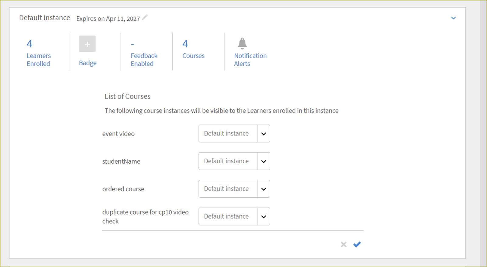

# 学習プログラム

>[!WARNING]
>
>学習プログラムは、Learning Manager Adobeで非推奨となりました。

この記事では、Learning Manager で学習プログラムを作成および管理する方法について説明します。

学習プログラムとは、学習者の特定の目標を満たすように固有に作成されたコースです。これらの学習プログラムは、学習者向けに管理者が作成します。学習者はこれらの学習プログラムを見ることができます。

## 学習プログラムを作成する {#createalearningprogram}

学習プログラムを作成できるのは管理者です。学習プログラムを作成するには、以下の手順を実行します。

1. 管理者してログインします。左ペインで「**[!UICONTROL 学習プログラム]**」をクリックします。 既に学習プログラムが組織用に作成されている場合は、学習プログラムのページに既存の学習プログラムの一覧が表示されます。
1. ページの右上隅にある「追加」をクリックします。新しい学習プログラムの追加ページが表示されます。
1. 学習プログラム名、概要を入力して、プログラムのメリットを入力します。
1. 他のロケールで学習プログラムを作成するには、ページの上部にある「新しい言語を追加」をクリックします。 必要な言語を選択し、「追加」をクリックします。 選択したすべての言語で、すべての学習プログラムのメタデータを追加する必要がある場合があります。 または、他のロケールでは英語の情報が表示されます。
1. 学習プログラムに固有の学習オブジェクト ID を入力します。 固有IDには、アルファベットと数字のみを含め、特殊文字は含めないでください。 2 つの学習オブジェクトに同じ ID を使用することはできません。
1. 管理者登録またはセルフ登録のいずれかの登録タイプを選択します。 登録解除オプションとコースの順序付けオプションを選択し、「保存」をクリックします。 セルフ登録を選択すると、学習者は学習プログラムに登録できます。

   学習プログラムにコースを追加するためのコースページが表示されます。 「カリキュラム」タブと「カタログ」タブが表示されます。

   **注**

   すべてのタイプのコースを学習プログラムに追加できます。 これには、教室およびバーチャルクラスルームコース、アクティビティ、セルフペース、ミックス済みコースが含まれます。 マネージャーによりノミネート済みで、マネージャーにより承認されているコースが学習プログラムのコース選択時に表示されません。

1. コースを公開する前に、学習プログラムにコースを追加する必要があります。 クリック **[!UICONTROL カタログ]** タブを使用して、コースを学習プログラムに関連付けます。 利用可能なすべてのコースが一覧表示されます。

1. 学習プログラムに追加するコースを選択するには、任意のコースカードにマウスポインターを置いてクリックします。 コースが学習プログラムにまだ追加されていない場合は、そのコースカードの中央に「+」記号が表示されます。

   さらにコースを含めるには、この手順を繰り返します。

   **注**

   学習プログラムに追加されたすべてのコースのリストを表示 **[!UICONTROL 教育課程]** タブをクリックします。 追加したコースに追加したラベルは、「**[!UICONTROL カタログ]**」タブのコースカードの下部に表示されます。

1. クリック **[!UICONTROL プログラムに戻る]** 左ペインの上に、すべての学習プログラムのリストが表示されます。 新しく追加した学習プログラムがリストに表示されます。
1. 学習プログラムを公開するには、左ペインの「概要」をクリックして「アクション／公開」を選択します。 また、ページの右上隅にある「公開」をクリックして、コースビューとインスタンスビューから学習プログラムを公開することもできます。

## 学習プログラムに学習者を追加する {#addlearnerstoalearningprogram}

学習者の登録の詳細と手順については、「  [学習者の登録](courses.md#main-pars_header_1058138132)

## 学習プログラムのカタログのフルコントロールを有効にする {#catalog}

フルライセンスの付与が好き [学習またはモジュールのカタログ制御](shared-catalog-full-control.md)また、学習プログラムのカタログのフルコントロールを有効にすることもできます。

## コースのリセット

管理者は、学習プログラム内のコースの進捗をリセットできます。

管理者は、学習プログラムからコースの進捗状況をリセットできます。

管理者がコースをリセットするには、「コース」ドロップダウンからコースを選択する必要があります。

それから **[!UICONTROL アクション]** ドロップダウンリストで、 **[!UICONTROL コースをリセット]**.

これで学習者が、選択したコースのモジュールを最初から起動できるようになりました。

**注意：リセットされるのは、失敗したコースのモジュールと完了していないコースのモジュールのみです。**

## 学習プログラムの複数のインスタンスの作成 {#createmultipleinstancesoflearningprograms}

1 つのコースまたは学習プログラムの複数のインスタンスを作成できます。

1. 左ペインで「学習プログラム」をクリックします。
1. サムネイルのコースリストや学習プログラムのリストで学習プログラム名をクリックします。
1. 左側のペインで「インスタンス」をクリックします。
1. コース情報画面の右上隅に表示されている「新しいインスタンスを追加」をクリックします。
1. 学習プログラムの新しいインスタンスが表示されます。
1. 新しいインスタンスの編集アイコン（スナップショットに赤い矢印で示されています）をクリックして、コースや学習プログラムの値（期日、インスタンス名、フィードバック、バッジなど）を変更します。 値の編集が完了したら、その値の横に表示されているチェックマークをクリックして編集内容を保存します。編集操作をキャンセルする場合は、「X」記号をクリックします。

管理者は、教室およびバーチャルクラスルーム形式のコースを学習プログラムに追加できます。 コースの作成中に作成者が指定したセッションはすべて、デフォルトのインスタンスになります。 管理者が学習プログラムにコースを追加すると、デフォルトでは、すべてのコースのデフォルトのインスタンスにマッピングされます。ただし、管理者はインスタンスマッピングを変更することができます。 学習プログラムに追加されたコースの数は、インスタンスページにも表示されます。以下に例を示します。

**インスタンスマッピングの変更**

インスタンスマッピングを変更するには、「インスタンス」ページでコース数をクリックします。 コースのインスタンスマッピングボックスが、インスタンスのリストとともに表示されます。 これにより、インスタンスマッピングを選択できるようになります。

## 柔軟な学習プログラムを作成する {#flexible}

学習者は柔軟な学習プログラムを使用することで、デフォルトのインスタンスの内容に限定されないトレーニングを受けることができます。 管理者は、学習者のニーズに合わせて様々なインスタンスを作成できます。 このタイプの学習プログラムは通常、教室またはVCセッションです。 すべての学習者が出席できるように、管理者は異なるタイムゾーンに合わせて、コースセッションのインスタンスを複数作成できます。

管理者は、学習プログラムのインスタンスを、学習者が選択したコースのインスタンスにマッピングすることもできます。

**ワークフロー**

1. 複数のインスタンスが含まれるコースをいくつか作成します。
1. 学習プログラムを作成して、いくつかのコースを追加します。
1. 学習プログラムのインスタンスを作成します。
1. 学習者を登録します。

## サブスクリプション {#subscription}

管理者は、クイズスコアと学習者のステータスレポートを取得できます。 レポートの頻度、電子メールの件名、受信者の電子メール ID を設定できます。 設定した頻度に応じて、受信者はレポートが添付された電子メールを受け取ります。

## クイズのスコアを表示する {#viewquizscores}

1. 学習プログラムのタイルをクリックします。
1. 左側のペインで「クイズスコア」をクリックします。

特定の学習プログラムのクイズスコアは、ユーザー名または各質問に基づいて表示できます。 それに応じて「ユーザー別」または「質問別」タブを選択します。

クイズのスコアは、一度に 1 つのコースに対して表示されます。 他のコースのクイズスコアを表示するには、ドロップダウンでコース名を変更します。 各コースのクイズスコアを書き出すこともできます。

ドロップダウンリストからインスタンスの種類を選択すると、学習プログラムの各インスタンスに基づいてスコアが表示されます。

## L1 と L3 のフィードバックを表示する {#viewl1andl3feedback}

管理者は、学習プログラムでL1およびL3フィードバックを有効にすることができます。 学習者が入力したL1フィードバックは「L1フィードバック」タブに表示され、マネージャーが入力したL3フィードバックは「L3フィードバック」タブに表示されます。

## 学習者の登録解除 {#unenrollmentforlearners}

管理者は、学習プログラムの作成中に、学習者が学習プログラムから自分で登録を解除できるかどうかを選択できます。 管理者がこの登録解除オプションを選択すると、学習者が自分でコースの登録を解除できるようになります。

## 完了のマーク {#markcompletion}

管理者は、利用可能なオプションを使用して、学習プログラムに完了とマークすることができます。 学習プログラムを完了とマークするには、以下の手順を実行します。

1. 「**[!UICONTROL 学習プログラム]**」を開きます。
1. 左側のメニューから「**[!UICONTROL 学習者]**」ページを開きます。

   「**[!UICONTROL 学習者]**」ページが開き、登録されている学習者のリストが表示されます。

1. 1 人の学習者、複数の学習者、またはすべての学習者を選択し、各学習者に対してチェックボックスで LP 完了をマークします。
1. 「**[!UICONTROL ユーザー]**／**[!UICONTROL アクション]**／**[!UICONTROL 完了のマーク]**」の順にクリックします。

   LP に複数のコースが存在する場合は、すべてのコースが完了とマークされます。

## 学習プログラムでコースの順序付けをする {#orderingofcoursesinlearningprogram}

管理者は、学習プログラムで学習者がコースを受講する順序を設定することができます。 学習プログラムを作成した後、このコースの順序はいつでも更新できます。

学習プログラムでコースの順序を更新するには

1. 目的の学習プログラムカードをクリックし、 **[!UICONTROL コース]** をクリックします。

1. 学習プログラムに関連付けられたコースカードが一覧表示されます。 クリック **[!UICONTROL 編集]** をクリックします。
1. 各コースカードをクリックして適切な位置にドラッグすると、リストの順序を変更することができます。
1. クリック **[!UICONTROL 再公開]**.

## 公開済みの学習プログラムを編集する {#editingapublishedlearningprogram}

管理者は、「公開済み」状態の学習プログラムを編集することができます。 管理者は、この状態で、学習プログラムのすべてのセクションを編集し、再パブリッシュすることができます。

公開された学習プログラムを編集するには、学習プログラムカードをクリックして **[!UICONTROL 編集]** をクリックします。

学習プログラムの特定のセクションの編集中にその編集ページから移動すると、学習プログラムが再パブリッシュされます。 その際、学習プログラムの再パブリッシュを確認するためのダイアログが表示されます。
